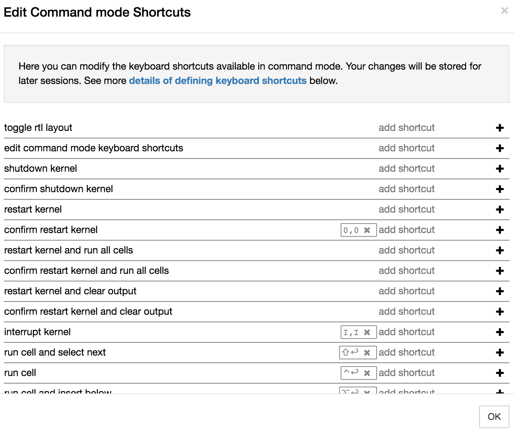
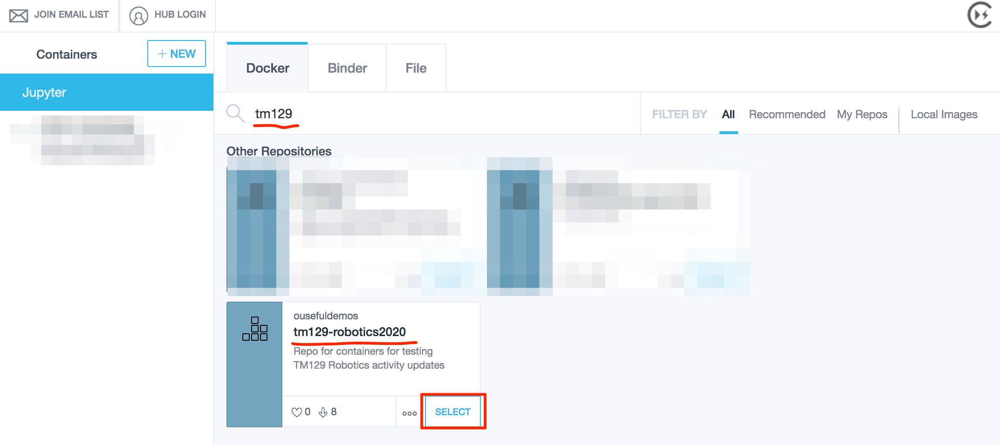
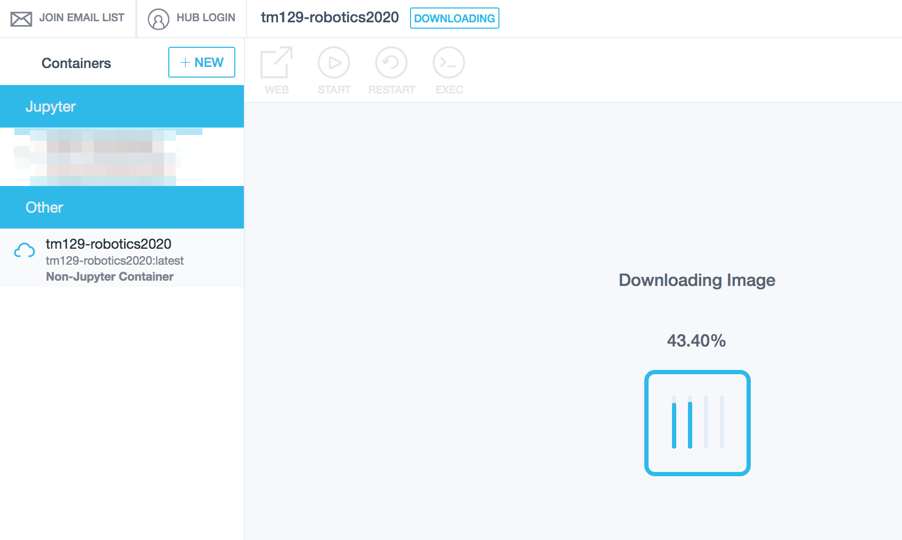

# 1 Getting started

In which we introduce the working environment for the TM129 Robotics Block practical activities.

*As I edit this, as a direct revision of the original, it's a very "flat" document. A lot of the things could be made more interactive. eg an interactive tour of elements of the notebook or a Graffiti interaction, rather than a static, linear, screenshot enhanced narration. Middle ground would be a screencast. But could we also instrument that somehow? Certainly, we could capture the visual recording using browser automation.*

## 1.1 Introduction to the TM129 Virtual Robotics Lab: RoboLab

The *TM129 Virtual Robotics Lab*, or "RoboLab" for short, is a self-contained, virtualised computing environment. This environment enables you to experiment with, and program, simple simulated robots using the Python programming language. The same environment can be used on different computing platforms (Windows, MacOS, Linux) either running locally on your own computer or via a remote external server accessed over the internet.

You will use RoboLab in a practical session during each study week of this part of the module. 

After studying RoboLab you should be able to: 

* understand the basics of computer programs (e.g. explain what is meant by a sequential computer program, the terms ‘constant’ and ‘variable’, and explain and illustrate the terms ‘branch’ and ‘loop’)

* use programs in RoboLab (e.g. run example programs in RoboLab and say what a simple robot control program will do)

* manipulate simple programs in RoboLab (e.g. modify the programs to give different behaviours and write your own simple robot control programs).

If you already know something about computer programming or robotics you will have the opportunity to go further than this. 

The lab sessions each week consist of exercises using a simulated robot. The simulated robot is based on a small mobile robot with a number of sensors. Robots like this are available at low cost and many are within the reach of amateur enthusiasts.

RoboLab is accessed using a Jupyter environment presented via a web browser. Many activities are presented through interactive Jupyter notebooks and make use of a simple `Jyro` graphical robot simulator.

### The Jupyer Notebook Environment

Jupyter notebooks are are widely used interactive environment for writing "literate" programming scripts in a web browser. Originally developed to support computational data science projects, they are increasingly used as more general computational notebooks that can blend explanatory text with executable code and graphical, or even interactive, code outputs.

The notebook homepage provides a simple listing of files in a particular directory. Additional tabs allow you to monitor currently running notebooks and configure user-enabled extensions that can be used to customise your notebook environment.

Clicking on a file of an appropriate type will open it as am interactive Jupyter notebook.

Notebooks are structured using the notion of different sorts of "cell". For example, *markdown cells* are used to contain explanatory text written using the simple text based markdown script. Executable *code cells* can be used to declare executable Python code, the outputs of which can be displayed as *code cell outputs*.

Markdown and code cells can be edited and saved interactively via the notebook's browser interface.

As well as the notebook environment, a more complex "lab" or "integrated development" style interface, *Jupyterlab*, is also available.

Whilst you are welcome to make use of this environment, we will tend to stick to the simple notebook interface for the module activities.

### Notebook Extensions

A wide range of notebook extensions are installed in the RoboLab environment, although the majority have not been pre-enabled.

You can enable and disable extensions, as well as further configuring certain extensions, via the extensions configurator. This can be accessed from the notebook homepage or from the `nbextensions config` option in the `Edit` menu of an opened notebook.

You are welcome to explore the available extensions, or even add further ones of your own, to personalise your notebook environment, but we will not discuss them further here.

*You may want to share details of any extensions you find particularly useful in your module or tutor group forums.*

### The Jyro Simulator

The `Jyro` simulated robot will be the focus of many of the programming activities. `Jyro` is based on a Pioneer 3-DX differential drive robot.

The `Jyro` simulator offers a two dimensional (2D) plan view of the environment, viewed from directly above, and a three dimensional(3D) robot's eye view.

A series of buttons along the bottom of the simulator can be used to start, pause and stop the execution of the robot's control program, as well as resetting the environment back to its initial state.

In the 2D plan view, the orientation of the red simulated robot is denoted by a black arrow that points towards the front of the robot.

The robot has two wheels, one each side, although these are not shown.

The robot can also be configured with a range of sensors, as well as a gripper. These are visually represented on the 2D robot graphic when they are added to the robot.

The forward facing light sensors, which have a configurable maximum range are indicated by the two yellow dots at the front of the robot, one on either side.

The grey lines indicate the "visible" range of the sixteen ultrasound sensors which are arranged around the robot.

The black rectangle on the top of the robot represents the forward facing camera, which provides the 3D view.

The presence of the gripper is indicated by the black attachment at the fron of the robot.

Various three dimensional objects can be placed in the simulated world, including a boundary wall around the edge of the simulated world, variously sized and coloured boxes, and differently coloured light sources.

__TO DO: screenshot of different worlds with different objects? If so, keep a note in the metadata at least of the config used to define each environment.__

__TO DO: contextualise the robot with a photo and descrioption of a small hobby style robot.__

<s>A photograph of a small robot buggy built with a LEGO Mindstorms kit. This robot has two prominent wheels, one each side of the robot. These are driven from motors through a couple of gears. The body of the robot consists largely of the yellow LEGO RCX robot control ‘brick’ which is 8 x 14 Lego studs and several bricks high. Wires emerge from the RCX brick and connect to the motors and to a sensor. The sensor is a light sensor, which takes the form of a 4 x 2 blue brick that has been mounted pointing down to the ground at the front of the robot. The robot has been placed on a sheet of white paper on which is marked a rectangle drawn with 2 cm wide black lines. There are no touch sensors on this particular robot.</s>

Programming robots is very stimulating, sometimes frustrating and usually very rewarding. Although the RoboLab exercises all have a serious purpose, we hope you will find them enjoyable and fun.

## 1.2 Workload

The RoboLab practical sessions have been written so that if you are an absolute beginner with no experience of robotics or programming you can complete the work each week in four to five hours. The pace is deliberately unhurried and we recommend you take your time. If you already have some programming experience RoboLab should take you less time.

Each week’s practical session combines two aspects of robotics. We will teach you the basics of programming in RoboLab, introducing features gradually during the sessions. You will also carry out some investigations using the simulated robot which will give you a taste of some of the more practical aspects of robotics.

Throughout the RoboLab sessions you will encounter a number of activities that are labelled as ‘challenges’. We’ve defined these tasks as challenges because:

* there may be several ways of achieving a solution to the task, rather than a single best approach

* it may be possible to refine any particular solution and improve its performance.

Challenges implicitly incorporate some performance measure that you can use to rate the effectiveness of your solution, such as the time taken for the robot to complete a task, or the accuracy with which it does so. There is thus a mildly competitive element to the activity. You may not get the chance to compare your solution with those of other students, but you can think about trying to improve the quality of your own solution – though you should not spend too long trying for perfection!

### Assessment

We hope that by the end of the RoboLab practical sessions you understand some of the basic ideas and can program the simulated robot to do some basic tasks. This should ensure that you can do the assignment and complete the block satisfactorily. The assessment will not include any material covered in optional practical activities.

## 1.3 Accessibility

We have tried our best to make RoboLab accessible to all students, whatever their particular needs.

The Jupyter environment includes an [accessibility toolbar extension](https://github.com/uclixnjupyternbaccessibility/accessibility_toolbar) that allows you to control the presentation style of the Jupyter notebook; for example, you can change the font style, size and spacing, the notebook background colour, and so on. Several predefined custom themes are available [BROKEN] and you can also define your own. The extension also supports voice control [BROKEN].

__TO DO: there is also a [jupyter-themes](https://github.com/dunovank/jupyter-themes) extension that we could pre-install, perhaps with one or more OU custome themes? This may be in addtion to, or in place of, the accessibility toolbar. There are also simple tricks and tools for speaking out code cell contents, such as the [jupyter-a11y](https://github.com/jameslmartin/jupyter-a11y) extension.__

All of the styles are saved into local storage when refreshing the page. This means that if you use notebooks on different servers with the same browser, the same accessibility settings will be applied to notebooks on all servers within which you have enabled the accessibilty extension.

### Enabling the Accessibility Extension
The accessibility is __disabled__ in the RoboLab environment by default. To use the accessibility extension, you need to enable it first. You can do this from the `nbextensions` tab on the notebook homepage: check the `Accessibility toolbar` extension to enable the toolbar. When you open a new notebook, the toolbar should be displayed.

Check the [accessibility toolbar documentation](https://github.com/uclixnjupyternbaccessibility/accessibility_toolbar#toolbar-summary) for more information.

The Module Team welcome feedback on these features.

### Colours and fonts
 
If you wish to change the font and interface colours used in RoboLab to improve readability, the accessibility toolbar allows you to select the font style, size and colour. You can also modify the line spacing and spacing between individual characters.

 
The font style applies to *all* text elements within the notebook itself. This includes the contents of markdown (text) cells, code cells and code cell outputs.

The toolbar can also be used to control the notebook's background colour and the cell background colour.

You can also save a style you have defined from the `Add new style...` option in `Predefined styles` menu. Once saved, it will be added to the menu list so you can apply it as required. 

### Keyboard interface

The Jupyter notebook interface supports a wide range of pre-defined keyboard shortcuts to menu and toolbar options. The shortcuts can be displayed using the `Keyboard shortcuts` item from the notebook `Help` menu or via the `ESC-h` keyboard shortcut.

You can also add additional shortcuts and/or edit exist shortcuts via the `Edit Keyboard shortcuts` menu item.

__TO DO: is Jyro keyboard accessible??__

__TO DO: what's best way of tabbing through the notebook? Or should notebook keyboard shortcuts be used? Are any potentially useufl navigation style keyboard shortcuts missing?__

### Magnification

The apparent size of the notebook contents in general and the Jyro simulator in particular can be zoomed using standard browser magnification tools. __TO DO: check this works for Jyro__

Alternatively, use operating systems tools such as *Windows Magnify* or the MacOS *Zoom Window*, or other assistive software.

### Other assistive software

__TO DO: to what extent will screen readers and dictation systems operate features of RoboLab??__

Please contact the Module Team if you discover that the material does not work with a particular screen reader or dictation system that you would typically expect to be able to use.

### Audio

Some RoboLab programs 'speak'. Where the speech is generated as a part of a program flow, a visual display of the spoken phrase will also typically be displayed at the time the phrase is spoken.

__TO DO: need to make sure we do this; a custom widget might help that maps to both audio and a text display widget.__

## 1.4 Writing Style Compliant Code

Whilst this is not specifically a programming course, this may well be the first time you have done any sort of programming at all, let alone any programming in Python.

The style of programming we are teaching is geared towards helping you understand how we might be able to control robots through programme code, rather than formally teaching you programming in general, or Python coding in particular.

However, we will try to to demonstrate code examples that are well written and that comply with the popular [PEP 8 — Style Guide for Python Code](https://www.python.org/dev/peps/pep-0008/). This guide sets out a set of stylistic convention for writing clear Python code.

There are many tools available that can be used to support code authors and we have installed some of them into the RoboLab environment.

One particular tool is know as a "linter". When you run a code cell, this tool can post warnings about where the code diverges from PEP-8 guidelines.

Error codes are described via the following links:

- `E*`, `W*`: [show code lookups](https://pycodestyle.readthedocs.io/en/latest/intro.html#error-codes);
- `D*`: [show code lookups](http://www.pydocstyle.org/en/2.1.1/error_codes.html);
- `F*`: [show code lookups](http://flake8.pycqa.org/en/3.7.9/user/error-codes.html).

The linter can be enabled in a notebook by running the following magic:

`%flake8_on --ignore D100`

When you run a code cell, if the linter detects a difference from the style guide, it will display a warning of the form:

TO DO 

??show line numbers
??fix 
??rerun

Another useful extension that is installed, but not enabled, is the `Autopep8` extension. You can enable the extension from the `nbextensions Configurator` [[direct link](/nbextensions/?nbextension=code_prettify/autopep8)]. Enabling this extension provides a "hammer" toolbar button that you can use to prettify your code in accord with some PEP-8 recommendations at least. Simply select a code select, and hit the button; it will prettify the code, if it can, in a more PEP-8 compliant way. (But it won't change the way your code executes, so it won't tend to fix bugs in your code for you...)

One way of using the `flake8` linter and `Autopep8` button together is to let the linter raise a warning (if you do make an error), use the button to try to fix the code, then run the cell again to invoke the linter and see if the warning(s) were addressed. If they were, *inspect the fixed code to see what change the `Autopep8` tool made* (`CTRL-z` (Win), `CMD-z` (Mac) will undo the last cell edit; `SHIFT-CTRL-z` (Win), `SHFT-CMD-z` (Mac) will then redo it).

Tools are also available to support writing markdown text in markdoan cells. For example, enabling the `livemdpreview` extension will display an inline live preview of the rendered markdown directly beneath a markdown cell as you edit it [[direct link](/nbextensions/?nbextension=livemdpreview/livemdpreview)].

Spell checkers are also available, either as the `spellchecker` notebook extension [[direct link](https://hub.gke.mybinder.org/user/innovationoutsi-29-robotics2020-o5z3lwky/nbextensions/?nbextension=spellchecker/main)) or via the Accessibility toolbar.

## 1.5 Gaining Access to the RoboLab Environment

There are several ways in which you can access RoboLab:

- *as a "temporary" online service using MyBinder*
- <s>*via the OU hosted JupyterHub environment WHICH DOESN'T EXIST YET*</s>
- *locally on your own computer*

### Accessing RoboLab Online - MyBinder / BinderHub

You can run the RoboLab environment online using the MyBinder service .

If you want to save any of the notebooks used there, you will have to download them as follows:

- as a single notebook from the notebook page `File` menu;
- as a zipped archive file of all notebooks using the the download button on the notebook homepage.

You can also upload your own notebooks from the notebook homepage either individually, or as a zip file. If you upload a zip file, you will need to unzip it. You can do this from a notebook command cell using the `unzip` shell command or [using Python code](https://thispointer.com/python-how-to-unzip-a-file-extract-single-multiple-or-all-files-from-a-zip-archive/). More details can be found in the __TO DO?? - see the `RoboLab Environment FAQ`__

### Downloading and Installing RoboLab

RoboLab runs in a simple virtual machine known as a Docker container.

To run RoboLab, you will need to download and install two applications: *Docker* and *ContainDS*.

### Download and Install Docker

Docker is the virtualisation platform that runs the RoboLab environment. You should download and install the latest version of Docker from the [Docker website](https://www.docker.com/products/docker-desktop), following the instructions for your particular operating system:

- [Docker Desktop for Windows](https://docs.docker.com/docker-for-windows/install/) ([direct download link](https://download.docker.com/win/stable/Docker%20for%20Windows%20Installer.exe)): *requires Windows 10 64-bit: Pro, Enterprise, or Education*
  - if your Windows machine does not meet the requirements for installing *Docker Desktop for Windows*, you should still be able to run Docker using the [Docker Toolbox on Windows](https://docs.docker.com/toolbox/toolbox_install_windows/)
- [Docker Desktop for Mac](https://docs.docker.com/docker-for-mac/install/) ([direct download link](https://download.docker.com/mac/stable/Docker.dmg)): *requires macOS 10.12 or newer, hardware from 2010 or newer*)
  - for older Macs that do not meet the requirements for installing *Docker Desktop for Mac*, you may still be able to run Docker using the [Docker Toolbox on Mac OS](https://docs.docker.com/toolbox/toolbox_install_mac/)
- *Linux*: you may find that Docker is already installed on your Linux computer (in a terminal, run the command `docker --version` to check). If it isn't available, you should install the latest version of the *Docker Engne - Community Edition* from the Docker repository. Find your flavour of Linux on the [Docker Engine overview](https://docs.docker.com/install/) page and follow the links to install the package on your particular operating system.

Locate the folder containing the downloaded installer: your browser may have a `Downloads` folder or it may have saved the downloaded file to the `My Documents` or `Desktop` folder. Inside the download folder, find the downloaded installer file and double-click it to run it.

__TO DO - could we get any security warnings?? If so, what, and how do we resolve them??__

If you saved the installer earlier, you may now delete it since it is no longer required.

Docker runs as an application service and it should automatically start and run in the background. 

### Download and Install ContainDS

*ContainDS* is a cross-platform (MacOS, Windows) desktop application that simplifies the launching and management of Docker containers in general, and Docker containers that incorporate Jupyter notebook servers in particular.

*You can also launch and use the RobotLab environment from the command-line on any platform (__TO DO?? - see the `RoboLab Environment FAQ`__ ). It's just that ContainDS makes life much easier...*

Download and install the latest version of the ContainDS application directly from the [ContainDS website](https://containds.com/):

- __Windows__ — use *one* of the following:
  - [`exe` installer](http://containdsreleases.s3-website.us-east-2.amazonaws.com/latest/exe)
  - [`msi` installer](http://containdsreleases.s3-website.us-east-2.amazonaws.com/latest/msi)
- __MacOS__ — use *one* of the following:
  - [`pkg` installer](http://containdsreleases.s3-website.us-east-2.amazonaws.com/latest/pkg)
  - [`dmg` installer](`http://containdsreleases.s3-website.us-east-2.amazonaws.com/latest/dmg`) 
  - __Linux__: *not currently available* __TO DO: Kitematic might be a GUI fall back; or command line, which might make sense anyway.__

Alternatively, you may save the installer to your computer by right-clicking the appropriate link and choosing `Save Link As…` or `Save Target As…`.

Locate the folder containing the downloaded installer: your browser may have a `Downloads` folder, or it may have saved the downloaded file to the `My Documents` or `Desktop` folder. Inside the download folder, find the downloaded installer file and double-click it to run it.

__TO DO - could we get any security warnings?? If so, what, and how do we resolve them??__

If you saved the installer earlier, you may now delete it since it is no longer required.

The ContainDS application is a desktop application. Run it as you would any other application:

- Windows: launch the application __TO DO: how??__
- MacOS: the application will be installed into your `Applications` folder. You can launch it from there, or add the application icon the Dock to make it easier to find and launch. See also: [MacOS documentation - using the Dock](https://support.apple.com/en-gb/guide/mac-help/mh35859/mac).

### Using ContainDS to Run the Prebuilt RoboLab Container

*Note that in this approach, you will __not__ be able to synchronise files inside the container with a persistent directory on your desktop.*

Open the ContainDS application, select the `Docker` tab and search for `tm129`. Select the `tm129-robotics2020` image.

If you have not previously downloaded the image, ContainDS will download it for you:

Once downloaded, you will be prompted for a method of starting the container. Select "Standard":

The container will now be launched and a log trace displayed.

At this point, you need to `STOP` the container and remove it:

Now create a running version of the container from the *local* Docker image. This will allow you to share a local directory into the container as well as clicking through directly to the notebook homep[age in your browser.

### Running the RoboLab Environment from a Local Docker Image

From the new button, select the `Docker` tab and then the `Local Images` tab:

`SELECT` the local copy of the `tm129-robotics2020` container which will open the container workspace configuration page:

Set the path to the directory on your host computer that you want to share into the container. This will create a `notebooks` directory in that directory that will be mapped onto the `notebooks` directory visible from the notebook homepage.

When you `CREATE` the container, it will run automatically. Clicking the `WEB` link should take you to the notebook home page in your browser.

When you save your notebooks, they will be saved into the shared directory on your own computer.

### Using ContainDS to Build and Run a RoboLab Container from Scratch

As well as running the prebuilt RoboLab container, ContainDS can also build the container image, and then launch an image from it, from scratch. (The image only needs to be built once.)

Launch the ContainDS application, and then select the `Binder` tab.

Enter the name of the source repository:

`innovationOUtside/tm129-robotics2020`

and click the `LAUNCH` button.

As the image is built, you will see several temporary containers being created and destroed along the way. Note that the build process may take some time (up to 10 minutes or more).

Once the image has been built, a running container will be launched from it.

Click on the `WEB` link and you should be taken directly to the notebook homepage in your browser without needing to provide any notebook server token yourself.

`STOP` and remove the container, and then run it from a Local Docker Image; this will allow you to share a local directory into the container and directly click through to the notebook server homepage in your browser. 

### Running the RoboLab Virtual Environment from the Command Line

It is quite possible to launch the RoboLab virtual environment from a terminal / command prompt and then access the actual environment via your browser in the normal way, although it is slightly more fiddly than using ContainDS.

To run the container from the command line, run the following command:

`docker run --name tm129test --rm -d -p 8897:8888 -v $PWD/notebooks:/home/jovyan/notebooks ousefuldemos/tm351-binderised:latest`

This will serve the container on [`http://localhost:8897`](`http://localhost:8897`)

On Windows, I think you need to try something like the following [UNTESTED]:

`docker run --name tm129test --rm -d -p 8897:8888 -v c:\tm129share\notebooks:c:\home\jovyan\notebooks ousefuldemos/tm351-binderised:latest`

In order to access the notebook server via your browser, you will need to find the token used to access the notebook server. Run the command-line command:

`docker exec -it tm129test jupyter notebook list`

This will display something along the lines of:

`Currently running servers:
http://0.0.0.0:8888/?token=dca25d6755dbd2a1c9b346dca3b8c839e44c9271e20bc416 :: /home/jovyan`

Use the token value to log in to the server.

The run command will create a notebooks directory in the directory you issued the run command from, and then share it into the `notebooks` folder that you can see from the notebook server homepage. OpenRefine projects are also shared between your local machine and the container.

Files that exist outside the `/home/joyan/notebooks` directory path in the container (which is to say, outside the `notebooks` directory viewable from the notebook server homepage, *will not be shared to your local desktop*.

### Obtaining the RoboLab Instructional Materials

We have provided a complete set of interactive instructional materials for working through the RoboLab activities in the RoboLab environment when run as a standalone container. However, if you share a local directory into the container using ContainDS, this will overwrite all those files.

If you need to download the materials separately, they can be downloaded from:

- [TEMPORARY]: the [innovationOUtside/tm129-robotics2020](https://github.com/innovationOUtside/tm129-robotics2020) repository;
- <s>the Resources area of the VLE????</s> __TO DO__

The contents of the repository can also be , it's easier to use the `nbgitpuller` application. From your notebook homepagem for example at `http://localhost:32796/tree` (your port number may well be different to `32796`...) change the path from `tree` to:

`git-pull?repo=https%3A%2F%2Fgithub.com%2FinnovationOUtside%2Ftm129-robotics2020&urlpath=tree%2Ftm129-robotics2020%2F&depth=1`
 
to give a URL of the form:

`http://localhost:YOUR_PORT_NUMBER/git-pull?repo=https%3A%2F%2Fgithub.com%2FinnovationOUtside%2Ftm129-robotics2020&urlpath=tree%2Ftm129-robotics2020%2F&depth=1`

Entering this URL will download the contents of the repository, making them available via the notebook server homepage and saving them to you local, shared directory if you are working with a local, shared workspace.

The materials are presented as a set of Jupyter notebooks. They include written guidance and example code that you can edit and execute. You can also add text cells to keep your own commentary and notes inside the notebook, as well as code cells in which you can write and run your own robot programming code.

You will probably want to keep copies of your annotated and executed notebooks as you work through them.

### Saving and Checkpointing Your Work

Within the notebook environment, the file will be saved automatically every 120 seconds (which is to say, every two minutes).

If you have changed the notebook since it was last autosaved, you will see a statement like the following next to the notebook filename at the top of the notebook:

`Last Checkpoint: Last Friday at 12:18 AM
(unsaved changes)`

The `(unsaved changes)` phrase is akin to the `*` indicator you often see next to a filename in a document editor that shows the file has changed since it was last saved.

If you watch for at most a couple of minutes, you'll note that it soon changes to something with the following form:

`Last Checkpoint: Last Friday at 12:18 AM
(autosaved)`

You can change the autosave period using magic (yes, really! That's what it's called...). For example, run the following statement in a notebook code cell and it will change the autosave period *for that notebook only* to 60 seconds:

`%autosave 60`

The autosave time can also be set using the `AutoSaveTime` notebook extension which can be enabled from the `nbextensions configurator` [[direct link](/nbextensions/?nbextension=autosavetime/main)].

As well as allowing your notebooks to be automatically saved, you can also "checkpoint" them.

When you use a keyboard shortcut to manually save the file, or you save a notebook document from the notebook `File` menu, you are actually issuing a `Save and Checkpoint` command. This saves in the same way that the autosave function does, but it *also* generates a checkpointed (backed up) version of the file in the hidden `.ipynb_checkpoints` folder.

What this means is that if you work on a file, allowing it to be autosaved, and realise that you have made some terrible mistakes in it, you can revert the notebook to a previously checkpointed (manually saved) version.

Note that this will throw away all changes made to the autosaved version of the notebook since the last manual (checkpointing) save, so use this command with care.