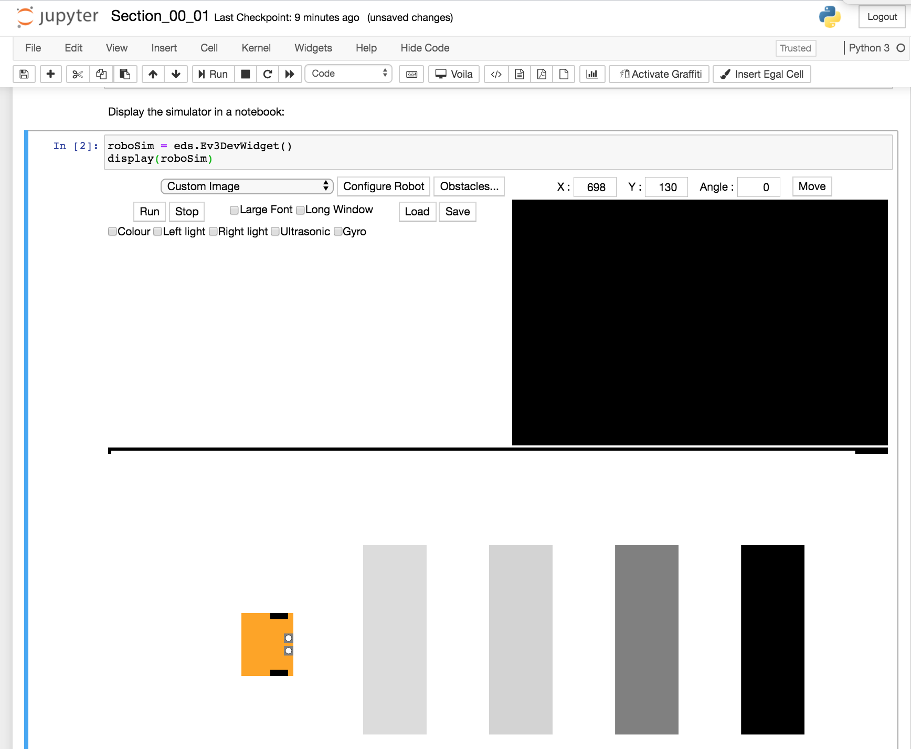

<!-- #region -->
### The `ev3devsim` Simulator

The `ev3devsim` simulated robot will be the focus of many of the programming activities. `ev3devsim` is inspired by (`ev3dev`)[`https://www.ev3dev.org/`], *"a Debian Linux-based operating system that runs on several LEGO® MINDSTORMS compatible platforms including the LEGO® MINDSTORMS EV3 and Raspberry Pi-powered BrickPi."* 

A Python 3 library, [ev3dev-lang-python](https://github.com/ev3dev/ev3dev-lang-python) provides a Python wrapper around `ev3dev` that allows you to program a LEGO EV3 robot using Python code.

The `ev3devsim` package implements a cut down version of the [`ev3dev-lang-python`] library to control a browser based, 2D-simulated robot. The `ev3devsim` Python codes runs in a Skulpt interpreter (a browser based Python interpreter) to control a Javascript powered robot simulator.

The original [`ev3devsim`](https://github.com/QuirkyCort/ev3dev-sim) simulator ran as a standalone web application that could be run, even in an offline mode, using just a web browser ([try it here](https://www.aposteriori.com.sg/Ev3devSim/index.html)).

[

Program code is entered into the editor window and run by clicking the simulator *Run* button and halts if there is an error or when the *Stop* button is pressed. An output window display messages sent from the program, such as sensor log values, as well as error messages if the programme throws an error when it is run.

The [`nbev3devsim`](https://github.com/innovationOUtside/nbev3devsim) package builds on the original `ev3devsim` to provide an `ipywidget` that embeds the simulator in a Jupyter notebook and allows it to be programmed from notebook code cells. Sensor data logged within the simulator can be exported to the notebook's own Python environment and analysed using the full power of Python's wide range of charting and data analysis packages.

  
Screenshots should show different layouts; eg with chart showing sensor traces and logs in message window; simpler output
 

The following screenshot shows a notebook code cell that includes a `%%sim_magic` IPython magic invocation so that the contents of the cell are downloaded to the simulator when the cell is run:

Whilst the original `ev3devsim` simulator runs without any software requirements other than a modern web browser, the `nbev3devsim` approach does require the availability of a Jupyter notebook environment. Although this increases the complexity of the software environment, it does provide several benefits:

1. instructional material can be provided within a notebook to support each programming activity;
2. data retrieved from the simulator can be analysed and charted in the notebook kernel context (for example, using Python or R);
3. the notebook environment provides a read / write environment within which a learner can make their own notes and annotations, as well as keep a record of the various steps they took to develop any particular robot control programme.

The current robot simulator allows robots to be configured using various components on specific input and output ports:

- `OUTPUT_B`: left motor (state can be running or blank, not ramping, holding, overloaded, or stalled; stop action is ignored and the robot always stops instantly; `SpeedPercent`, `SpeedNativeUnits`, `SpeedRPS`, `SpeedRPM`, `SpeedDPS`, `SpeedDPM` are all defined, as are `MotorSet`, `MoveTank` and `MoveSteering` motor groups);
- `OUTPUT C`: right motor;
- `INPUT 1`: ultrasonic sensor (readings provided for angles of incidence up to 50 degrees; slow update rate of an actual ultrasonic sensor is simulated with reading updates approximately every 0.1s);
- `INPUT 2`: left color sensor(raw values ranges between 0 to 255; ambient_light_intensity will always return 0; color and color_name may not give the same value as the actual sensor);
- `INPUT 3`: right color sensor;
- `INPUT 4`: gyro sensor.

The simulated world can be loaded with a selection of predefined background layouts, or uploaded custom layouts, can be used as the basis of specific robot programming tasks or challenges. (Layouts are sized 2362 by 1143 pixels, which corresponds to the size of a First Lego League / World Robot Olympiad (WRO) field mat, with 1 pixel representing 1mm.)

The colour sensors can obtain readings from traces on canvas layer that loads the floor mat; the ultrasonic sensor can sense obstacles on the mat although these are not physical objects that impede the progress of the robot. 

The robot is configured according to a simple set-up script that defines:

- the wheel diameter (default: `56` mm);
- the wheel spacing (default: `180` mm);
- the length of the robot (default: `120` mm);
- the weight of the robot (default: `weightless`);
- the placement of the left light sensor (`sensor1`, by default registered at location (`-20`, `30`) from centre front of the robot ) and the right light sensor at (20, 30);
- the placement and orientation of the ultrasonic sensor (by default, in the front center of the robot at (`0`, `20`) with angle `0` degrees relative to the front/back robot center-line).

The configuration can be updated via a pop-up window in the simulator.

  
In `nbev3devsim`, the intention is to move the set up either to a notebook code cell, a simple `ipywidget` configurator, or via simulator magic parameters.

<!-- #endregion -->

Programming robots is very stimulating, sometimes frustrating and usually very rewarding. Although the RoboLab exercises all have a serious purpose, we hope you will find them enjoyable and fun.
