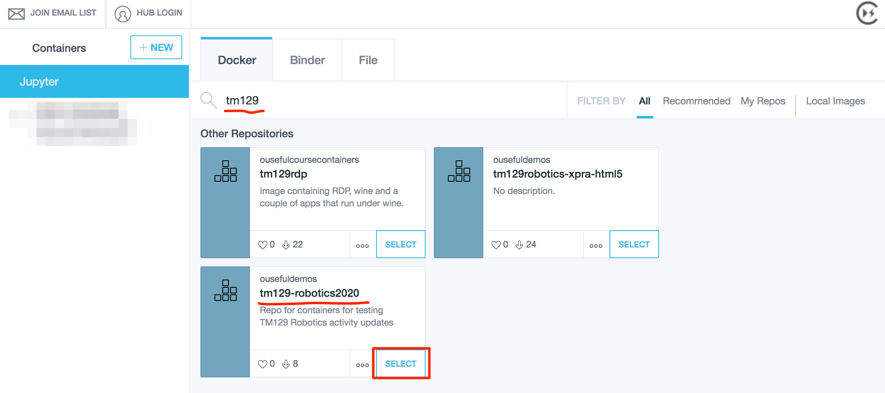
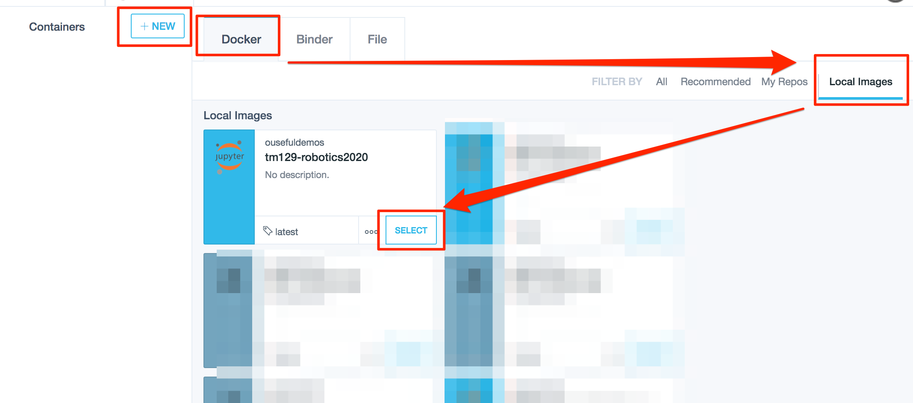
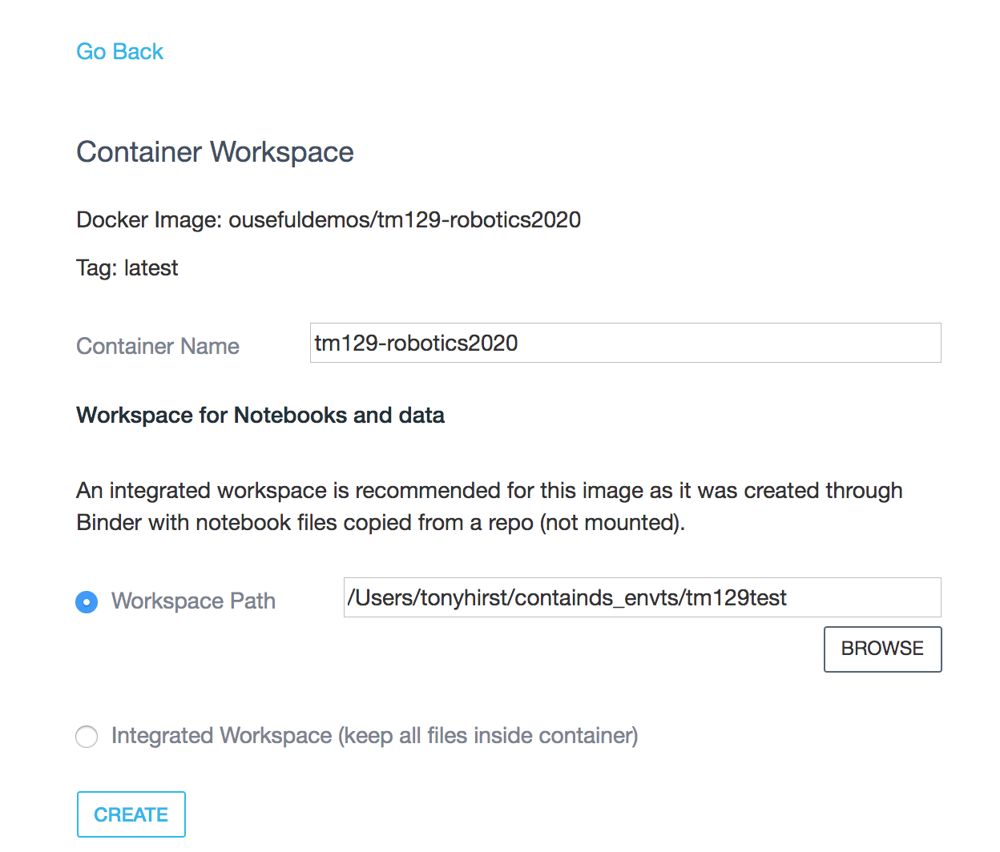
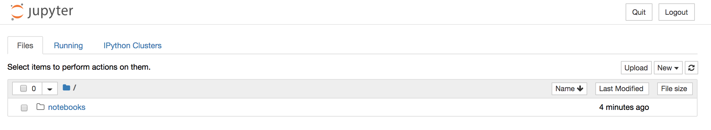
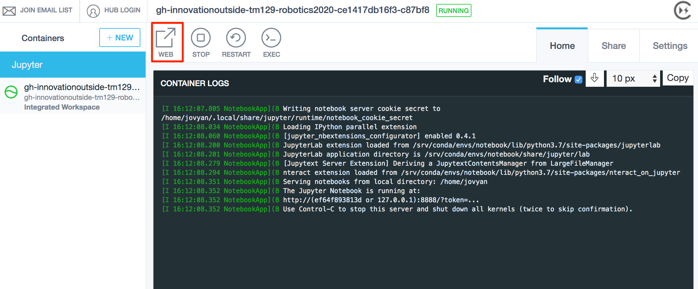

## 1.5 Gaining Access to the RoboLab Environment

There are several ways in which you can access RoboLab:

- *as a "temporary" online service using MyBinder*
- <s>*via the OU hosted JupyterHub environment WHICH DOESN'T EXIST YET*</s>
- *locally on your own computer*

### Accessing RoboLab Online - MyBinder / BinderHub

You can run the RoboLab environment online using the MyBinder service .

If you want to save any of the notebooks used there, you will have to download them as follows:

- as a single notebook from the notebook page `File` menu;
- as a zipped archive file of all notebooks using the the download button on the notebook homepage.

You can also upload your own notebooks from the notebook homepage either individually, or as a zip file. If you upload a zip file, you will need to unzip it. You can do this from a notebook command cell using the `unzip` shell command or [using Python code](https://thispointer.com/python-how-to-unzip-a-file-extract-single-multiple-or-all-files-from-a-zip-archive/). More details can be found in the __TO DO?? - see the `RoboLab Environment FAQ`__

### Running RoboLab On Your Own Computer - Computer Requirements

To run RoboLab on your computer, we suggest you install the prebuilt RoboLab computing environment. Using this environment has the advantage that the module team knows exactly what's inside it and how to help fix things if they appear to go wrong.

The downside is that the environment is quite large in terms of memory requirements: you will need at least 5GB of free memory to install it the environment, as well as its dependencies.

The underlying Docker application, which provides the virtualisation tools used to run the environment, is also happiest on computers with at least 4GB of RAM available.

### Downloading and Installing RoboLab

RoboLab runs in a simple virtual machine known as a Docker container.

To run RoboLab, you will need to download and install two applications: *Docker* and *ContainDS*.

### Download and Install Docker

Docker is the virtualisation platform that runs the RoboLab environment. You should download and install the latest version of Docker from the [Docker website](https://www.docker.com/products/docker-desktop), following the instructions for your particular operating system:

- [Docker Desktop for Windows](https://docs.docker.com/docker-for-windows/install/) ([direct download link](https://download.docker.com/win/stable/Docker%20for%20Windows%20Installer.exe)): *requires Windows 10 64-bit: Pro, Enterprise, or Education*
  - if your Windows machine does not meet the requirements for installing *Docker Desktop for Windows*, you should still be able to run Docker using the [Docker Toolbox on Windows](https://docs.docker.com/toolbox/toolbox_install_windows/)
- [Docker Desktop for Mac](https://docs.docker.com/docker-for-mac/install/) ([direct download link](https://download.docker.com/mac/stable/Docker.dmg)): *requires macOS 10.12 or newer, hardware from 2010 or newer*)
  - for older Macs that do not meet the requirements for installing *Docker Desktop for Mac*, you may still be able to run Docker using the [Docker Toolbox on Mac OS](https://docs.docker.com/toolbox/toolbox_install_mac/)
- *Linux*: you may find that Docker is already installed on your Linux computer (in a terminal, run the command `docker --version` to check). If it isn't available, you should install the latest version of the *Docker Engne - Community Edition* from the Docker repository. Find your flavour of Linux on the [Docker Engine overview](https://docs.docker.com/install/) page and follow the links to install the package on your particular operating system.

Locate the folder containing the downloaded installer: your browser may have a `Downloads` folder or it may have saved the downloaded file to the `My Documents` or `Desktop` folder. Inside the download folder, find the downloaded installer file and double-click it to run it.

__TO DO - could we get any security warnings?? If so, what, and how do we resolve them??__

If you saved the installer earlier, you may now delete it since it is no longer required.

Docker runs as an application service and it should automatically start and run in the background. 

### Download and Install ContainDS

*ContainDS* is a cross-platform (MacOS, Windows) desktop application that simplifies the launching and management of Docker containers in general, and Docker containers that incorporate Jupyter notebook servers in particular.

*You can also launch and use the RobotLab environment from the command-line on any platform (__TO DO?? - see the `RoboLab Environment FAQ`__ ). It's just that ContainDS makes life much easier...*

Download and install the latest version of the ContainDS application directly from the [ContainDS website](https://containds.com/):

- __Windows__ — use *one* of the following:
  - [`exe` installer](http://containdsreleases.s3-website.us-east-2.amazonaws.com/latest/exe)
  - [`msi` installer](http://containdsreleases.s3-website.us-east-2.amazonaws.com/latest/msi)
- __MacOS__ — use *one* of the following:
  - [`pkg` installer](http://containdsreleases.s3-website.us-east-2.amazonaws.com/latest/pkg)
  - [`dmg` installer](`http://containdsreleases.s3-website.us-east-2.amazonaws.com/latest/dmg`) 
  - __Linux__: *not currently available* __TO DO: Kitematic might be a GUI fall back; or command line, which might make sense anyway.__

Alternatively, you may save the installer to your computer by right-clicking the appropriate link and choosing `Save Link As…` or `Save Target As…`.

Locate the folder containing the downloaded installer: your browser may have a `Downloads` folder, or it may have saved the downloaded file to the `My Documents` or `Desktop` folder. Inside the download folder, find the downloaded installer file and double-click it to run it.

__TO DO - could we get any security warnings?? If so, what, and how do we resolve them??__

If you saved the installer earlier, you may now delete it since it is no longer required.

The ContainDS application is a desktop application. Run it as you would any other application:

- Windows: launch the application __TO DO: how??__
- MacOS: the application will be installed into your `Applications` folder. You can launch it from there, or add the application icon the Dock to make it easier to find and launch. See also: [MacOS documentation - using the Dock](https://support.apple.com/en-gb/guide/mac-help/mh35859/mac).

### Using ContainDS to Install the Prebuilt RoboLab Container Image

*Note that in this approach, you will __not__ be able to synchronise files inside the container with a persistent directory on your desktop.*

Open the ContainDS application, select the `Docker` tab and search for `tm129`. Select the `tm129-robotics2020` image.

If you have not previously downloaded the image, ContainDS will download it for you:

Do not be concerned if the download percentage indicator sometimes goes down as well as up — the downloader is actually downloading multiple items at once. (The container image is made up from several layers, each of which is downloaded separately, before they are combined in the final image.)

When everything had downloded, you may find your computer appears to be doing nothing for a minute or two, or even appears to get stuck just short of a 100% complete donwload. *Don't Panic!* The downloaded layers are all compressed files, and it may take some time for your computer to unzip them all.

Once downloaded, you will be prompted for a method of starting the container. Select "Standard":

The container will now be launched and a log trace displayed.

At this point, you need to `STOP` the container and remove it:

Now create a running version of the container from the *local* Docker image. This will allow you to share a local directory into the container as well as clicking through directly to the notebook homep[age in your browser.

### Running the RoboLab Environment from a Local Docker Image

Click on the `+NEW` button and then select the `Docker` tab and then the `Local Images` tab:

`SELECT` the local copy of the `tm129-robotics2020` container which will open the container workspace configuration page:

Set the path to the directory on your host computer that you want to share into the container. This will create a `notebooks` directory in that directory that will be mapped onto the `notebooks` directory visible from the notebook homepage.

When you `CREATE` the container, it will run automatically. Clicking the `WEB` link should take you to the notebook home page in your browser. *(Note that the file listing in the screenshot may differ from the file listing you see.)*

When you save your notebooks, they will be saved into the shared directory on your own computer.

### Using ContainDS to Build and Run a RoboLab Container from Scratch

As well as running the prebuilt RoboLab container, ContainDS can also build the container image, and then launch an image from it, from scratch. (The image only needs to be built once.)

Launch the ContainDS application, and then select the `Binder` tab.

Enter the name of the source repository:

`innovationOUtside/tm129-robotics2020`

and click the `LAUNCH` button.

As the image is built, you will see several temporary containers being created and destroed along the way. Note that the build process may take some time (up to 10 minutes or more).

Once the image has been built, a running container will be launched from it.

Click on the `WEB` link and you should be taken directly to the notebook homepage in your browser without needing to provide any notebook server token yourself.

`STOP` and remove the container, and then run it from a Local Docker Image; this will allow you to share a local directory into the container and directly click through to the notebook server homepage in your browser. 

### Running the RoboLab Virtual Environment from the Command Line

It is quite possible to launch the RoboLab virtual environment from a terminal / command prompt and then access the actual environment via your browser in the normal way, although it is slightly more fiddly than using ContainDS.

To run the container from the command line, run the following command:

`docker run --name tm129test --rm -d -p 8897:8888 -v $PWD/notebooks:/home/jovyan/notebooks ousefuldemos/tm351-binderised:latest`

This will serve the container on [`http://localhost:8897`](`http://localhost:8897`)

On Windows, I think you need to try something like the following [UNTESTED]:

`docker run --name tm129test --rm -d -p 8897:8888 -v c:\tm129share\notebooks:c:\home\jovyan\notebooks ousefuldemos/tm351-binderised:latest`

In Windows, you cannot mount on to a non-empty directory inside the container. You can, however, define and automaticaly create your own directory. For it to be visible to the notebook server homepage, the shared directory needs to be mounted along the `/home/jovyan/' directory path. For example, `-v c:\tm129share\notebooks:c:\home\jovyan\mySharedDirectory`.

In order to access the notebook server via your browser, you will need to find the token used to access the notebook server. Run the command-line command:

`docker exec -it tm129test jupyter notebook list`

This will display something along the lines of:

`Currently running servers:
http://0.0.0.0:8888/?token=dca25d6755dbd2a1c9b346dca3b8c839e44c9271e20bc416 :: /home/jovyan`

Use the token value to log in to the server.

The run command will create a notebooks directory in the directory you issued the run command from, and then share it into the `notebooks` folder that you can see from the notebook server homepage. OpenRefine projects are also shared between your local machine and the container.

Files that exist outside the `/home/joyan/notebooks` directory path in the container (which is to say, outside the `notebooks` directory viewable from the notebook server homepage, *will not be shared to your local desktop*.

### Obtaining the RoboLab Instructional Materials

We have provided a complete set of interactive instructional materials for working through the RoboLab activities in the RoboLab environment when run as a standalone container. However, if you share a local directory into the container using ContainDS, this will overwrite all those files.

If you need to download the materials separately, they can be downloaded from:

- [TEMPORARY]: the [innovationOUtside/tm129-robotics2020](https://github.com/innovationOUtside/tm129-robotics2020) repository;
- <s>the Resources area of the VLE????</s> __TO DO__

The contents of the repository can also be , it's easier to use the `nbgitpuller` application. From your notebook homepagem for example at `http://localhost:32796/tree` (your port number may well be different to `32796`...) change the path from `tree` to:

`git-pull?repo=https%3A%2F%2Fgithub.com%2FinnovationOUtside%2Ftm129-robotics2020&urlpath=tree%2Ftm129-robotics2020%2F&depth=1`
 
to give a URL of the form:

`http://localhost:YOUR_PORT_NUMBER/git-pull?repo=https%3A%2F%2Fgithub.com%2FinnovationOUtside%2Ftm129-robotics2020&urlpath=tree%2Ftm129-robotics2020%2F&depth=1`

Entering this URL will download the contents of the repository, making them available via the notebook server homepage and saving them to you local, shared directory if you are working with a local, shared workspace.

The materials are presented as a set of Jupyter notebooks. They include written guidance and example code that you can edit and execute. You can also add text cells to keep your own commentary and notes inside the notebook, as well as code cells in which you can write and run your own robot programming code.

You will probably want to keep copies of your annotated and executed notebooks as you work through them.

### Saving and Checkpointing Your Work

Within the notebook environment, the file will be saved automatically every 120 seconds (which is to say, every two minutes).

If you have changed the notebook since it was last autosaved, you will see a statement like the following next to the notebook filename at the top of the notebook:

`Last Checkpoint: Last Friday at 12:18 AM
(unsaved changes)`

The `(unsaved changes)` phrase is akin to the `*` indicator you often see next to a filename in a document editor that shows the file has changed since it was last saved.

If you watch for at most a couple of minutes, you'll note that it soon changes to something with the following form:

`Last Checkpoint: Last Friday at 12:18 AM
(autosaved)`

You can change the autosave period using magic (yes, really! That's what it's called...). For example, run the following statement in a notebook code cell and it will change the autosave period *for that notebook only* to 60 seconds:

`%autosave 60`

The autosave time can also be set using the `AutoSaveTime` notebook extension which can be enabled from the `nbextensions configurator` [[direct link](/nbextensions/?nbextension=autosavetime/main)].

As well as allowing your notebooks to be automatically saved, you can also "checkpoint" them.

When you use a keyboard shortcut to manually save the file, or you save a notebook document from the notebook `File` menu, you are actually issuing a `Save and Checkpoint` command. This saves in the same way that the autosave function does, but it *also* generates a checkpointed (backed up) version of the file in the hidden `.ipynb_checkpoints` folder.

What this means is that if you work on a file, allowing it to be autosaved, and realise that you have made some terrible mistakes in it, you can revert the notebook to a previously checkpointed (manually saved) version.

Note that this will throw away all changes made to the autosaved version of the notebook since the last manual (checkpointing) save, so use this command with care.