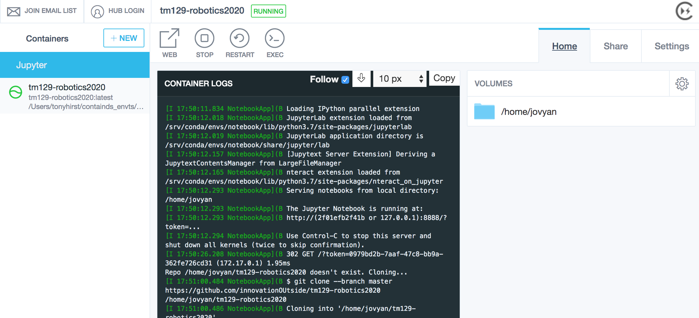
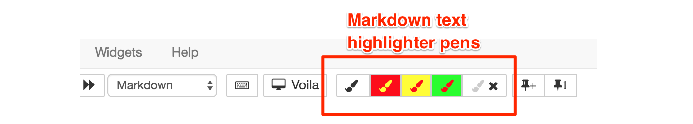

 number of sample programs that you will use in your Robot Lab sessions. You will need to save these in a folder of your hard drive. You may already have a folder called `TM129` for your work on this module. I suggest you create a subfolder called `RobotLab samples` for the sample files that you are about to download. You may of course choose a different location, but you will need to find these files again as you work in future Robot Lab Sessions. 
<div xmlns:str="http://exslt.org/strings" style="background:lightgreen">
<!--Heading: 
            Saving your work-->
As you work through future Robot Lab Sessions, you will often edit and extend my sample programs. I suggest you always save new work under a new file name so that you can go back to the original sample file. If you find you have inadvertently overwritten a sample file, you can download it again.
</div>
1. 
Find the RobotLab sample programs in the Study resources section of the module website.


2. 
Save the zip file to a folder of your choice by right-clicking and choosing `Save Link As…` or `Save Target As…`.


3. 
Extract the files and folders in this zip. You should see a number of subfolders called `week-1`, `week-2`, etc.


4. 
You can now delete the zip file but you may wish to keep it in case you wish to restore one or more sample files.


---


## 1.6 Activity: The RoboLab Notebook Editable Text Environment


In this short activity I will show you how to organise your RoboLab work environment. You won’t run any robot programs until the next activity.

TO DO - this is a 101 in using the environment. We're in an md doc running in notebook, so can use this part of the doc interactively.


If you clicked on the the link to this document from the notebook homepage in a the RoboLab environment, it will have opened within the notebook user interface as an interactive notebook document.

```python
!cat $CONDA_DIR/image_build.txt
```

### A first look

To start RoboLab, launch the ContainDS application.

If RoboLab is running, you should see it in the side bar, with its status indicator highlighted green. 



If it is not running, the status indicator will be greyed out. Click on the `START` button to start the container running.

If you cannot see the container in the sidebar, click on the `+NEW` button and following the instructions for *Running the RoboLab Environment from a Local Docker Image*.

If you cannot see a local copy of the image, follow the instructions for `Using ContainDS to Install the Prebuilt RoboLab Container Image`.

With the container running, click on the `WEB` button to open the notebook server homepage in your browser.

When RobotLab starts, the notebook server homepage will look something like the following (the actual file listing may differ).


If you click on a folder link, you will be presented with a list of the files contained in that folder, as you might expect. Click on the directory path links to navigate your way back up the directory listing tree.

The top of the directory listing is the directory that you shared in to the container using ContainDS. If you started the container from the command line, the top level is the `/home/jovyan` directory in the container and files should be mounted into that directory, either directly on on the path (for example, `/home/directory/mySharedDirectory`).


## Working With Notebook Files Interactively

If you are reading this document in a live Jupyter notebook environment, you will be able to interact with it directly.


For example, you can correct the speling mistake in this sentence by editing it directly. Double click on this paragraph, and the cell will become editable. Correct the spelling mistake, then "run" the markdown cell to redisplay it as formatted text.

You can do this in two ways. Either click on the `Run` button in the toolbar, or use a keyboard shortcut: `shift-enter` (that is, the shift key and the enter key at the same time).

Remember, to look up keyboard shortcuts, you can use the `ESC-h` keyboard shortcut (press the escape key and then, quickly after, the `h` key, or the escape key and the `h` at the same time): in the "Edit mode" area, look for "run selected cell".


### Previewing Formatted Markdown

Markdown text is a simple *mark-up* language in which you can write styled text using simple (hopefully intuitive) text elements. For example, to *emphasise* a word using italics, write it as follows: \*emphasis\*.

You may notice my "starred" text is not itself italicised. If you double click on this markdown cell to see its editable view, you will see I have "escaped" the * characters around the word \*emphasis\* with a backslash character — \ — as if to say: *do not process this*. Note that if you have a space between a * and a letter at the start of a word, then the styling is similarly not applied; likewise, to "close" the styling, you need to place the second * right next to the final character in the emphasised text.

*When you have finished looking at the editable text, hit `shift-enter` to return the cell to the rendered view.*

That may all sound complicated, but hopefully it will become natural to you. You may find you use similar techniques anyway when writing emails or social media messages or posts. You may even find that your editor in those environments is actually treating your text markup as markdown anyway.

The next paragraph contains several examples of other forms of mark up. Double click on the cell to make it editable so you can see how the styling was generated.

<!-- #region -->
### Markdown Examples

Double click on this cell to see how markdown is used to create particular styling effects.

We can *italicise text* by wrapping it with single asterisk `*...*` or `_..._` underscore elements.

Use a backslash character to disable the text processing effect, eg if you which to italicise a *\** character.

Strong (__bold__) emphasis can be introduced by wrapping text doubling up the number of * or _ elements.

Unnumbered list items:

- are prefixed by a `-` or single `*` character, followed by a space;
* are clearer in their text for if you precede the first list item with a blank line
  - sublists are indented, and are identified by prefixing the - or * marker by two spaces.
  
Numbered lists:

1. are identified by prefixing the line with `1.` followed by a space.
1. some flavours of markdown may offer the ability to use alternative numbering schemes (letters, or Roman numerals, for example).


Headings are identified by starting the header line with one or more `#` characters, followed by a space and then the title or (sub) heading. The number of `#` characters identifies the level of heading required.

You can also identify a heading by placing two or more equals signs (`==`) on the line immediately below it, or a subheading by placing two or more dashes (`--`) at the start of the following line.

Dividing lines can also be added: just start a line with three or more dashes (`---`) prefixed by an empty line.

---

Inline `code` can be identified by wrapping the code item within backticks: \`...\`. 

Blocks of code can identified by marking out an area using three or more backticks to start and end the block:

```
# comment
def hello(msg):
    print(msg)

hello("my friend")
```

Syntax highlighting for a particular language can be enabled by declaring the language required immediately after the opening set of backtcicks (although rendereing backticks in backticks can be tricky!). For example, starting a code block with ```` ```python ```` will cause it to be rendered using Python language syntax highlighting:


```python
# comment
def hello(msg):
    print(msg)

hello("my friend")
```

You can also add links you your markdown text, using constructions of the form: `[my link text](https://example.com)`.
<!-- #endregion -->

<!-- #region -->
## Taking Ownership of Your Notebooks

One of the difficulties in working with electronic texts is that they can often be hard to annotate. Interactive notebook style interfaces offer a different way of working, in that you can annotate or edit the text directly. 

One way of annotating the markdown text materials is to use the highlighter pen from notebook toolbar.




<span class="mark">Simply select the text you want to highlight in its rendered view, and then click on the appropriate highlighter pen colour.</span>

Another way is to just start clicking on the markdown cells, adding your own notes, commentary or reflection, or your own questions, explanations and examples, to the text.

There are risks associated with this of course - like accidentally deleting a chunk of module materials, or changing a working example to a broken one. But there are also many advantages - like making the materials meaningful *to you*. And if you want to distinguish your content from the provided materials, you can always highlight them, or put them in a markdown cell of their own, with a heading that identifies the text in that cell as your own work. 
<!-- #endregion -->

<!-- #raw -->
Alternatively, from the notebook toolbar, change your own markdown cells to cells of type `Raw NBConvert`. Although this cell type does not render the markdown styling — the text is presented in a "raw" teletype style text view —  if you used markdown annotations *they should still mark up your text in a __meaningful__ way*. And the text is visually distinguishable from the provided, styled, markdown materials.
<!-- #endraw -->

### Previewing Style Markup

Although I find it second nature to write in markdown (I've been been writing in simple text formats for a long time!) you may find it takes some getting used to, and that you keep having to flip between the edit view and the rendered view to make sure you are creating the text effect you intended.

To make it easier, if you enable the `livemdpreview` notebook extension [[direct link](/nbextensions/?nbextension=livemdpreview/livemdpreview)], you can preview how your rendered markdown looks in a preview window directly underneath a markdown cell you are editing.

*You may need to save your notebook and reload it in your browser after enabling the extension to see the effect. It should be enabled by default for any notebooks you open after enabling the extension.*

A checkbox option in the extension's configuration panel optionally allows you to display the preview alongside, rather then below, the markdown cell being edited. The preview disappears when you return the cell to its display mode.


### WYSIWYG "Text Editor" View
If you really cannot get to grips with writing raw markdown, a WYSIWG editor is available.

Enable the [`jupyter_wysiwyg`](/nbextensions/nbextension=jupyter_wysiwyg/index) extension from the notebook configuration menu. (You may find that access to it is disabled at first; at the top of the extensions configurator page, uncheck the *disable configuration for nbextensions without explicit compatibility* option.)

Save and reload your notebook. When you double click on a markdown cell to edit it, you should now see two buttons have appeared on the left-hand side of the cell, one with a `Rich Text Editing` tooltip when you hover over it, the other with a `Run Cell` tooltip.

The `Run Cell` button provides a convenient additional way of rendereing a markdown cell that is currently in edit mode. You also need to use this button to render the cell if you have been editing it using the rich text WYSIWYG editor.

The `Rich Text Editing` button provides a way of launching the rich text editor. This editor allows you to style your text, and immediately see the result, as you type. You can still see the raw mark-up text by rendering the cell and then double clicking on it to take it into the edit mode. However, you may find that the marked up text is not quite as clean as mark-up text: HTML tags are used to style the text and any previous markdown annotations will be converted to theitr HTML equivalents.


## Creating New Markdown Text Cells


## Code Cells

Code cells can be used to enter — and *execute* — Python code.

To run a code cell, which is to say, to execute the code contained in a code cell, click in the code cell to select it and then press the run ("play") button on the notebook toolbar. Alternatively, use a keyboard shortcut - `SHIFT-RETURN` — to run the selected cell.

```python
print("Hello!")
```

When a cell has successfully completed executing, the run status indicator is coloured green. After running a code cell, a number in square brackets displays a cell execution index number. Each time a code cell is run, the overall index count goes up by one and is used to indicate the cell execution index (or "cell run number") for that cell.

When a code cell is running, or waiting to run, it is highlighted with a light blue colour on the left hand side. A * character also indicates the status of the running cell.


If you run all the cells in a notebook, all the cells yet to be run, as well as the running cell, are highlighted with a blue run status indicator and the * cell run number.


If an error is raised that causes a code cell not to execute correctly, the run status indicator is coloured pink and an error message is show beneath the the cell in the code cell display area.


Clicking on the arrow will at the end of the error messge will reveal the full error message.


Run the following cells to see the indicators in action.

```python
import time
```

```python
time.sleep(25)
```

```python
print("hello")
```

```python
print("hello again"
```

### Displaying Code Line Numbers

Sometimes it can be useful to display line numbers in a code cell to more easily reference or refer to a particular


### Code Style

To make code as readable as possible, the PEP8 style guide provides guidance on how to lay out your code. Code style guidance includes things like:

 - this 
 - that


## Creating New Code Cells

```python
## Activity — Creating and Editing Your Own Markdown Cells
```

## Activity — Highlighting Markdown Text

```python
## Activity — Creating New Raw NBConvert Commentary Cells
```

## Activity — Creating and Running Your Own Code Cells


The RobotLab program has two important windows – the `Simulator` window on the right and the `Program editor` window on the left. The `Program editor` window contains three different areas or ‘panes’.

 On the left of the `Program editor` is the `Command` pane which lists all the RobotLab commands. There are three different tabs which simply list the commands in different ways. The `Basic` tab has the most commonly used commands. The `By name` tab lists the full list in alphabetic order and is more convenient if you use the keyboard rather than the mouse. Try clicking the tabs<div xmlns:str="http://exslt.org/strings" style="background:lightblue"><p>Keyboard: Use the Tab and Shift+Tab keys to cycle among tabs</p></div> now; return to the `Basic` tab when you have finished.
<!--ITQ-->

#### Question

What does the `By type` tab do?


#### Answer

The `By type` tab lists the full set of RobotLab commands, but grouped into similar types of command rather than in alphabetical order.
<!--ENDITQ-->
Below the `Command` pane is the `Key-Value` pane. This is used to change the detail of commands in programs. More on this later.

To the right of the `Command` pane is a pane which lists the currently loaded program. We will also look at this in more detail later.

On the far right is the `Simulator` window, which should currently show a view of a yellow robot seen from above.

---

---

<!-- #region -->
### Alternative RoboLab User Environments


__If we move to JupyterLab, or Voilà, there is more scope for controlling the layout of the RoboLab environment. For the initial treatment, let's just work with notebooks and focus on the code elements and see how well that works.__

Below the `Program` window there are other minimised windows: `Controls`, `Data log`, and so on. The purpose of all these windows will be explained later.

 All these different windows can be closed, restored to view, maximised, minimised and moved around the screen. Try clicking<div xmlns:str="http://exslt.org/strings" style="background:lightblue"><p>Keyboard: Press Alt+Minus and then pick menu items</p></div> the different windows’ Restore    and Close    buttons, and dragging the windows around the screen until the layout looks completely different. 

---

---
<!-- #endregion -->

### Restoring the default window layout of RobotLab

It is easy to get the default window configuration back. Simply click on `Window` in the `menu` bar,<div xmlns:str="http://exslt.org/strings" style="background:lightblue"><p>Keyboard: To select menu items, press Alt, then cursor keys to select and press Enter, or press underlined letters</p></div> then the `Default layout` option, as illustrated in Figure 1.5. Alternatively, click on the Default layout    button in the toolbar.


Figure 1.5 Restoring the Default layout


The RobotLab Window menu containing the items: 

 Default layout (highlighted) 

 Restore layout 

 Save layout 

 ------------- 

 1 Simulator 

 2 Program editor 

 3 Controls 

 4 Data log 

 5 MindScript 

 6 Variables 

 7 Messages

You can also restore and close different windows using the RobotLab `Window` menu in Figure 1.5. Try this now.

It is useful to know how to control the windows in RobotLab. Otherwise you may lose or gain windows at inopportune times, and risk getting frustrated. 
<!--ITQ-->

#### Question

If you have a layout that you find useful and would like to use it again, what would you do?


#### Answer

You can use the RobotLab `Window &gt; Save layout` menu to save the layout you have currently displayed. Then, next time you start RobotLab, use the `Window &gt; Restore layout` menu items to get it back.
<!--ENDITQ-->
When you have finished, click again on `Default layout` and you are ready to continue.

---


## 1.7 Activity: Opening a program

<div xmlns:str="http://exslt.org/strings" style="background:lightgreen">
<!--Heading: 
            Instructions in detail-->
In this activity I will show you how to open a RobotLab program, giving instructions in some detail. In later activities, I will simply ask you to open a particular example program and assume you can remember how to do it. You may need to refer back to this activity if you can’t quite remember what to do.
</div><div xmlns:str="http://exslt.org/strings" style="background:lightgreen">
<!--Heading: 
            Windows XP in figures-->
In these instructions, I will be illustrating what you see with screen dumps that were taken on a computer running Windows XP. If you are running a different version of the operating system the details of what you see are likely to look slightly different. I hope you will still be able to follow these instructions. If you get into difficulty, try asking for advice on the module Technical Help forum.
</div>
Click the RobotLab `File` menu and then choose `Open...`.<div xmlns:str="http://exslt.org/strings" style="background:lightblue"><p>Keyboard: Ctrl+O</p></div> This will open the standard Windows file dialog.

Navigate to the folder `week-1` of the RobotLab sample programs you downloaded earlier. You should see the following list of programs.


Figure 1.6 The Windows file `Open...` dialog with sample files in `week-1` shown


Select the file `Move_a_robot` and click the `Open` button.<div xmlns:str="http://exslt.org/strings" style="background:lightblue"><p>Keyboard: Enter</p></div>


Figure 1.7 RobotLab with the `Move_a_robot` program loaded


This will open the program `Move_a_robot` (Figure 1.7). 

That’s it! You are ready to run your first robot program – but I won’t tell you how to do that until the next activity.

To open a different program, you can simply choose `File &gt; Open...` again.

To exit from RobotLab, just choose `File &gt; Exit`.<div xmlns:str="http://exslt.org/strings" style="background:lightblue"><p>Keyboard: Alt+F4 will exit RobotLab at any time</p></div>

If you have made changes to your program, RobotLab will first prompt to save your work; for now, just choose No.

