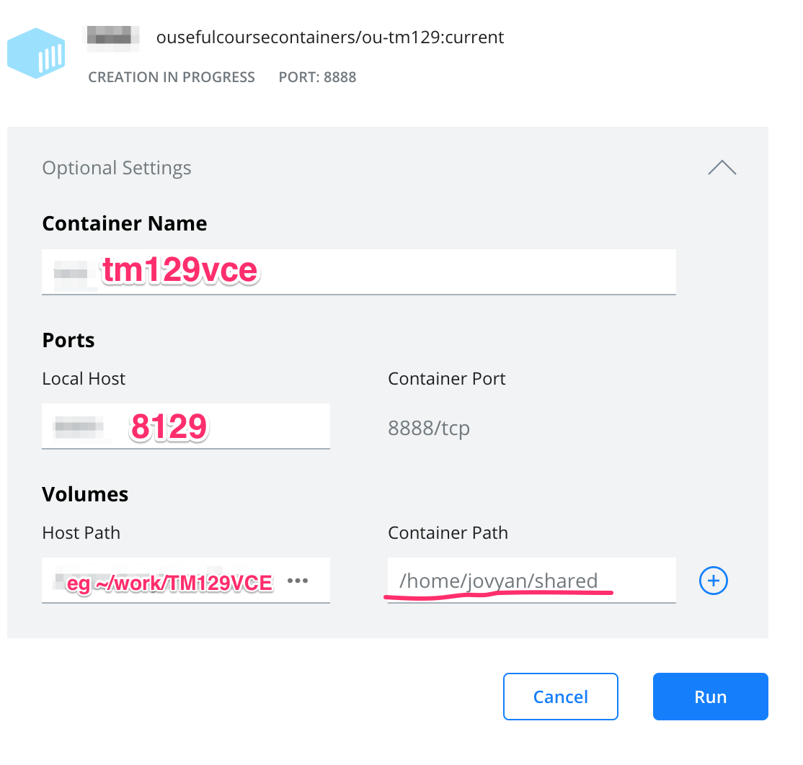

# tm129-robotics2020
Repo to explore the drafting of updated robotics activities for the OU module TM129.

[](https://gke.mybinder.org/v2/gh/innovationOUtside/tm129-robotics2020/master)

Neural net demos: [](https://mybinder.org/v2/gh/innovationOUtside/tm129-robotics2020/master?filepath=content%2F07.%20Neural%20networks)

Presentation: [](https://gke.mybinder.org/v2/gh/innovationOUtside/tm129-robotics2020/master?filepath=seminar_tm129_robotics_overview.md)

*(I note in passing the nbgitpuller binder tab [here](https://jupyterhub.github.io/nbgitpuller/link.html), as well as this [WIP](https://github.com/innovationOUtside/ou-tm129-py/) on packaging py requirements via a py package; should this repo be used as content against a binderbox elsewhere?)*


## Build process

The `ousefuldemos/tm129-robotics2020:latest` container  is built from this [`innovationOUtside/tm129-robotics2020/`](https://github.com/innovationOUtside/tm129-robotics2020/) repo by a Github Action [watching releases](https://github.com/innovationOUtside/tm129-robotics2020/blob/master/.github/workflows/repo2docker.yml).
 
On my own machine, I then run:

```
cd release
docker pull ousefuldemos/tm129-robotics2020:latest
docker build --tag ousefulcoursecontainers/ou-tm129:current .
docker push ousefulcoursecontainers/ou-tm129:current
```

The [`release/Dockerfile`](https://github.com/innovationOUtside/tm129-robotics2020/blob/master/release/Dockerfile) is likely to become a work in progress that does things like tidy up the container. At some point, the housekeeping will then be pushed back into the Github Action; I may also create another Github Action, or extend the original one, to perform the above steps to publish the release container.

A proper tagging strategy and automation route for images creating and publishing images released to students also needs figuring out.

## Quick start (presentation testing)

Download and installer docker...

From the command line / Powershell, run:

```
# update the image
docker pull ousefulcoursecontainers/ou-tm129:current
```

Create a directory to share into the container somewhere, eg `~/TM129VCE`

### Docker dashboard instructions

From the images tab, create a new container (`tm129vce`), use port: `8129`, select the `TM129VCE` directory you want to to share and mount it onto `/home/jovyan/shared` inside the container:



Set the container running and follow the running containe's *Open in browser* dashboard link.

Go to the *With the container running* instructions...

### Mac instructions:

__If you've done the Docker Dashbboard route, follow the previous instruction and go to the *With the container running* section.__

From command line:
 
Find yourself a working directory.
Optionally create a TM129VCE test directory (one will be created if you don’t)
Run: 

```
# update the image
docker pull ousefulcoursecontainers/ou-tm129:current
# clear any old container
docker rm -f tm129vce
# launch new container
docker run -d -p 8129:8888 --name tm129vce -v "$PWD/TM129VCE":/home/jovyan/shared  ousefulcoursecontainers/ou-tm129:current
```

Go to the *With the container running* instructions...

### Windows instructions:

__If you've done the Docker Dashbboard route, follow the previous instruction and go to the *With the container running* section.__

Using Powershell, find yourself a working directory.

Optionally create a TM129VCE test directory (one will be created if you don’t)

Run:
 
```
# update the image
docker pull ousefulcoursecontainers/ou-tm129:current
# clear any old container
docker rm -f tm129vce
# launch new container
docker run -d -p 8129:8888 --name tm129vce -v $pwd\TM129VCE:/home/jovyan/shared  ousefulcoursecontainers/ou-tm129:current
```

Go to the *With the container running* instructions...

### With the container running:

In a browser, go to localhost:8129

Use the token: `letmein`
 
On notebook homepage, click to select the `content` folder, then in notebook homepage toolbar select `Move`, and enter `/shared` in the moved to path.
 
You should then be able to view the notebooks in `shared/content` in the notebook UI and the notebooks should also be on host in `TM129VCE/content`

__Note that the `nbev3devsim` simulator used throughout the notebooks requires you to access the materials via a recent Chrome browser.__
 

## HTML version
An HTML version (maybe?!) of the materials in the repo is available here: [https://innovationoutside.github.io/tm129-robotics2020/](https://innovationoutside.github.io/tm129-robotics2020/). Note that this site may lag the materials in the repo by few days...

This repository defines the computing environment for the practical activities for the 20J update to the OU TM129 robotics block.

A Docker container image built from the repository using `repo2docker` is available on Dockerhub: [`ousefuldemos/tm129-robotics2020`](https://hub.docker.com/repository/docker/ousefuldemos/tm129-robotics2020)

Release:

`docker pull ousefuldemos/tm129-robotics2020:latest && docker image tag ousefuldemos/tm129-robotics2020:latest ousefulcoursecontainers/ou-tm129:current && docker push ousefulcoursecontainers/ou-tm129:current`

## Getting Started
You can explore the contents of this repository via interactive Jupyter notebooks by clicking the *Binder* button above.

To run the environment on your own computer, you need to do the following:

- install Docker onto your computer; you can download the installation files from the Docker website: [Get Docker](https://docs.docker.com/get-docker/)

- open a terminal / command prompt in your desktop; from the command prompt, do the following:
  - create a working directory / folder to work in by entering the command: `mkdir TM129`;
  - change directory into that fold by running the command: `cd TM129`;

  - run the command `docker pull ousefuldemos/tm129-robotics2020:latest` to pull down the Docker container image from Docker Hub; (if you have previously downloaded the image, this will downloaded any updated version of it);
  - on a Mac at least, launch the docker container by running the command: `docker run --name tm129vce -p 8129:8888 -v "$PWD:/home/jovyan/notebooks"  -e JUPYTER_TOKEN="letmein" ousefuldemos/tm129-robotics2020:latest`
    - *(the quotes round the volume mount cope with spaces in the `$PWD` directory path)*
  - stop (hibernate) the container with the command: `docker stop tm129vce`
  - restart the container with the command: `docker restart tm129vce`


On Windows, use a run command of the form:

`docker run --name tm129vce -d -p 8129:8888 -v $pwd\notebooks:/home/jovyan/notebooks -e JUPYTER_TOKEN="letmein" ousefuldemos/tm129-robotics2020:latest`

When you run the `docker` command, several things will happen:
 
 - first, docker will download the container image from DockerHub (this may take some time but only happens the first time you try to run the container);
 - then, docker will launch the container and a Jupyter notebook server will start running inside it.
 
When the container is running, go to [`localhost:8129`](http://localhost:8129) in your browser (if that doesn't work, try [`127.0.0.1:8129`](http://127.0.0.1:8129)) and you should see a running notebook server there.

Use the token `letmein` to access the server (you should only need to do this once).
 
Any files in the local `TM129` directory on your host computer should appear in the `notebooks` folder in the notebook homepage directory listing.

## Teaching Materials

The repository also contains drafts of the practical activity teaching materials. These materials are "unpublished" and *©The Open University, 2020*; they are posted here purely to support commentary and review during development. The initial draft of the materials is essentially a recasting of the original materials and activities into a form that uses a new user environment (*Jupyter notebooks*) and new simulation environment ([`nbev3devsim`](https://github.com/innovationOUtside/nbev3devsim), based on [`ev3devsim`](https://github.com/QuirkyCort/ev3dev-sim)).

When starting the Docker container, if you mount the current working directory on host onto the `/home/jovyan` directory in the container, it will clobber all the files that were are the top level of this repo that are otherwise baked into the container.

However, some essential file from the top level of the repo directory are also stashed in the `$CONDA_DIR/workfiles/recover` directory.

Launch a notebook terminal and run the command: 

`cp -ir $CONDA_DIR/workfiles/recover/* /home/jovyan/`

to recover the files into clobbered home directory. This files will then be place in your current working directory. (Omit the `i` flag if you do not want to be warned about overwriting any files.)


## Open Computing Lab

This repo is being developed according to (emerging!) *Open Computing Lab* principles. The `userguide` provides generic instruction on using *Open Computing Lab* environments.
