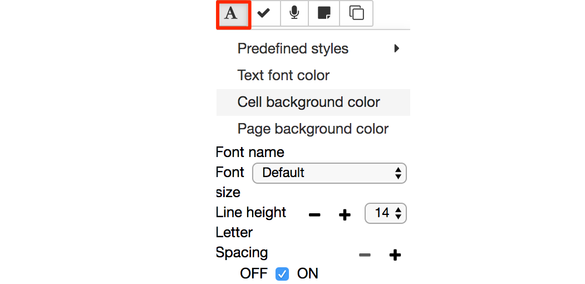

## 1.3 Accessibility

We have tried our best to make RoboLab accessible to all students, whatever their particular needs.

__TO DO - I havenlt test accessibility toolbar in conjucntion with the simulator; they may or may not play well together...__

The Jupyter environment includes an [accessibility toolbar extension](https://github.com/uclixnjupyternbaccessibility/accessibility_toolbar) that allows you to control the presentation style of the Jupyter notebook; for example, you can change the font style, size and spacing, the notebook background colour, and so on. Several predefined custom themes are available [BROKEN] and you can also define your own. The extension also supports voice control [BROKEN].

__TO DO: there is also a [jupyter-themes](https://github.com/dunovank/jupyter-themes) extension that we could pre-install, perhaps with one or more OU custome themes? This may be in addtion to, or in place of, the accessibility toolbar. There are also simple tricks and tools for speaking out code cell contents, such as the [jupyter-a11y](https://github.com/jameslmartin/jupyter-a11y) extension.__

All of the styles are saved into local storage when refreshing the page. This means that if you use notebooks on different servers with the same browser, the same accessibility settings will be applied to notebooks on all servers within which you have enabled the accessibilty extension.

### Enabling the Accessibility Extension
The accessibility is __disabled__ in the RoboLab environment by default. To use the accessibility extension, you need to enable it first. You can do this from the `nbextensions` tab on the notebook homepage: check the `Accessibility toolbar` extension to enable the toolbar. When you open a new notebook, the toolbar should be displayed.

Check the [accessibility toolbar documentation](https://github.com/uclixnjupyternbaccessibility/accessibility_toolbar#toolbar-summary) for more information.

The Module Team welcome feedback on these features.

### Colours and fonts

If you wish to change the font and interface colours used in RoboLab to improve readability, the accessibility toolbar allows you to select the font style, size and colour. You can also modify the line spacing and spacing between individual characters.

 
The font style applies to *all* text elements within the notebook itself. This includes the contents of markdown (text) cells, code cells and code cell outputs.

The toolbar can also be used to control the notebook's background colour and the cell background colour.

You can also save a style you have defined from the `Add new style...` option in `Predefined styles` menu. Once saved, it will be added to the menu list so you can apply it as required. 

### Keyboard interface

The Jupyter notebook interface supports a wide range of pre-defined keyboard shortcuts to menu and toolbar options. The shortcuts can be displayed using the `Keyboard shortcuts` item from the notebook `Help` menu or via the `ESC-h` keyboard shortcut.

You can also add additional shortcuts and/or edit exist shortcuts via the `Edit Keyboard shortcuts` menu item.

__TO DO: is Jyro keyboard accessible??__

__TO DO: what's best way of tabbing through the notebook? Or should notebook keyboard shortcuts be used? Are any potentially useufl navigation style keyboard shortcuts missing?__

### Magnification

The apparent size of the notebook contents in general can be zoomed using standard browser magnification tools. 

Alternatively, use operating systems tools such as *Windows Magnify* or the MacOS *Zoom Window*, or other assistive software.

### Other assistive software

__TO DO: to what extent will screen readers and dictation systems operate features of RoboLab??__

Please contact the Module Team if you discover that the material does not work with a particular screen reader or dictation system that you would typically expect to be able to use.

### Audio

Some RoboLab programs 'speak'. Where the speech is generated as a part of a program flow, a visual display of the spoken phrase will also typically be displayed at the time the phrase is spoken.

__TO DO: https://github.com/jameslmartin/jupyter-a11y/ accessibility extension which included keyboard shortcuts to read the highlighted cell, cancel reading of the cell, skip the current line of the code cell being read widget. I will update this extension, try it out and if it works okay add it to the environment.

__TO DO: need to make sure we do this; a custom widget might help that maps to both audio and a text display widget._
