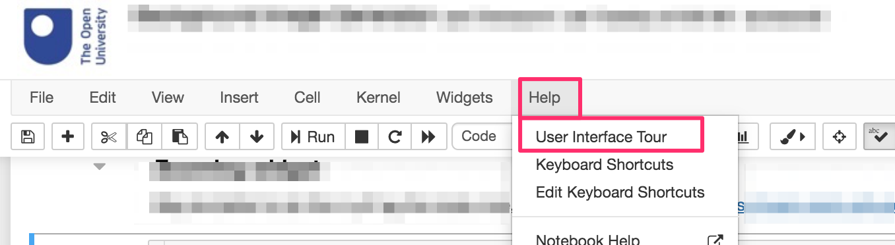

# 1 Getting started

In which we introduce the working environment for the TM129 Robotics Block practical activities.

*As I edit this, as a direct revision of the original, it's a very "flat" document. A lot of the things could be made more interactive. eg an interactive tour of elements of the notebook or a Graffiti interaction, rather than a static, linear, screenshot enhanced narration. Middle ground would be a screencast. But could we also instrument that somehow? Certainly, we could capture the visual recording using browser automation.*


## 1.1 Introduction to the TM129 Virtual Robotics Lab: RoboLab

The *TM129 Virtual Robotics Lab*, or "RoboLab" for short, is a self-contained, virtualised computing environment. This environment enables you to experiment with, and program, simple simulated robots using the Python programming language. The same environment can be used on different computing platforms (Windows, MacOS, Linux) either running locally on your own computer or via a remote external server accessed over the internet.

You will use RoboLab in a practical session during each study week of this part of the module. 

After studying RoboLab you should be able to: 

* understand the basics of computer programs (e.g. explain what is meant by a sequential computer program, the terms ‘constant’ and ‘variable’, and explain and illustrate the terms ‘branch’ and ‘loop’)

* use programs in RoboLab (e.g. run example programs in RoboLab and say what a simple robot control program will do)

* manipulate simple programs in RoboLab (e.g. modify the programs to give different behaviours and write your own simple robot control programs).

If you already know something about computer programming or robotics we will also provide you with links to various extension activities that you can use to develop your skill further.

Note that the purpose of these activities is *not* to teach you how to write code in the Python programming language specifically, nor to provide you with an introductory course in computer programming in general. Instead, the intention is show you how we can use building blocks of code to programme a simple simulated robot in order to perform a range of simple tasks. The *programming* task is often more to do with decomposing a problem into simple steps we know how to do than it is writing syntactically correct Python code. So if something new appears in one of the programmes we provide you with in an unexplained way, *DON'T PANIC*. Accept it as a black box that does *something*, and go with it; a fuller explanation will often appear later.

The lab sessions each week consist of exercises using a simulated robot. The simulated robot is based on a small mobile robot with a number of sensors. Robots like this are available at low cost and many are within the reach of amateur enthusiasts.

RoboLab itself is accessed using a Jupyter environment presented via a web browser. Many activities are presented through interactive Jupyter notebooks and make use of a simple graphical robot simulator.


### The Jupyer Notebook Environment

Jupyter notebooks are are widely used interactive environment for writing "literate" programming scripts in a web browser. Originally developed to support computational data science projects, they are increasingly used as more general computational notebooks that can blend explanatory text with executable code and graphical, or even interactive, code outputs.

The notebook homepage provides a simple listing of files in a particular directory. Additional tabs allow you to monitor currently running notebooks and configure user-enabled extensions that can be used to customise your notebook environment.


Clicking on a file of an appropriate type will open it as an interactive Jupyter notebook.

Notebooks are structured using the notion of different sorts of "cell". For example, *markdown cells* are used to contain explanatory text written using the simple text based markdown script. Executable *code cells* can be used to declare executable Python code, the outputs of which can be displayed as *code cell outputs*.


As well as supporting general computation, code cells are also used to create and display a simulator output:


In addition, code cells can contain code that is "downloaded" to the simulator when the code cell is run:


Markdown and code cells can be edited and saved interactively via the notebook's browser interface.

For an interactive tour of the notebook environment, from a notebook *Help* menu select the *User Interface Tour* option. (Press the `Escape` key on your keyboard to cut the tour short.)



As well as the notebook environment, a more complex "lab" or "integrated development" style interface, *Jupyterlab*, is also available.

The following shows a JupyterLab set up based around another notebook based simulator, the  `Jyro` robot simulator. At the current time, the simulator used for the RoboLab activities do not work using the "torn off" simulator output window display mode shown below.


Whilst you are welcome to make use of the JupyterLab environment, we will tend to stick to the simple notebook interface for the module activities.


The following cell contains Python code that can be executed by "running" the code cell. The code can produce two sorts of output:

- display items rendered as the programme executes via `display()` or `print()` commands in the code;
- a "cell output" value that displays the return value (if any) from the last statement in the cell.

The code in the cell can be executed using the "Run" button in the notebook toolbar, as well as via keyboard shortcuts.

(We will explore the mechanics of using the notebooks in more detail later on.)

```python
print("hello world...")

my_variable = "value of my variable"
my_variable
```

### Notebook Extensions

A wide range of notebook extensions are installed in the RoboLab environment, although the majority have not been pre-enabled.

You can enable and disable extensions, as well as further configuring certain extensions, via the extensions configurator. This can be accessed from the notebook homepage or from the `nbextensions config` option in the `Edit` menu of an opened notebook.


You are welcome to explore the available extensions, or even add further ones of your own, to personalise your notebook environment, but we will not discuss them further here.

*You may want to share details of any extensions you find particularly useful in your module or tutor group forums.*


## Addendum

At the end of some notebooks, there may be an *Addendum* section. These sections are *optional* as far as the module goes, and you are not necessarily expected to, let alone required to, study them, read through them, or even glance at them at all.

In particular, the addendum sections provide additional context or explanation not directly relevant to the module but which may be of interest to the more curious or technically minded amongst you. In some cases, the sections are there to explore in a little more detail how a particular activity or notebook feature works behind the scenes; in other cases, they may hint at other ways in which what you have learned may be applied to other contexts not directly associated with programming robots.
