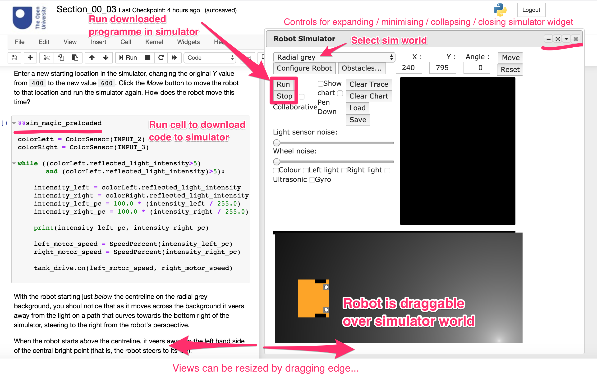

# 2 The RoboLab simulated on-screen robot (`nbev3devsim`)


<!-- #region -->
## The `nbev3devsim` Simulator


The `nbev3devsim` simulator is arranged slightly differently to the original `ev3devsim` simulator in order to develop a workflow that more naturally suits notebook style working.

Rather than saving programmes to separate files, each individual robot simulator programme is defined within its own notebook code cell, and can then be "downloaded" to the simulated robot. This means you can keep track of a how a programme develops by writing each version of a programme in its own code cell. 


<div class='alert-danger'>Layout is subject to change...</div>



Program files can be saved from, and loaded into the the program editor.

A range of predefined worlds can be loaded into the simulator, as image files, from a drop down menu.

Obstacles can be added to a world using a configuration file opened by clicking the `Obstacles` button.

The robot can be configured via a configuration menu.

The robot can be moved to a specifed location  y speficifying target location oc-ordinates and clicking `Move`. [TO DO - would be useful to be able to recenter the robot as well as  drag, drop, rotate it.]


?? something about the actual ev3 robot and ev3dev py library ??


Figure 2.2 A LEGO Mindstorms robot buggy


Simon simulates simple robots such as ones that can be built with LEGO Mindstorms (Figure 2.2). In fact, RobotLab was originally designed to work with LEGO Mindstorms RCX robots. Robots as simple as this are very useful for getting hands-on experience with robotics, but naturally they have some limitations compared with more sophisticated (and complex) robot systems. Some of the features of RobotLab and Simon will make more sense if you know a little bit about a simple robot system such as the LEGO Mindstorms RCX kit.<div xmlns:str="http://exslt.org/strings" style="background:lightblue"><p>Note: LEGO’s more recent Mindstorms NXT kits differ from the RCX version described here</p></div>

The robot in Figure 2.2 is built around the LEGO Mindstorms RCX ‘brick’ which is shown in more detail in Figure 2.3. Inside the RCX brick there is a microprocessor and other circuitry. Think of it as a small computer. Built into the brick are three ‘sensor input ports’ labelled 1, 2 and 3, and three ‘actuator output ports’ labelled A, B and C, which are capable of powering motors. 


Figure 2.3 The RCX controller ‘brick’


The RCX controller ‘brick’, seen from above. This is a large piece of yellow Lego, about 8 x 14 studs in size. At the centre is a control panel with a small LCD screen surrounded by four buttons: these are labelled On-Off, Run, Prgm (Program) and View. Above the control panel are three sensor input ports, labelled 1, 2, 3. These take the form of 2 × 2 studs which are partly metallic. Below the control panel are three actuator output ports, labelled A, B, C. These also are 2 × 2 studs which are partly metallic. 

 The *ports* are interfaces to the external world. Sensors can be attached to the input ports, allowing information about the environment to enter the computer. Motors and other actuators can be attached to the output ports, and the brick can switch them on and off and control their direction and power. 

RobotLab assumes that the simulated robot works like an RCX brick. This means that RobotLab needs to know what kinds of sensors and actuators are being used, and how the (simulated) RCX is ‘configured’. You will see how this is done later.

Although I have described the simulated robot in terms of a simple Lego robot, similar considerations would apply to other robotics systems. The control subsystem of any robot is usually flexible and designed to be configured with a variety of sensors and actuators. 


## 2.1 Activity: Running a program

TO DO - NEED A BETTER WAY OF RUNNING CODE.

Copy and paste the following code into the `ev3devsim` program editor and click the `Run` button in the simulator. You should see the robot moved forwards for three seconds.

*Note that the movement may be a little jerky; do not worry about this; remember, the simulator is very crude.*

<!-- #raw -->
# Move robot forward

from ev3dev2.motor import MoveSteering, OUTPUT_B, OUTPUT_C

motor_pair = MoveSteering(OUTPUT_B, OUTPUT_C)

# Move robot forward for 3 seconds
motor_pair.on_for_seconds(steering=0, speed=50, seconds=3)
<!-- #endraw -->

<!-- #region -->
TO DO - WE MAY NOT NEED THIS IF WE WORK IN THE NOTEBOOK VIA A WIDGET


Save the programme with a meaningful file name (for example, `move_a_robot.py`) and clear the programme editor by deleting all the contents from it. If you `Run` the (non-existent) programme, the robot should not move.

Load the file you saved back into the programme window, and run it again. This time the robot should move for 3 seconds again.

TO DO - LINE NUMBER OPTIONS IN EDITOR?
<!-- #endregion -->

### Show trail mode

TO DO - this would be really useful... Not currently available.

It is possible to operate the simulated robot in ‘show trail’ or ‘pen-down’ mode. This enables you to see the path the robot follows.

ChCheck the `Show trail`  button in the toolbar. Run the program again to see the robot’s trail.

TO DO - keyboard shortcuts would be useful.

TO DO - a simulator run status indicator would be useful.


## 2.2 The Program window


So far we have taken a very quick look at the `Program editor` and `Simulator` windows. In RoboLab Session 2 there will be a much more detailed discussion of computer programs and the principles behind how they work, and the contents of these windows will become clearer. For now let’s look again at the `Program` window as it relates to the `Move_a_robot` program, to see the essential elements of the program and why the robot behaves as it does.

If you don’t already have the `move_a_robot.py` program open, reopen it now.

The `move_a_robot.py` program is displayed in the `Program` window as follows:

<!-- #region -->
```python
# Move robot forward


from ev3dev2.motor import MoveSteering, OUTPUT_B, OUTPUT_C

motor_pair = MoveSteering(OUTPUT_B, OUTPUT_C)

# Move robot forward for 3 seconds
motor_pair.on_for_seconds(steering=0, speed=50, seconds=3)
```

The program may look a bit cryptic to start with, but it is built up from some very simple steps.

The `#` character at the start of a line is a *line comment* marker that tells the simulator to ignore the rest of the line. This provides a way of putting non-program text into programs to make the program more readable. The first comment just gives a title describing the program. 

The next line, starting `from ev3dev2.motor import` tells the programme to *import* some items *from* the `ev3dev2.motor` Python package. The import statement commands make additional commands available to our programme that are not defined as part of the basic Python language. In this case, the items define the various motor output ports and a simple programme command that can turn the motors on for a specified time.

The `OUTPUT_B` and `OUTPUT_C` items represent fixed constant identifier labels. The underlying simulator predefines these values so that they refer to the simulated motor outputs used by the simulator.

The `motor_pair = MoveSteering(OUTPUT_B, OUTPUT_C)` line associates a `motor_pair`  name or label (also known as an *identifier*) with a control block that implements a steering wheel style controller (`MoveSteering`); this steering controller uses the two motors on the specified outputs to steer the robot. The controller expects two values passed to it in the form `MoveSteering(LEFT_WHEEL_OUTPUT, RIGHT_WHEEL_OUTPUT)`. These two values are then used to *configure* the output ports used by the steering block so that they can deliver power to the motors.

Once configured, the `motor_pair` can be told to turn on the motors for a specified period of time (`motor_pair.on_for_seconds`).

Note that you can use the underscore character as part of a name to make things clearer, but you must not use spaces or other punctuation when creating an identifier. For example, `motor_pair` can be recognised as a single name, but `motor pair` would be treated as two names (`motor` and `pair`) and result in an error. You are free to make up names as you wish as long as they meet these simple rules. However, some names are already reserved for use as program commands and you must also avoid these names. 

When telling the steering controller to turn on the motors for a specified time, we need to provide it with three essential pieces of information:

- a `steering` value, which might be though of as a "steering wheel" angle in degrees for the robot; the 0 degrees angle means drive straight ahead;
- a `speed` value, which is the speed at which the wheels turn;
- a `seconds` duration which specifies how long the simulated motors powering the wheels should be turned on for.

All three values are required to move the robot.

To see all of this working, run the program again.
<!-- #endregion -->
