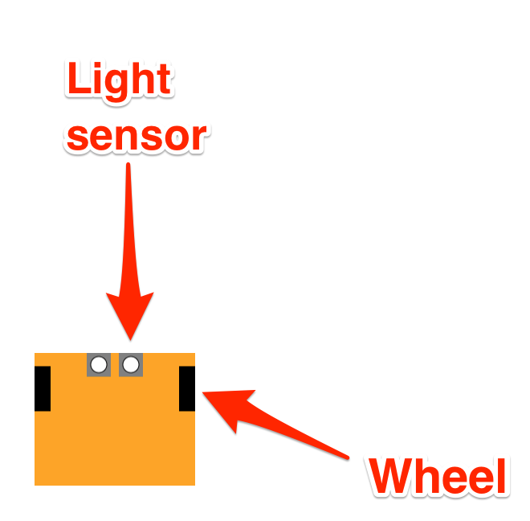
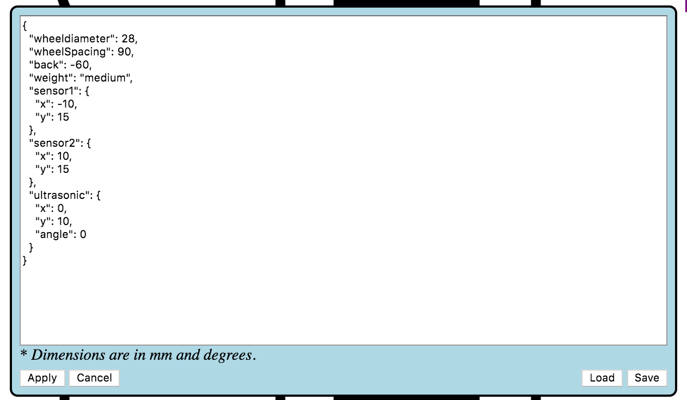

<!-- #region -->

### Background: The `ev3devsim` Simulator

An extension of the `ev3devsim` robot simulator will be the focus of many of the programming activities in this block. `ev3devsim` itself was inspired by (`ev3dev`)[https://www.ev3dev.org/], *"a Debian Linux-based operating system that runs on several LEGO® MINDSTORMS compatible platforms including the LEGO® MINDSTORMS EV3 and Raspberry Pi-powered BrickPi."* 


Lego EV3 educational robots are widely used in all levels of education. For example, they are used in the Open University residential school course *T176 Engineering: professions, practice and skills 1*.

Low level functions provided by the `ev3dev` operating system are "wrapped" by the [ev3dev-lang-python](https://github.com/ev3dev/ev3dev-lang-python) Python 3 package. This means that a LEGO EV3 robot running the `ev3dev` operating system can be programmed using Python code.

The `ev3devsim` package implements a cut down version of the [`ev3dev-lang-python`] library to control a browser based, 2D-simulated robot. The `ev3devsim` Python codes runs in a Skulpt interpreter (a browser based Python interpreter) to control a Javascript powered robot simulator.

The original [`ev3devsim`](https://github.com/QuirkyCort/ev3dev-sim) simulator ran as a standalone web application that could be run, even in an offline mode, using just a web browser ([try it here](https://www.aposteriori.com.sg/Ev3devSim/index.html)).

[

Program code is entered into the editor window and run by clicking the simulator *Run* button and halts if there is an error or when the *Stop* button is pressed. An output window display messages sent from the program, such as sensor log values, as well as error messages if the programme throws an error when it is run.

Program files can be saved from, and loaded into the the program editor.

A range of predefined worlds can be loaded into the simulator, as image files, from a drop down menu.

Obstacles can be added to a world using a configuration file opened by clicking the `Obstacles` button.

The robot can be configured via a configuration menu.

The robot can be moved to a specifed location  y speficifying target location oc-ordinates and clicking `Move`. 

The [`nbev3devsim`](https://github.com/innovationOUtside/nbev3devsim) package builds on the original `ev3devsim` to provide an `ipywidget` that embeds the simulator in a Jupyter notebook and allows it to be programmed from notebook code cells. Sensor data logged within the simulator can be exported to the notebook's own Python environment and analysed using the full power of Python's wide range of charting and data analysis packages.

Whilst the original `ev3devsim` simulator runs without any software requirements other than a modern web browser, the `nbev3devsim` approach does require the availability of a Jupyter notebook environment. Although this increases the complexity of the software environment, it does provide several benefits:

1. instructional material can be provided within a notebook to support each programming activity;
2. data retrieved from the simulator can be analysed and charted in the notebook kernel context (for example, using Python or R);
3. the notebook environment provides a read / write environment within which a learner can make their own notes and annotations, as well as keep a record of the various steps they took to develop any particular robot control programme.

### The EV3 "Brick"

The physical EV3 controller is capable of supporting four motor outputs referred to as `OUTPUT A`, `OUTPUT B`, `OUTPUT C` and `OUTPUT D`. In the simulator, we define a simple two wheeled differential drive robout using two motors configured as follows:

- `OUTPUT B`: left motor;
- `OUTPUT C`: right motor.

THe EV3 brick also support four input ports to which four different, independent sensors can be attached. These range from touch sensors, to light sensors, infrared sensors, ultrasonic sensors and even gyroscopes. 


The `ev3devsim` simulator this simulates simple robots such as ones that can be built with LEGO Mindstorms.


__TO DO: this all needs updating, eg with image assets from T176 presentation.__


 In fact, RobotLab was originally designed to work with LEGO Mindstorms RCX robots. Robots as simple as this are very useful for getting hands-on experience with robotics, but naturally they have some limitations compared with more sophisticated (and complex) robot systems. Some of the features of RobotLab and Simon will make more sense if you know a little bit about a simple robot system such as the LEGO Mindstorms RCX kit.<div xmlns:str="http://exslt.org/strings" style="background:lightblue"><p>Note: LEGO’s more recent Mindstorms NXT kits differ from the RCX version described here</p></div>

The robot in Figure 2.2 is built around the LEGO Mindstorms RCX ‘brick’ which is shown in more detail in Figure 2.3. Inside the RCX brick there is a microprocessor and other circuitry. Think of it as a small computer. Built into the brick are three ‘sensor input ports’ labelled 1, 2 and 3, and three ‘actuator output ports’ labelled A, B and C, which are capable of powering motors. 


Figure 2.3 The RCX controller ‘brick’


The RCX controller ‘brick’, seen from above. This is a large piece of yellow Lego, about 8 x 14 studs in size. At the centre is a control panel with a small LCD screen surrounded by four buttons: these are labelled On-Off, Run, Prgm (Program) and View. Above the control panel are three sensor input ports, labelled 1, 2, 3. These take the form of 2 × 2 studs which are partly metallic. Below the control panel are three actuator output ports, labelled A, B, C. These also are 2 × 2 studs which are partly metallic. 

 The *ports* are interfaces to the external world. Sensors can be attached to the input ports, allowing information about the environment to enter the computer. Motors and other actuators can be attached to the output ports, and the brick can switch them on and off and control their direction and power. 

RobotLab assumes that the simulated robot works like an RCX brick. This means that RobotLab needs to know what kinds of sensors and actuators are being used, and how the (simulated) RCX is ‘configured’. You will see how this is done later.

Although I have described the simulated robot in terms of a simple Lego robot, similar considerations would apply to other robotics systems. The control subsystem of any robot is usually flexible and designed to be configured with a variety of sensors and actuators. 


[Credit: Nigel Gibson / @nogbad]

### Simulator Overview
The `ev3devsim` simulator allows robots to be configured using various components on specific input and output ports:

- `OUTPUT_B`: left motor (state can be running or blank, not ramping, holding, overloaded, or stalled; stop action is ignored and the robot always stops instantly; `SpeedPercent`, `SpeedNativeUnits`, `SpeedRPS`, `SpeedRPM`, `SpeedDPS`, `SpeedDPM` are all defined, as are [`MotorSet`](https://ev3dev-lang.readthedocs.io/projects/python-ev3dev/en/stable/motors.html#motor-set), [`MoveTank`](https://ev3dev-lang.readthedocs.io/projects/python-ev3dev/en/stable/motors.html#move-tank) and [`MoveSteering`](https://ev3dev-lang.readthedocs.io/projects/python-ev3dev/en/stable/motors.html#move-steering) motor groups);
- `OUTPUT C`: right motor;


The simulated robot also supports a range of sensors:

- an ultrasonic sensor (`UltrasonicSensor`) that can be used to detect obstacles ahead [TO DO - CHECK] of the sensor. "In an actual ultrasonic sensor, if the angle of incident is too steep, the sound gets reflected away from the sensor resulting in no reading. We try to replicate this by providing readings only if the angle of incident is no more than 50 degrees. The slow update rate of an actual ultrasonic sensor is simulated; readings are only updated around 10 times per sec." <- from the docs
- one or more downward facing light / colour sensors (`ColorSensor`) that can be used to sense coloured readings on the world canvas directly below the sensor; sensors give readings of between 0..255.
- a gyroscope sensor (`GyroSensor`) that measures the angle of the robot; the angle is measure in ??. A gyro reading of 0 corresponds to ??

The sensors are available on predefined sensor inut ports. The ultrasonic and color sensors are mounted at default positions on the robot, although the position can be reconfigured using the robot configuration file:

- `INPUT 1` : ultrasonic sensor; by default, this is mounted *front and center* on the robot;  [ultrasonic sensor](https://ev3dev-lang.readthedocs.io/projects/python-ev3dev/en/stable/sensors.html#ultrasonic-sensor) (readings provided for angles of incidence up to 50 degrees; slow update rate of an actual ultrasonic sensor is simulated with reading updates approximately every 0.1s);
- `INPUT 2` : color sensor by default, mounted *front and left* on the robot; left [color sensor](https://ev3dev-lang.readthedocs.io/projects/python-ev3dev/en/stable/sensors.html#color-sensor) (raw values ranges between 0 to 255; ambient_light_intensity will always return 0; color and color_name may not give the same value as the actual sensor);
- `INPUT 3` : color sensor; by default, mounted *front and right* on the robot;  `INPUT 3`: right color sensor;
- `INPUT 4` : gyro sensor; fixed location in the center of the robot; [gyro sensor](https://ev3dev-lang.readthedocs.io/projects/python-ev3dev/en/stable/sensors.html#gyro-sensor).

In the T176 residential school, several activities are defined using different floorplans, such a circular racing track marked out a flat surface that the robots must navigate round as quickly as possible. Such activities are essentially "two dimensional" so you should not feel that just because the simulator we are using is essentially a two dimensional simulator you are not doing a realistic robot programming activity.

(In actual fact, the simulator is more like 2.5D simulator in that it supports an obstacle layer that sits above the plane of the background and within which walls and other smaller obstacles can be detected by a simulated ultrasonic sensor. Note that to keep the "world physics" provided by the simulation as simple as possible, the obstacles do not, in fact, impede the progress of the simulated robot.

__TO DO - optionally impede progrgess if robot encouters wall or obstacle.__

The simulated world can be loaded with a selection of predefined background layouts, or uploaded custom layouts, can be used as the basis of specific robot programming tasks or challenges. (Layouts are sized 2362 by 1143 pixels, which corresponds to the size of a First Lego League / World Robot Olympiad (WRO) field mat, with 1 pixel representing 1mm.)

The colour sensors can obtain readings from traces on canvas layer that loads the floor mat; the ultrasonic sensor can sense obstacles on the mat although these are not physical objects that impede the progress of the robot. 



<!-- #endregion -->


<!-- #region -->
### Robot Configuration

The simulated robot itself is configured according to a simple set-up script that defines:

- `wheeldiameter`: the diameter of the robot's wheels (default: `56` mm);
- `wheelSpacing`: the distance between the robot's wheels; essentially, this defines the "width" of the robot (default: `180` mm);
- `back`: the distance to the back of the robot from the front; essentially, this defines the "height" of the robot (default: `120` mm from the centreline between the wheels (TO DO - check));
- `weight`: the weight of the robot (default: `medium`) TO DO - does this affect physics at all?
- `sensor1`: the physical location on the robot of the color sensor on `INPUT 2` (`sensor1`, by default registered at location `(-20, 30)` from centre front of the robot and with diameter `20`;
- `sensor2`: the physical location on the robot of the color sensor on `INPUT 3`  at location `(20, 30)` and with diameter `20`;
- `ultrasonic`: the orientation and physical location on the robot of the ultrasonic sensor on `INPUT 1` (by default, in the front center of the robot at (`0`, `20`) with angle `0` degrees relative to the front/back robot center-line).

The configuration can be updated via a pop-up window in the simulator.



The robot configuration file is a JSON (Javascript Object Notation) object definition:

```javascript
{
  "wheeldiameter": 56,
  "wheelSpacing": 180,
  "back": -120,
  "weight": "medium",
  "sensor1": {
    "x": -20,
    "y": 30,
    "diameter": 20
  },
  "sensor2": {
    "x": 20,
    "y": 30,
    "diameter": 20
  },
  "ultrasonic": {
    "x": 0,
    "y": 10,
    "angle": 0
  }
}
```

<!-- #endregion -->

Some simulator parameters are configurable as paramters passed via the magic used to download code to the simulator. You will learn how to use these parameters in later notebooks.
