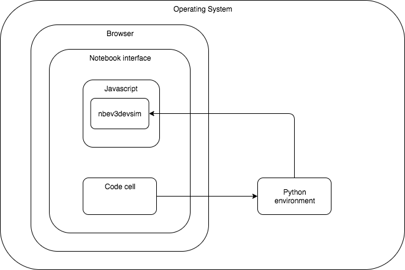

---
jupyter:
  jupytext:
    text_representation:
      extension: .md
      format_name: markdown
      format_version: '1.2'
      jupytext_version: 1.4.2
  kernelspec:
    display_name: Python 3
    language: python
    name: python3
---

# 1 An introduction to programming robots


The objective of this RoboLab session is to explain the basics of robot computer programming and show you how to use some of the elementary features of the RoboLab simulator.

It is assumed that you are completely new to computer programming and robotics. We’ll try to avoid jargon and go at a pace that makes it easy for you to understand what is going on.


## 1.1 Some basics of computer programming


For beginners, computer programming can appear to be a very mysterious process. Programming a robot may seem even more daunting, but I hope to show that the basics are quite straightforward. As you may have seen in the quick tour in the *Software Guide*, a *computer program* is a sequence of instructions or commands, written using words, symbols and numbers.

For example, you might want the robot to go forwards for five seconds. If we control the motors separately, this involves turning each motor on separately, waiting for 5&nbsp;seconds, and then terminating the program, at which point the motors in our robot simulation are automatically switched off.


<div class='alert-warning'>The ‘stop the motors at the end of the program’ behaviour is not guaranteed in other environments used to program either simulated or real robots. To be safe, it’s often worth making sure you turn off the motors at the end of a program so you know for sure what state they are in when the program terminates.</div>

<!-- #region -->
In our simulated robot environment, we need to:

- turn each motor on with a particular *speed*, which also sets the *direction*: positive speed values are assumed to mean ‘go forwards’, negative ones ‘go backwards’
- wait for 5 seconds
- (program ends, motors turned off automatically).

This could be *coded* in RoboLab using Python instructions of the form:

```python
left_motor.on(SpeedPercent(50))
right_motor.on(SpeedPercent(50))

time.sleep(5)
```

for suitable configurations of `left_motor` and `right_motor`.

Perhaps confusingly, the `time.sleep()` command, rather than saying ‘do nothing for 5&nbsp;seconds’, means ‘continue to do what you’re already doing for 5&nbsp;seconds’. For our current example, this means ‘keep your motors on and running for 5&nbsp;seconds’.

But how does the program know what the `left_motor` and `right_motor` are? Our program requires that we have defined these items earlier in the program using things it *does* know about. In particular, we would need to use a construction of the form:

```python
left_motor = Motor(OUTPUT_B)
right_motor = Motor(OUTPUT_C)
```

Here, the `Motor()`, `OUTPUT_B` and `OUTPUT_C` statements, as well as the previously seen `SpeedPercent`, are provided as predefined building blocks to use in our own simulated robot control programs.

The `Motor()` element refers to program elements elsewhere that define a `Motor` *object*. This computational object provides an abstract representation of a physical (or simulated) motor along with a set of operations or *methods* that can be enacted on it. For example, we may turn a motor *on* in a particular *direction* and with a particular *speed* for a particular *time* or for a specified number of *rotations*. 

The `Motor()` object is created with an *argument* that identifies an *output port* that the physical motor in a real robot, and the simualted motor in a simulated robot, would be connected to. Output ports are used to identify power and/or control lines that a software controller can use to control the behaviour of a physical (or simulated) device, such as a motor, LED display, or speaker. In our simulated robot case, two output ports are defined: `OUTPUT_B` and `OUTPUT_C`. By convention, we associate `OUTPUT_B` with the motor on the left-hand side of the robot as it travels in a forwards direction, and `OUTPUT_C` with the right-hand motor.

To simplify matters, other ‘higher level’ *predefined* building blocks are also provided to make writing our programs simpler.

For example, the `MoveTank` building block allows us to create a ‘tank’ drive comprising a left motor and right motor. We can instruct the tank drive to turn each motor on with its own specified speed and direction, and for a certain amount of time, using a single command:

```python
tank_drive = MoveTank(OUTPUT_B, OUTPUT_C)
tank_drive.on_for_seconds(SpeedPercent(50), SpeedPercent(50), 5)
```

Computer code usually looks stilted like this because it has to follow very strict rules about which characters go where. Fortunately, the notebooks have some support, know as ‘tab completion’, for helping you create programs without making typing mistakes. You will learn more about that as we go along.
<!-- #endregion -->

## How the Jupyter notebooks and the robot simulator work together
<font color='red'>JD: This second-level heading is at the same heading level as Section 1.1, yet this section isn't numbered. Should it be numbered? Or should it be a third-level heading? There are similar instances below.</font>

This section describes what happens when you use a notebook to program the simulated robot.

First, we use some IPython ‘magic’ (and yes, it really is called that!), at the start of a code cell to say that the following code should be passed to a particular instance of our simulator running in the same notebook.<font color='red'>JD: We’ve not used ‘IPython’ so far (I think) and we’ve said we’ll avoid jargon... Should ‘IPython’ be explained in the Software Guide or here? Or change to ‘Jupyter’ here?</font>

The magic incantation takes the form:

`%%sim_magic`

and it __MUST__ appear as the first line of a code cell. In the above example, `roboSim` is the name of the variable associated with our simulator instance. <font color='red'>JD: As this follows on from the magic incantation, I thought this sentence about `roboSim` would be related. But it seems to be a separate fact (and one that doesn’t seem to be needed yet?). Edited to add: should (as is used later in Section 1.3) the incantation be `%%sim_magic roboSim` ?</font>

The rest of the code in the cell is the code that will be passed into the simulator and used to control the the simulated robot. (The same code should also work with a *real* Lego EV3 robot running the `ev3dev` operating system.)

When you run the code cell, the code is ‘downloaded’ to the simulator *but is not executed*.

To execute your program, you need to click the *Run* button in the simulator itself. Once the code is ‘downloaded’ from your code cell to the simulator (or – if we work out how! [This](https://github.com/ev3dev/vscode-ev3dev-browser) may provide some clues... – to a real robot), the robot is *autonomous* and runs independently of the code cell within which the program is defined. <font color='red'>JD: to be resolved.</font>

The following diagram tries to capture the relationship between the code as seen in a notebook magic code cell and the simulator running as a JavaScript program inside the browser JavaScript environment.

![A diagram showing how code wihtin a code cell can be ‘downloaded’ to the nbev3devsim simulator or, in principle, downloaded to a real robot running Linux and the ev3dev-py environment. At one side is a box representing a Jupyter notebook and the other side a box representing an EV3 robot. The notebook container contains a ‘magic code cell’ and a separate JavaScript environment. The JavaScript environment contains an nbev3devsim container. An arrow is shown going from the code cell to the nbev3devsim container inside the JavaScript container. Inside the EV3 robot box is a Linux container, and inside that an ev3dev container. A second arrow leads from the magic code cell inside the notebook container to the ev3dev container inside the Linux conainer inside the EV3 robot box.](../images/ev3dev-codearchitecture.png)<font color='red'>JD: ‘Javascript’ needs changing to ‘JavaScript’ with an uppercase ‘S’.</font>

The diagram also shows how, in principle, the *same* program could be used to program the simulated robot *or* a real EV3-powered robot.


In the simulated robot environment, the same physical computer is being used to do several different things:<font color='red'>JD: As this sentence starts with ‘In the simulated env’, it makes it sound like ‘the same physical computer’ is inside the similated env - is that correct? What is the ‘physical computer’ we are talking about here? A student’s computer, or the server?</font>

1. to create and edit RoboLab programs in the Jupyter notebook; the Jupyter notebook interface runs in the browser, and the content of the code cells are executed inside a Python environment running on your computer<font color='red'>JD: Will the Python env really be running ‘on your computer’?</font>

2. to execute Python code contained in a notebook code cell in a Python environment, or ‘download’ code from a code cell to the simulator

3. to execute the program in a simulated robot in a JavaScript environment running inside your browser.

Whilst they run on the same physical computer, these programs actually run in different computational environments on the computer. For example, the simulator is actually a JavaScript program that runs in your browser: once you click on the `Run` button, it is the simulated robot’s control system that is executing the robot program inside a JavaScript environment in your browser. The code is actually sent to the simulator via a Python process when the notebook code cell is run. The IPython magic tells the Python process to grab the contents of the code cell (and depending on the magic, prefix it with additional boilerplate code), and then send that code to the simulator running as JavaScript code in the browser window that contains the notebook user interface.



<div class='alert-warning'>Would it make sense to use another work in the simulator? "Execute"? "SimRun"?</div>
<font color='red'>JD: Change ‘Javascript’ to ‘JavaScript’</font>

<font color='red'>JD: I’m not convinced that all the ‘under the hood’ details are necessary. Do students really need to know all this, or would their time be better spent getting on with programming?</font>

<!-- #region -->
## Getting started with the simulator

The simulator we will be using must be loaded into each notebook that wants to use it, once per notebook. In addition, __only one instance of the simulator per notebook is allowed__. Any more than that and things don’t work at all.

The following cell will load in the Python package that makes the simulator available, along with some IPython magic that allows us to interact with the simulator.

Run the following code cell to load the simulator:
<!-- #endregion -->

```python
from nbev3devsim.load_nbev3devwidget import roboSim, eds

%load_ext nbev3devsim
```

The simulator itself is created as a Jupyter widget in a free-floating, resizable dialogue box. The simulator can be referenced using the variable `roboSim`.
<font color='red'>JD: is there a simple way of getting back the 'Robot Simulator' dialogue if you accidently delete it?</font>

To get code into the simulator, we run a code cell prefixed with particular IPython cell magic to download the code in the code cell to the simulator.

You can also get code into the simulator by highlighting and copying the code (without the IPython magic line) and then clicking the *Paste* button in the simulator.

You can also preview the code available in the simulator by clicking the simulator *Show Code* button.

To execute the program on the simulated robot, click the *Run* button in the simulator and watch the result.


### Error messages in the simulator

If you make an error in a program sent to the simulator, then when you try to run the program in the simulator a message will be displayed in the simulator console.


The line number specified will be one less than the line number displayed in the associated code cell if you enable line number display within the cell.

__TO DO: this needs addressing if we have preloaded some packages as inserts into the code. The code preview window in the simulator may help here: need line numbers and code styling there?__ <font color='red'>JD: to be resolved.</font>


### Passing code into the simulator

To write program code that can be passed to the simulator and executed within it to control the simulated robot, we add code to a code cell with some IPyhton magic in the first line:

```python
%%sim_magic
print('hello world')
```

When the code cell is run, the code is downloaded to the simulator. The code can then be executed in the simulator by clickin the *Run* button __in the simulator__. Try this now.


## 1.2 An introduction to sequential programming

There are various ways of programming computers to control robots. One of these is the *sequential* approach, which is the main approach used in RoboLab. This method of writing computer programs, as lists or sequences of commands, produces what are called *sequential programs*.

<!-- #region -->
In the sequential program model, the computer executes commands in sequence.

__TO DO: we can just do sequential here using simple Pyhton code in un-magicked notebook code cells, then introduce the simulator later?__<font color='red'>JD: to be resolved.</font>
<!-- #endregion -->

<!-- #region -->
The program is structured in a particular way that allows it to operate correctly (a *necessary* requirement) as well as making it ‘readable’ (a *desirable* requirement).

In terms of correctness, the program requires that we define things within our program before we try to call on them and make use of them within our program.

One way of defining things is to *import* them from a Python package. A package is essentially a collection of predefined program elements that are useful for a particular programming task.

```python
# Import statements
from ev3dev2.motor import Motor, SpeedPercent, OUTPUT_B, OUTPUT_C
import time

# Definitions
left_motor = Motor(OUTPUT_B)
right_motor = Motor(OUTPUT_C)

# Program actions
left_motor.on(SpeedPercent(75))
right_motor.on(SpeedPercent(75))

# Wait here for 1 second...
time.sleep(1)

# Program ends
```
<font color='red'>JD: given what we've said about time.sleep, perhaps the comment in the program shouldn't be 'Wait' but something like 'Keep motors on for 1 second...' ?</font>

Lines prefixed by a `#` are *comments* that are not executed as program code but are intended as notes to human readers that can be used to help make a program more readable.
<!-- #endregion -->

The following program turns the left and right motors on at a quarter (25%) of their full speed, waits<font color='red'>JD: again, is 'waits' the best word here?</font> for a short period (3&nbsp;seconds), then the program ends and the motors are automatically switched off.

```python
%%sim_magic

# Import statements
from ev3dev2.motor import Motor, SpeedPercent, OUTPUT_B, OUTPUT_C
import time

# Definitions
left_motor = Motor(OUTPUT_B)
right_motor = Motor(OUTPUT_C)

# Program actions
left_motor.on(SpeedPercent(25))
right_motor.on(SpeedPercent(25))

# Wait here for 3 seconds...
time.sleep(3)

# Program ends
```

*Run the above code cell to download the code to the simulator, and then run the program using the simulator interface.*

When you run the program in the simulator, the robot should move forwards quickly for one second and then stop. Try increasing the ‘sleep’ time in seconds, re-run the code code cell to download the program to the simulator, and then re-run it in the simulator. Does the robot behave as you expect? What happens if you also change the `SpeedPercent(VALUE)`, where `VALUE` is a numerical value that can range from `-100` to `100`?

<!-- #region -->
### Using predefined code building blocks

Writing programs at such a low level is possible, but we often find it more convenient to program at a higher level of abstraction or generalisation. In the following example, we can configure and use a predefined motor drive that allows us to control both motors from a single command.

In particular, the `MoveTank()` function from the `ev3dev3.motor` Python package allows us to define a simple tank drive comprising two motors, one on the left-hand side of the robot and one on the right-hand side. The configuration associates a controllable motor output with a particular motor.

```python
tank_drive = MoveTank(OUTPUT_B, OUTPUT_C)
```

The tank drive is used to power two motors simultaneously in various ways. For example, we can turn the motors on at desired speeds:

```python
tank_drive.on(LEFT_SPEED, RIGHT_SPEED)
```

We can also turn the motors on for a specified time and then automatically turn them off at the end of that period:

```python
tank_drive.on_for_seconds(LEFT_SPEED, RIGHT_SPEED, TIME)
```

The following example shows how we can drive the tank:

1. *forwards* in a straight line (both motors at the same speed) for a specified time using the tank drive

2. *turn on the spot* for the same period (one motor forwards, the other backwards, at the same speed)

3. *reverse* in a straight line for the same period of time (both motors backwards at the same speed.

*Run the following code cell to download the program to the simulator and then run the program in the simulator.*
<!-- #endregion -->

```python
%%sim_magic_preloaded

from ev3dev2.motor import MoveTank, SpeedPercent, OUTPUT_B, OUTPUT_C

# Sequential program

tank_drive = MoveTank(OUTPUT_B, OUTPUT_C)

time_1s = 1

# Go forwards...
# Set the left and right motors in a forward direction at the same speed
# and run for 1 second
tank_drive.on_for_seconds(SpeedPercent(50), SpeedPercent(50), time_1s)


# Turn on the spot...
# Set the left motor forwards and the right motor backwards
# and run for 1 second
tank_drive.on_for_seconds(SpeedPercent(50), SpeedPercent(-50), time_1s)


# Go backwards...
# Set the left and right motors in a backwards direction at the same speed
# and run for 1 second
tank_drive.on_for_seconds(SpeedPercent(-50), SpeedPercent(-50), time_1s)
```

<!-- #region activity=true -->
### Activity – Driving the motors at different speeds

What do you think will happen if the motors are turning in the same direction but at different speeds?

What will happen if the motors turn in *different* directions?

*Run the following code cell to download the program to the simulator and then run the program in the simulator. Experiment using different values for the motor speeds. To compare different configurations, use the Pen Down feature to leave a trace showing where the robot hos been. Use the Clear Trace button to remove the trace and the Move button to reset the starting position of the robot between each run. Remember to download updated configurations to the simulator by running the updated code cell before re-running the program in the simulator.*

*Note that the simulated robot may not behave as a real robot would. It all depends on how well the simulated robot and the simulator physics have been implemented.*

<font color='red'>JD: In the following, why has `tank_drive.on_for_rotations` been used, when its third argument is a time in seconds? Should it be `on_for_seconds` instead?</font>
<!-- #endregion -->

```python activity=true
%%sim_magic
from ev3dev2.motor import MoveTank, SpeedPercent, OUTPUT_B, OUTPUT_C

# Try motors with difference speeds

tank_drive = MoveTank(OUTPUT_B, OUTPUT_C)

TIME_IN_S = 5

LEFT_MOTOR_SPEED_PC = -50
RIGHT_MOTOR_SPEED_PC = -50

tank_drive.on_for_rotations(SpeedPercent(LEFT_MOTOR_SPEED_PC),
                          SpeedPercent(RIGHT_MOTOR_SPEED_PC),
                          TIME_IN_S)
```

<!-- #region activity=true heading_collapsed=true -->
#### Answer

*Click the arrow in the sidebar or run this cell to reveal the answer.*<font color='red'>JD: added 'or run this cell' as more accessible for keyboard users to simply Shift+Enter.</font>
<!-- #endregion -->

<!-- #region activity=true hidden=true -->
With both motor speeds set in the forward direction, if the left motor speed is slightly faster than the right motor speed, then the robot curves towards the right; if the right motor is slightly faster than the left motor, then the robot curves to the left. The greater difference between the speeds, the tighter the curve.

If one of the motors is set at a forward speed and one is in reverse, then the robot turns in a tight circle centred on the reverse turning wheel.

If both motors are are going backwards (negative speed), then with the `.on_for_seconds()` command, the robot does not move. This seems to be an issue with the simulator.<font color='red'>JD: This works OK for me... (with either `.on_for_seconds()` or `.on_for_rotations()`).</font>
<!-- #endregion -->

<!-- #region -->
### Turning the motors on for a specified number of wheel rotations

As well as turning the motors on for a specified period of time, we can also turn them on for a specified number of rotations of the wheels:

```python
tank_drive.on_for_rotations(LEFT_SPEED, RIGHT_SPEED, ROTATIONS)
```

This is easy to imagine for the case where the wheels are turning at the same speed, but if one wheel turns faster than the other, then the robot will follow a curving path and the outside wheel will travel further than the inside wheel (assuming that the inside wheel doesn’t slip).

__TO DO -  we could have a diagram here showing a robot driving round a circle; the circumference of the locus followed by the outer wheel wheel will be shorter than that of the inner wheel making it clear that if the wheels are the same size, the outer one must rotate more than the inner one.__

From [the documentation](https://ev3dev-lang.readthedocs.io/projects/python-ev3dev/en/stable/motors.html#ev3dev2.motor.MoveTank.on_for_rotations), *‘if the left speed is not equal to the right speed (i.e., the robot will turn), the motor on the outside of the turn will rotate for the full rotations while the motor on the inside will have its requested distance calculated according to the expected turn.’*

The following code cell provides code for exploring the use of the `.on_for_rotations()` command.<font color='red'>JD: so why does the code currently use `.on_for_seconds()` ?</font>


*Run the following code cell to download the program to the simulator and then run the program in the simulator. Experiment using different values for the motor speeds and number of rotations. To compare different configurations, use the Pen Down feature to leave a trace showing where the robot hos been. Use the Clear Trace button to remove the trace and the Move button to reset the starting position of the robot between each run. Remember to download updated configurations to the simulator by running the updated code cell before re-running the program in the simulator.*
<!-- #endregion -->

```python
%%sim_magic
from ev3dev2.motor import MoveTank, MoveSteering, SpeedPercent, OUTPUT_B, OUTPUT_C

tank_drive = MoveTank(OUTPUT_B, OUTPUT_C)

LEFT_MOTOR_SPEED = SpeedPercent(50)
RIGHT_MOTOR_SPEED = SpeedPercent(55)

ROTATIONS = 4

tank_drive.on_for_seconds(LEFT_MOTOR_SPEED, RIGHT_MOTOR_SPEED, ROTATIONS)

```

Compared to the `.on_for_seconds()` command, the `.on_for_rotations()` command is capable of going backwards!
<font color='red'>JD: I found that both methods allow the robot to go backwards...</font>

*TO DO - we could make that an activity and have an example of annotated screengrab of the simulator showing different traces.*

<!-- #region -->
### Steering the robot – `MoveSteering`

As well as the `MoveTank()` configuration, a `MoveSteering()` configuration is also available that again is based on the presence of two motors connected to the same controllable outputs:


```python
tank_turn = MoveSteering(OUTPUT_B, OUTPUT_C)
```

The `MoveSteering()` configuration again drives both motors simutaneously, although this time at the same speed but in different directions.

To turn the robot, we use the command:

```python
tank_turn.on(STEERING, SPEED)
```

where `STEERING` is a numerical value between `-100` and `100` and where:

- `-100` means turn left on the spot (right motor at 100% forward, left motor at 100% backward)
- `0` means drive in a straight line
- `100` means turn right on the spot (left motor at 100% forward, right motor at 100% backward).


As well as turning the steering drive on, we can turn it on for a specified time using `.on_for_seconds(STEERING, SPEED, TIME)` as in the case of the tank drive.

The following program gives a simple example of how to turn the robot using the `MoveSteering()` motor configuration.

*Run the following code cell to download the program to the simulator and then run the program in the simulator. Experiment with various settings for the s*
<font color='red'>JD: some text is missing here...</font>
<!-- #endregion -->

*TO DO - it would perhaps be interesting to have a simple simulator view, cf. a [remote control](https://github.com/innovationOUtside/nbev3devsim/issues/39), where we can turn the motors on or off, select a motor group, and set the motor speeds, steering degree etc. Maybe do this with a magic that has a couple of ipywidgets that send realtime updates to a free running simulator?*

<!-- #region -->
Alternatively, we can turn the steering drive on for a specified number of rotations of one of the wheels:

```python
on_for_rotations(STEERING, SPEED, ROTATIONS)
```

Running the following code cell provides a demonstration:
<!-- #endregion -->

```python
%%sim_magic
from ev3dev2.motor import MoveTank, MoveSteering, SpeedPercent 
from ev3dev2.motor import OUTPUT_B, OUTPUT_C

tank_drive = MoveTank(OUTPUT_B, OUTPUT_C)

# the first two parameters can be unit classes or percentages.
tank_drive.on_for_rotations(SpeedPercent(50), SpeedPercent(50), 4)

# drive in a turn for 2 rotations of the outer motor
tank_turn = MoveSteering(OUTPUT_B, OUTPUT_C)

tank_turn.on_for_rotations(-100, SpeedPercent(75), 2)
```

<!-- #region activity=true -->
#### Question

Suppose that a simulated robot starts pointing towards the top of the screen. If you download and run the program in the code cell below, will the robot turn towards the right or left while executing the sequence of commands shown?

*Before* you run the code, make a prediction about what you think the robot will do when the code is executed by the simulated robot.

*To monitor what the robot does, you may find it convenient to enable the Pen Down feature in the simulator that will trace out the path taken by the simulator robot as the program runs.*
<!-- #endregion -->

<!-- #region student=true -->
__DOUBLE-CLICK THIS CELL TO EDIT IT.__

*When the following code is executed by the robot simulator, I predict ...__YOUR ANSWER HERE__... .*
<!-- #endregion -->

```python activity=true
%%sim_magic
from ev3dev2.motor import MoveTank, MoveSteering, SpeedPercent, OUTPUT_B, OUTPUT_C

tank_drive = MoveTank(OUTPUT_B, OUTPUT_C)

time_1s = 1

# Set the left and right motors in a forward direction
# and run for 1 second
tank_drive.on_for_seconds(SpeedPercent(50), SpeedPercent(50), time_1s)


# Set the left motor forwards and the right motor backwards
# and run for 1 second
tank_drive.on_for_seconds(SpeedPercent(50), SpeedPercent(-50), time_1s)

```

<!-- #region activity=true -->
If a simulated robot starts pointing towards the *right-hand side* of the screen, will it turn towards the top or bottom of the screen while executing the same sequence of commands?
<!-- #endregion -->

<!-- #region student=true -->
__DOUBLE-CLICK THIS CELL TO EDIT IT.__

*When the following code is executed by the robot simulator, I predict ...__YOUR ANSWER HERE__... .*
<!-- #endregion -->

<!-- #region activity=true heading_collapsed=true -->
#### Answer

*Click on the arrow in the sidebar or run this cell to reveal my answer.*
<!-- #endregion -->

<!-- #region activity=true hidden=true -->
When the program is run, the first `tank_drive` motor command moves the robot forwards for one second:

```python
tank_drive.on_for_seconds(SpeedPercent(50), SpeedPercent(50), time_1s)
```

The next command turns the robot towards the right (the left wheel goes forwards and the right wheel goes backwards) for one second:

```python
tank_drive.on_for_seconds(SpeedPercent(50), SpeedPercent(-50), time_1s)
```

The combined result is that the robot goes forwards for one second and turns for one second.
<!-- #endregion -->

<!-- #region activity=true hidden=true -->
![Diagrams representing different movements of a differentially steered two-wheel robot by drawing its initial and final position. (a) Forward (line 10): the robot moves straight ahead a short distance and stops without turning. (b) Turn (line 15): the robot initially points forward and then turns well short of a right angle, on the spot, clockwise. (c) Forward and turn (statements 1, 2, 3 and 4): the robot starts, drives forward a short distance and then turns on the spot through a right-angle clockwise.](../images/tm129_rob_p2_f007.jpg)<font color='red'>JD: I'm not sure what the line numbers and statement numbers in the alt text and on the diagram refer to.</font>
<!-- #endregion -->

<!-- #region activity=true hidden=true -->
The trace left as the robot turns on the spot does not appear to be center simulated robot doesn’t turn exactly on the spot because the robot is turning about one of the wheels.
<!-- #endregion -->

### Writing your own programs – getting into the ‘mind’ of the robot

When trying to understand, or write your own, robot programs, it can be helpful to ‘play robot’. This means that you put yourself in the place of the robot and act out (or at least imagine) what you or the robot would do when executing each statement of the program. If you have the help of a friend, get them to read out the program statements to you one at a time. 

<!-- #region -->
## 1.3 Writing programs for use in the RoboLab Simulator

Once the simulator has been loaded and displayed in a notebook, you can start to write programs that will run on the simulated robot.

The programs are written __in a single code cell__ prefixed with the magic incantation `%%sim_magic roboSim` on __the first line__ of the code cell.

Running the code cell ‘downloads’ the program from the cell to the simulated robot. Clicking the *Run* button in the simulated robot will then execute the downloaded robot program within the simulator.


*TO DO - need some sort of help or lookup for simulator program commands.*<font color='red'>JD: to do</font>

In the next few activities you will learn how to use RoboLab to construct a computer program that will move a simulated robot around a square course. Work through the instructions carefully and slowly. It is important that you complete each step successfully before moving on to the next. We have allowed two&nbsp;hours for this, although you may be able to complete the exercise in less time if you have some experience of computer programming.
<!-- #endregion -->

## Creating and editing your own programs

If you run the following program in the simulator, then you will find that it drives the robot forward a short way and then turns on the spot for more than a right angle (ninety degrees).

*TO DO - simple diagram showing angles and their names, eg ninety degrees.*

```python
%%sim_magic_preloaded

# Set the left and right motors in a forward direction
# and run for 1 rotation
tank_drive.on_for_rotations(SpeedPercent(50), SpeedPercent(50), 1)


# Set the robot to turn on the spot
# and run for 1 rotation *of the wheels*
tank_turn.on_for_rotations(-100, SpeedPercent(75), 1)
```

<!-- #region activity=true -->
### Activity – Copying and modifying a program

We can edit a code cell directly to add additional lines to it, or we may want to retain our original code (for reference) and create a new program based on an earlier one.

We can grab a copy of a code cell by:

- clicking on it to select it
- clicking the *copy selected cells* button in the toolbar
- clicking the *paste cells below* toolbar button to place a copy of the cell in a new cell
- select the new cell and use the arrow keys to move it to a location of your choosing.

Select the code cell above by clicking on it, use the toolbar button to copy it, single-click on this Markdown cell to provide the current location, then click on the toolbar paste button to copy the code cell below this one.

Modify the program in your newly created cell so that the robot turns through a right angle (or as close as you can get it without spending too much time!). Test your code by running the code cell to download the code to the simulator, and then run it in the simulator.

You may find that using the pen trace helps you see how far the robot has turned.
<!-- #endregion -->

```python activity=true
%%sim_magic_preloaded

# Set the left and right motors in a forward direction
# and run for 1 rotation
tank_drive.on_for_rotations(SpeedPercent(50), SpeedPercent(50), 1)


# Set the robot to turn on the spot
# and run for 1 rotation *of the wheels*
tank_turn.on_for_rotations(-100, SpeedPercent(75), 1)
```

<!-- #region activity=true heading_collapsed=true -->
#### My attempt

*Click the arrow in the sidebar or run this cell to reveal the settings I used.*
<!-- #endregion -->

```python activity=true hidden=true
%%sim_magic_preloaded

# Set the left and right motors in a forward direction
# and run for 1 rotation
tank_drive.on_for_rotations(SpeedPercent(50), SpeedPercent(50), 1)


# Set the robot to turn on the spot
# and run for 1 rotation *of the wheels*
tank_turn.on_for_rotations(-100, SpeedPercent(75), 0.846)

```

<!-- #region hidden=true -->
On my computer, I found I could turn the robot through about ninety degrees by setting the number of wheel rotations on the turn step to between 0.85 and 0.9.
<font color='red'>JD: so how come the code above has 0.846, which is less than 0.85? Assuming 0.846 was your value, should the text be changed to 0.84?</font>
<!-- #endregion -->

### Copying code using keyboard shortcut commands

You can also use the `Esc-C` keyboard shortcut to copy a selected cell and `Esc-V` to paste a copied cell immediately below the currently selected cell.

Alternatively, you can highlight and select code *within* a code cell and then use the keyboard copy and paste commands to copy the code from the original cell, create a new code cell, then paste the copied code into the new code cell.


### Deleting cells

Sometimes, you may find you want to delete a code or Markdown cell.

To delete a cell, click on it to select it and then click the scissors (*cut selected cells*) toolbar button.


### Deleting and moving lines of code in a code cell
To delete one of more particular lines of code in a code cell, highlight just that line or lines of code then use the keyboard delete key to delete them.

To move one or more lines of code in a code cell, first highlight them to select them. Next, cut then using your normal keyboard cut command (for example, `Ctrl-X` or `Cmd-X`), place the cursor where you want them to go then and paste them using your normal keyboard paste command (for example, `Ctrl-V` or `Cmd-V`).

<font color='red'>JD: There's no Section 1.4. (And, as mentioned later, it seems odd that Section 1.5 is an activity whereas other activities are third-level sections inside second-level sections.)</font>

## 1.5 Activity – Working with comments

<!-- #region -->
In a computer program, a *comment* refers to a line of explanatory text that is not executed when the program runs. As such, it does not have to conform to the syntax of the programming language once it has been identified as a comment.

In a Python program, a comment is identified by prefixing a line of text or a line of code with a `#` (a ‘hash’ or, in US English, a ‘pound’) character.

```python
# A Python comment line is prefixed by a # (hash) character
```

If you run the following code cell, the contents of which should look like this:

```python
# This is a comment

print('Hello')

#print("Commented out code lines are not executed.")
```

you will see that the first commented-out line is ignored, the second line prints out the word `Hello`, and the third line is also ignored.
<!-- #endregion -->

```python
# This is a comment

print('Hello')

#print("Commented out code lines are not executed.")
```

*Uncommenting* a line refers to removing the initial character that identifies the line as a comment line.

__DO__: *un*comment the second print statement in the code cell above by deleting the `#` character in front of it, and re-run the code cell. You should see that both messages are displayed.


If a comment line would work in uncommented form as a line of code, rather than being a more general line of human-readable text, then it will often be referred to as being ‘commented out’.

If you hear the phrase ‘comment out that line’, it thus refers to leaving the line in the program, but prefixing it with the comment character so that the line is not exectuted when the program is run.

__DO__: comment out the first print statement in the code cell above by prefixing it with the `#` comment character and re-run the cell. This time you should only see the second print message being displayed.

__DO__: finally, uncomment the first (text comment) line in the code cell above and re-run the cell. This time, an error will be thrown because the first line is *not* a valid line of Python code.


### Using comments

Comments are often used to document particular lines of code to clarify or explain their role in a program. It is good practice to keep comments as meaningful as possible.


### Block comments

The phrase *block comment*, or the plural *comments*, is taken to refer to continous explanatory comment text that extends over several lines.

```python
# Multiple consecutive lines of comments are often referred to
# as 'block comments'.
#
# The syntax of some programming languages allows block comments to be defined
# simply by using special character sequences at the start and end of the comment block.
#
# In Python, one widely used convention is to delimit each line as its own comment line.

'''
Multi-line text strings can also be used as a way of 'escaping' lines of text
so that it is not executed. 

Such strings are identified by using three single (or double) quotes at the start of the
text string, and three matching single (or double) quotes at the end of the string.

If a text string appears as the last item in a Jupyter notebook code cell,
it will be returned and displayed as the cell output if the cell is run.

Run this code cell to see what I mean...
'''
```

### Using comments in other ways

As well as being used to annotate a program with helpful information, comments can also be used to provide visual clues to the division of lines or chunks of code. For example, you might use a comment to identify separate sections of a program from each other. This technique can be used to make your programs easier to read.


### Using notebook Markdown cells to narrate a program code and program development

As well as commenting code within a code cell, you can also make notes in a Jupyter notebook’s Markdown cells. For example, you might use Markdown cells:

- to describe what you aim to achieve with the code in a following code cell
- to describe the output produced by running a previous code cell
- to reflect on the behaviour of code executed in a previous code cell; for example, if it does not work as expected.

Remember that the *notebooks are yours*, so use them for making your own notes as you work through them.

You may notice that in some activities, cells are distinguisehd by a yellow background. These cells are prompts for you to make your own notes.

For example, you may wish to make some notes in the following cell about why it might be useful to make notes in the notebooks...

<!-- #region student=true -->
*Double-click this Markdown cell to edit it. ‘Run’ the cell to render the Markdown as styled HTML text.*

*Add some of your own thoughts here about why it might be useful to add your own notes to the Jupyter notebooks.*
<!-- #endregion -->

If you create your own cells in the notebook, either code cells or Markdown cells, you may want to highlight them with the yellow background so that you can easily find them again. You can do this as follows. Create a new cell by clicking on the `+` button in the notebook toolbar. To change it from the default code cell to a Markdown cell, press `Esc-M` while the cell is selected or use the cell type drop-down list in the notebook toolbar to change the cell type to *Markdown*. Add some content to it and then, with the cell selected, click on the person (*Toggle cell student*) button in the toolbar to toggle the yellow background on and off.

<!-- #region -->
### Saving a RoboLab program

When writing notebooks it is good practice to save them periodically.

Notebooks are typically saved with the `.ipynb` filetype suffix. The name of the file is taken from the name set in the notebook header at the very top of the page. (You can change the notebook name by clicking on the notebook name, which will pop up a *Rename Notebook* dialogue box:


When you make changes to a notebook, either by editing a code or Markdown cell, or by running one or more code cells, you may notice that an `(unsaved changes)` message appears at the top of the notebook:


The notebook will be automatically saved every minute or two. When it is autosaved, the status will change:


You can also do a ‘hard save’ of your notebook by clicking on the *Save and Checkpoint* notebook toolbar button or, from the *File* menu by seleting *Save and Checkpoint*. You can also save the notebook to a new file name from the *File -> Save as...* menu option. The *File -> Make a Copy* option will create a copy of the current notebook.


Checkpoints are useful because they not only autosave the notebook to the current file, but they also save a hidden copy of the notebook in a checkpoints directory. The *File -> Revert to Checkpoint* menu option allows you to reload the previously checkpointed notebook. This is handy if you have made some changes to your notebook and those changes have been autosaved, but you find you want to revert to the previous version of the notebook where you made a conscious decision to save and checkpoint it.

It’s not uncommon to see that you have been working on a noebook for quite some time since consciously saving it!


<!-- #endregion -->

<!-- #region activity=true -->
## 1.6 Activity – Drawing a square

In this activity, you need to have the program you worked with in the previous activity already open in RoboLab. If you don’t, open it now by running the code cell that contains the simulator and simulator magic import commands:

```python
from nbev3devsim import ev3devsim_nb as eds
%load_ext nbev3devsim
```

and the command to create and display the simulator widget:

```python
roboSim = eds.Ev3DevWidget()
display(roboSim)
```


*TO DO - are we going to have a simulator button in the toolbar?*
<!-- #endregion -->

<!-- #region activity=true -->
Make a copy of the earlier code cell in which you programmed the robot to draw a straight line then turn through a right angle and paste it below:
<!-- #endregion -->

<!-- #region activity=true -->
---

In the new code cell, copy the lines of code to drive the robot forward and turn through ninety degrees, and paste the copy below the original lines.

What do you think your program will do now?

Run the program in the simulator to find out.

*Note that copying and pasting code is a tried-and-trusted technique. Do not be averse to reusing any code your have developed previously and that behaves as you expect.*
<!-- #endregion -->

<!-- #region activity=true heading_collapsed=true -->
#### My observations

*Click on the arrow in the sidebar or run this cell to reveal my observations.*
<!-- #endregion -->

<!-- #region activity=true hidden=true -->
When I ran my version of the program (see below), the robot drew two sides of a square as an L shape and had made the turn ready to start a third edge.
<!-- #endregion -->

```python activity=true hidden=true
%%sim_magic_preloaded

# Draw a square


# First edge and turn

# Set the left and right motors in a forward direction
# and run for 1 rotation
tank_drive.on_for_rotations(SpeedPercent(50), SpeedPercent(50), 1)

# Set the robot to turn on the spot
# and run for 1 rotation *of the wheels*
tank_turn.on_for_rotations(-100, SpeedPercent(75), 0.846)


# Second edge and turn

# Set the left and right motors in a forward direction
# and run for 1 rotation
tank_drive.on_for_rotations(SpeedPercent(50), SpeedPercent(50), 1)


# Set the robot to turn on the spot
# and run for 1 rotation *of the wheels*
tank_turn.on_for_rotations(-100, SpeedPercent(75), 0.846)
```

### Building on a previously developed computer program

Trying to build a complex program in one go is a risky strategy. There are many factors that can prevent a program from working correctly, including:

- *syntax errors*: characters in the wrong place, or incorrectly typed package or variable names
- *logical errors*: for example, if your program uses logical tests, these may not be tested as intended, or the wider logic of the program may be incorrect.

For this reason, it often makes sense to start small and then test increasingly elaborate versions of your program by incrementally adding a line or two of code at a time, checking that things are still working as you'd expect as you add additional steps to your program.

<!-- #region activity=true -->
### Activity – Extending your program further
<font color='red'>JD: This activity is nested inside the previous activity (which seems odd). It's because the second-level heading 1.6 is being used as an activity. I think it would be clearer to consistently use third-level sections as activities, and use numbered second-level sections as sections only.</font>

Bulding on the program you developed in the previous activity, extend your program further so that the robot draws all four sides of a square.

(Either modify your program in an earlier code cell, or make a copy of the earlier code cell, paste it here, and work in the newly copied cell: your notebook, your rules...!)

You may find it convenient to make some notes first about how the new goal (to draw four sides of the square) relates to the previous goal, and what you need to change about your original program so that it performs the new task.
<!-- #endregion -->

<!-- #region student=true -->
*Make your notes here.*
<!-- #endregion -->

<!-- #region activity=true -->
When you have created your extended/modified program, download it to the simulator and run it to test that it works.

Run your program several times, with the pen down and without clearing the trace between runs. Note how any errors compound as you run the program multiple times.

You may notice that it is easier to ‘tune’ the value of the rotation count required to turn the robot through ninety&nbsp;degrees when the robot turns multiple times, because it is easier to see where, and by how much, the turn undershoots or overshoots the right angle.

Increasing the length of the side of the square can also help reveal when the angle is slightly off the right angle.

Also note that you may not be able to get the robot to create a perfect square. (Don’t spend too long trying to achieve this!) You will learn in a later notebook how to get the robot to turn through a right angle in a more accurate and controllable way.

__Reflection__: Having written your program, what do you notice about it? If you want to change the size of the square’s side length, for example, or modify the angle turned by the robot, how easy is it to modify your program? 
<!-- #endregion -->

<!-- #region student=true -->
*Record your thoughts and observations about how easy your program is to extend and maintain here.*
<!-- #endregion -->

<!-- #region activity=true heading_collapsed=true -->
#### My observations

*Click the arrow in the sidebar or run this cell to reveal my observations.*
<!-- #endregion -->

<!-- #region activity=true hidden=true -->
Here is my program. On multiple runs, it seems to overshoot the turn slightly.
<!-- #endregion -->

```python activity=true hidden=true
%%sim_magic_preloaded

# Draw a square


# First edge and turn

# Set the left and right motors in a forward direction
# and run for 1 rotation
tank_drive.on_for_rotations(SpeedPercent(50), SpeedPercent(50), 1)

# Set the robot to turn on the spot
# and run for 1 rotation *of the wheels*
tank_turn.on_for_rotations(-100, SpeedPercent(75), 0.846)


# Second edge and turn

# Set the left and right motors in a forward direction
# and run for 1 rotation
tank_drive.on_for_rotations(SpeedPercent(50), SpeedPercent(50), 1)


# Set the robot to turn on the spot
# and run for 1 rotation *of the wheels*
tank_turn.on_for_rotations(-100, SpeedPercent(75), 0.846)


# Third edge and turn

# Set the left and right motors in a forward direction
# and run for 1 rotation
tank_drive.on_for_rotations(SpeedPercent(50), SpeedPercent(50), 1)

# Set the robot to turn on the spot
# and run for 1 rotation *of the wheels*
tank_turn.on_for_rotations(-100, SpeedPercent(75), 0.846)


# Fourth edge and turn

# Set the left and right motors in a forward direction
# and run for 1 rotation
tank_drive.on_for_rotations(SpeedPercent(50), SpeedPercent(50), 1)


# Set the robot to turn on the spot
# and run for 1 rotation *of the wheels*
tank_turn.on_for_rotations(-100, SpeedPercent(75), 0.846)
```

<!-- #region activity=true hidden=true -->
In terms of the program’s design, I used comments to split up the code for each side, but there does seem to be a lot of repetition. If I want to change the side length or the angle turned, I need to make changes in lots of different places. If I had to draw a regular shape with twenty or thirty sides, things would start to get really unwieldly!
<!-- #endregion -->

<!-- #region -->
## Summary


In this notebook you have learned how to make use of the notebooks for creating your own simulated robot control programs and running them in the robot simulator.

You have seen how sequential programs can be used to instruct a robot to perform a series of tasks, one after the other.

For simple, rote tasks, that may already be quite useful. But in the approach we have taken so far, there does appear to be a lot of repetition in the code.

Surely there's a better way...?
<!-- #endregion -->

---

## Addendum

*Remember that addendum sections are optional and go beyond what’s needed for the module. Only look at these sections if you have the time.*

The following might be useful as an extension to this activity; it uses the gyro to perform the turn with quite a nice graceful turn.

```python
%%sim_magic
from ev3dev2.motor import MoveTank, SpeedPercent, OUTPUT_B, OUTPUT_C
from ev3dev2.sensor import INPUT_4
from ev3dev2.sensor.lego import GyroSensor

# Sequential program with gyro turn

tank_drive = MoveTank(OUTPUT_B, OUTPUT_C)

time_1s = 1

# Set the left and right motors in a forward direction
# and run for 1 second
tank_drive.on_for_seconds(SpeedPercent(50), SpeedPercent(50), time_1s)


gyro = GyroSensor(INPUT_4)

target_angle = gyro.angle + 90
tank_drive.on(SpeedPercent(50), SpeedPercent(-50))
while gyro.angle < target_angle:
    pass
```
