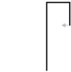

```python
from nbev3devsim.load_nbev3devwidget import roboSim, eds

%load_ext nbev3devsim
%load_ext nbtutor
```

# 3 Robot Lab challenges


Here you are given a number of challenges to do. These challenges are a bit different from the activities you did earlier in RoboLab sessions. We leave you to work out the challenges for yourself, although you are encouraged to use the forums if you need help or if you want to share or discuss any of your ideas with other students.

The purpose of the challenges is to allow you to try your hand at writing your own RoboLab programs. Don’t spend too much time on this work. If you get stuck, take a break: it's surprising how often a solution to a programming problem comes to mind if you take a few minutes away from the screen and the keyboard and do something completely different instead.

The challenges in the next notebook are more difficult and are completely optional. They generally require you to have had some computer programming experience before you started this module.

In the meantime, once you have finished RoboLab Session 3 I suggest you take a well-earned break before going back to the website to complete Study week 3.


### Challenge: Moving Simon forwards

Write a RobotLab program to make the Simon robot move forwards for two seconds.


### Challenge: Traversing a triangle
<div xmlns:str="http://exslt.org/strings" style="background:lightgreen">

 Please note that you must complete and submit the 'Traversing a triangle' activity as part of your ePortfolio.
</div>

Write a program to make the simulated program trace out a triangular path. Run the program in pen-down mode by checking the pen down checkbox in the simulator and grab a screenshot of the code + simulator output.

__TO DO: need some guidance on taking screenshots etc__


---

---

<!-- #region -->
### Challenge: Making a countdown program
Write a RoboLab program that counts down from 10 to 0 and finishes by saying ‘OK’.


#### Question

Would you like a hint?
<!-- #endregion -->

#### Answer

The simulator speech engine can only speak "strings" not digits. So you need to pass in numbers as a string, such as `'2'`, *not* as a literal numeric value, such as `3`. 

---


### Challenge: Traversing a hook

Write a RoboLab program to make the simulated robot trace out the following path: going up the screen, making three turns to the right and ending up crossing its original path, as shown below.



<!--ITQ-->

#### Question

Would you like a hint?


#### Answer

It will help to create three constants, `longTime`, `shortTime` and `turnTime`. You could make `longTime` about twice as long as `shortTime`. Use the `tank_drive()` construct for the movement up the screen. Since this is long, use the constant `longTime`. I used the `tank_turn()` command to make the robot turn for a specified number of wheel rotations.

---

