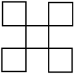
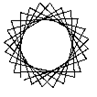
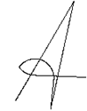

```python
from nbev3devsim.load_nbev3devwidget import roboSim, eds

%load_ext nbev3devsim
%load_ext nbtutor
```

# 4 Optional challenges


These challenges are more difficult, so we’ve made them optional. If you want more programming experience before tackling these challenges you can always come back to this section later in the block.

---


### Challenge: Traversing a multi-square

Write a RoboLab program to make the simulated robot trace out the following path:




A geometric shape. This is a complex path traced out by repeatedly moving forward and turning to the right. The path crosses over itself, forming a square loop at one end; this is then repeated until the path joins up with the beginning again. Overall the net effect is to produce a pattern that can be seen as five identical squares; one is placed centrally and the other four placed at each corner, diagonally outside so only the corner of each surrounding square meets a corner of the central square. 


####  HINT: click the arrow in the sidebar to reveal a hint


You can repeat the path of the ‘Traversing a hook’ challenge in notebook ??.


## Challenge: Making a Spirograph drawing

When you were a child you might have played with Spirograph, in which case you might recognise the pattern below which is constructed from multiple rotated triangles overlaid on top of each other: *did RobotLab have pen up/pen down commands?*




A Spirograph pattern. This is a series of about 30 lines, inscribed across a circle but not through the centre; the overall pattern is of a rosette with many triangular petals surrounding an inner circle. 

Write a RoboLab program to make the simulated robot leave this trail.


#### HINT: click the arrow in the sidebar to reveal a hint


A `for..in..` or `while..` loops is the key here...


## Challenge: Writing a script ‘A’ character

Make the simulated robot trace out the letter A in script form as illustrated below, and to say ‘A’:




A pattern that looks like a capital letter A, hand drawn without lifting pen from paper. This could be done by starting at the base of the left limb, drawing up to the point, down the right limb, and then in a sweeping curve up and left to a point to the left of the letter, and finally straight across to form the cross bar.


####  HINT: click the arrow in the sidebar to reveal a hint


You should be able to do the straight lines easily enough. For the turn, explore various `tank_turn` settings...
