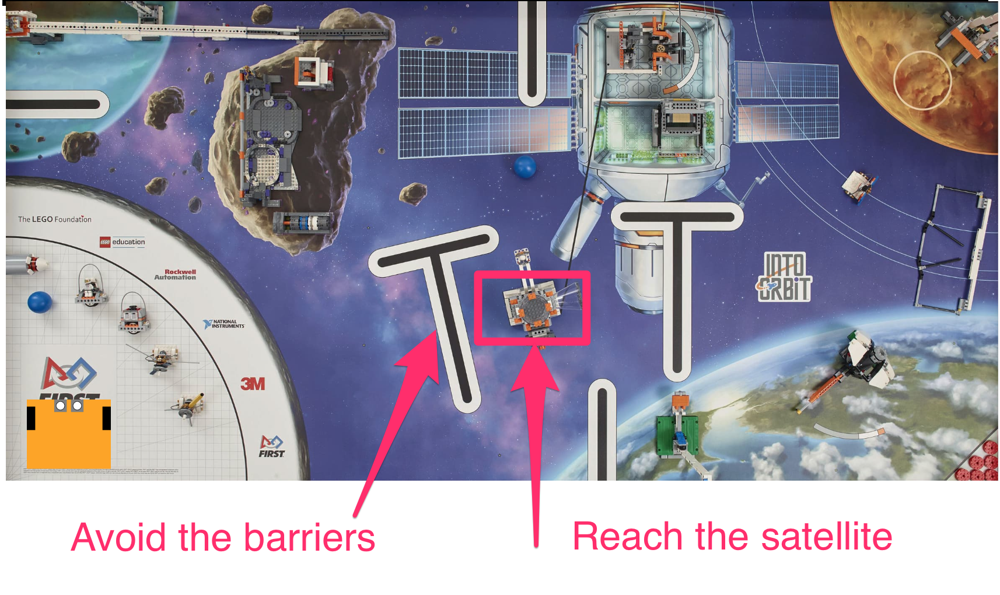

---
jupyter:
  jupytext:
    text_representation:
      extension: .md
      format_name: markdown
      format_version: '1.2'
      jupytext_version: 1.4.2
  kernelspec:
    display_name: Python 3
    language: python
    name: python3
---

```python
from nbev3devsim.load_nbev3devwidget import roboSim, eds

%load_ext nbev3devsim
%load_ext nbtutor
```

# 3 Dead reckoning


*Dead reckoning* is a means of navigation that does not rely on external observations. Instead, a robot’s position is estimated by summing its incremental movements relative to a known starting point.

Estimates of the distance traversed are usually obtained from measuring how many times the wheels have turned, and how many times they have turned in relation to each other. For example, the wheels of the robot could be attached to an odometer, similar to the device that records the mileage of a car.

In RoboLab we will calculate the position of a robot from how long it moves in a straight line or rotates about its centre. We will assume that the length of time for which the motors are switched on is directly related to the distance travelled by the wheels.


## 3.1 Activity — dead reckoning


An environment for the simulated robot to navigate is shown below, based on the 2018 First Lego League "Into Orbit" challenge.

The idea is that the robot must get to the target satellite from its original starting point by avoiding the obstacles in its direct path.



The following program should drive the robot from its starting point, to the target, whilst avoiding the obstacles. We define the obstacle as being avoided if it is not crossed by the robot's *pen down* trail.

Load the *FLL_2018_Into_Orbit* background into the simulator. Run the code cell to download the program to the simulator and then, with the *Pen Down* checkbox enabled, run the program in the simulator.

*Remember that you can reset the original location and orientation of the robot by clicking the simularo `Reset` button. You can clear the pen trace by clicking the simulator `Clear Trace` button.*

Does the robot reach the target satellite without encountering any obstacles?


To set the speeds and times, I used a bit of trial and error.

If the route had been much more complex, I would have been tempted to  comment out the steps up I had already run an add new steps that would be applied from wherever the robot was currently located.

Note that the robot could have taken other routes to get to the satellite - I just thought I should avoid the asteroid!

```python
%%sim_magic_preloaded -b FLL_2018_Into_Orbit -p

import playsound

# Turn on the spot to the right
tank_turn.on_for_rotations(100, SpeedPercent(75), 0.8 )

# Go forwards
tank_drive.on_for_rotations(SpeedPercent(30), SpeedPercent(30), 4)

# Slight graceful turn to right
tank_drive.on_for_rotations(SpeedPercent(50), SpeedPercent(30), 2.5)

# Turn on the spot to the left
tank_turn.on_for_rotations(-100, SpeedPercent(75), 0.8 )

# Forwards a bit
tank_drive.on_for_rotations(SpeedPercent(30), SpeedPercent(30), 0.8)

#Turn on the spot a bit more to the left
tank_turn.on_for_rotations(-100, SpeedPercent(75), 0.6 )

# Go forwards a bit more and dock on the satellite
tank_drive.on_for_rotations(SpeedPercent(30), SpeedPercent(30), 1.5)

playsound.say("Hopefully I have docked with the satellite...")
```

<!-- #region student=true -->
*Add your notes on how well the simulated robot performed the task here.*
<!-- #endregion -->

<!-- #region activity=true -->
## 3.2 Challenge: reaching the moon base
<!-- #endregion -->

<!-- #region activity=true -->
In the following code cell, write a program to move the simulated robot from its location servicing the satellite to the moon base identified as the circlular area marked on the moon in the top right hand corner of the simulated world.

In the simulator, set the robot's X location to `1250` and Y location `450` and use the *Move* button to loate the robot there.

Use the following code cell to write your own dead reckoning program to drive the robot to the moon base at location `(2150, 950)`.
<!-- #endregion -->

```python activity=true
%%sim_magic_preloaded

# YOUR CODE HERE

```

## 3.3 Dead reckoning with noise


The robot traverses its path using timing information for dead reckoning. In principle, if the simulated robot had a map, it could calculate all the distances and directions for itself, convert these to times, and dead reckon its way to the target. However, there is a problem with dead reckoning: *noise*.

In many physical systems, a perfect intended behaviour is subject to *noise*, random perturbations that arise within the system as time goes on as a side-effect of its operation. In a robot, noise might arise in the behaviour of the motors, the transmission or the wheels. The result is that the robot does not execute its motion without error. We can model noise effects in the mobility system of out robot by adding a small amount of noise to the motor speeds as the simulator runs. This noise componenent may speed up, or slow down, the speed of each motor, in a random way. As with real systems, the noise represents are slight random deviations from the theoretical, ideal behaviour.


Run the following code cell to download the program to the simulator. Select an empty background (select the *Empty Map*) and tick the *Pen Down* checkbox. Also reset the initial location of the robot to an X value of `50` and Y value of `400`; use the simulator *Move* button to move the robot to that location.

Run the program in the simulator and observe what happens.

```python
%%sim_magic_preloaded -b FLL_2018_Into_Orbit -p

tank_drive.on_for_rotations(SpeedPercent(30),
                            SpeedPercent(30), 3)
```

When you run the program, you should see the robot drive forwards a short way in a straight line, leaving a staight line trail behind it.

Reset the location of the robot by clicking the simulator *Move* button. Also within the simulator, increase the *Wheel noise* value from zero by dragging the slider to the right a little way.

Run the program in the simulator again.

You should notice this time that the robot does not travel in a straight line. Instead, it drifts from side to slide although possible to one side of the line.

Move the robot back to the start poistion (click the *Move* button) and run the program in the simulator again. This time, you should see it follows yet another different path.

Depending on how severe the noise setting is, the robot will travel closer (low noise) the original straight libe, or follow an ever more erratic path (high noise).


Now run the original satellite finding dead reckoning program again, using the *FLL 2018 - Into Orbit* background, but in the presence of *Wheel noise*. Does it:

```python
%%sim_magic_preloaded

import playsound

# Turn on the spot to the right
tank_turn.on_for_rotations(100, SpeedPercent(75), 0.8 )

# Go forwards
tank_drive.on_for_rotations(SpeedPercent(30), SpeedPercent(30), 4)

# Slight graceful turn to right
tank_drive.on_for_rotations(SpeedPercent(50), SpeedPercent(30), 2.5)

# Turn on the spot to the left
tank_turn.on_for_rotations(-100, SpeedPercent(75), 0.8 )

# Forwards a bit
tank_drive.on_for_rotations(SpeedPercent(30), SpeedPercent(30), 0.8)

#Turn on the spot a bit more to the left
tank_turn.on_for_rotations(-100, SpeedPercent(75), 0.6 )

# Go forwards a bit more and dock on the satellite
tank_drive.on_for_rotations(SpeedPercent(30), SpeedPercent(30), 1.5)

playsound.say("Hopefully I have docked with the satellite...")
```

## Summary

In this notebook you have seen how we can use dead reckoning to move the robot along a specified path. However, in the presence of noise, this is very unreliable: whilst the robot may think it is following one path, it may in fact be following another. And whilst in some cases it may reach the target safely, in others it may end somewhere completely different, or encounter an obstacle along the way.
