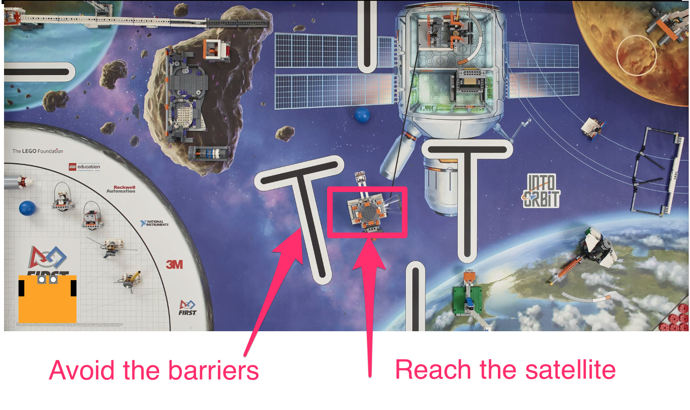

---
jupyter:
  jupytext:
    text_representation:
      extension: .md
      format_name: markdown
      format_version: '1.2'
      jupytext_version: 1.5.2
  kernelspec:
    display_name: Python 3
    language: python
    name: python3
---

# 2 Dead reckoning

*Dead reckoning* is a means of navigation that does not rely on external observations. Instead, a robot’s position is estimated by summing its incremental movements relative to a known starting point.

Estimates of the distance traversed are usually obtained from measuring how many times the wheels have turned, and how many times they have turned in relation to each other. For example, the wheels of the robot could be attached to an odometer, similar to the device that records the mileage of a car.

In RoboLab we will calculate the position of a robot from how long it moves in a straight line or rotates about its centre. We will assume that the length of time for which the motors are switched on is directly related to the distance travelled by the wheels.


## 2.1 Activity – Dead reckoning

An environment for the simulated robot to navigate is shown below, based on the 2018 First Lego League ‘Into Orbit’ challenge.

The idea is that the robot must get to the target satellite from its original starting point by avoiding the obstacles in its direct path.



<!-- #region tags=["alert-success"] -->
The First Lego League (FLL) is 
<!-- #endregion -->

Load in the simulator in the usual way:

```python
from nbev3devsim.load_nbev3devwidget import roboSim, eds

%load_ext nbev3devsim
```

To navigate the environment, we will use a small robot configuration within the simulator. The robot configuration can be set via the simulator user interface, or by passing the `-r Small_Robot` parameter setting in the simulator magic.

The following program should drive the robot from its starting point to the target, whilst avoiding the obstacles. We define the obstacle as being avoided if it is not crossed by the robot’s *pen down* trail.

Load the *FLL_2018_Into_Orbit* background into the simulator. Run the following code cell to download the program to the simulator and then, with the *Pen Down*, run the program in the simulator.

<!-- #region tags=["alert-warning"] -->
Remember, you can use the `-P / --pencolor` flag to change the pen color and the `-C / --clear` option to clear the pen trace.
<!-- #endregion -->

Does the robot reach the target satellite without encountering any obstacles?

```python
%%sim_magic_preloaded -b FLL_2018_Into_Orbit -p -r Small_Robot

# Turn on the spot to the right
tank_turn.on_for_rotations(100, SpeedPercent(70), 1.7 )

# Go forwards
tank_drive.on_for_rotations(SpeedPercent(30), SpeedPercent(30), 20)

# Slight graceful turn to left
tank_drive.on_for_rotations(SpeedPercent(35), SpeedPercent(50), 8.5)

# Turn on the spot to the left
tank_turn.on_for_rotations(-100, SpeedPercent(75), 0.8)

# Forwards a bit
tank_drive.on_for_rotations(SpeedPercent(30), SpeedPercent(30), 2.0)

#Turn on the spot a bit more to the right
tank_turn.on_for_rotations(100, SpeedPercent(60), 0.4 )

# Go forwards a bit more and dock on the satellite
tank_drive.on_for_rotations(SpeedPercent(30), SpeedPercent(30), 1.0)

say("Hopefully I have docked with the satellite...")
```

<!-- #region student=true -->
*Add your notes on how well the simulated robot performed the task here.*
<!-- #endregion -->

To set the speeds and times, I used a bit of trial and error.

If the route had been much more complex then I would have been tempted to comment out the steps up I had already run and add new steps that would be applied from wherever the robot was currently located.

Note that the robot could have taken other routes to get to the satellite – I just thought I should avoid the asteroid!

<!-- #region activity=true -->
## 2.2 Challenge – Reaching the moon base
<!-- #endregion -->

<!-- #region activity=true -->
In the following code cell, write a program to move the simulated robot from its location servicing the satellite to the moon base identified as the circular area marked on the moon in the top right-hand corner of the simulated world.

In the simulator, set the robot’s X location to `1250` and Y location `450` and use the *Move* button to locate the robot there.

Use the following code cell to write your own dead reckoning program to drive the robot to the moon base at location `(2150, 950)`.
<!-- #endregion -->

```python activity=true
%%sim_magic_preloaded

# YOUR CODE HERE

```

## 2.3 Dead reckoning with noise

The robot traverses its path using timing information for dead reckoning. In principle, if the simulated robot had a map then it could calculate all the distances and directions for itself, convert these to times, and dead reckon its way to the target. However, there is a problem with dead reckoning: *noise*.

In many physical systems, a perfect intended behaviour is subject to *noise* – random perturbations that arise within the system as time goes on as a side effect of its operation. In a robot, noise might arise in the behaviour of the motors, the transmission or the wheels. The result is that the robot does not execute its motion without error. We can model noise effects in the mobility system of our robot by adding a small amount of noise to the motor speeds as the simulator runs. This noise component may speed up or slow down the speed of each motor, in a random way. As with real systems, the noise represents slight random deviations from the theoretical, ideal behaviour.

For the following experiment, create a new, empty background cleared of pen traces.

```python
%sim_magic -b Empty_Map --clear
```

Run the following code cell to download the program to the simulator using an empty background (select the *Empty_Map*) and the *Pen Down* mode selected. Also reset the initial location of the robot to an X value of `150` and Y value of `400`.

Run the program in the simulator and observe what happens.

```python
%%sim_magic_preloaded -b Empty_Map -p -x 150 -y 400 -r Small_Robot


tank_drive.on_for_rotations(SpeedPercent(30),
                            SpeedPercent(30), 10)
```

<!-- #region student=true -->
*Record your observations here describing what happens when you run the program.*
<!-- #endregion -->

When you run the program, you should see the robot drive forwards a short way in a straight line, leaving a straight line trail behind it.

Reset the location of the robot by clicking the simulator *Move* button. Also within the simulator, increase the *Wheel noise* value from zero by dragging the slider to the right a little way.

Run the program in the simulator again.

You should notice this time that the robot does not travel in a straight line. Instead, it drifts from side to side, although possibly to one side of the line.

Move the robot back to the start position, or rerun the previous code cell to do so, and run the program in the simulator again. This time, you should see it follows yet another different path.

Depending on how severe the noise setting is, the robot will travel closer (low noise) the original straight line, or follow an ever-more erratic path (high noise).

<!-- #region student=true -->
*Record your own notes and observations here describing the behaviour of the robot for different levels of motor noise.*
<!-- #endregion -->

Clear the pen traces from the simulator by running the following line magic:

```python
%sim_magic -C
```

Now run the original satellite-finding dead reckoning program again, using the *FLL_2018_Into_Orbit* background, but in the presence of *Wheel noise*. How well does it perform this time compared to previously?

```python
%%sim_magic_preloaded -b FLL_2018_Into_Orbit -p -r Small_Robot

# Turn on the spot to the right
tank_turn.on_for_rotations(100, SpeedPercent(70), 1.7 )

# Go forwards
tank_drive.on_for_rotations(SpeedPercent(30), SpeedPercent(30), 20)

# Slight graceful turn to left
tank_drive.on_for_rotations(SpeedPercent(35), SpeedPercent(50), 8.5)

# Turn on the spot to the left
tank_turn.on_for_rotations(-100, SpeedPercent(75), 0.8)

# Forwards a bit
tank_drive.on_for_rotations(SpeedPercent(30), SpeedPercent(30), 2.0)

#Turn on the spot a bit more to the right
tank_turn.on_for_rotations(100, SpeedPercent(60), 0.4 )

# Go forwards a bit more and dock on the satellite
tank_drive.on_for_rotations(SpeedPercent(30), SpeedPercent(30), 1.0)

say("Did I avoid crashing and dock with the satellite?")
```

Reset the robot to its original location and run the program in the simulator again. Even with the same level of motor noise as on the previous run, how does the path followed by the robot this time compare with the previous run?

<!-- #region student=true -->
*Add your own notes and observations here.*
<!-- #endregion -->

## 2.4 Summary

In this notebook you have seen how we can use dead reckoning to move the robot along a specified path. Using the robot's motor speeds and by monitoring how long the motors are switched on for, we can use distance time calculations to estimate out the robot's path. If we add in accurate measurements regarding how far we want the robot to travel, and in what direction, this provides one way of helping the robot to navigate to a particular waypoint.

However, in the presence of noise, this approach is likely to be very unreliable: whilst the robot may think it is following one path, as determined by how long it has turned its motors on, and at what speed, it may in fact be following another. In a real robot, the noise may be introduced in all sorts of ways, including from friction in the motor bearings, the time taken to accelerate from a standing start and "get up to speed, and loss of traction effects such as wheel spin and slip as the robot's wheels turn. 

Whilst in some cases it may reach the target safely, in others it may end somewhere completely different, or encounter an obstacle along the way.
