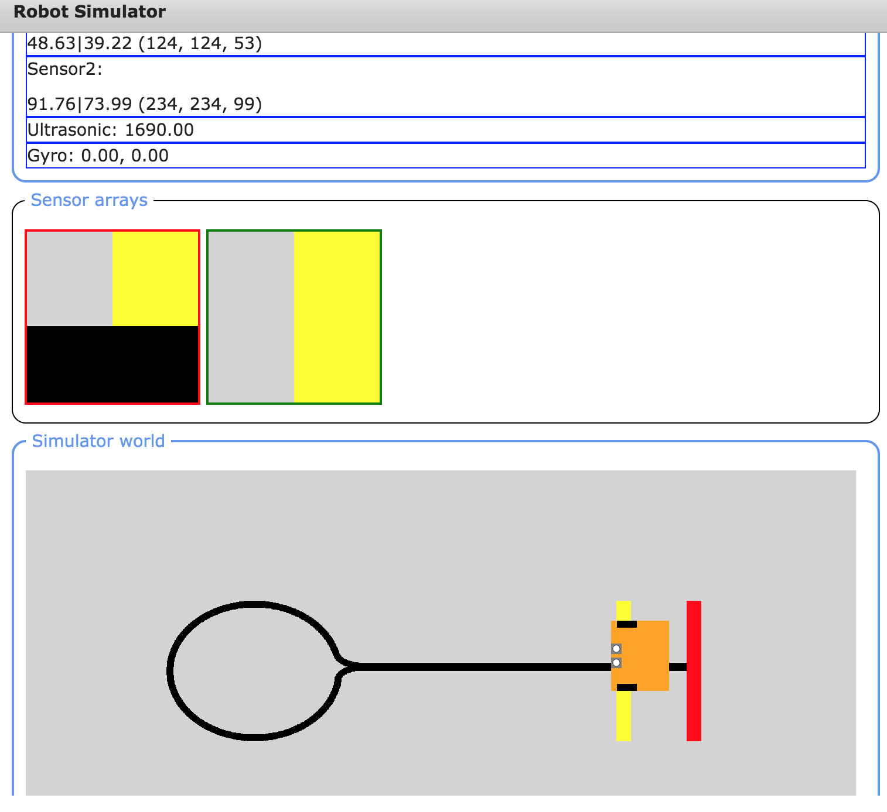

---
jupyter:
  jupytext:
    text_representation:
      extension: .md
      format_name: markdown
      format_version: '1.2'
      jupytext_version: 1.4.2
  kernelspec:
    display_name: Python 3
    language: python
    name: python3
---

```python
from nbev3devsim.load_nbev3devwidget import roboSim, eds

%load_ext nbev3devsim
%load_ext nbtutor
```

# 2 Sensor noise


My line-following program in the previous notebook seems to work reasonably well, as long as the line is not too wiggly. But it operates in a binary world with clearly defined, and very distinct, features in the sense of the white background and black line.

Suppose we have a slightly more complex environment, as depicted by the `Lollipop` background in the simulator.

![The lollipop image used as a background for the modified edge-follower program. This has a grey background on which is a lollipop shape, drawn sidways as a black outline. The robot starts at the stick, must follow the line across the screen to the left, around the head of the lollipop and back up the stick. The start/end is marked by a transverse broad red line; a transverse yellow line occurs midway along the straight path. The yellow line is drawn behind the black lollipop so the black line is unbroken at this point; the red line is drawn across the end of the black line.](../images/lollipop_sim.png)

This environment has grey background, with a lollipop-shaped black line. At the end of the lollipop ‘stick’, a red rectangle is laid over the line. A little way before the end of the ‘stick’ is a yellow rectangular shape placed underneath the line. You might also notice that the robot is slightly smaller than we have used previously.

In this notebook, you will start to work on the challenge of programming the simulated robot to use a single light sensor to follow the line from its default starting point in the environment, go round the lollipop, up the stick, over the yellow rectangle and stop when it reaches the red rectangle.


## 2.1 A Closer look at the `ColorSensor`

In order to complete this challenge, you will need to calibrate the robot’s sensor readings so that you can work out a strategy for identifying what the robot can see at any particular time.

<!-- #region -->
When a light sensor is placed over an object, the sensor display areas shows the light sensor reading for that object in various ways:

<font color='red'>JD: Note that in my 'Robot Simulator' screen, it doesn't say "Sensor readings:" Instead, I have "Port Values:" followed by values for LeftMotor and RightMotor then the blue box. (so no heading "Sensor readings:") My sensor arrays are also different ('pixellated circles'). ... My screen looks more like the screenshot towards the end of this notebook.</font>



- the *sensor arrays* display shows the area of the backgound that is under each sensor (without the addition of any sensor noise)
- the *sensor readings* display shows three different readings:
  - the reflected light intensity as a percentage
  - the ‘full’ reflected light intensity as a percentage
  - the red, green and blue colour components, each in the range `0...255`.

In order to access these values in a program, use the following.

```python
from ev3dev2.sensor import INPUT_2 # Or INPUT_3
from ev3dev2.sensor.lego import ColorSensor

color_sensor = ColorSensor(INPUT_2)

# Reflected light intensity
# This is actually the R (red) component
color_sensor.reflected_light_intensity

# Reflected light intensity as a percentage
color_sensor.reflected_light_intensity_pc

# 'Full' reflected light intensity
# This is the simple average (mean) of all three
# RGB components, as a percentage
color_sensor.full_reflected_light_intensity
```

The colour value readings are are made up of different amounts of red (R), blue (B) and green (B) – so-called RGB values. Each value varies between decimal (base&nbsp;10) values 0 and 255.
<!-- #endregion -->

<!-- #region -->
The raw RGB values are returned as a list and can be accessed in a simulated robot program as follows:

```python
# List of RGB values: [red, green, blue]
color_sensor.rgb

# Index in to get the separate components
color_sensor.rgb[0] # red
color_sensor.rgb[1] # green
color_sensor.rgb[2] # blue
```
<!-- #endregion -->

<!-- #region tags=["alert-warning"] -->
Note that it is not uncommon to see individual colour component values represented as hexadecimal numbers in the range `00` to `FF`. So a pure red would be `(FF, 00, 00)`, `(#FF, #00, #00)` or `(0xFF, 0x00, 0x00)`.
<!-- #endregion -->

## 2.2 Experimenting with colour

Run the following code cell to create a simple interactive colour explorer that lets you change the values of the R (red), G (green) and B (blue) components of a colour signal to create a particular colour.

A pure red colour is represented by an RGB value `(255, 0, 0)`: ‘all red, no green, no blue’. Black is an absence of colour: `(0, 0, 0)` and white the presence of all colours, `(255, 255, 255)`.

As well as changing the values using the sliders, you can also double-click in the number label, change it to the desired value (an integer in the range 0..255) and hit return to update the value.

```python
from PIL import Image
from ipywidgets import interact


HEIGHT = WIDTH = 50

# The ipywidgets framework provides us with a powerful toolkit for creating
# simple interactive displays from a function using a simple function decorator
# https://ipywidgets.readthedocs.io/en/stable/examples/Using%20Interact.html
@interact(red=(0, 255, 1), #min, max, step
          green=(0, 255, 1),
          blue=(0, 255, 1))
def showColour(red=255, green=0, blue=0):
    """Create a simple solid colour display based on provided RGB components."""
    display(Image.new('RGB', (WIDTH, HEIGHT), (red, green, blue)))
```

<!-- #region activity=true -->
### Calibrating the required sensor readings

You first need to record the light sensor readings associated with each of the coloured bands on the lollipop image, as well as for the black line and the grey background.

Drag the robot around the screen, dropping it so the left-hand light sensor is directly over the area you want to record the sensor reading for. When you drop the robot, the light sensor reading should be updated in the simulator sensor readings area.

For each colour area, record the RGB values, the reflected light intensity percentage and the full reflected light percentage.

What happens to the readings if the sensor is now completely over a single solid block of colour?
<!-- #endregion -->

<!-- #region student=true -->
- Black: *YOUR VALUES HERE*
- Grey: *YOUR VALUES HERE*
- Yellow: *YOUR VALUES HERE*
- Red: *YOUR VALUES HERE*

*Also record your observations about what happens if the sensor is not wholly over a single solid block of colour.*
<!-- #endregion -->

<!-- #region activity=true heading_collapsed=true -->
#### My readings

*Click on the arrow in the sidebar or run this cell to reveal my answer.*
<!-- #endregion -->

<!-- #region activity=true hidden=true -->
Here are the readings I got when I placed the robot sensor fully over each colour:

| Colour | RGB | Reflected light (%) | Full reflected light (%) |
|---|---|---|---|
| Black | (0, 0, 0) | 0 | 0 |
| Grey | (211, 211, 211) | 82.75 | 82.75 |
| Yellow | (255, 255, 0) | 100 | 66.67 |
| Red | (255, 0, 0) | 100 | 33.33 |

If the sensor was not completely over a single block of colour, then the values were not so clear-cut and changed depending on how much of each colour was in view.
<!-- #endregion -->

### Challenge – An edge-follower for the lollipop

Write an edge-follower program using a single light sensor that will cause the robot to follow the line from its default starting point in the environment, go round the lollipop, up the stick, over the yellow rectangle and stop when it reaches the red rectangle.

You are encouraged to use the edge-follower code from the previous notebook as the basis for your program.

You may find it convenient to consider your program in two or three parts. For example:

- following the line over the grey background
- following the line over the yellow bar
- stopping on the red bar.

Spend five to ten minutes developing your program. Good luck!

*If you cannot get your program to work properly – or even at all – don’t panic. My program didn’t work at all well at first! In later activities we will be reviewing several aspects of this program, including how to apply a design-cycle approach to fix it when it doesn’t at first work, as well as looking at how to make it more robust and reliable when it does seem to work.*

```python student=true
%%sim_magic_preloaded --background Lollipop

# YOUR CODE HERE
```

<!-- #region activity=true heading_collapsed=true -->
#### My answer

*Click on the arrow in the sidebar or run this cell to reveal my answer.*
<!-- #endregion -->

<!-- #region activity=true hidden=true -->
The following program represents my final attempt at the edge follower that stops on the red line.

My original attempt did not work so well, as you will find out in the next notebook. But after a bit of investigative work I managed to find out why it wasn’t working as I’d anticipated and how I then fixed the problem.

A key consideration in the following program is the stopping condition; in this iteration of the program, I explicitly try to detect pure red. As you will see later, my first attempt used a different, and far less successful, approach to try to identify when the robot should stop.

There could still be a problem with this approach, though: if the red is not a pure red, or there is a non-zero green component, or the robot does not get a clear view of just the red bar, then the condition will not evaluate as true and the robot won’t stop.
<!-- #endregion -->

```python activity=true hidden=true
%%sim_magic_preloaded --background Lollipop

colorLeft = ColorSensor(INPUT_2)
print(colorLeft.reflected_light_intensity)
while True:
    
    intensity_left = colorLeft.reflected_light_intensity
    
    print(intensity_left)

    if intensity_left < 50:
        left_motor_speed = SpeedPercent(0)
        right_motor_speed = SpeedPercent(20)
    else:
        left_motor_speed = SpeedPercent(20)
        right_motor_speed = SpeedPercent(0)
    tank_drive.on(left_motor_speed, right_motor_speed)
    
    # If we see red, quit the loop
    if (colorLeft.rgb[0]==255 and colorLeft.rgb[1]==0):
        break
```

### Trying to identify what the robot can see 

The way I designed my program was based on various logical distinctions that I made and that I tried to put into the program. In particular, I tried to identify whether the robot could see:

- the black line as distinct from the grey background or yellow bar
- the red bar.

The light sensor values identified during the calibration phase helped me decide what sensor readings would allow me to distinguish each of those cases. I also had to bear in mind that the calibration values were based on ideal values when the sensor could only see a ‘pure’ block of colour and that the actual values seen by the robot would be determined by the area of the background it could actually see. 


## 2.3 Coping with noise

The *Lollipop* background image used for the line-following activity was made with a Python drawing package (see the `backgrounds/Background Image Generator.ipynb` notebook), and the colours are all very precise, with no variation. Many real images are not like this.

For example, if we scanned the background image using a cheap scanner and you zoomed in to look at a highly magnified view of it, then you might see something like the following:


Each pixel is visible, but there is considerable variation in colour, for example a black line may appear as many shades of dark grey, and some pixels of the pale grey background may have a noticeable pink, green or blue distortion.

Human vision is very adaptable and can usually overcome these irregularities. If you have normal colour vision then you should be able to pick out the red, yellow, black and grey areas in this image easily, but it is much more difficult for a machine to do this. Poor machine vision is a major problem in the development of robots.


### Noise from sensors

In many respects, what the robot sees is like the view a scanner has of the image, except that the robot sensor sees only a tiny part of the image at any particular time.

Even if the background is a ‘crisp’ high-resolution, low-noise one, such as the original, the sensor itself may perceive something more like the noisy scanned image.

There are several various possible sources of such noise, including electrical noise or a fault in the sensor itself, or ‘optical noise’ arising from shadows, or dust on the sensor. Different random amounts of noise might be added separately to each of the sensor’s pixel detectors which means that even if the robot is stationary, the values returned by the sensor may vary each time we sample them.

Where the noise is added may be largely irrelevant, for example whether it’s noise ‘in the background’ or noise added by the sensor. If the value returned by the sensor is affected by noise, and we can’t reduce that noise, then our control strategy needs to be able to cope with it.


### The light sensor’s pixelated view of the world

The images that form the different backgrounds in the simulator window are made up grids of coloured squares called *pixels*. The sensor array view on the simulator shows the pixel values detected by the sensor as coloured squares of various intensities. The colour value of each pixel is represented by an RGB value. The light sensor view is as circular as it can be given that it’s made from squares!

The single value returned by the light sensor is an average of the pixel values captured by the sensor. In the simulator we’re using, the final sensor value is formed from the simple average taken over all the pixels in view. In other simulators, or other sensor models, a *weighted sum* may be used where we weight the contribution of the pixels nearer the centre of the sensor more highly than we do the pixels on the edges.

We can increase the number of pixels read by the sensor by tuning the *diameter* of the area sensed. This is analogous to increasing the height off the ground of the light sensor on a real robot.


### Adding sensor noise

We can model the addition of sensor noise by using the *Light sensor noise* slider in the simulator.

If you add noise using the light sensor noise slider, then you should see ‘speckles’ appearing in the sensor array view in the simulator:


<!-- #region activity=true -->
## Activity – Following a line in the presence of sensor noise

Try re-running your edge-follower program in the presence of sensor noise.

Make some notes on what the effect (if any) is on the behaviour of your program for increasing levels of sensor noise.

*Sometimes the addition of small amounts of noise can, perhaps surprisingly, improve the behaviour of a robot...*
<!-- #endregion -->

<!-- #region student=true -->
*Record your observations here describing how the addition of sensor noise affects the performance of your edge-follower program.*
<!-- #endregion -->

## Summary

In this notebook, you have had the opportunity to explore in a little bit more detail the behaviour of the light sensor.

You have also seen how it can be important to calibrate and understand the behaviour of your sensors if you are using particular sensor values as the basis for decisions that the simulated robot makes about what it can see at any particular time, and as a result, what action it should take. 
