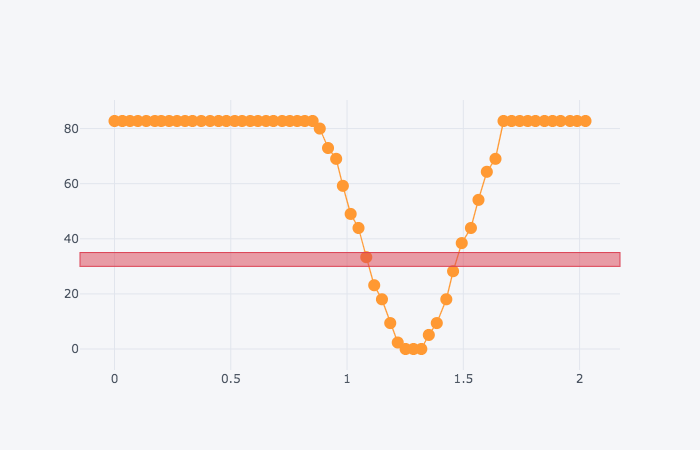
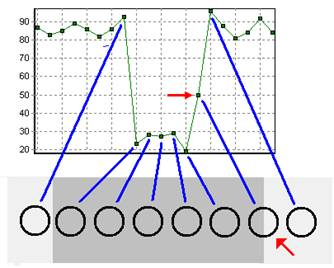

# 4 The design engineer as detective


If you have never before experienced a disappointment when building systems, welcome to the world of engineering design!

Design is characterised by defining *requirements*, translating these into a *specification*, generating a possible solution to the specified problem and *evaluating* the outcome. If the "solution" is not satisfactory, it is necessary to go back and try to formulate another possible solution. This is called the *design cycle* .

```python
# TO DO - this will be provided by installed / importable package
# Maybe also some magic

fcode='''
st=>start: Start
e=>end: End
op1=>operation: Generate
op2=>parallel: Evaluate
st(right)->op1(right)->op2
op2(path1, top)->op1
op2(path2, right)->e
'''

#Original alt text.
# Could we generate something like this from the flow chart specification?
alt_txt = """
A diagram of the design cycle, drawn as a simple flow chart.
This starts in an oval labelled ‘Start’ and finishes in another oval labelled ‘End’.
From ‘Start’ an arrow leads to a box labelled ‘Generate’;
from here an arrow leads to a box ‘Evaluate’.
From ‘Evaluate’ there are two arrows:
one leads directly to the ‘End’, the other loops back to ‘Generate’.
Thus there are two paths in the diagram, 
one straight from Start to Generate to Evaluate to End,
the other that forms a loop around Generate and Evaluate."""

import jp_proxy_widget
import uuid
class FlowchartWidget(jp_proxy_widget.JSProxyWidget):
    def __init__(self, *pargs, **kwargs):
        super(FlowchartWidget, self).__init__(*pargs, **kwargs)
        e = self.element
        
        e.empty()
        self.load_js_files(["https://cdnjs.cloudflare.com/ajax/libs/raphael/2.3.0/raphael.min.js",
                            'https://cdnjs.cloudflare.com/ajax/libs/flowchart/1.13.0/flowchart.js'])
        
    def charter(self, chart, embed=False):
        uid = uuid.uuid4()
        self.element.html(f'<div id="{uid}"></div>')
        self.set_element("chartdef", chart)
        self.js_init(f"chart = flowchart.parse(element.chartdef); chart.drawSVG('{uid}');")
        if embed:
            return self
        
testEmbed = FlowchartWidget()
testEmbed.charter(fcode)
testEmbed

```

During the design cycle, candidate soluions are generated and evaluated. If the design fails to meet expectations, then a new up or updated design must be generated. If the evaluation of the design is satisfactory, then the design can be accepted and the process may end.

In a continuous improvement design cycle, the the design may be used but it may also be reconsidered. If an improvement is found the new design may be both adopted and passed back round the cycle for further reconsideration.

```python
import sys
sys.path.insert(0,'..')

from _load_nbev3devwidget import roboSim, eds

%load_ext nbev3devsim
%load_ext nbtutor
```

*Note that things have moved on in the simulator. We can now specify a background and robot configuration as parameters to the magic ( TO DO - NOT YET AVAILABLE IN ALL MAGICS).*

```python
%%sim_magic_preloaded --background Lollipop -r Small_Robot
import ev3dev2_glue as glue

colorLeft = ColorSensor(INPUT_2)
colorRight = ColorSensor(INPUT_3)
print(colorLeft.reflected_light_intensity)
while (colorLeft.reflected_light_intensity < 30 or colorLeft.reflected_light_intensity > 35):
    
    intensity_left = colorLeft.reflected_light_intensity
    #intensity_right = colorRight.reflected_light_intensity
    
    print(intensity_left)

    print('gs',glue.pyState())
    if intensity_left < 50:
        left_motor_speed = SpeedPercent(0)
        right_motor_speed = SpeedPercent(20)
    else:
        left_motor_speed = SpeedPercent(20)
        right_motor_speed = SpeedPercent(0)
    tank_drive.on(left_motor_speed, right_motor_speed)
 

```

### Following the Design Cycle

In the current example, the system was specified according to the requirement that the robot would go all the way round the track and stop at the red bar. I generated a solution based on my 'model' of the system. When I ran it, my evaluation was that the system did not work! (Even if it had worked first time, it's possible that the solution was not very good either in terms of the way the robot behaved, or in terms of how the programme was written.)

Under these circumstances, the design engineer looks for reasons why things went wrong, using all the available information. Sometimes this involves devising experiments. It's rather like being a detective, trying to piece together the solution.

One of the main assumptions underlying my first program was that the colours could be separated by thresholds. I decided to test this assumption to try to find out what Simon really 'sees'.

The following program drives the robot forward a short way, far enough from it to cross the black line. Download and run the programme so that 

```python
%%sim_magic_preloaded 
import time
tank_drive.on(SpeedPercent(20), SpeedPercent(20))

for i in range(60):

    print('Colour: ' + str(colorLeft.reflected_light_intensity ))
    time.sleep(0.02)
```

Grab the data from the datalog:

```python
# Get the data
#eds.sim_get_data(roboSim)
data = roboSim.results_log
df = eds.get_dataframe_from_datalog(data)
# TO DO - should we simplify this so if no data is passed we pull it from self?

df.head()
```

```python
df['time'] = df['index'].dt.total_seconds()
```

Now let's plot each of those data points:

```python
import matplotlib.pyplot as plt
import seaborn as sns

g = sns.FacetGrid(df, row="variable",
                  height=5, aspect=2, sharey=False)
g = g.map(plt.plot, "time", "value", marker=".");

# This is rather obscure and relates to the structure
# of the chart object.
ax1= g.axes[0][0]
ax1.axhline(y=10, ls='--');
```

*TO DO - I think plotly now has native support for pandas...*

The `cufflinks` packages adds support for plotting charts using the `plotly` package directly from *pandas* datadrames.

```python
import cufflinks as cf
cf.go_offline()
```

We can now create a plotly chart using *markers* to identify each sensor reading sample point as well as a *line* that connects them. A horizontal band, identified by the `hband=[(MIN_Y, MAX_Y)]` parameter adds a horizontal band to the chart  corresponding to the thresholded range I was using to identify whether the robot had encountered the red line:

```python
df.iplot( x = 'time', y = 'value',
         mode='markers+lines', hspan=[(30,35)])
```

Here's a screenshot of the trace of light readings I got as the simulated robot went from the grey background, over the black line and back to the grey background:




__TO DO: should long desc text only be for partially sighted students, or does it actually make things easier for *all* students? Here's an example of using a long desc style description in the main body of the teaching material.__

The vertical scale shows sensor values on a vertical y-axis scale ranging 0-85 or so (the actual readings in principle range form 0..100 per cent). The horizontal scale is a time base showing a time of 0 to 2 seconds, with a plot every 0.02s (that is, about every fiftieth of a second. The sensor readings are also joined to form a line. The line starts with high values, starting at a y value of just over 80. There is then an abrupt fall in the values until they reach a low point of 0 for 3 samples, followed by a return to the high values around 80. On the diagram, I have marked a horizontal band highlighting values between

**TO DO - the sensor definition has been changed since this chart was first created. Need to revise it with current config and check we still get same sort of result. Also make a point about seeing in red and what we miss otherwise, eg red vs blue.**

This chart helps to explain why my original program did not work as intended. On the right of the black line, in the transition from black to grey, the simulated robot has recorded a value of about 34, within the thresholded band value I was using to identify the red line.

The sensor value is calculated as some function of the value of  several pixels in view of the sensor at any one time and it just so happens that the calculation may return a reading I had associated with the red line.

In fact, the `.reflected_light()` mode is *not* a good indicator of colour at all. What happens if you run the robot over the *Coloured_bands* background, for example, logging the reflected light sensor data as you so so? (Either chart the data in the simulator to review it, or grab the datalog into the notebook and view it here at you leisure.)





A diagram which shows the graph previously described, below which a diagram shows the black line (actually shown as dark grey) highly enlarged. A series of circles is also shown starting on the pale grey background and continuing across the black line and then back on to the grey. These represent the position of the sensor each time a reading is taken, and an arrow leads from each circle indicating a sensor reading to the corresponding point plotted on the graph. Most of these circles are wholly on either the grey or the black line and produce a correspondingly high (80-95) or a low (20-30) reading. However, one circle straddles the edge of the line, so half of the interior is black and the other half grey. This produces an intermediate sensor value of 50.

This is a tough lesson. What ought to be easily classified as either a black or white sensor reading is ambiguously somewhere in the middle. The value of 50% is exactly in the range that the program interprets as red. The assumption underlying the program that a sensor reading of 50% indicates red is clearly incorrect, and another approach is required.


We note that if a sampled data point falls between the values I used for my threshold settings that were intended to identify the red line, then the robot would have a "false positive" match and stop before it was supposed to.
