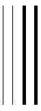
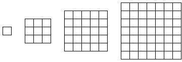
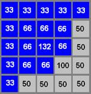

# 6 Simulating raising and lowering the light sensor

Open the `Sensor_diameter_test` program. This has two sets of four parallel lines. The first group of four lines are colour black and have increasing thickiness. The second group of lines also increase in thikness and are colored red.

TO DO - UPDATE IMAGE

Figure 6.1 The four parallel lines

Run the following cell to download the programme to the simualator. Enable the chart display and then run the programme in the simulator several times, resetting the chart display between each run. 

 Upload the data each time by clicking on the Upload   toolbar button (or choose `Connect | Upload data log`), and view it in the Data log window. You will probably find that Simon misses one or both of the thin lines. This is illustrated in the data log in Figure 6.2, where 40 consecutive sensor readings have been logged and downloaded to the computer to draw the graph. The points at 100% represent white and the points at 0% represent black.

Figure 6.2 Scanning with Simon may miss lines

A Data log graph of light sensor readings, with vertical scale 0 to 100 and horizontal showing 40 readings. Most readings form a line at 100, with abrupt dips down to readings of 0. There is a single dip down to 0 for reading 7 and then the readings return to 100. The reading dips to 0 again once at readings 22 and 23, and then again at readings 29, 30 and 31.

It is possible for the robot to miss a line because the sensor is not being read continuously. In the above case, when the sensor was over the line, Simon was doing something else (i.e. waiting).

The images that form the different backgrounds in the Simulator window are grids of coloured squares called *pixels*. These can be seen clearly in Figure 3.1. Simon’s light sensor reads the values of the pixels underneath it. We can get it to read a single pixel’s light level, as it does in default mode, or we can get it to look at several pixels at a time and take their *average* light level. When we increase the number of pixels read by the sensor, in RobotLab we increase the *diameter* of the area sensed, although we are actually referring to square arrays of pixels, not circles as ‘diameter’ would imply (Figure 6.3). The larger the diameter, the less realistic this approximation to a square becomes. Deploying Simon’s *spread sensor* in this way is analogous to increasing the height off the ground of the light sensor on a real robot.

TO DO -  I haven't tried altereing the sensor setting in the ev3devsim yet...  I'm pretty sure it's just a simple setting that needs a slider to control it somewhere...

Figure 6.3 The simulated sensor diameters (left to right: 1, 3, 5 and 7 respectively)

Four diagrams representing different sensor sizes. The smallest is a single square pixel, the next is a 3 × 3 grid of pixels, then 5 × 5 and finally 7 × 7 pixels.

__TO DO: I'm not sure the ev3devsim sensor is simulated this way?__

Like a sensor on a real robot, the simulatoed robot's sensor responds more to the pixels in the middle of its field of view. So we calculate what is called a *weighted average* – the pixels in the middle have a higher weighting than those on the outside. For example, if the diameter is 5 pixels, the sensor returns the sum of the 16 outer pixels plus 8 inner pixels, plus 1 pixel in the middle, weighted 1, 2 and 4 respectively. The weighted average is obtained by dividing the total by (16 × 1) + (8 × 2) + (1 × 4), i.e. 36. A worked example follows.

What happens when the sensor (hence sensed area) straddles two different coloured areas? The 5 × 5 pixel grid in Figure 6.4 straddles an ‘edge’, and contains a mixture of blue and grey pixels. The normal sensor reading for a blue pixel is: 0 (red) + 0 (green) + 100 (blue), divided by 3, which gives 33% (rounded to the nearest whole number). The normal sensor reading for a grey pixel is: 50 (red) + 50 (green) + 50 (blue) divided by 3, which is 50%.

Figure 6.4 Calculating the sensor response for 5-pixel diameter

The grid of values read by a 5 × 5 pixel sensor weighted as described in the text. The background colour in the top left is dark blue, and grey in the bottom right, with the boundary running in a diagonal between bottom left and top right. The weighted readings for each pixel are as follows: 
<table xmlns:str="http://exslt.org/strings">
<caption></caption>
<tbody>
<tr>
<td class="highlight_" rowspan="" colspan=""> 33 </td>
<td class="highlight_" rowspan="" colspan=""> 33 </td>
<td class="highlight_" rowspan="" colspan=""> 33 </td>
<td class="highlight_" rowspan="" colspan=""> 33 </td>
<td class="highlight_" rowspan="" colspan=""> 33 </td>
</tr>
<tr>
<td class="highlight_" rowspan="" colspan=""> 33 </td>
<td class="highlight_" rowspan="" colspan=""> 66 </td>
<td class="highlight_" rowspan="" colspan=""> 66 </td>
<td class="highlight_" rowspan="" colspan=""> 66 </td>
<td class="highlight_" rowspan="" colspan=""> 50 </td>
</tr>
<tr>
<td class="highlight_" rowspan="" colspan=""> 33 </td>
<td class="highlight_" rowspan="" colspan=""> 66 </td>
<td class="highlight_" rowspan="" colspan=""> 132 </td>
<td class="highlight_" rowspan="" colspan=""> 66 </td>
<td class="highlight_" rowspan="" colspan=""> 50 </td>
</tr>
<tr>
<td class="highlight_" rowspan="" colspan=""> 33 </td>
<td class="highlight_" rowspan="" colspan=""> 66 </td>
<td class="highlight_" rowspan="" colspan=""> 66 </td>
<td class="highlight_" rowspan="" colspan=""> 100 </td>
<td class="highlight_" rowspan="" colspan=""> 50 </td>
</tr>
<tr>
<td class="highlight_" rowspan="" colspan=""> 33 </td>
<td class="highlight_" rowspan="" colspan=""> 50 </td>
<td class="highlight_" rowspan="" colspan=""> 50 </td>
<td class="highlight_" rowspan="" colspan=""> 50 </td>
<td class="highlight_" rowspan="" colspan=""> 50 </td>
</tr>
</tbody>
</table>

TO DO - I don't think the ev3devsim sensor weights the pixels?

RobotLab uses these values and weights them according to how far they are from the edge. The outer pixels are weighted by a factor of 1, so their values remain the same. Here all the outer pixels are 33 (1 × 33% for blue) or 50 (1 × 50% for grey). The pixels in the next layer in are given a weighting of 2, so their values are doubled. The eight pixels in this layer therefore have a value of 66 (2 × 33% for blue) or 100 ( 2 × 50% for grey). Finally, the central pixel has a weighting of 4. So this gets a weighted value of 132 (4 × 33% for blue). The sum of all these numbers is 1341. This sum is divided by (16 × 1) + (8 × 2) + (1 × 4) = 36 to bring it back to the scale 0–100%, as before. So 1341/36 = 37% is the value the sensor returns for these five pixels (to the nearest whole number).

Open the Configure simulation dialogue by clicking on `Simulator | Configure`. Click on the tab for `Input 2` to select the light sensor and change the diameter to 5 pixels, as shown below.

Keyboard: Use Tab and cursor keys to select

Figure 6.5 Changing the sensor diameter in pixels

The Configure simulation dialogue. The ‘Input 2’ tab is selected and the diameter slider has been moved to read ‘5’.

Now rerun the program. Upload the data by clicking on the Upload    toolbar button or use the `Connect | Upload data log` menu. Open the Data log window to view the data. Your data log should be similar to Figure 6.6. With the sensor now reading a wider spread of pixels, both thin lines are now likely to be seen. (If this appears not to work, make sure you have changed the diameter of Input 2.)

Figure 6.6 The lines are more likely to be sensed with a wider sensor spread

A Data log graph of light sensor readings, with vertical scale 0 to 100 and horizontal showing 40 readings. Most readings form a line at 100, but there are four dips to lower values. The first dips from 100 to 85, 78 (at reading 4), 85 and then back to 100. The second dips from 100 to 78, 78 (at readings 11 &amp; 12) and then back to 100. The third dip is from 100 to 62, 36, 12 (at reading 21), 32, 85 and back to 100. The final dip is from 100 to 85, 32, 0 (at reading 30) 32, 62 and back to 100. Compared to the previous graph, the dips recording lines are less abrupt, record intermediate values (previously only values of 100 or 0 were recorded), and are registered over a greater number of readings.

If you are interested, experiment by setting the sensor values to diameters 3, 7, 8 and 11 pixels.

## 6.1 Activity: Using the spread sensors for a line follower

Open the `Spread_sensor_line_follower` program and run it. You should see Simon going round a track.

This program exploits the use of a spread sensor, with the diameter set at 11. The sensor readings are 100% for white and a minimum of 30% for black. This gives an effective range of 70%. The relevant part of the program code is as follows:

Figure 6.7 Listing: Spread_sensor_line_follower: forever loop

forever

      comment : control the motors.

      set left_power  = (light_sensor  - 30)/10

      set right_power = (100 - light_sensor) / 10

      power [left_motor ] left_power

      power [right_motor] right_power

The command `set left_power = (light_sensor – 30)/10` sets the `left_power` variable in a range of 0 to 7, suitable for the `power` command.

The command `set right_power = (100 – light_sensor)/10` also sets the `right_power` variable in a range of 0 to 7.

When `left_power` is 0, `right_power` is 7, and vice versa. Thus, when the sensor reads white, the clockwise-moving robot steers to the right, and when the sensor reads black (corresponding to when the robot is on top of the line), the robot steers away from the line. This keeps the robot on track.

## 6.2 Challenge: Making this robot control strategy faster

Can you think of a way of making this robot control strategy faster?

## 6.3 Simulated noise on the sensors and the motors

In robotics, the term *noise* is used to mean any uncertainty in the system. Noise on the sensors, as you have seen, is usually caused by random electrical events. Noise on the motors can be caused by random electrical events in the controller supplying power, or by mechanical events such as wheels slipping and irregular friction.

You can change the noise on both the sensors and the motors using the noise sliders in the simulator widget.

__TO DO: shouls we have separate noise controls for each sensor and motor?__

Apart from noise, sensors and drives may have bias. For example, the Lego light sensors do not all read in exactly the same range. Some are biased to give lower readings and some give higher readings. Similarly, a motor drive might be worn or might stick a bit, making it systematically slower than it should be.

__TO DO: should we have a bias value either applied to all sensors/motors, or separately?__

Experiment by setting the noise values for the sensors and motors of the line-follower program. At what point does it cease to function?

