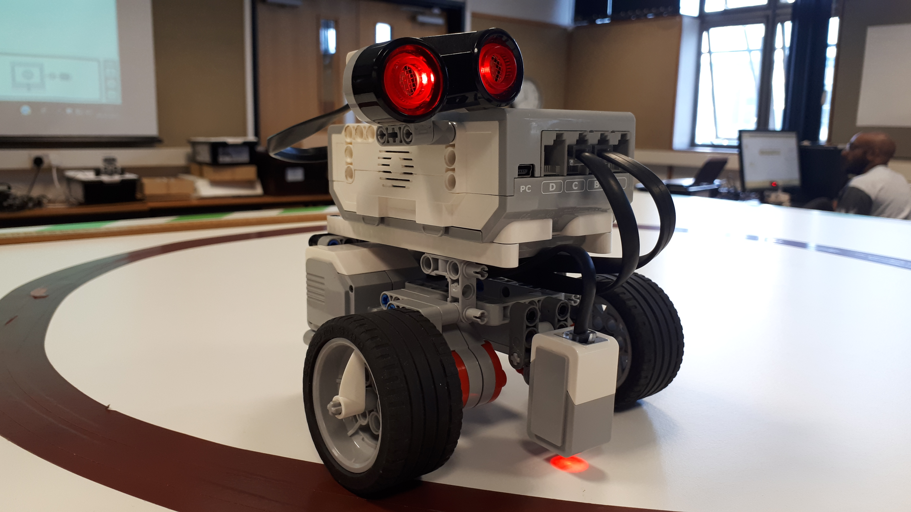
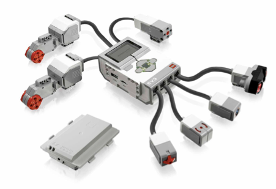

---
jupyter:
  jupytext:
    text_representation:
      extension: .md
      format_name: markdown
      format_version: '1.2'
      jupytext_version: 1.4.2
  kernelspec:
    display_name: Python 3
    language: python
    name: python3
---

# 2 The RobotLab sensors

In which we explore some of the robot's sensors in more detail...

```python
import sys
sys.path.insert(0,'..')

from _load_nbev3devwidget import roboSim, eds

%load_ext nbev3devsim
%load_ext nbtutor
```

## 2.1 Activity: Configuring sensors


Recall from previous activities [ TO DO — better reference] that the simulated robot is configured with a variety of sensors, including two downward facing light sensors, an ultrasonic sensor and a gyro.


In this activity, we will have a look at how sensors are configured in the simulator.

[ TO DO - haven't we already done this? What point are we trying to make here? ]
[ TO DO - the simulator doesnlt currentl have a touch sensor. Do we need one? (we would for T176 activity? Model one as an intersect of an touch sensor area with an object in the obstacle layer?]

By default, the simulated robot, the light sensors are located at the front of the robot, just to the left and right of the centre line. They are also assumed to be facing downwards so that they detect the colour / brightness of the background.

[TO DO - should we experiment with config? eg a light sensor on midline at front and one at back? Or one by each wheel?]

*To change the configuration of the simulated robot,  See also __03_Robot_Lab/Section_00_03.md__* [TO DO - need better notebook names / references.]

In the Software Guide, I briefly described the Lego Mindstorms EV3 "brick". This is a simple but otherwise typical robot control system: it has input and output *ports* to which different sensors and actuators can be connected:




The EV3 brick itself contains a microprocessor running Linux and a rechargeable battery pack, four input ports labeled 1..4 for connecting sensors, four output ports labeled A..D for connecting motor outputs, a grey on off button, four cursor control (up-down, left right) buttons surrounding a central select button, and a small display screen.





The control system needs to know what sensors and actuators actually are connected so that the input and output signals can be interpreted correctly. This is the purpose of the `sensor` and `output` statements are defined in every RoboLab program, although in some of the magics used to download programmes to the robot, those statements are added as default "boilerplate" code when the magic cell is run and before the programme is downloaded to the simulator.


## 2.2 Activity: Testing the ultrasonic sensor

__[TO DO - the original activity tested the touch sensor using a simple forward-bump-reverse program]__


In this activity I’m going to illustrate how the ultrasonic sensor can be used in the simulator.

The robot will drive forward, at speed, until it observes an obstacle, at which point it will start to slow down.

Note that the ultrasonic sensor is mounted a little way back from the front edge of the robot, so we need to take that offset into account when deciding that the front of the robot is in contact with an obstacle.


As well as downloading code to the simulator, the magic supports several command line switches that can be used to configure the robot and the simulator environment.

Arguments:

- `--background / -b`: specify the background option to load into the simulator; 
- `--robotSetup / -r`: define the pre-configured robot template to use;
- `--xpos / -x`: specify initial, default x-coordinate of robot for this activity;
- `--ypos / -y`: specify initial, default y-coordinate of robot for this activity;
- `--angle / -a`: specify initial, default angle of robot for this activity.

Flags (pass the following to force the specified behaviour):

- `--quiet / -q`: suppress the audio alert that from a successful download to the simulator (default: audible download alert);
- `--obstacles / -o`: enable obstacles(default: no obstacles; takes arg corresponding to predefined obstacle config (`Central_post`, `Square_posts`, `Wall`);
- `--ultrasound / -u`: show ultrasound rays (default: no rays);
- `--pendown / -p`: set the pen in the pen down position (default: pen up).


The following code cell configures the simulator to use a blank background (`-b Empty_Map`) and a single obstacle (`Central_post`); the simulated robot is initially situated to near the mid-point of the left hand edge of the simulator canvas (`-x 100 -y 500`) and the ultrasonc rays are displayed (`-u`).

Run the code cell to configure the simulator and download the programme and then run the programme in the simulator.

Observe what happens and record your observations, paying attention to both the behaviour of the robot and the measurements returned by the ultrasonic sensor. (You may find it useful to display a chart of the measurements.)

What happens if you initially locate the robot at `-x 100 -y 450`?

When you have observed what happens, closely read through the programme. How does the code explain the behaviour of the robot?


*Use this markdown cell to record your observations of what happens when the programme is run.*

*Annotate the programme with comments to explain how it works.*

```python
%%sim_magic_preloaded -u -b Empty_Map -o Central_post -x 100 -y 450

import time
ultrasonic = UltrasonicSensor(INPUT_1)

u = ultrasonic.distance_centimeters
print('Ultrasonic: ' + str(u))
time.sleep(1)
while  u > 3:
    u = ultrasonic.distance_centimeters
    print('Ultrasonic: ' + str(u))
    u = min(100, u)
    left_motor_speed = SpeedPercent(u)
    right_motor_speed = SpeedPercent(u)
    tank_drive.on(left_motor_speed, right_motor_speed)
    
print("done...")
```

<!-- #region heading_collapsed=true -->
### My Observations

*Click the arrow on the left to reveal my observations*
<!-- #endregion -->

<!-- #region hidden=true -->
When the programme is run, the robot remains stationary for a moment or two before driving forward at some speed. As the simulated robot appraoches the obstacle, it starts to slow down, coming to stop as it reaches the obstacle.

Starting from the second location, the robot behaves in a similar way to the first run, but it doesn't stop when it reaches the obstacle. Rather, it runs over the obstacle, slowly at first, then speeds up as it passes the obstacle.

It seems that as the robot does not get very close to the obstacle *as measured by the ultrasonic sensor*, it does not stop. Instead, it continues moving and as the obstacle gets further away, the robot speeds up.

Looking at the programme, I have annotated it to describe what each line does and relate it the my observations of the robot's behaviour:

```python

# Import a package 
import time

# Create a variable associated with the ultrasonic sensor
ultrasonic = UltrasonicSensor(INPUT_1)

# Read the distance measured by the sensor
u = ultrasonic.distance_centimeters

# Display the distance
print('Ultrasonic: ' + str(u))

# Pause for 1 second - this is the delay before the robot starts moving
time.sleep(1)
# The delay is actually to give the ultrasonic sensor time to start working

# If the distance is greater than three centimeters
while  u > 3:
    # Take the reading again
    u = ultrasonic.distance_centimeters
    
    #Display the reading
    print('Ultrasonic: ' + str(u))
    
    #Find the minimum value between the sensor reading and 100
    u = min(100, u)
    
    # Set the motor speeds relative to the distance
    # So the closer the robot is to the obstacle,
    # the slower it will go.
    left_motor_speed = SpeedPercent(u)
    right_motor_speed = SpeedPercent(u)
    
    # Drive the robot at the desired speed
    tank_drive.on(left_motor_speed, right_motor_speed)
    
# We're out of the whole loop, so the distance to the obstacle
# must be less than or equal to three centimeters

# And we're done... Print a message to announce the fact.
print("done...")
```

Even though the robot encounters the obstacle, the robot drives over the obstacle rather than being stopped by it. The simulator physics are obviously not so complicated that obstacles have any simulated "physical" substance to them capable of impeding the progress of the robot.
<!-- #endregion -->

## Summary

In this notebook, you have seen how we can configure the simulator using the magic used to download code to the simulator.

You have also seen how the ultrasonic sensor can be used to control the behaviour of the robot when it perceives an obstacle.
