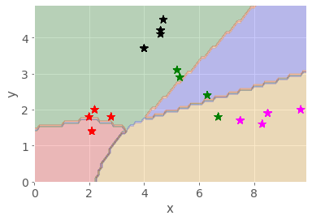

---
jupyter:
  jupytext:
    text_representation:
      extension: .md
      format_name: markdown
      format_version: '1.2'
      jupytext_version: 1.5.1
  kernelspec:
    display_name: Python 3
    language: python
    name: python3
---

# 2 Multi-dimensional data and the MLP

The neural network examples in the previous notebook were very impressive, but how do they work?

In this notebook we’ll make a start by looking at a classification task that attempts to identify various pieces of fruit. The activity is a simplified, stylised one, but it demonstrates several of the features (pun intended, as you may see!) that more complex neural network models employ when performing their recognition tasks.


## 2.1 Fruit recognition task

Consider four classes of fruit: pears, bananas, strawberries and oranges. How might a robot recognise and distinguish between them?

Let’s suppose that a robot’s vision system can isolate the fruit objects and make two measurements. The first is the length of the ‘long axis’. This is called the *long measurement*. The second measurement is taken at right angles to the long axis, halfway along it. This is called the *short measurement*. Oranges are approximately spherical in shape, which means that their long and short measurements are nearly the same. Bananas, on the other hand, are long and thin, so their long measurements are larger than their short measurements.

Note that we are also making an assumption that the fruits are all presented to the same scale. This is fine if we are using a fixed camera and the fruit is passing underneath on a conveyor belt, but in a more general photograph that information may not be so easy to discern. The approach we’re taking also suggests we can segment the photographic image to just give us the fruit object within it. Again, in an industrial setting, we may be able to control for this (only one object in view, on a clean white conveyor background, for example.


Let’s assume we have got the images in the form that is required.


The table below records the measurements listed for the fruit shown in the diagram calcuated according to the method described above. The long measurement is given first, followed by the short measurement.

|pears|bananas|strawberries|oranges|
|--- |--- |--- |--- |
|(5.2, 3.1)|(8.5, 1.9)|(2.1, 1.4)|(4.7, 4.5)|
|(6.3, 2.4)|(8.3, 1.6)|(2.8, 1.8)|(4.6, 4.2)|
|(6.7, 1.8)|(9.7, 2.0)|(2.0, 1.8)|(4.6, 4.1)|
|(5.3, 2.9)|(7.5, 1.7)|(2.2, 2.0)|(4.0, 3.7)|


These measurements can be plotted on a grid. The longest measurement is plotted on the horizontal axis, and the shorter measurement is plotted on the vertical axis.

![A graph showing clusters of different fruits. The fruit short-axis measurement is plotted on the vertical axis which runs from 0 to 5. The fruit long-axis measurement is plotted on the horizontal axis which runs from 0 to 10. Each individual fruit is plotted at its long and short axis measurements, and each cluster of fruit is enclosed by a circle or ellipse. The four strawberries form a cluster centred around (2.2, 1.7). The four oranges cluster around (4.4, 4.1). The pears form a slightly looser cluster around (5.7, 2.5). The bananas form an oval around (8.8, 1.8). Each cluster is distinct. The strawberry cluster is well separated from all the others, but the others touch although they do not overlap. The short-axis measurements of the pears and bananas overlap considerably, but the long-axis measurements for pears and bananas do not overlap. Both long- and short-axis measurements for pears and oranges overlap somewhat when considered on their own, but the clusters remain distinct because combinations of short and long measurements don’t overlap.](../images/tm129_rob_p8_f003.jpg)

As the diagram shows, when we plot the objects on a grid using the long measurement on the horizontal *x-*axis and the short measurement on the vertical *y*-axis, the similar sorts of fruits are arranged close to each other. These sorts of grouping are typically referred to as *clusters*.

When data are grouped like this, we can use various techniques to learn about the clusters, as well as identifying which cluster a newly presented object is likely to correspond to. Neural networks provide a powerful method for working with such data.

<!-- #region activity=true -->
### Activity – A simple classification task

Let’s suppose that a robot has the data above in its memory, and it comes across (as yet) unclassified fruit with the pairs of measurements shown in the table below.
<!-- #endregion -->

<!-- #region student=true -->
| Features | Label |
|---|---|
|(2.5, 2.1)| strawberry |
|(4.6, 4.5)| orange|
|(6.3, 2.9)| |
|(9.5, 1.9)| |
|(1.8, 1.5)| |
|(5.1, 2.1)| |
|(4.5, 4.1)| |

Double-click on this cell and complete the table, identifying the class of fruit the robot would associate each measurement pair with.
<!-- #endregion -->

<!-- #region activity=true -->
### Answer

Click on the arrow in the sidebar or run this cell to reveal the answer.
<!-- #endregion -->

<!-- #region activity=true -->
The answers I got were as follows:

| Features | Label |
|---|---|
|(2.5, 2.1)| strawberry |
|(4.6, 4.5)| orange|
|(6.3, 2.9)| PEAR |
|(9.5, 1.9)| BANANA |
|(1.8, 1.5)| STRAWBERRY |
|(5.1, 2.1)| PEAR |
|(4.5, 4.1)| ORANGE |


You probably found this quite easy. Arranging data points like this on a grid is a simple idea, and there are many techniques that use it to enable automatic classification.

In many cases, however, rather than than imaginging the points in a 2-dimensional grid, the network may be partitioning them over a 20-dimensional grid, or a 200-dimensional grid. This is quite a bit harder for us to visualise!
<!-- #endregion -->

### The classification task

The general idea behind classification using neural networks as classifers is that data are fed into the network and one of the outputs ‘fires’, signifying that the class associated with this output has been recognised.

For example, in the figure below, a neural network that classifies fruit is shown diagrammatically. On the left are inputs, long measurement (`9.5`) and short measurement (`1.9`). On the right are outputs: `pear`, `banana`, `strawberry` and `orange`. Between are represented three layers of neurons – two input neurons, three intermediate neurons and four output neurons – and their interconnections. In this case, the measurements `(9.5, 1.9)` are fed into the network and the output corresponding to ‘banana’ fires.


## 2.2 Creating a simple neural network model – a multi-layer perceptron (MLP)

One of the original neural network models, but one that is still relevant today, is known as a multi-layer perceptron or MLP network.

The Python *scikit-learn* (`sklearn`) package supports a range of techniques for creating learned models, including an MLP. We will find it convenient to use this  package to train a fruit-discriminating network for us.

The multi-layer perceptron (MLP) network model has a certain number of input-layer nodes, or *neurons*, that accept the input data, and some output-layer neurons that are used to represent output classes. Connecting the input and output layers are one or more layers of inner *hidden* neurons.

Let’s consider how we might configure such a network that will hopefully be able to recognise, and discriminate between, our fruit examples.

On the input side, we need *two* nodes to represent the *long measurement* and the *short measurement*.

On the output side, in order to identify which category of fruit a set of input measurements corresponded to, we need... what?

In order to train the network, we need to encode the desired response in a way that the network can represent, and present that as our training value rather than the human-understandable label.

The network only deals with numbers, not categorical labels (such as *banana*, *pear*, *orange*, *strawberry*) so we need to encode these values numerically. In an MLP classifier – that is, an MLP that we want to perform a classification task that assigns each set of inputs to one or more different *categorical* groups, or *classes* – we use one output to represent each separate category.

For our MLP, we will need *four* outputs, one for each class of fruit. The numbers on the output neurons range from 0 to 1. By convention, we interpret 0 to mean *not recognised* and 1 to mean *recognised*.

In many cases, each of the actual values of the four outputs are likely to be in the range 0...1, for example `(0.1, 0.9, 0.2, 0.1)`. In these cases, the MLP uses a *winner-takes-all* strategy in which the largest value is rounded up to 1 and the other values are reduced to zero.

In our example of outputs `(0.1, 0.9, 0.2, 0.1)`, the second output would be rounded up to 1, whilst the other three outputs are reduced to 0, giving the output classification `(0, 1, 0, 0)`. The second neuron is said to have ‘fired’ as a result, and the network recognises that input as being associated with the class represented by the second output neuron.

If the second output identifies the *banana* class, then for the input `(9.5, 1.9)` the desired output would be `(0, 1, 0, 0)`. The values `(9.5, 1.9)` and `(0, 1, 0, 0)` could then be used as a ‘training pair’ of known inputs and outputs.

Trying to keep track of which outputs correspond to which categorical label can be a bit fiddly, particularly with large numbers of categories, so it’s rather handy that the `sklearn` MLP function just lets us pass in the categorical label values and it works out the output layer mappings for us.

For this reason, as well as the need to generate features derived from the original input image that can be fed into the network, we typically think of the network as part of a wider system. This system takes the original input, passes it thorough a *pre-processor* that transforms the input into a form that can be fed into the network, runs it through the network, and then passes the output through a *post-processor* that turns the output into something human readable. Run the following code blocks to see a diagram that illustates this.   

```python
%load_ext blockdiag_magic
```

```python
%%blockdiag

A [label = "Pre-processor"];
B [label = "Neural Network"];
C [label = "Post-processor"];

A -> B -> C;
```

## 2.3 Training a simple MLP using `sklearn`

The code below will load a set of training pairs of data based on the fruit measurement data into a *pandas* dataframe.

Run the cell to load the values into the dataframe and preview the result.

```python
import pandas as pd

df = pd.DataFrame([['Pear', [5.2, 3.1]], ['Pear', [6.3, 2.4]],
                   ['Pear', [6.7, 1.8]], ['Pear', [5.3, 2.9]],
                   ['Banana', [8.5, 1.9]], ['Banana', [8.3, 1.6]],
                   ['Banana', [9.7, 2.0]], ['Banana', [7.5, 1.7]],
                   ['Strawberry', [2.1, 1.4]], ['Strawberry', [2.8, 1.8]],
                   ['Strawberry', [2.0, 1.8]], ['Strawberry', [2.2, 2.0]],
                   ['Orange', [4.7, 4.5]], ['Orange', [4.6, 4.2]],
                   ['Orange', [4.6, 4.1]], ['Orange', [4.0, 3.7]]
                  ],
                 columns = ['Fruit', 'Input'])

#Preview the first six rows
df.head(6)
```

These measurement-label pairs are called the *training data*. Once a system is trained, it can be used to classify previously *unseen* data: given the input numbers, the network will report which class has been recognised, which we regard as a prediction of the class as made by the model.

With the data in place, let’s start to prepare things for our network. We don’t actually need to define the number of output nodes (they can be calculated from the number of provided output categories) but let’s make a note of the number we think there are anyway.

The number of input nodes is then set to two, and the number of output nodes to four. For the hidden neurons, let’s have two layers with six nodes in each.

```python
input_nodes = 2
output_nodes = 4

hidden_nodes = [6, 6]
```

One of the defining features of an MLP network is that it is *fully connected*, which is to say that all the input nodes are connected to all the nodes in the first hidden layer; all the nodes in the first hidden layer are connected to all the nodes in the second hidden layer; and all the nodes in the second hidden layer are connected to all the nodes in the output layer.

Run the following code cell to see the resulting network.

```python
from VisualizeNN import DrawNN, mlp_structure

network_structure = mlp_structure(2, [6, 6], 4)
network = DrawNN(network_structure)

# Draw the Neural Network without weights
network.draw()
```

When the network is initialised, the lines connecting the nodes, which are referred to as *weights*, are set to random values. The way the network operates is as follows: the *inputs* to each node in the first hidden layer are calculated as the sum of each input value multiplied by the weight that connects it to the first hidden layer node. An additional ‘bias’ term may also be added. Each node then looks at the summed input value and outputs a value either in the range -1...1 or 0...1 for different flavours of MLP, based on the input. Then the calculation repeats at the next layer, using weighted input from the previous layer. At the output layer, the winner-takes-all decision is applied and an output class is identified. If the output class is correctly identified, then the weights connected to input nodes that fired are rewarded and their values are increased. If the output class is incorrectly identified, then the weights connected to input nodes that fired are punished and their values are decreased. Over time, the network learns to associate particular outputs with particular inputs.

The Python `sklearn.neural_network.MLPClassifier` can do all the sums for us, just as long as we correctly configure it and provide it with enough input data.

Run the following code cell to create the initial neural network.

```python
from sklearn.neural_network import MLPClassifier

fruit = MLPClassifier(hidden_layer_sizes=(6, 6), max_iter=20)
```

With the `max_iter` set to the low value of 20, this means that we will show the network twenty inputs, and update its weights just twenty times.

We would not really expect such a network to learn very much at all using this strategy, but let’s try it anyway.

Run the following code cell to train the network, or ‘fit the model’, and then check to see how well it performs against each item in the dataframe.

```python
# Fit the model
fruit.fit(df['Input'].to_list(), df['Fruit'])

#Check the prediction for each input
predictions = fruit.predict(df['Input'].to_list())
predictions
```

Running the cell should display a ‘_ConvergenceWarning_’ that although the complicated-sounding *Stochastic Optimizer* has reached the *Maximum iterations (20)*, the maximum value we set, ‘_the optimization hasn't converged yet_’.

In other words, the MLP hasn’t been trained effectively.

Looking at the prediction results, we see that they’re not very good. 

There are actually a couple of tools we can use to see just how badly the network is performing. The first is a *classification report*; this tells us, for each output category, several useful things, including the following.

- The [__precision__](https://scikit-learn.org/stable/modules/generated/sklearn.metrics.precision_score.html), is a metric that captures a sense of whether the classifier doesn’t ever claim that something is what it isn’t. Formally, it relates the number of *true positives* (the classifier said it was a banana and it was a banana) and *false positives* (the classifier said it was a banana but it wasn’t a banana); the best value is 1, and the worst value is 0.
- The [__recall__](https://scikit-learn.org/stable/modules/generated/sklearn.metrics.recall_score.html) gives a sense of how well the classifier recognises every instance of a particular category, by relating the number of *true positives*  and the number of *false negatives* (for example, the classifier said it wasn’t a banana, but it was). Again, 1 is good, 0 is bad.

```python
from sklearn.metrics import classification_report

# The zero_division parameter suppresses a divide by zero warning when using zeroed parameters
print(classification_report(df['Fruit'], predictions, zero_division=False))
```

The second tool is called a [confusion matrix](https://scikit-learn.org/stable/modules/generated/sklearn.metrics.confusion_matrix.html) which has down the rows the actual known categories and across the top the categories those items, when tested, were predicted as being in. If the classifier is working perfectly, then the confusion matrix is a diagonal matrix, with zeros everywhere other than down the top-left to bottom-right diagonal.

```python
from sklearn.metrics import confusion_matrix

print(confusion_matrix(df['Fruit'], predictions))
```

Our network really isn’t very good, is it?!

Let’s see if we can improve things by tweaking the network parameters, such as the hidden layer sizes (`h1` and `h2`) and the maximum number of training iterations.

<!-- #region activity=true -->
### Activity – Interactively training the network

Run the following cell to create a simple interactive application that lets you use sliders to set the parameter values and displays the classification report and confusion matrix as you do so.
<!-- #endregion -->

```python activity=true
from ipywidgets import interact

fruit = None

@interact(iterations=(100, 3000, 100), h1=(0, 10, 1), h2=(0, 10, 1))
def trainer(iterations=2000, h1=6, h2=6):
    global fruit
    fruit = MLPClassifier(hidden_layer_sizes=(h1, h2), max_iter=iterations)
    
    # Fit the model
    fruit.fit(df['Input'].to_list(), df['Fruit'])
    
    #Check the prediction for each input
    predictions = fruit.predict(df['Input'].to_list())

    print(classification_report(df['Fruit'], predictions))
    print(confusion_matrix(df['Fruit'], predictions))
```

<!-- #region activity=true -->
When you think you have trained your network well, let’s see how it does with some new examples. Run the following code cell to test the network on some previously unseen examples.
<!-- #endregion -->

```python activity=true
fruit.predict([[7.5, 1.0], [2.0, 1.5], [6.0, 2.5], [4.0, 4.0]])
```

<!-- #region activity=true -->
How did your network do? (I'm hoping that you could work out which fruit was which from the numbers!)
<!-- #endregion -->

<!-- #region student=true -->
*Record your observations about how effectively the network worked here, as well as any other reflections you have about how the parameter changes affect the performance of the network.*
<!-- #endregion -->

### Visualising the network structure

Sometimes, it can be quite instructive to look at the neural network weights. If you see that all the weights coming into a particular nodes are close to zero, then that node isn’t really contributing much to the decision-making in the next layer, so you might consider reducing the size of the layer with the redundant neuron(s).

Run the following cell to view the weights of your trained network; the blue lines are positive weights and the orange lines are negative weights. The thickness of the lines is proportional to their value.

```python
network_structure = mlp_structure(2, fruit.hidden_layer_sizes, 4)

# Draw the Neural Network with weights
network=DrawNN(network_structure, fruit.coefs_)
network.draw()
```

Based on the structure of the weights, does it look like there may be any redundant or unused neurons in there? If so, try reducing the size of that layer and retrain the network. Can you reduce the size of the network whilst still retaining its performance level? (Reducing the network size should also speed up the training because there are fewer sums to do on each iteration...)

Note that each time you train the network from scratch, it is seeded with different training results, so even with a fixed architecture you may find that some times it reaches a good solution, but other times it doesn’t.

<!-- #region activity=true -->
### Activity – Visualising boundaries

The way the MLP works is to try to draw ‘decision lines’ or ‘boundary lines’ that separate each clustered group of values associated with one class from the values associated with other categories.

For a two-dimensional feature space as the one we have (the long and the short measurements each represent a separate ‘feature’ of the input training space) we can plot how every point in the plane (within specified bounds) is categorised, and colour it accordingly.

The code I have available for this doesn’t (yet!) work with categorical labels used to name the separate categories – it expects numbers instead – so let’s create a new network trained on numerical values used to identify the fruits, rather than their names.

Let’s prepare the data:
<!-- #endregion -->

```python activity=true
df['FruitNum'] = df['Fruit'].map({'Strawberry': 1, 'Pear': 2, 'Orange': 3, 'Banana': 4})
df.head(6)
```

<!-- #region activity=true -->
Then create and train a model:
<!-- #endregion -->

```python activity=true
model = MLPClassifier(hidden_layer_sizes=(6, 6), max_iter=2500)
model.fit(df['Input'].to_list(), df['FruitNum'])
```

```python activity=true
predictions = model.predict(df['Input'].to_list())

print(classification_report(df['FruitNum'], predictions))
print(confusion_matrix(df['FruitNum'], predictions))
```

<!-- #region activity=true -->
And now visualise that to see where the decision boundaries are:
<!-- #endregion -->

```python activity=true
from boundary_models import plot_boundaries

plot_boundaries(model, df)
```

<!-- #region student=true -->
__Well-trained model__

*Record your observations about what you see in the visualisation of the boundaries here.*
<!-- #endregion -->

<!-- #region activity=true -->
How does the visualisation look if you change the model parameters so that the network doesn’t perform so well? What differences are there compared to the well-trained model?
<!-- #endregion -->

<!-- #region student=true -->
__Poorly trained model__

*Record your observations about what you see in the visualisation of the boundaries here.*
<!-- #endregion -->

<!-- #region activity=true heading_collapsed=true -->
### Observations

*Click the arrow in the sidebar or run this cell to reveal my observations.*
<!-- #endregion -->

<!-- #region activity=true hidden=true -->
For the well-trained model, I see something like the following (the actual boundaries move each time I re-train the network as a result of the initial random starting condition):

<font color='red'>JD: The following image is missing...</font>


The different fruit clusters are clearly separated into different coloured areas, with decision boundaries separating the the different classes of fruit.

In the poorly trained model, the decision lines do not properly separate the different classes of fruit, with many items falling into the wrong grouping.

<font color='red'>JD: The following image is missing...</font>



Further observations: for a two-dimensional model this sort of visulisation works well, and could even work for a three-dimensional model. But with 10, 100 or 1000 input dimensions it would be rather hard to visualise. As a mind’s-eye visualisation tool, however, you may get a ‘feeling’ about what separation in high-dimensional space might be like.
<!-- #endregion -->

### Partially training the network

As well as training a network until it converges, or until the maximum number of iterations is reached, we can also train the network an iteration at a time, and review the performance of the network at the end of each iteration.

To do this, we need to use the `.partial_fit()`, rather than the `.fit()` training function.

The following code cell runs 1000 iterations, showing the confusion matrix after every 100 iterations (you will need to scroll down the cell):

```python
import numpy as np
import matplotlib.pyplot as plt

model = MLPClassifier(hidden_layer_sizes=(6, 6))

num_iterations = 1000

# Get a list of all the classes
classes = np.unique(df['FruitNum'])


for i in range(num_iterations):
    # In the partial_fit(), we need to declare up front what all the possible classes are
    # This is because we could present different training classes at each step
    model.partial_fit(df['Input'].to_list(), df['FruitNum'], classes)

    # for every 100 iterations, display the result
    # A simple way to do this is to divide the iteration count by 100
    #  and see if there's a remainder...
    if (i==0) or ((i+1) % 100 == 0):
        predictions = model.predict(df['Input'].to_list())
        
        print(f"\n\nAt iteration {i+1}:\n")
        #print(classification_report(df['FruitNum'], predictions))
        
        # Generate the boundary plot
        fig, ax = plot_boundaries(model, df, True)
        # And display it
        display(fig)
        # Prevent the repeated display of the figure at the end
        plt.close(fig)

        # Also show the confusion matrix
        print(confusion_matrix(df['FruitNum'], predictions))
```

Did the network get a reasonable solution? Run the cell several times again, reviewing the confusion matrices produced each time. You should see how the network may come to a reasonable solution quite quickly on some runs, but not achieve a particularly good result even after 1000 iterations on other runs.


### Animating the boundary line evolution

Finally, it's worth noting that we can also generate animations to show how the boundaries evolve over a specified number of iterations. In the following cell, the `mlp_boundary_animate` function reuses the routine from the previous code cell to train the network, but also grabs the boundary plot every 10 iterations (as defined by the `every` parameter) and uses it as an animation frame.

*Note that this may take some time to produce the animation if you set the `every` parameter too low. Changing it to every 100 iterations should speed things up but the animation will not be so smooth.*

```python
from boundary_models import mlp_boundary_animate

mlp_boundary_animate(df, size=(6, 6), iterations=1000, every=10, fname='animation.gif');
```

## Summary

In this notebook you have seen how we can describe some real-world items in a way that allows us to train a particular sort of fully connected neural network known as a multi-layer perceptron (MLP) to distinguish between the items and correctly classify them (or not!).

Metrics such as *precision* and *recall* scores, and tools like the confusion matrix and boundary visualiser, allow us to get a feel for how accurate the model is and the extent to which we can trust it.

By visualising the network weights, and looking for nodes that appear to only every make a small contribution, if any, to the activation of nodes in later layers, we can sometimes get a feel for whether we have created a network that is perhaps larger than it needs to be to perform a particular task.

In the next notebook, you will have an opportunity to explore a little more the inner workings of a neural network where the categories are perhaps not so easy to separate.
