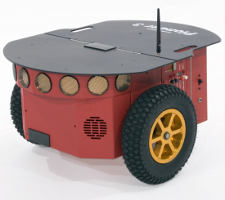
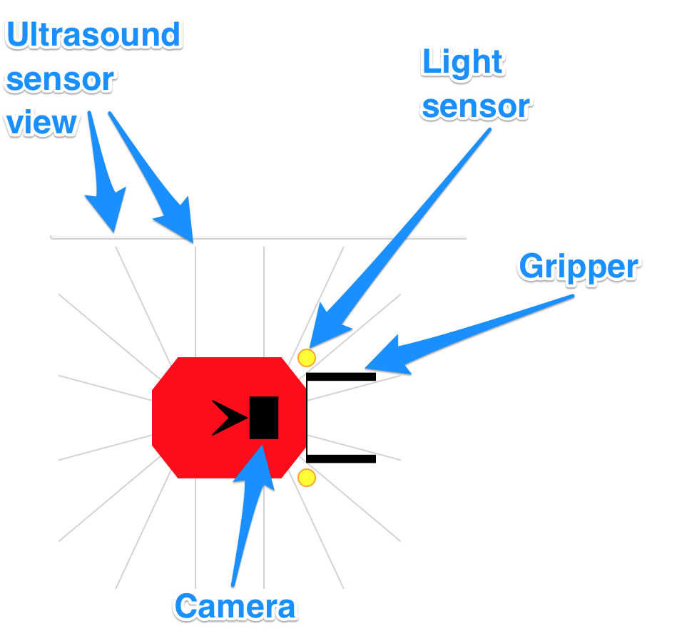

### The Jyro Simulator

The `Jyro` simulated robot will be the focus of many of the programming activities. `Jyro` is based on a Pioneer 3-DX differential drive robot.

The `Jyro` simulator offers a two dimensional (2D) plan view of the environment, viewed from directly above, and a three dimensional(3D) robot's eye view.

A series of buttons along the bottom of the simulator can be used to start, pause and stop the execution of the robot's control program, as well as resetting the environment back to its initial state.

In the 2D plan view, the orientation of the red simulated robot is denoted by a black arrow that points towards the front of the robot.

The robot has two wheels, one each side, although these are not shown.

The robot can also be configured with a range of sensors, as well as a gripper. These are visually represented on the 2D robot graphic when they are added to the robot.

The forward facing light sensors, which have a configurable maximum range are indicated by the two yellow dots at the front of the robot, one on either side.

The grey lines indicate the "visible" range of the sixteen ultrasound sensors which are arranged around the robot.

The black rectangle on the top of the robot represents the forward facing camera, which provides the 3D view.

The presence of the gripper is indicated by the black attachment at the fron of the robot.

Various three dimensional objects can be placed in the simulated world, including a boundary wall around the edge of the simulated world, variously sized and coloured boxes, and differently coloured light sources.

__TO DO: screenshot of different worlds with different objects? If so, keep a note in the metadata at least of the config used to define each environment.__

__TO DO: contextualise the robot with a photo and descrioption of a small hobby style robot.__

<s>A photograph of a small robot buggy built with a LEGO Mindstorms kit. This robot has two prominent wheels, one each side of the robot. These are driven from motors through a couple of gears. The body of the robot consists largely of the yellow LEGO RCX robot control ‘brick’ which is 8 x 14 Lego studs and several bricks high. Wires emerge from the RCX brick and connect to the motors and to a sensor. The sensor is a light sensor, which takes the form of a 4 x 2 blue brick that has been mounted pointing down to the ground at the front of the robot. The robot has been placed on a sheet of white paper on which is marked a rectangle drawn with 2 cm wide black lines. There are no touch sensors on this particular robot.</s>

Programming robots is very stimulating, sometimes frustrating and usually very rewarding. Although the RoboLab exercises all have a serious purpose, we hope you will find them enjoyable and fun.
