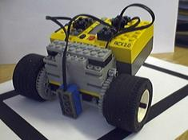
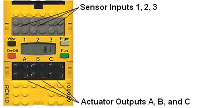
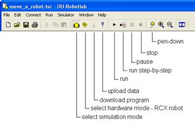
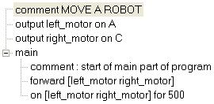

# 2 The RoboLab simulated on-screen robot (Jyro)


Welcome to `Jyro`, the RoboLab simulated on-screen robot.

<!-- #region -->
__This cell is s copy of content in Section_00_01.__
__Do we want repetition, albeit perhaps phrased differently, or reordder content somehow.__


### The Jyro Simulator

The `Jyro` simulated robot will be the focus of many of the programming activities. `Jyro` is based on a Pioneer 3-DX differential drive robot.


The `Jyro` simulator offers a two dimensional (2D) plan view of the environment, viewed from directly above, and a three dimensional(3D) robot's eye view.


A series of buttons along the bottom of the simulator can be used to start, pause and stop the execution of the robot's control program, as well as resetting the environment back to its initial state.

In the 2D plan view, the orientation of the red simulated robot is denoted by a black arrow that points towards the front of the robot.


The robot has two wheels, one each side, although these are not shown.

The robot can also be configured with a range of sensors, as well as a gripper. These are visually represented on the 2D robot graphic when they are added to the robot.


The forward facing light sensors, which have a configurable maximum range are indicated by the two yellow dots at the front of the robot, one on either side.

The grey lines indicate the "visible" range of the sixteen ultrasound sensors which are arranged around the robot.

The black rectangle on the top of the robot represents the forward facing camera, which provides the 3D view.

The presence of the gripper is indicated by the black attachment at the fron of the robot.

Various three dimensional objects can be placed in the simulated world, including a boundary wall around the edge of the simulated world, variously sized and coloured boxes, and differently coloured light sources.

__TO DO: screenshot of different worlds with different objects? If so, keep a note in the metadata at least of the config used to define each environment.__

__TO DO: contextualise the robot with a photo and descrioption of a small hobby style robot.__
<!-- #endregion -->

?? something about the actual pioneer robot ??





Figure 2.2 A LEGO Mindstorms robot buggy


Simon simulates simple robots such as ones that can be built with LEGO Mindstorms (Figure 2.2). In fact, RobotLab was originally designed to work with LEGO Mindstorms RCX robots. Robots as simple as this are very useful for getting hands-on experience with robotics, but naturally they have some limitations compared with more sophisticated (and complex) robot systems. Some of the features of RobotLab and Simon will make more sense if you know a little bit about a simple robot system such as the LEGO Mindstorms RCX kit.<div xmlns:str="http://exslt.org/strings" style="background:lightblue"><p>Note: LEGO’s more recent Mindstorms NXT kits differ from the RCX version described here</p></div>

The robot in Figure 2.2 is built around the LEGO Mindstorms RCX ‘brick’ which is shown in more detail in Figure 2.3. Inside the RCX brick there is a microprocessor and other circuitry. Think of it as a small computer. Built into the brick are three ‘sensor input ports’ labelled 1, 2 and 3, and three ‘actuator output ports’ labelled A, B and C, which are capable of powering motors. 





Figure 2.3 The RCX controller ‘brick’


The RCX controller ‘brick’, seen from above. This is a large piece of yellow Lego, about 8 x 14 studs in size. At the centre is a control panel with a small LCD screen surrounded by four buttons: these are labelled On-Off, Run, Prgm (Program) and View. Above the control panel are three sensor input ports, labelled 1, 2, 3. These take the form of 2 × 2 studs which are partly metallic. Below the control panel are three actuator output ports, labelled A, B, C. These also are 2 × 2 studs which are partly metallic. 

 The *ports* are interfaces to the external world. Sensors can be attached to the input ports, allowing information about the environment to enter the computer. Motors and other actuators can be attached to the output ports, and the brick can switch them on and off and control their direction and power. 

RobotLab assumes that the simulated robot works like an RCX brick. This means that RobotLab needs to know what kinds of sensors and actuators are being used, and how the (simulated) RCX is ‘configured’. You will see how this is done later.

Although I have described the simulated robot in terms of a simple Lego robot, similar considerations would apply to other robotics systems. The control subsystem of any robot is usually flexible and designed to be configured with a variety of sensors and actuators. 


## 2.1 Activity: Running a program


Open the program `Move_a_robot` by using the menu option `File &gt; Open...`,<div xmlns:str="http://exslt.org/strings" style="background:lightblue"><p>Keyboard: Ctrl+O</p></div> navigating to the folder `week-1`, selecting `Move_a_robot` and clicking `Open`.

Run the program using the `Run &gt; Run` menu item;<div xmlns:str="http://exslt.org/strings" style="background:lightblue"><p>Keyboard: F5</p></div> alternatively click on the Run    button in the toolbar (Figure 2.4). Observe what happens to the robot in the `Simulator` window.

You should see the robot move forwards, up the screen. Keep this program open as you will need to refer to it in the next section.

```python
from jyro.simulator import Pioneer, VSimulator
import math
```

```python
txt = 'hello'
Javascript(f'speechSynthesis.speak(new SpeechSynthesisUtterance("{txt}"))')
```

```python
from IPython.display import display, Javascript

class Speak:
    """Simple speaking class."""
    def __init__(self):
        """Initialise speaking class."""
        self.tosay = None
    
    def _sayaloud(self):
        """Text to speech and display text."""
        print('..',self.tosay)
        if self.tosay:
            display(Javascript(f'speechSynthesis.speak(new SpeechSynthesisUtterance("{self.tosay.pop(0)}"))'))
    
    def _clear():
        """Get ready to speak again."""
        speak.tosay = None
            
    def speak(self, tosay=''):
        """Say something."""
        print('ss',tosay)
        if tosay:
            if self.tosay is None:
                print('wtf')
                self.tosay = [tosay]
        self._sayaloud()
```

```python
ss= Speak()
```

```python
ss.speak('test')
```

```python
speak._clear()
speak('test')
speak._clear()
```

```python
robot_name = "Pioneer"
robot = Pioneer(robot_name, 5, 5, 0)

robot.speak = speak

def world(sim):
    # Bounding box around the simulated world
    sim.addBox(0, 0, 10, 10, fill="backgroundgreen", wallcolor="lightgrey")

```

```python
def move(robot):
    robot.move(1.0, 0.0)
    robot.speak('test')
    robot.say('hello')
    #robot.move(0.0, 0.0)

robot.brain = move
```

```python
VSimulator(robot, world);
```

```python
?need an async to drive forward for a time?
```

```python
robot_name = "Pioneer"

#Co-ords in meters
x_orig = 2.5
y_orig = 4.5

#Angle in radians
theta_orig = math.pi * 3/2

robot = Pioneer(robot_name, x_orig, y_orig, theta_orig)
robot.say('hello')
robot
```

```python
VSimulator?
```

```python
robot.say("hello")
```

```python
robot.move()
```

```python
def avoidObstacle(robot):
    """ Turn right if there's an obstacle close ahead, else go straight. """
    
    sonars = robot["sonar"].getData()
    front = min(sonars[1:7])
    if front < 0.5:           # check for an obstacle
        robot.move(0.0, -1.0) # stop and turn right
    else:
        robot.move(1.0, 0)    # otherwise go straight
        
robot.brain = avoidObstacle
```




Figure 2.4 The RobotLab simulator toolbar buttons


The RobotLab toolbar with the simulator buttons labelled. From left to right these are: 

 Select simulation mode 

 Select hardware mode – RCX robot 

 Download program 

 Upload data 

 Run 

 Run step-by-step 

 Pause 

 Stop 

Show trail
<div xmlns:str="http://exslt.org/strings" style="background:lightgreen">
<!--Heading: 
            Simulation mode-->
When you first start RobotLab, it will be in ‘simulation mode’. However, RobotLab also has a ‘hardware mode’ that can be used with LEGO Mindstorms RCX kits; we will not use RobotLab in this way in this module and the hardware features are disabled.
</div>
---


### Show trail mode

It is possible to operate the simulated robot in ‘show trail’ or ‘pen-down’ mode. This enables you to see the path the robot follows.

Choose the `Simulator &gt; Show trail` menu item<div xmlns:str="http://exslt.org/strings" style="background:lightblue"><p>Keyboard: Alt, S, T</p></div> or click on the Show trail    button in the toolbar. Run the program again to see the robot’s trail.

---


## 2.2 The Program window


So far we have taken a very quick look at the `Program editor` and `Simulator` windows. In Robot Lab Session 2 there will be a much more detailed discussion of computer programs and the principles behind how they work, and the contents of these windows will become clearer. For now let’s look again at the `Program` window as it relates to the `Move_a_robot` program, to see the essential elements of the program and why the robot behaves as it does.

If you don’t already have the `Move_a_robot` program open, reopen it now.

The `Move_a_robot` program is displayed in the `Program` window as follows:





Figure 2.5 Listing: `Move_a_robot`


comment MOVE A ROBOT

output left_motor on A

output right_motor on C

main

      comment : start of main part of program

      forward [left_motor right_motor]

      on [left_motor right_motor] for 500

The program is very simple. The statement `comment` tells the simulator to ignore the rest of the line, and is a way of putting non-program text into programs to make them more readable. The first comment just gives a title describing the program. 

 The following lines give meaningful names to the devices attached to the output ports. The simulated robot has a motor driving a wheel on the left of the robot and this motor is connected to output A. The statement `output left_motor on A` declares a meaningful name `left_motor` that we can use in our program without having to remember which motor is controlled by which output port. The similar statement `output right_motor on C` declares the name `right_motor` for use in our program.

The names `left_motor` and `right_motor` are examples of names (or *identifiers*) used in RobotLab; you will encounter names used for other purposes later. As far as RobotLab is concerned, names (identifiers) can be any combination of letters, numbers and the underscore character ‘_’, as long as they start with a letter. Humans usually give identifiers meaningful names like `left_motor` and `right_motor` so that it’s clear what they refer to. Behind the scenes, RobotLab makes all the necessary associations, so you don’t need to worry about them. 

 Note that you can use the underscore character to make things clearer, but you must not use spaces or other punctuation. For example, `left_motor` can be recognised by RobotLab as a single name, but `left motor` would be treated as two names and result in an error. You are free to make up names as you wish as long as they meet these simple rules. However, some names are already reserved for use as program commands (listed in the Command list) and you must also avoid these names. 

The commands discussed above are said to *initialise* the program, before it runs. In particular they *configure* the output ports so that they can deliver power to the motors.

 The main part of the program is called, appropriately, `main`. In `Move_a_robot` this consists of `forward [left_motor right_motor]` and `on [left_motor right_motor] for 500`. 

 The robot control system needs to know which way the wheels should turn. The `forward` command tells it that both the `left_motor` and the `right_motor` are to be set in a forwards direction. 

Setting the motor directions is different from applying power to them. The `on for` command applies power to the `left_motor` and `right_motor` for 500 time intervals of 1/100 of a second, or five seconds, while the robot moves. After five seconds the power is switched off and the robot stops. 

 To see all of this working, run the program again. Choose the `Run &gt; Run` menu item<div xmlns:str="http://exslt.org/strings" style="background:lightblue"><p>Keyboard: F5</p></div> or click on the run    button in the toolbar. 

