---
jupyter:
  jupytext:
    formats: ipynb,md
    text_representation:
      extension: .md
      format_name: markdown
      format_version: '1.2'
      jupytext_version: 1.6.0
  kernelspec:
    display_name: Python 3
    language: python
    name: python3
---

<!-- #region slideshow={"slide_type": "slide"} -->
# Introducing RoboLab: an integrated robot simulator and Jupyter notebook environment for teaching and learning basic robot programming

__Tony Hirst__

*Computing and Communications*

__Demo: https://github.com/ouseful-demos/tm129-lite__

https://github.com/innovationOUtside
<!-- #endregion -->

<!-- #region slideshow={"slide_type": "notes"} -->
*A presentation given to the OU OpenTEL workshop, November 10th, 2020.*
<!-- #endregion -->

<!-- #region slideshow={"slide_type": "slide"} -->
# TM129 Technologies in practice Robotics Block: RobotLab (2001(?)-2020B)

Originally developer for T184, which became the TM129 Robotics block.

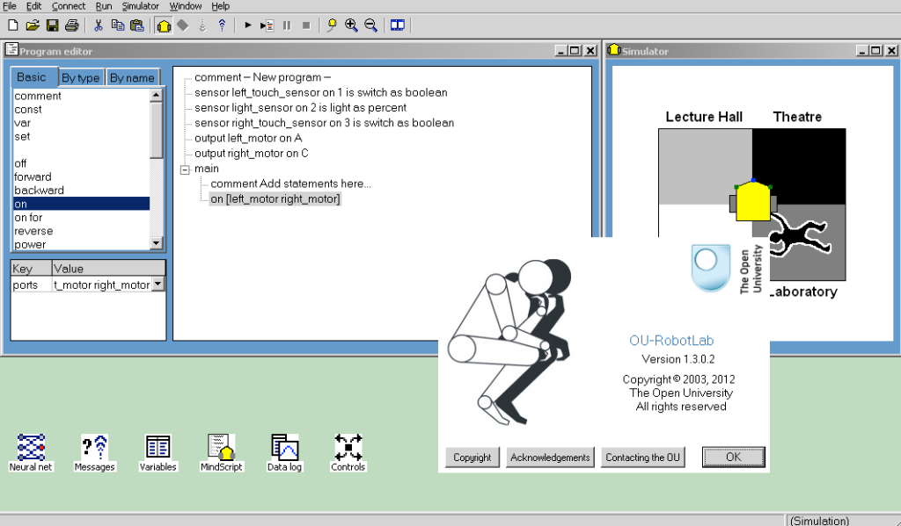
<!-- #endregion -->

<!-- #region slideshow={"slide_type": "notes"} -->
In the beginning was *T184 Robotics and the Meaning of Life*, which continues to this day in the form of the TM129 Robotics block.

The robotics activities were based around an OU developed Windows application, *RobotLab*. *RobotLab* included a drag and drop style text based programming environment and a simple 2D simulator. Programs could also be downloaded to and run on a *Lego Mindstorms RCX* brick.
<!-- #endregion -->

<!-- #region slideshow={"slide_type": "slide"} -->
# TM129 2020J Refresh — Requirements

- replace RobotLab
- retain original narrative and activity coverage    
- move to a Python style text based programming language
- work on OU minimum specification computers
- (deliver software through a browser)
- (use Jupyter notebooks)
- as with the original T184 design, the activities should be *fun*

<!-- #endregion -->

<!-- #region slideshow={"slide_type": "notes"} -->
Although developed as a Windows application, *RobotLab* can be run on a cross-platform basis using tools such as *Wine* or *PlayOnMac*. But as a nearly 20 year old application, keeping it running and fully functional is a challenge. There is also no real scope for adding new features, or integrating the application into new environments.

Limited time and resource was available for the refresh. The practical activities represent about 50% of the workload of a 10 CAT point block that runs over 8 study weeks. To simplify matters, an early design decision was to try to reimplement the original activities and narrative using a new simulator. *Development started in April 2020, originally for intended first student use in October 2020 (20J). Risk mitigation resulted in moving the Robotics block from block 1 (20J start) to block 2 (2020L start) with a final handover in early 20K.*

The Python programming language is widely used as a general purpose programming language in many disciplines. In the OU, Python is used in presentation in at least TM351, TM112, S818, SXPS288; M269 (under revision); TM358 and MST374 (in production).

The software is required to run on typical student machines, which we take to mean: cross-platform, low spec, possibly quite dated.

Delivering software via a browser interface provides a level of abstraction that allows us to deliver software from a server that could exist anywhere, either on the student's own computer, on a server on their local network, or via a remote server, such as an OU hosted server or a self-service commercially hosted server launched by the student. Browsers are increasingly powerful in terms of the programs that can run natively in the the browser using Javascript, WebGL and WebAssembly, and this raises the possibility of running computational environments purely within the browser without any server requirement.

Jupyter notebooks provide a useful medium for distributing instructional materials that incorporate practical code based activities. They can blend instructional text with provided or student created code, connect to an execution environment that can execute the student code, and capture the outputs of code execution. Students can also add their own content to notebooks as well as creating their own notebooks. The aforementioned Python using courses all make use of Jupyter notebooks. In addition, M346 and M248, both in revision/production, are looking to use Jupyter notebooks with R rather than Python code execution support.

The final consideration was that the activities should continue to be *fun*, engaging and playful, and the tone of the materials should reflect that, whilst at the same time being ambitious in expectations regarding the ability of students new to programming to engage with code mediated activities. *Joy, Fun, Robotics* was the original working title of T184 and play was seen as a guiding principle in the design of the that course.
<!-- #endregion -->

<!-- #region slideshow={"slide_type": "slide"} -->
# Instructional material

> In the small community of researchers who in 1980 were beginning to think about the use of computers in K-12 education, most focused on “computer-aided instruction,” in which computers played the role of a traditional teacher: delivering information and instruction to students, conducting quizzes to measure what the students had learned, then adapting subsequent instruction based on student responses.
>
*Mitchel Resnick, Foreword to the new edition of Seymour Papert’s book Mindstorms*
<!-- #endregion -->

<!-- #region slideshow={"slide_type": "notes"} -->
The original practical activity instructional material was presented via the VLE, guiding activities to be completed using the desktop application.

Certain activities contributed to the portfolio assessment portion of the module. Students provided screenshots of their RobotLab environment along with separate written reflection about certain robotics activities.

Some activities were designed as open ended and mildly competitive *challenges*, in which a goal was set with some metric and students could then develop their own solutions against that metric. (For example, getting the robot to use and edge following strategy to complete a circuit of a closed loop track as quickly as possible.)
<!-- #endregion -->

<!-- #region slideshow={"slide_type": "slide"} -->
# Engaged and (inter)active

> In Mindstorms, Seymour [Papert] offered a radically different vision. For Seymour, computers were not a replacement for the teacher but a new medium that children could use for making things and expressing themselves. In one of many memorable turns-of-phrase in Mindstorms, Seymour rejected the computer-aided instruction approach in which “the computer is being used to program the child” and argued for an alternative approach in which “the child programs the computer.”
>

*Mitchel Resnick, Foreword to the new edition of Seymour Papert’s book Mindstorms*
<!-- #endregion -->

<!-- #region slideshow={"slide_type": "notes"} -->
One of my guiding philosophies in the development of educational materials is that we should try to find ways of engaging and developing students' personal and natural curiosity.

We should help them surface their own questions, observations and realisations as they work through a topic with our guidance, encouragement and supported open learning style of support.

We should encourage students to take ownership of their own learning, and of the materials we provide them with. The materials are *theirs*, NOT *ours*, and should be designed with that in mind.
<!-- #endregion -->

<!-- #region slideshow={"slide_type": "slide"} -->
# TM129 Original Robot Activities

- 2D simulator (code could also run on Lego Mindstorms RCX brick)
- range of sensor types (touch, light) and output tones and pre-recorded speech messages
- integrated charting tools for sensor data analysis
- neural network (multilayer perceptron) training and testing
- "multi-agent" activity with co-operating robot and MLP
<!-- #endregion -->

<!-- #region slideshow={"slide_type": "notes"} -->
The original robot activities were based around programming the simulated 2D robot within the *RobotLab* desktop application. The same program could also be downloaded and run on a Lego Mindstorms RCX brick. Activities were originally designed so that they could be run either in the simulator on a real robot provided by the students themselves.

The original simulator implemented touch and reflected light sensors and variety of activities were developed that exploited those sensors. Robots could also be controlled by turning motors on for a desired time (which had the side effect of being a *blocking action*). The robot could also generate various tones and generate spoken messages from pre-recorded audio files.

Data could be logged and displayed using an integrated charting tool, or exported as CSV data.

A separate neural network application implemented a simple multilayer perceptron that could run trained networks or be used to train new networks, for example using data collected by the simulated robot.

A multi-agent activity allowed the robot to pass collected data to the trained network, which would classify the data and return the classification result to the robot.
<!-- #endregion -->

<!-- #region slideshow={"slide_type": "slide"} -->
# Review of available simulators

`ev3devsim`: simple web based (Javascript) 2D simulator

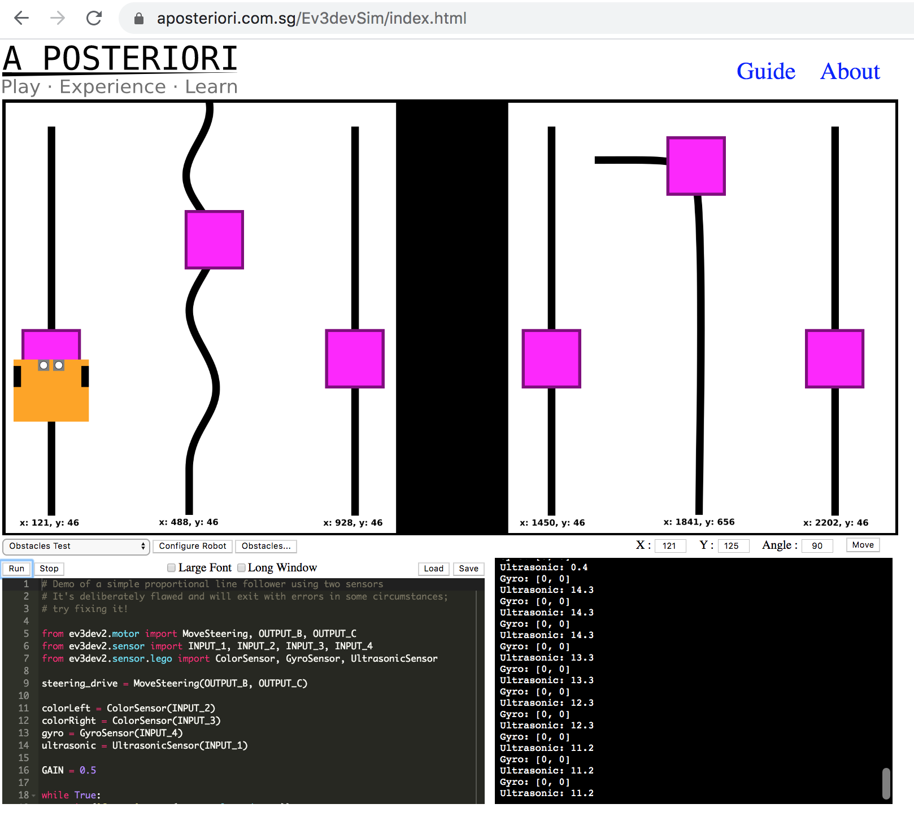

https://github.com/ouseful-demos/simple-robot-simulator-review
<!-- #endregion -->

<!-- #region slideshow={"slide_type": "notes"} -->
As preparatory activity, in part funded by the Institute of Coding, a [review](https://github.com/ouseful-demos/simple-robot-simulator-review) of several candidate robot simulators was completed.

In many cases, the reviewed simulators were not appropriate on grounds of complexity or resource requirements (for example, large processor memory requirements and/or GPUs). One simulator in particular, VREP, had been [explored in some depth](https://github.com/psychemedia/ou-robotics-vrep) as a candidate replacement for RobotLab, but was discounted on grounds of complexity and lack of ease of use. (VREP has since be discontinued and replaced by [`coppeliaSim`](https://www.coppeliarobotics.com/coppeliaSim).) The [`Webots`](https://www.cyberbotics.com/) simulator also looked instresting but placed too many resource requirements on users if it was to run effectively.

A recent addition to the range of available simulators at the time of the review was the browser based [`ev3devsim`](https://www.aposteriori.com.sg/Ev3devSim/index.html) simulator [[code repository](https://github.com/QuirkyCort/ev3dev-sim)]. This implemented a simple 2D simulator supporting light, ultrasound and gyroscope sensors, as well as motor/wheel odometry. The simulated robot is programmed using the Python [`ev3dev`](https://ev3dev-lang.readthedocs.io/projects/python-ev3dev/en/stable/) bindings, which means the programs can be downloaded to, and run on, a Lego Mindstorms EV3 brick running the [`ev3dev`](https://www.ev3dev.org/) operating system.

The EV3 brick is currently used in an OU residential school activity, albeit programmed using the Lego Mindstorms software environment. (The residential school previously used RobotLab to program Lego Mindstorms RCX brick powered robots.) [Previous exploratory activity](https://github.com/psychemedia/ev3robotics) into using `ev3dev-py` to program the Lego EV3 brick in a residential school activity had been undertaken.

It is worth noting that the same developer has more recently released a 3D browser based *Generic Educational Autonomous Robotics Simulator* [`Gears`](https://gears.aposteriori.com.sg/) [[code repository](https://github.com/QuirkyCort/gears)], although this appeared to late for consideration for the TM129 rewrite.
<!-- #endregion -->

<!-- #region slideshow={"slide_type": "slide"} -->
# TM129 Jupyter notebook adoption

- notebooks provide instructional material
- simulator "embedded" in notebook somehow
- code "downloaded" from notebook to simulated robot
- data "uploaded" from simulated robot to notebook
- data analysed in notebook
- notebooks provide support reflective portfolio 
<!-- #endregion -->

<!-- #region slideshow={"slide_type": "notes"} -->
Over the last few years, we have been using a rolling rewrite model to iterate on how we are using Jupyter notebooks to support teaching and learning in TM351. TM129 represented an opportunity for a clean start based in what we have learned from TM351, as well as an opportunity to develop new tools and extensions that could be integrated with the teaching materials.

*The extent to which notebooks provided to students should __only__ work in OU provided extended notebook environments, __best__ work in OU provided extended notebook environments, or work in all Jupyter notebook environments is an open question. My feeling is that they should __best__ work in provided, customised environments (added value...) and __degrade gracefully__ to work in vanilla environments.*

In the TM351 model, instructional material is provided in a linear narrative: text blocks introduce code blocks, code is executed and code outputs appear immediately below the exectured code cell, and the following text block picks up on what we antcipated the student would see as code output.

The first major point of difference with the TM351 model is that the instructional material provided for the TM129 Robotics activities essentially guides the use of a graphical application: so how do we frame that?

The selected simulator, `ev3devsim`, runs in Javascript in the browser, whereas notebook code cell code executes inside a language environment managed by the Jupyter notebook server. But:

- if we are to use code cells for writing code that runs in the simulator, how do we manage the "download" of code from the notebook code environment to the simulator's Javascript environment?
- if the robot in the simulator captures logged data traces that we want to analyse in the notebooks code environment, how do we get the data out of the simulator into that environment?

Finally, one of the things we have underexplored in Jupyter notebooks in TM351 to date is how we can get students to use the notebook to capture their own thoughts and thinking. Notebooks are used in assessment, with students adding answers in provided notebooks in early TMAs, and creating their own notebooks for later TMAs and their final, project based end-of-course assessment. But we don't necessarily encourage students to annotate notebooks with learning diary style observations of reflections, nor have we really explored how they might effectively do that. In short, we haven't explored how students might use notebooks *as a notebook*.
<!-- #endregion -->

<!-- #region slideshow={"slide_type": "slide"} -->
# A new medium for learning and reflecting

Jupyter notebooks are an example of the read-write web, which is how the web was always meant to be...

They are, as yet, underexplored as a teaching and learning medium.
<!-- #endregion -->

<!-- #region slideshow={"slide_type": "notes"} -->
The TM129 Robotics block rewrite provides an opportunity for exploring how we might use notebooks in an OU teaching and learning context in a relatively low risk way:

- the block is one of three in a 20 point level 1 module;
- the block content is not a depended upon requirement of any pathway;
- the content is assessed by a single TMA and the final EMA, but practical components represent less than half the assessment marks;
- the module presents twice a year (J and B), and as such revisions are possible twice a year;
- the students are not necessarily encumbered with a "how it's done in every other OU course" way of thinking (although this does arguably also add to risk by offering an atypical way of teaching and learning compared to other modules).

The subject matter is similar in kind to certain topics covered in TM112, M269, TM351 and TM358, two of which are currently in production, and as such provides an opportunity to test certain extensions or ways of introducing particular topics that may inform other module teams.

A portfolio approach is used in partial assessment of the module, and as such exploring ways of creating portfolio contributions within the notebook context is in keeping with the way the module currently operates rather than adding "reflection" and "portfolio" elements as some sort of extra activity that is completely out-of-keeping with the rest of the module.
<!-- #endregion -->

<!-- #region slideshow={"slide_type": "slide"} -->
# A Jupyter notebook environment

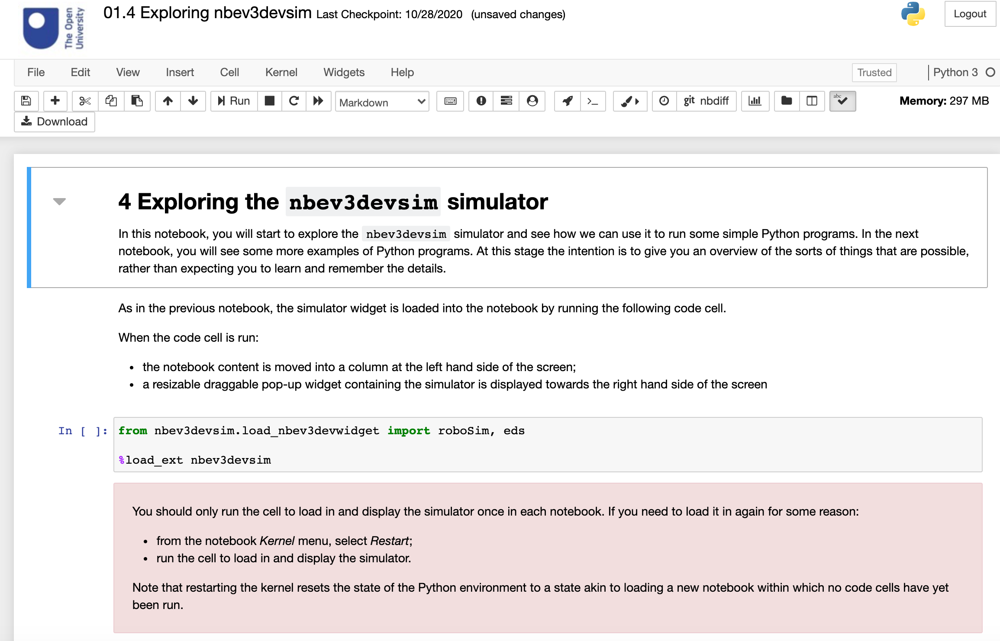
<!-- #endregion -->

<!-- #region slideshow={"slide_type": "notes"} -->
The notebook environment is an OU branded Jupyter notebook server running several pre-installed and pre-enabled notebook extensions and notebook server extensions.

Several extensions enhance the layout of the notebook, for example by colouring cells tagged in a particular way. The styling degrades gracefully: in an environment without the required extensions, the cells are just rendered with the default notebook styling.

The robot simulator is currently loaded by running a particular code cell. When time allows, other ways of loading the environment, for example, by raising it from a notebook toolbar button, will be explored.
<!-- #endregion -->

<!-- #region slideshow={"slide_type": "slide"} -->
# `nbev3devsim`

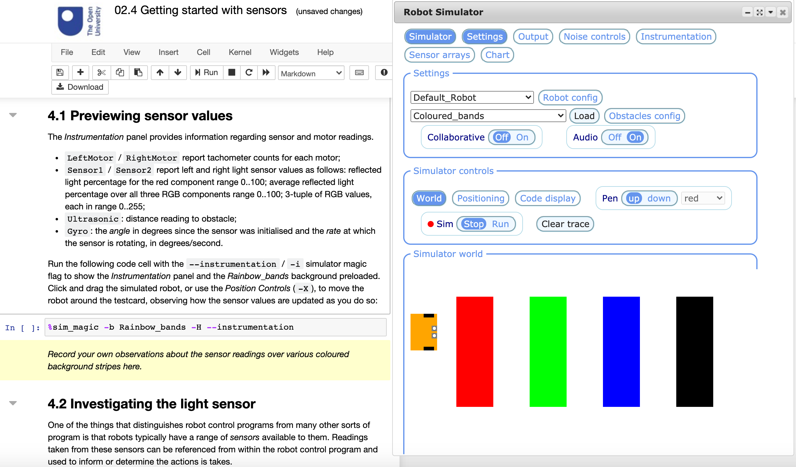
<!-- #endregion -->

<!-- #region slideshow={"slide_type": "notes"} -->
The robot simulator itself represents a forked and expanded version of the original `ev3devsim` simulator, distributed as the [`nbev3devsim` Python package](https://github.com/innovationOUtside/nbev3devsim) which runs within a classic Jupyter notebook environment. *At the moment, `nbev3devsim` does not run inside a JupyterLab environment.*

The simulator is rendered in a resizeable, draggable JQuery `Dialog` widget with widget display controls.

The heart of the simulator retains the original `ev3devsim` code but it has been added to in several ways:

- modifications have been added to provide additional sensor modes;
- sensor and motor noise tools have been added;
- a live chart to plot logged data is now available;
- the user interface has been completely reimagined;
- the Javascript package has been wrapped as an `ipywidget` using [`jp_proxy_widget`](https://github.com/AaronWatters/jp_proxy_widget) which allows bidirectional state transfer between the simulator Javascript code and the notebook Python environment.

At the moment, the simulator will not run outside the notebook environment in a standalone HTML page. However, decoupling the simulator code back out into a standalone HTML page mode is planned.

Integration with the Jupyter notebooks is further supported through the use of IPython magics, which can be used to configure the simulator and its display, run code in the simulator, and retrieve data from the simulator.
<!-- #endregion -->

<!-- #region slideshow={"slide_type": "slide"} -->
# RoboLab: notebook + `nbev3devsim`

> By referring to the notebook + simulator widget environment as *RoboLab*, the implication is that we are thinking of it as a *laboratory*. ...
>
>The notebook itself represents a laboratory notebook, and you are intended to treat it as such, keeping a personal record of your work and using it to record your own comments, observations and reflections, as well as experimental method, code and results.

*__Source: TM129 module materials__*
<!-- #endregion -->

<!-- #region slideshow={"slide_type": "notes"} -->
The notebook and the simulator together are taken to define an integrated experimental laboratory.

The simulator itself provides a range of controls which can be accessed either via the simulator graphical user interface or via the notebook magics.

The controls support the ability to:

- load a background into the simulator world;
- configure the robot;
- configure obstacles in the simulator world;
- pen up / pen down for tracing the path followed by the robot;
- clear trace (that is, clear pen trace);
- display and hide the live data chart, as well as select chart display traces (colour, left light, right light, ultrasonic, gyro, left wheel, right wheel);
- set light sensor and motor/wheel noise values;
- set the *X* and *Y* co-ordinates and the *Angle* or orientation of robot; the *X* and *Y* values are updated when the robot is dragged across the canvas; the *Reset* button resets the robot’s location and orientation to the default for that background (if set).

For an overview of the `nbev3devsim` simulator, work through the notebook `content/99. Technical Appendices/99.2 nbev3devsim user interface.ipynb` in the [demo environment](https://github.com/ouseful-demos/tm129-lite
).

The controls offer a wide range of options for setting up different laboratory configurations that support a wide range of experiments we might want to run or settings within which we want the robot to perform particular tasks or complete particular challenges.
<!-- #endregion -->

<!-- #region slideshow={"slide_type": "slide"} -->
# Accessible or inclusive?

- keyboard shortcuts when mouse over simulator
- audio support
  - download ping
  - program error buzz
  - `say()` command
<!-- #endregion -->

<!-- #region slideshow={"slide_type": "notes"} -->
In it's current form, there are are likely to be several accessibility related issues with *RoboLab*. The `nbev3devsim` simulator does not currently support tab based navigation, nor is it clear how this might be most effectively managed.

If the mouse cursor is over the simulator widget, various keyboard shortcuts exist to activate the simulator controls. For unsighted users, an issue remains as to how to enable those keyboard shortcuts if they can't see how to mouse over the widget. (Ideally, the user should be able to tab between notebook cells and the simulator widget; when the simulator widget has the focus, simulator keyboard controls should be in focus. Simulator and notebook keyboard shortcuts collide.)

One of the advantages of developing in a Javascript environment is that audio controls are available. Audible feedback is therefore supported for several actions, such as indicating successful download of code from the notebook to the simulator, or an audible warning if a program running in the simulator raises an error. A `say()` command also allows the user to program arbitrary spoken messages into a simulator program. At the current time, the audible messages only work in the Chrome browser. (Indeed, `nbev3devsim` will not even load properly in the Firefox browser. Widening browser support is on the current "nice to have" list of things to do.)

One thing that became clear during the development of RoboLab, which is to say, the `nbev3devsim` Javascript widget *and* its integration within the Jupyter notebook user interface, as well as the IPython magics, was that *inclusive design decisions* taken early could improve user experience for *all users* and implicitly address concerns that might otherwise be raised later as accessibility issues without them ever having to be raised as accessibility issues.
<!-- #endregion -->

<!-- #region slideshow={"slide_type": "slide"} -->
# Defining simulator setups

`%sim_magic -b Rainbow_bands -H --instrumentation`

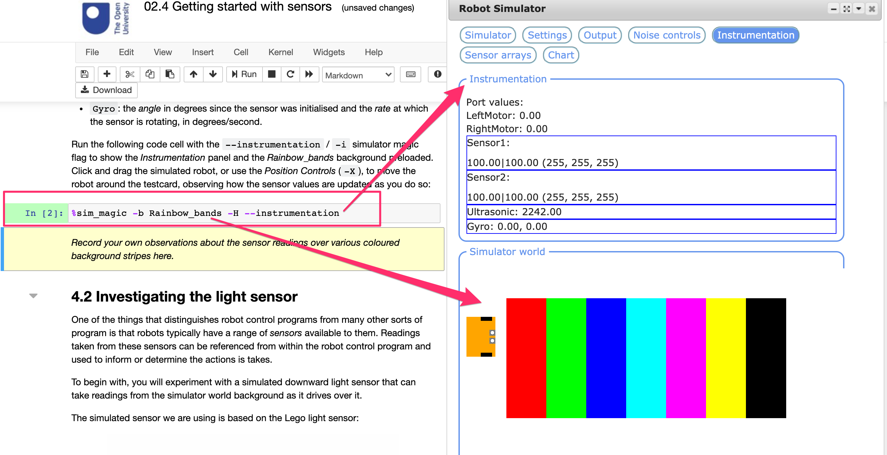

<!-- #endregion -->

<!-- #region slideshow={"slide_type": "notes"} -->
The `nbev3devsim` simulator user interface incorporates a wide range of controls, grouped within individual panels. Managing screen real estate can be problematic with so many controls, as can managing the display of the notebook content and the simulator itself.

To try to make effective use of the screen real estate, the notebook content is rendered to a resizeable, left-aligned column and the simulator is displayed in a resizable, draggable JQuery dialog widget. Widget controls also allow the widget to be collapsed, expanded, and resized to fit the current browser window.

*In a JupyterLab environment, we would be able to manage the display differently, for example presenting the notebook content in one panel and the simulator in another. At the current time, `nbev3devsim` does not work in JupyterLab.*

Panels are displayed and hidden by cliking "toggle display buttons" arranged along the top of the simulator widget. High contrast buttons clearly identify selected buttons. Some display panels themselves contain additional toggle display buttons. Closing a panel from which a second panel was displayed does not close the second panel.

Panel displays can also be toggled using keyboard shortcuts when the mouse cursor is over the simulator widget.

To further manage screen real estate, panels can be collapsed but still displayed by clicking on the panel name.

IPython magics can also play an important role in setting up a particular simulator configuration by providing a means for automating the set up of the simulator for any particular experiment or activity.

Within the notebook, you may notice that some markdown cells are colour highlighted with a yellow background. These are call to action cells that invite students to double on the cell to edit it and record their own observations. "Running" the cell renders the edited markdown code as HTML. The colour styling is applied using a preinstalled notebook extension that detects a particular metadata tag associated with the cell. In notebook environments without the appropriate extensions installed and enabled, no coloured background is applied. However, the cell is still distinguished from surrounding cells by the use of italics and the imperative language.
<!-- #endregion -->

<!-- #region slideshow={"slide_type": "slide"} -->
# `%sim_magic`  — line magic lab assistants

IPython line magics are predefined "macros" used like command line commands

- load a specified background
- hide / reveal different simulator display panels
- enable pen up / pen down mode
- situate the robot at a specific location
- automatically run a downloaded program
<!-- #endregion -->

<!-- #region slideshow={"slide_type": "notes"} -->
IPython magics — and yes, they really are called that — come in two flavours:

- *line magics* can be called inline and behave like command line commands; they can appear anywhere in a code cell, and can return values into Python expressions. Line magics can accept switches and refer to variables defined in the Python environment; 
- *block magics* modify the behaviour of a code cell. The block magic invocation must appear at the start of the cell and it then modifies how the rest of the cell content is processed. The block magic can be invoked with switches and variable state in the same way as a line magic.

In *RoboLab*, line magics can be used to automate the configuration of the `nbev3devsim` widget, displaying selected panels and setting particular simulator controls. The line magic can be used to select simulator world backgrounds, translate the simulated robot to a specific location, set the pen up/pen down mode, and automatically run a program previously loaded into the simulator.

In many respects, we might regard the line magic as a lab assistant that will set up a particular lab environment for us, or a little magic helper elf!

In terms of pedagogical design, the line magics allow us to manipulate the representation of the simulator and automate its behaviour. This means that we don't need to rely on the student setting up the environment manually ("make sure the chart panel is displayed and the motor traces selected; open the noise control panel and set the motor noise value to whatever..."). Rather, we can automate the setting of the simulator display using magic, optionally also describing how environment will be set up in markdown text. (We might also explore ways of parsing the magic command so that a text description or audible description of the configuration is generated from the magic command.)

Although the simulator runs *in the browser* and *in a browser Javascript environment*, the intention is that we should be able to "Run all cells" in a notebook and for this to automate the operation of the simulator, as well as executing code in the notebook Python environment.

*At the moment, the Javascript code execution is non-blocking, which means that we can download code to the simulator and then run it there from notebook code cell, and move on to execute the next code cell in the notebook before the program completes in the simulator. A call back or sentinel flag needs to be implemented such that the simulator code can block Python code execution until the simulator program has completed.*
<!-- #endregion -->

<!-- #region slideshow={"slide_type": "slide"} -->
# `%%sim_magic` block magics

`%%sim_magic_preloaded --background Grey_bands -OHR`

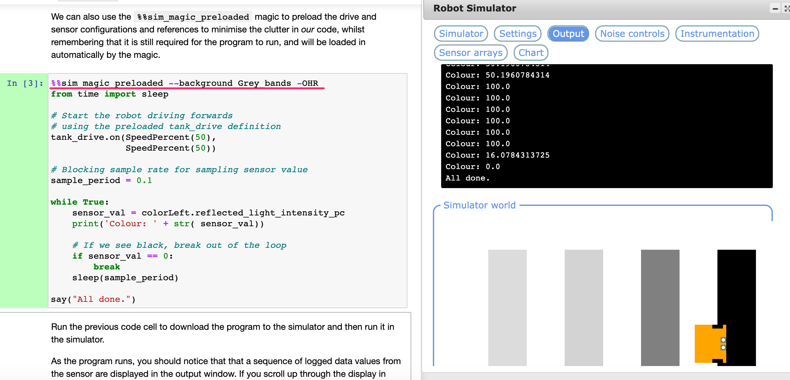

<!-- #endregion -->

<!-- #region slideshow={"slide_type": "notes"} -->
Several IPython block magics are defined within *RoboLab* that mediate the download of code from a notebook code cell to the simulator. These prepend the the code contained within the code cell with different amounts of boilerplate code *before* it is downloaded to the simulator.

For example, the `%%sim_magic_imports` block magic prepends required Python package imports and the `%%sim_magic_preloaded` block magic preloads the imports and some initialisation code.

The `--preview` switch can be applied to the two block magics run as line magics (prefixed by a single `%` sign) ro preview the code that will be prepended.

The use of such magics allows us to reduce the amount of boilerplate code that must be provided in downloaded code cells. This reduces clutter in the cell, allowing us to focus more on the commands of interest, and also reduces likely errors when learners write their own code.
<!-- #endregion -->

<!-- #region slideshow={"slide_type": "slide"} -->
# Viewing all the code...

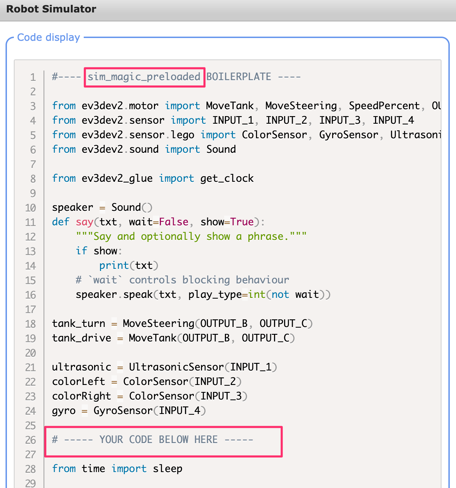

<!-- #endregion -->

<!-- #region slideshow={"slide_type": "notes"} -->
Within the simulator, an output display window (not shown) can be used as a display area for `print()` statements contained within programs downloaded to the simulator. The output display window also displays error messages if an error occurs when a downloaded program is run in the simulator, along with a standard Python error/exception message. (An audible alert also sounds when an error is raised.)

The Python error message typically includes an error trace containing the line numbers of offending lines, but these refer to the line number of the *complete* downloaded program, not the fragment that may exists in a notebook code cell using a magic that prepends additional code lines.

A *Code view* panel in the simulator can be used to review the code currently downloaded to the simulator, with appropriate syntax colour highlighting and line numbers. (The intention is to make this a fully blown editor that could be used to edit programs in a freestanding version of the simulated that can run as a standalone webpage outside of the notebook environment.)
<!-- #endregion -->

<!-- #region slideshow={"slide_type": "slide"} -->
# Simulator supported sensors

- light sensor (reflected light)
- gyroscope (direction)
- ultrasound (distance to obstacle)
- odometry (wheel rotations / distance travelled)
- (light sensor image array)
<!-- #endregion -->

<!-- #region slideshow={"slide_type": "notes"} -->
The original *RobotLab* simulator supported touch and light sensors. The original `ed3devsim` simulator supported a light sensor, ultrasonic sensor and gyroscope, along with motor/wheel odometry that monitors wheel rotations and these are carried forward into `ev3devsim`.

The way the ultrasound sensor is implemented (detecting the distance to objects in a particular simulator canvas layer) hints at a way we might also implement a touch sensor (e.g. as an ultrasound sensor detecting something in the same layer at a very close distance.)

However, at the current time, a touch sensor is *not* implemented in `nbev3devsim`, so some of the original activities were modified to provide equivalent alternatives. For example, rather than an original activity involving a bumper car set up in which the simulated robot would detect a bump collision with an object via the touch sensor, an equivalent activity might be the detection of an object by the ultrasound sensor within a certain distance.
<!-- #endregion -->

<!-- #region slideshow={"slide_type": "slide"} -->
# Light sensor array (with noise)

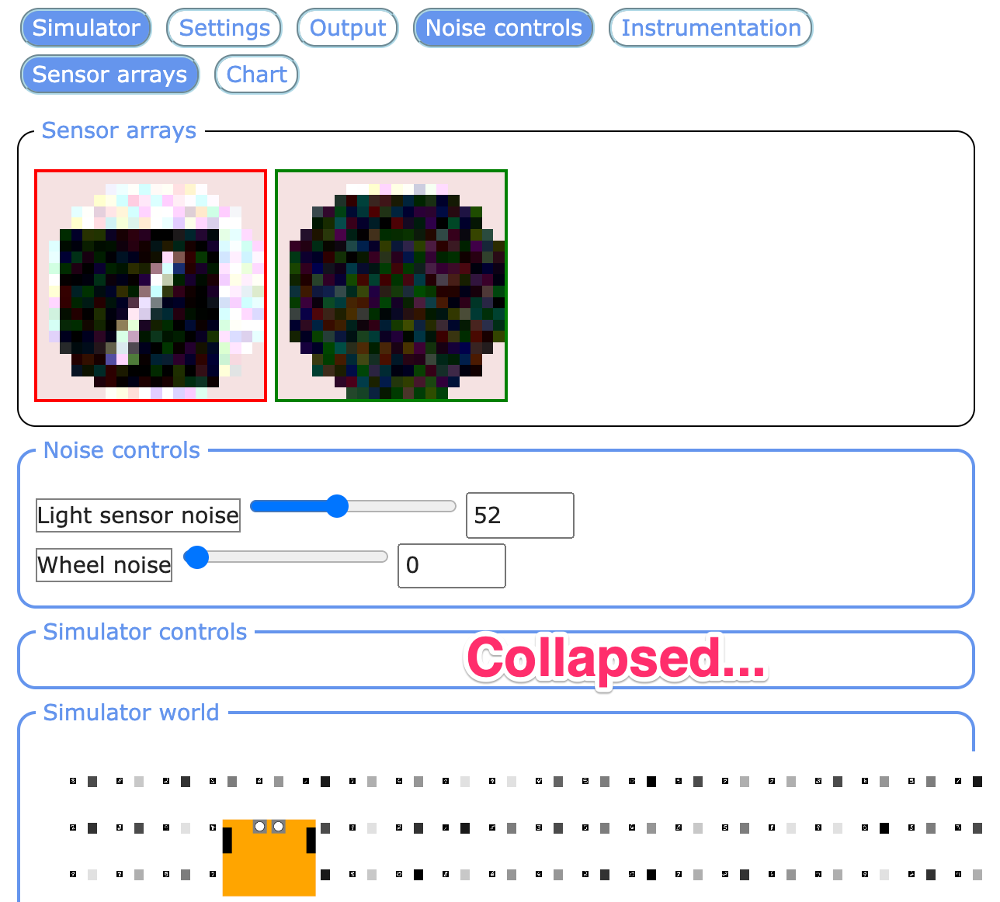

<!-- #endregion -->

<!-- #region slideshow={"slide_type": "notes"} -->
Developing control strategies that are robust in the presence of noise is an important consideration in robot programming and resilience in the presence of noise is a powerful idea in engineering in general.

A crude noise model is implemented in `nbev3devsim` that allows a user defined anmount of random noise to be added to both motors and to both light sensors. (Allowing different levels of noise to each sensor or each motor would be possible but would add to the complexity of the user interface if nothing else.)

The original `ev3devsim` simulator tried to be faithful in its implementetation of the `ev3dev-py` Python API so that programs written using `ev3devsim` could be downloaded directly to a real EV3 brick and run on a physical robot. (This should also be possible with the majority of `nbev3devsim` programs but this has not been explored as yet.)

However, the `nbev3devsim` simulator also extends the capabilities of the light sensor so that it can be used as a simple low resolution camera. The original implementation returned a single value representing either the reflected light value, a 3-type of RGB values, or a binned colour value ranging over a simple discrete spectrum. The response was based on the colour values of a grid of pixels within view of the light sensor.

The simulator *Sensor arrays* view allows us to view what each sensor can see in a pixelated form in real time. (We can also "raise" and 'lower' the downward facing light sensor to increase or reduce the field of view.) The sensor array view also allows us to see what the effect of applying noise might be at a pixel level.

The camera view also allows us to support several of the neural network recognition activities (not described otherwise herein), it which is convenient to reimagine the light sensor as a simple camera that can return a pixel array of values that could be processed as an image by the neural network. 
<!-- #endregion -->

<!-- #region slideshow={"slide_type": "slide"} -->
# Live charts in the simulator

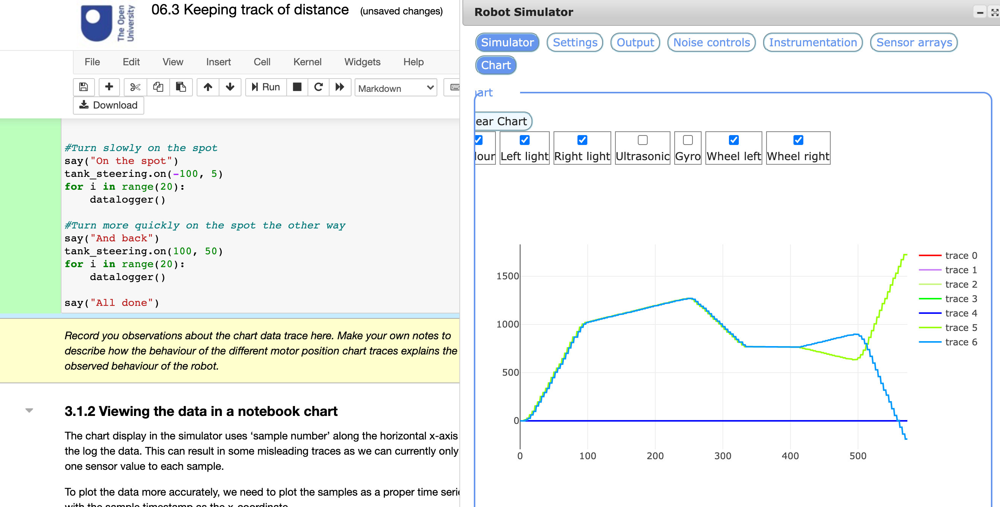

<!-- #endregion -->

<!-- #region slideshow={"slide_type": "skip"} -->
One of the original objectives of the original robotics activities is that they should provide a contextualised setting for some simple data interpretation activities in the form of analysing simple charts generated from collected datasets.

The `nbev3devsim` simulator includes an animated chart that can be updated dynamically with selected logged sensor data values as the robot explores its environment.

Commenting on chart behaviour provides some of the many opportunities for reflection within the notebook itself.
<!-- #endregion -->

<!-- #region slideshow={"slide_type": "slide"} -->
# Charts in the notebook

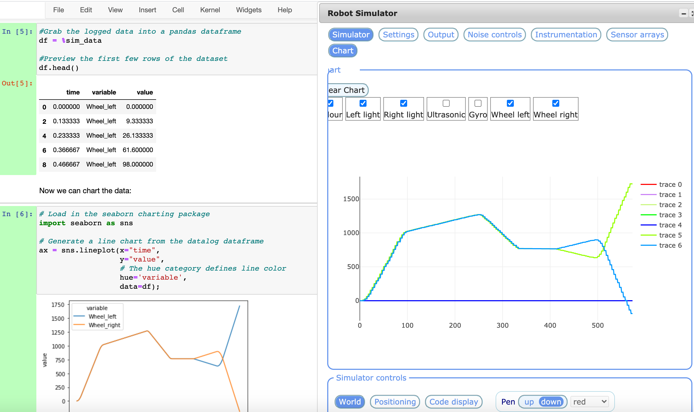
<!-- #endregion -->

<!-- #region slideshow={"slide_type": "skip"} -->
One issue with the simulator chart is that it can only chart data that exists as collected state within the simulator. However, we can also "export" or "upload" logged sensor data from the simulator to the notebook's Python environment and analyse it in non-magic notebook code cells using the notebook's connected native Python environment. (We can also then download the data to persistent data files.)

Data can be retrieved from the simulator using Python functions or custom IPython magics and charts generated and rendered as code cell outputs within the notebook. When the notebook is saved, these graphical code cell outputs are saved as part of the notebook and will be visible next time it is loaded. The data displayed by the chart in the simulator, on the other hand, will be lost when the notebook is reloaded, at least until such a time as additional data is logged and added to the chart widget itself.
<!-- #endregion -->

<!-- #region slideshow={"slide_type": "slide"} -->
# Notebook search — `nbsearch`

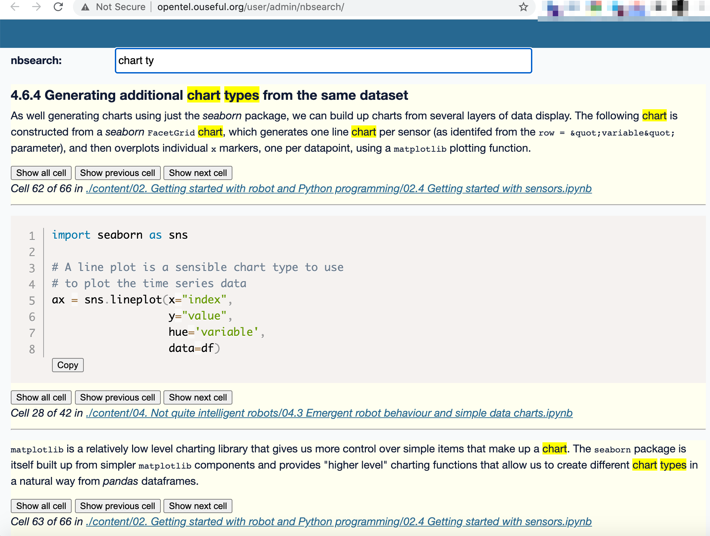

<!-- #endregion -->

<!-- #region slideshow={"slide_type": "notes"} -->
Finally, and distinct from the RoboLab environment, although complementing it in a useful way, is the `nbsearch` notebook search engine, [`nbsearch`](https://github.com/ouseful-testing/nbsearch).

Oe of the issues we have faced in TM351 with the presentation of content across large numbers of notebooks in different directories is that there is no effective search tool for searching across notebooks. This can make it difficult for students to easily refer back to previous work they remember from earlier notebooks when creating their own solutions to problems in later activities and challenges.

`nbsearch` is based on a full text search indexed SQLite database served using [`datasette`](https://github.com/simonw/datasette/) following a recipe described by *datasette* creator, Simon Willison: [*Fast Autocomplete Search for Your Website*](https://24ways.org/2018/fast-autocomplete-search-for-your-website/). The search engine can operate as a standalone service, or accessed via the notebook server home page as a [`jupyter-server-proxy`](https://github.com/jupyterhub/jupyter-server-proxy/) proxied service.

The search engine indexes notebook content *at the cell level* and returns markdown and code cells separately. Markdown cells are rendered in the search results and code cells are styled using appropriate syntax highlighting. Code cells also include line numbers, and a *Copy* button for copying the raw code.

By default, the number of characters displayed in a code cell result is limitied, although the display can be expanded to show the complete cell.

Controls are also provided *for each result* that allow the 'next' and 'previous' cells to be displayed. Selecting these repeatedely reveals ever more cells from the original notebook surrounding the original result cell.

When run via the jupyter-server-proxy configuration, if the search index paths are correctly defined relative to the Jupyter notebook server home directory, clicking a search result link should open the notebook via the notebook server directly, although not at the specific search result cell.
<!-- #endregion -->

<!-- #region slideshow={"slide_type": "slide"} -->
# Questions and Live Demo

### Demo: https://github.com/ouseful-demos/tm129-lite

### Original repo: https://github.com/innovationOUtside/tm129-robotics2020/
<!-- #endregion -->

<!-- #region slideshow={"slide_type": "notes"} -->
*To support the presentation, I also set up a demo using a Digital Ocean server. The server was deployed with a TLJH JupyterHub server with a first-use authenticator and a Dockerspawner launching the `ousefulcoursecontainers/ou-tm129:current` container. For a recipe on setting up the server, see [here](https://github.com/ouseful-demos/ou-rclub/blob/master/README.md#multi-user-jupyterhub-server-used-for-the-tutorial). It takes about 10 minutes to set up and costs about 5p an hour for a reasonable server could enough to let seminar participants have a quick play. In my opinion, this sort of facility should be available as a matter of course as a self-service option using an OU hosted server.*
<!-- #endregion -->
