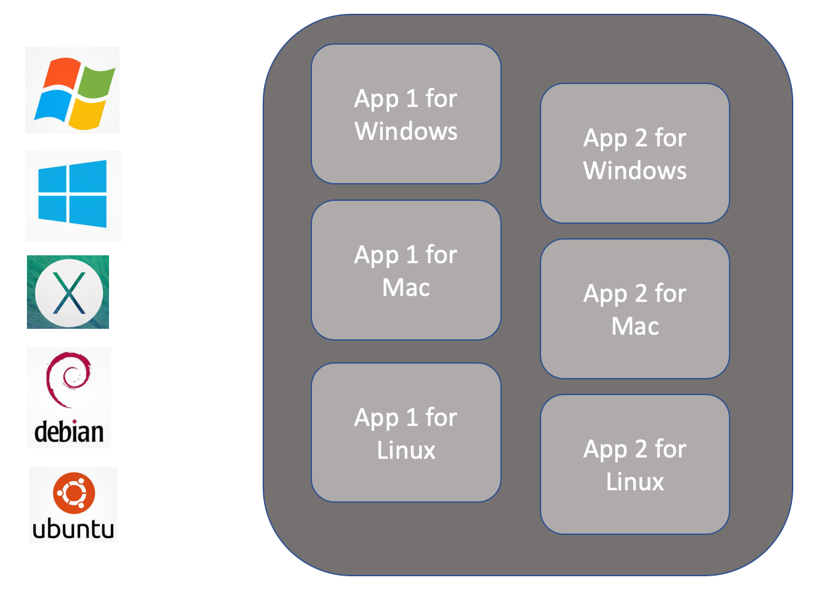
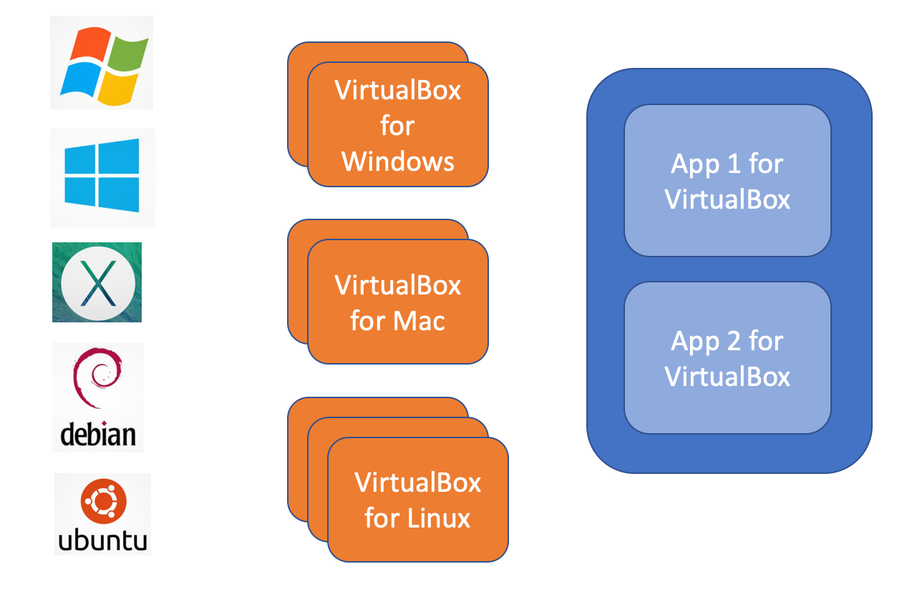
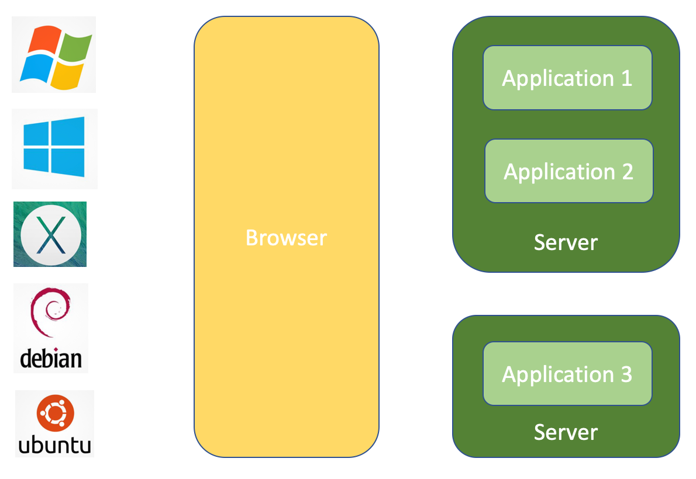
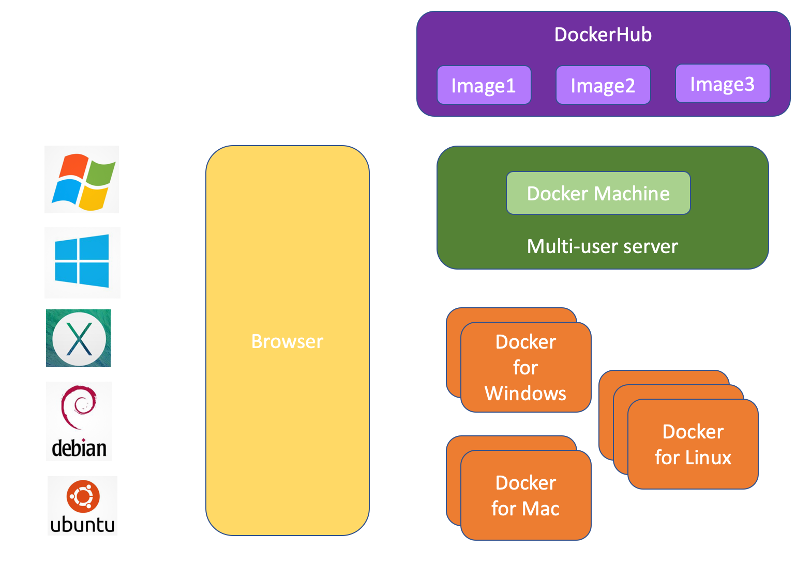
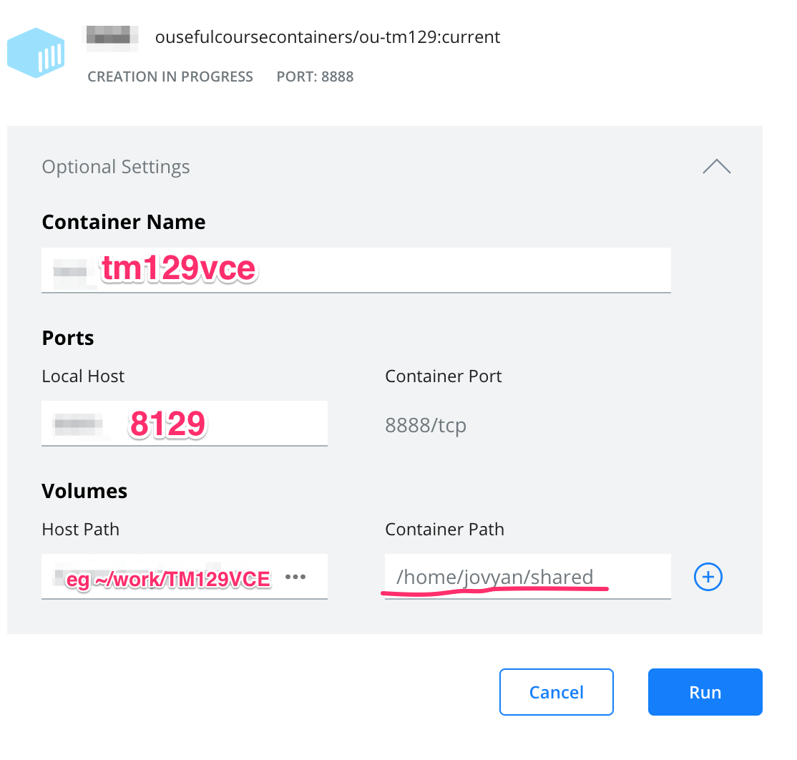
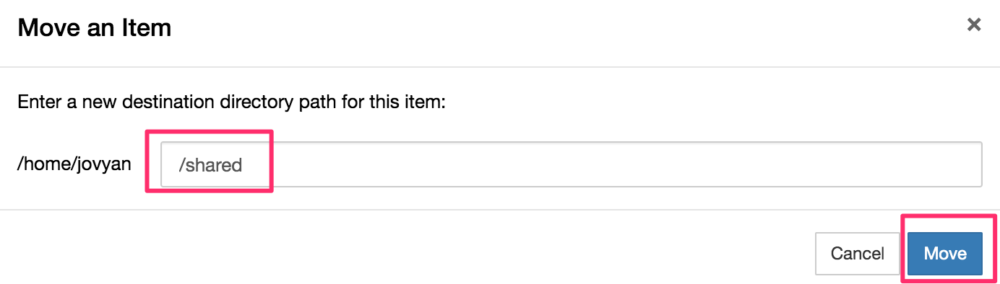
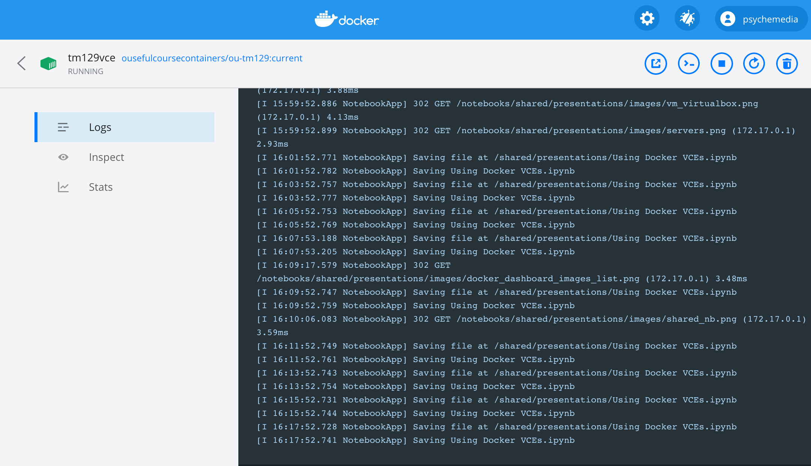

---
jupyter:
  jupytext:
    formats: ipynb,md
    text_representation:
      extension: .md
      format_name: markdown
      format_version: '1.2'
      jupytext_version: 1.6.0
  kernelspec:
    display_name: Python 3
    language: python
    name: python3
---

<!-- #region slideshow={"slide_type": "slide"} -->
# Using Docker to deliver virtual computing environments (VCEs) to distance education students

### Tony Hirst

#### Computing and Communications

#### `github.com/innovationOUtside`
<!-- #endregion -->

<!-- #region slideshow={"slide_type": "notes"} -->
*OpenTEL presentation, 10th Novermber, 2020.*
<!-- #endregion -->

<!-- #region slideshow={"slide_type": "slide"} -->
# "LDS & IT — we have a problem"


<!-- #endregion -->

<!-- #region slideshow={"slide_type": "notes"} -->
Working in a distance education institution, we face a very practical problem when trying to make software applications or more complex computational environments available to students: how do we do it?

Distance education students are BYOD — Bring Your Own Device — service users, which means we need to be able to distribute software in a way that is agnostic as to the sort of computer, or operating system that a student is using.

BUT we tend to assume that students do have access to a "real" computer running a "real" operating system, such a WIndows, OS/X or a full fledged Linux distribution, onto which we can install "real" software applications and not just "apps".

One way of doing this is to make sure that for each of the major software platforms at least, we have a distributable version of the software environment we want students to run. Many OU modules take two or more years to produce, and then run once or twice a year for five years in their first presentation, and potentially another five years after a major revision/update. That means a lot of potential support in terms of keeping the software running, not just across different operating systems, but within particular operating systems that themselves may see major updates every couple of years.

*I've ranted on-and-off about OU (non)adoption of virtualisation for software distribution for years, literally... [This](https://blog.ouseful.info/2019/02/18/i-just-keep-on-keeping-on-looking-at-this-virtual-stuff/) is a typical example, written a year ago. In certain respects, things have moved on since then. In others, they haven't at all...!;-)*
<!-- #endregion -->

<!-- #region slideshow={"slide_type": "slide"} -->
# Minimum student computing requirements

- who knows?!
- is a tablet good enough? *For many courses, it will be, perhaps with an added keyboard...*
- is a phone good enough? *For some courses, it may be...*
- do I need a big screen? *Or is the course design to work with two screens?*
- do I need a GPU? *For TM358 (in production) a GPU is required to run certain activities in a timely way...*
<!-- #endregion -->

<!-- #region slideshow={"slide_type": "notes"} -->
Way back when, the OU used to publish a minimum computing specification for students that identified a computer spec that would meet student computing needs whatever their course. Some courses also had additional expectations: the first OU module I worked on, [T396 Artificial Intelligence for Technology](https://www.open.ac.uk/library/digital-archive/module/xcri:T396/study), required students to have a computer with a maths co-processor to run the provided NeuralWorks neural network software.

Over time, computing specifications started to drift, and a web search for "open university minimum computer spec", or even a search of the OU website itself, would land you at various different, inconsistent, and often out of date description pages.

The current situation I think defaults to requiring students to having something along the lines of a "modern" computer with a "recent" operating system and "recent" browser. Again, certain modules may require students to use particular clients, such as web browsers, to run certain applications. The newly updated TM129 Robotics module, for example, *requires* students to use the Chrome browser because the provided *RoboLab* software environment doesn't currently work in any other browser.

In many cases, however, the assumption is that "computer" means "real computer" running a "real" operating system.

But the family of computers is now far wider than that, and different devices may be appropriate for different sorts of use:

- lots of OU materials are made available as e-books, so if all you want to do is *read* the material, a Kindle or e-book reader may suffice;
- mobile phones are now very powerful computers in their own right, providing a near universal browser experience and capable of running a wide range of phone native apps;
- tablets also provide a universal browsing experience, native applications, and a large-ish screen / viewing area; for completing assessments, typing is possible on a tablet but an external keyboard makes typing easier;
- netbooks / Chromebooks provide a laptop style package — screen and keyboard — with software applications accessed through a browser. "App" installation may be possible, but nor "real" computer software application installation is not typically supported.

Certain modules may also require access to particular computing requirements or resource. For example, *TM358 Machine Learning* (in production) requires students to be able to access GPUs in order to train machine learning models. Students with gaming PCs are likely well set up for this, but not the majority of computer users. Other modules may require students to access large files, such as a video streams. This places a requirement on bandwidth/network access if the data is streamed and consumed "live", or distribution and storage if students are supplied with (large) video or image files, for example.

*In passing, I note that certain forms of software application related teaching and learning may benefit from "dual screen" design. For example, when instructional material is provided on how to use a software application is displayed on the same screen as the application, screen real estate is taken away from the application. In such cases, a screen at your side, or printed material, containing the guidance may be more suitable. The friction incurred by having to look down or to the side to the refer to the supplementary material may also encourage the user to focus more on the main screen content. Dual screen working also applies to watching lean back content, such as video documentaries, on a big screen, whilst at the same time taking notes on a tablet or phone, chatting with peers, or making a note of links to additional resources or topics to chase at a later date. We can generalise further to notions of "dual channel", with two instances of the same medium, such as dual screen; of the same display modality, such as screen + print (both visual media); of mixed read and write modality: screen + paper notebook, or book + paper notebook; of mixed display modality: audio + screen/keyboard, audio + paper notebook, etc. I am not sure to what extent we consciously and actively take such considerations into account when designing and developing teaching and learning materials.*
<!-- #endregion -->

<!-- #region slideshow={"slide_type": "slide"} -->
# TM351 Virtual Machine (VM)

- Virtualbox virtual machine running a headless Linux/Ubuntu operating system
- houses a complete, complex software environment
  - customised Jupyter notebook server and Python environment
  - database servers (PostgreSQL, MongoDB)
  - OpenRefine data cleaning application
  - used in presentation since 16B
- originally delivered by USB, then via USB or public download
<!-- #endregion -->

<!-- #region slideshow={"slide_type": "notes"} -->
Part of my own journey regarding the distribution of complex software environments to students has centered around the *TM351 Data Management and Analysis* module. This module was first mooted in the summer of 2013, with an anticipated first presentation date of October 2015 that slipped to February 2016; it has been presented every October (J month, in OU parlance) ever since.

I have described the software environment used in TM351, the philosophy behind its design, and the way we distribute it, many times since my [original CALRG 2014 presentation](https://www.slideshare.net/psychemedia/calrg14-tm351-35718400), so I won't repeat that here, suffice to say that:

- the environment is made up of multiple services:
  - a customised and OU branded Jupyter notebook environment that provides access to instruction/interactive notebooks;
  - a complex Python environment;
  - PostgreSQL and MongoDB database servers, with preseeded databases and preconfigured user roles and permissions;
  - the OpenRefine browser accessed Java application.
- students need to be able to access the database services from the notebooks / Python environment

To simplify distribution and set-up of the environment, from 2015B to 2019J inclusive, the software was packaged into a VirtualBox virtual machine running a Linux operating system. The VM image was distributed to students originally via USB, latterly via a download from a public cloud service ([VagrantCloud](https://app.vagrantup.com/boxes/search?utf8=%E2%9C%93&sort=downloads&provider=&q=tm351); ~4GB download).
<!-- #endregion -->

<!-- #region slideshow={"slide_type": "slide"} -->
# Why virtualise?

- the same VM can run on any platform capable of running the VM
- we control what's inside the VM



<!-- #endregion -->

<!-- #region slideshow={"slide_type": "notes"} -->
*Virtualisation* is an approach to making the same physical computer hardware available to multiple different computational machines or environments.

In commercial webservices, virtualisation allows server providers to offer multiple "virtual" servers, each running their own operating system, to customers from the same physical server (a rack mounted machine in a server cabinet in a server farm filled with rows and of server cabinets somewhere in the world).

Virtualisation also works on the desktop. In this case, it can provide a means for the same physical computer, such as your own personal laptop to run multiple operating systems at the same time. For example, by running a *virtual machine* (VM), you can run a Linux virtual machine on a Windows computer, or a Windows desktop on your Mac, or one version of Windows alongside another version of the same operating system.

Virtual machines can operate in either a "desktop" or a "headless" mode. For desktop virtualisation, you can access the graphical Windows desktop running inside a VM on your Mac, for example. In a *headless* VM, the virtual machines runs services but there is no graphical desktop to work on. This doesn't mean you can't access applications with graphical user interfaces from headless machines: the TM351 virtual machine is headless but it exposes a Jupyter notebook server that publishes the graphical Jupyter notebook environment that can be viewed via a web browser over an http connection.

In distance education, this sort of desktop virtualisation allows us to build and distribute one virtual machine, such as a virtual machine containing all the software required to support a module, *including the operating system the the software runs on*.

Hopefully, you will see how this immediately provides us with an idea for how we might get around our software distribution problem. Rather than having to worry about packaging different versions of the same application or environment for different operating systems, we can package it for one operating system, bundled inside a virtual machine. The support problem is then reduced to:

- running the virtual machine on arbitrary end-user computers;
- running a client that can render the VM desktop or consume it's services. Note that "a recent web browser" might be an acceptable client, or we may require something more specific: a Chrome browser, version greater than *xx.xx*, for example.

Whilst different operating systems have their own native virtualisation environments, cross-platform virtual machine applications such as VirtualBox or VMWare can be installed across a range of platforms.

The support issue is then abstracted into two distinct forms of support. Firstly, supporting students to get an application such as VirtualBox running on their own computer; secondly, supporting students use of software *inside* the distributed virtual machine environment.

At an institutional level, if the same virtualisation technology is used to distribute software across curricula, the following approach is one route to separating production, presentation and support concerns:

- units such as LDS to create a robust, centralised installation workflow to support students installing the the virtualisation application, such as VirtualBox, running on end-user machines; this is at the level of computer lab technician making sure the computers work; it is not, strictly, a concern of the module team;
- LDS and IT student helpdesk develop robust, centralised support protocols for managing virtualisation installation support;
- units such LDS + IT work to find robust ways of distributing software to students;
- LDS and module teams work together to develop virtualised environments packaged in a way they can be used via the common virtualisation platform (CVP; for example, VirtualBox);
- module team support student use of the software, as it relates to module concerns, inside the virtualised environment.

The key idea here is that subject matter specialist module teams become responsible for what goes on inside the virtual environment, and centralised services are responsible for getting that environment up and running on student computers.
<!-- #endregion -->

<!-- #region slideshow={"slide_type": "slide"} -->
# Hosted TM351 computing environment?

- eg TM351 VM Jupyter server via local or remote server
- TM351 2020J shared hosted service operated by SSU to their design


<!-- #endregion -->

<!-- #region slideshow={"slide_type": "notes"} -->
From the outset, the TM351 module team were keen to be able to offer the TM351 computing environment to students as an OU hosted service, not least as a backup to students who struggled to install the VirtualBox application.

There are at least two ways in which this could be done using *personal virtual environments*, which is to say where the student is presented with an online hosted version of the same packaged environment they could run locally.

Firstly, using an approach taken by *TM352 Web, mobile and cloud technologies*, students could access a remotely hosted version of a repackaged version of the the VirtualBox VM distributed to students (the repacking is required to run the VM on a large scale virtual machine server rather than the VirtualBox personal desktop application).

Secondly, the students could log in to their own personal environment via a multi-user JupyterHub server. In this case, for students to use the same environment *packaged in the same way* as the environment distributed to students in the most convenient way, we need to move to a different virtualisation technology: *Docker containers*.


*A hosted online version of the TM351 environment has been made available for students on the 2020J presentation of TM351. Configured and operated to their own design by SSU, the offer provides a shared service multi-user equivalent to the TM351 environment, rather than a multi-user accessed personal environment. That is, rather than providing students with access to an environment that is identical to the distributed environment, the hosted service provides (less than) equivalent access to  equivalent shared services. For example, rather than students running their own PostgreSQL or MongoDB databases, they have accounts on shared, centralised database services. This approach differs from providing students their own personal environment in several ways. For example: the students do not "own" the database servers, they are users of a centrally administered database service; the environment cannot be "taken away" by students at the end of the module and used directly on their own computer; and from maintenance and support points of view, there are now two systems that need supporting: the self-contained environment, as distributed, and the multi-user service, where student accounts and credentials need setting up on not just the JupyterHub multi-user service, but also the shared database servers.*
<!-- #endregion -->

<!-- #region slideshow={"slide_type": "slide"} -->
# Introducing Docker

- Docker images (templates) vs Docker containers (instantiated images)
- containers are like resource sharing virtual machines
- different applications share common "layers" in a Docker environment
- used in TM351 (20J) and TM129 Robotics practical activities (20J)
- the same container can be run locally or via a multi-user service
<!-- #endregion -->

<!-- #region slideshow={"slide_type": "notes"} -->
*Docker* is a virtualisation technology that can be thought of as "virtual machines lite". The cross platform *Docker Engine* application runs virtualised services much as the VirtualBox application runs VirtualBox packaged virtual machines, virtual machine "containers" run as isolated virtual machines *but* they can also share common virtualised operating system components with other containers.

As to how this sharing is supported, it is useful to think of the contents of a Docker container being made up from a sequence of layers. For example, at the bottom might be an operating system layer, such as a particular version of Linux; then you might have separate layers for each application you want to run inside the container.

In a virtualisation system such as a VirtualBox, each VM is a self-contained virtual machine. If you have two virtual machines, both running the same version of Linux, one running application A, and one running a different application B, the size of each machine is the size of the Linux operating system plus the size of the application.

In a Docker Machine, suppose you have packaged one container with a particular version of Linux and application A, and one container with the same version of Linux and application B. The Docker Machine now only needs to download a single copy of the Linux operating system layer, which can then be shared by both containers. This approach makes sense when Docker is used for virtualised hosting, for example where a powerful physical cloud server hosts multiple virtual machines running the same operating system container layers, because you don't need so much memory to host a version of the operating system for each virtual machine.

This layered approach provides a related benefit when it comes to running Docker on a personal computer. If you are a student on two different modules, and each module distributes a container bundling the same operating system and a common application A, as well as application B for the first module and application C for the second module, then you only need to download the operating system and application A layers once, because they can be shared by the two separate module containers.

There is a benefit when it comes to production and maintenance too, in that when it comes to securing or testing the operating system layer, or the layer associated with application A, this only needs to be done once; the layers can then be shared with the developers responsible for putting together the containers for each of the distinct modules that needs to call on them.

In this way, we can start to build up a plug and play style of environment construction, where we can easily reuse the same software applications across different containers for little additional effort in terms of production and testing, and minimise the amount of stuff we require students to download.

(The practicalities are, of course, different, particularly once you start thinking about multiple software versions over many years and at different times; but that's the idealised *principle*!;-)

As with VM applications such as VirtualBox, it is also worth noting the different between virtual machine *images* and virtual machine *instances*. Years ago, operating systems and their updates used to be distributed on CD-ROMS or DVD-ROMS. These are fixed *images* that you would install onto your computer and set running to provide the operating system and its user desktop. Virtual machines are distributed as static image files, such as a VirtualBox `.box` file, for example, or a Docker image (also referred to as a *container image*). When you run the virtual machine, or in the case of Docker, run a Docker *container*, you generate a running instance of the virtual machine. This instance can be started or stopped, much as you start or shutdown a Windows or Mac desktop: while stopped, the files you were working with are still retained inside the container. But you can also destroy a container, and then recreate a new one from the original downloaded image. This is much the same as deleting your operating system and reinstalling from the image CD/DVD-ROM. In this case, any files that were solely inside the original container will have been lost unless you also took care to save a copy of them *outside* the container.

> Note that sometimes the static Docker images (container images) are also referred to as containers. Context should make it clear whether the image or an instantiated container is intended.

*In passing, I note that I first started considering how we might use Docker to deliver the TM351 VM back in January 2015 ([Using Docker to Build Linked Container Course VMs](https://blog.ouseful.info/2015/01/14/using-docker-to-build-course-vms/)). At the time Docker on the Desktop was far from mature enough to be able to do that in a cross-platform way.*
<!-- #endregion -->

<!-- #region slideshow={"slide_type": "slide"} -->
# Distributing Dockerised VCEs


<!-- #endregion -->

<!-- #region slideshow={"slide_type": "notes"} -->
To run a Docker container, you need to install the [Docker Engine](https://docs.docker.com/engine/). On a desktop computer, this means installing [Docker Desktop for Mac](https://docs.docker.com/docker-for-mac/install/), or [Docker for Windows](https://docs.docker.com/docker-for-windows/install/); [other distributions](https://docs.docker.com/engine/install/) are available for Linux. As with VirtualBox, once the Docker application is installed on a student's computer, we can be agnostic as to what operating system the computer is actually running.

Note that Docker typically needs to be installed on a "real" computer, although the Docker Engine will also run on powerful Chromebooks. Docker containers can be run on Raspberry Pi computers, but the images must be built specifically for the processor family that Raspberry Pi computers utilise. (For a starting point on my current thinking around this, see [*Idly Wondering – RPi 400 Keyboard*](https://blog.ouseful.info/2020/11/05/idly-wondering-rpi-keyboard/).)

As well as running containers on the desktop, there is widespread support for running containers, at scale, on standalone servers. For TM351 and TM129, where a single-user Jupyter notebook server provides the browser based single point of entry to the practical activity materials, a [JupyterHub](https://jupyterhub.readthedocs.io/en/stable/) multi-user server running a [Dockerspawner](https://jupyterhub-dockerspawner.readthedocs.io/en/latest/) environment spawner can be used to provide authenticated access to user accounts; when a student logs in to the server, a single, preselected Docker container environment can be launched for them, or they can be presented with a choice of different containerised environments from which they then select one to launch. Files can be shared into the container from a persistent user environment managed by the JupyterHub server.

Container images themselves are distributed from an online Docker image repository, from where they can be downloaded to wherever you want to run the container. These repositories can be privately managed organisational ones, or public repositories such as [DockerHub](https://hub.docker.com/search?q=&type=image) (have a mooch around the DockerHub website to get a feel for what sorts of Docker images are available "off-the-shelf"). The containers used to distribute software for TM351 and TM129 and be found at [`DockerHub: ousefulcoursecontainers`](https://hub.docker.com/u/ousefulcoursecontainers).

__Note that you should alway take care when installing untrusted third party software from public repositories, even if the software is distributed via containers...__

*To support the original presentation, I also set up a demo using a [Digital Ocean](https://www.digitalocean.com/) server. The server was deployed with a [TLJH (The Littlest JupyterHub)](https://tljh.jupyter.org/en/latest/) server using a [first-use authenticator](https://github.com/jupyterhub/firstuseauthenticator) and a Dockerspawner launching the `ousefulcoursecontainers/ou-tm129:current` container. For a recipe on setting up the server, see [here](https://github.com/ouseful-demos/ou-rclub/blob/master/README.md#multi-user-jupyterhub-server-used-for-the-tutorial). It takes about 10 minutes to set up and costs about 5p an hour for a reasonable server good enough to let seminar participants have a quick play. In my opinion, this sort of facility should be available as a matter of course as a self-service option using an OU hosted server.*

*Over the years, I've also tried to articulate for myself why I think Docker containers make sense. One attempt is described in [Application Shelves for the Digital Library – Fragments](https://blog.ouseful.info/2016/05/26/application-shelves-for-the-digital-library-fragments/) (May, 2015), another in this April Fool post from 2019 —  [Library DigiHub – Providing Accessing to Institutionally Hosted Virtual Computational Services and Applications](https://blog.ouseful.info/2019/04/01/library-digihub-providing-accessing-to-institutionally-hosted-virtual-computational-services-and-applications/) — where I tried to imagine what it would be like if the institutions suddenly provided the sort of service I've keep thinking about...*
<!-- #endregion -->

<!-- #region slideshow={"slide_type": "slide"} -->
# TM351 Virtual Computing Environment (VCE)

```
docker pull ousefulcoursecontainers/ou-tm351:current

docker run --name tm351vce --rm -d \
    -p 8351:8888 \
    -v "$PWD/TM351VCE/notebooks:/home/jovyan/notebooks" \
    -v "$PWD/TM351VCE/openrefine_projects:/home/jovyan/openrefine" \
    -e JUPYTER_TOKEN="letmein" \
    ousefulcoursecontainers/ou-tm351:current
```
<!-- #endregion -->

<!-- #region slideshow={"slide_type": "notes"} -->
Once Docker is installed on the student desktop, the Docker containerised TM351 virtual computing environment (VCE) distributed to the students for the first time in 20J via DockerHub is installed from DockerHub as [`ousefulcoursecontainers/ou-tm351`](https://hub.docker.com/r/ousefulcoursecontainers/ou-tm351) via a `docker pull` command. (The original repository used to build the environment is on Github at [`innovationOUtside/tm351vm-binder`](https://github.com/innovationOUtside/tm351vm-binder).)

A container instance is then launched using the Docker run command. The separate elements of the `docker run` command achieve the following things:

- `docker run`: the command that says we want to run a container;
- `--name tm351vce`: this is the name of the launched container; using a consistent container name allows us to provide explicit instructions about what commands to use to manage the container, such as stopping it, restarted it, deleting it, etc;
- `--rm -d`: these commands keep things tidy: `--rm` cleans up the container if we stop the service, `-d` runs it in "detached" mode, which is to say, in the background;
- `-p 8351:8888`: services are published inside the container to particular ports running on a local network inside the container. In the TM351 container, the Jupyter notebook server is published via internal port 8888. This is then mapped onto port 8351 on the student's host computer. When the container is running, student's visit the URL `localhost:8351` or `127.0.0.1:8351` using their browser to access the running notebook server;
- `-v "$PWD/TM351VCE/notebooks:/home/jovyan/notebooks"`: the contents of the `TM351VCE/notebooks` folder in the directory the `docker run` was run in (the "Print Working Directory", `$PWD`) are share into the `/home/jovyan/notebooks` directory inside the container. Files saved into the `/home/jovyan/notebooks` directory in the container also appear in the `TM351VCE/notebooks` directory on the host computer, and *vice versa*. If the container is deleted, the files will still persist in `TM351VCE/notebooks` on host. If any files exist inside the container in `/home/jovyan/notebooks` *before* the `TM351VCE/notebooks` directory is mounted on top of it, they will be clobbered (i.e. will not be recognised) when the desktop directory is mounted on top of it;
- `-v "$PWD/TM351VCE/openrefine_projects:/home/jovyan/openrefine"`: as for the other volume mount except that ow the contents of the local `TM351VCE/openrefine_projects` directory are shared with the `/home/jovyan/openrefine` directory inside the container;
- `-e JUPYTER_TOKEN="letmein"`: the notebook server is token protected and a prompt is shown on first use; `-e JUPYTER_TOKEN` sets an environmental variable inside the container; students need to enter the specified token, in this case: `letmein`, to gain access to the notebook server;
- `ousefulcoursecontainers/ou-tm351:current`: the image we want to create the container from; if we hadn't previously run the `docker pull` command, then if the image had not already been downloaded, it would be pulled (i.e. downloaded) automatically and then the container instance launched from it. The advantage of running the `docker pull` command first is that if a more recent copy of the image exists than an already downloaded image of the same name, the more recent image will be downloaded and used to create the container. 

Note that the syntax required to set up the paths to the volume mounts from the host machine varies according to whether the student is using a Mac/Linux or a Windows host computer. The syntax on Windows also changes according to whether the user runs the command using PowerShell or the command/CMD prompt. It is possible to provide students with a `docker-compose.yml` file that can be called to run a correctly configured container BUT this adds the overhead of distributing the file and students installing it in the corrext location. The `docker run` command shown above has the advantage that it just needs typing, or copying, into a terminal and then running.
<!-- #endregion -->

<!-- #region slideshow={"slide_type": "slide"} -->
# TM129 Robotics Virtual Computing Environment (VCE)

```
docker pull ousefulcoursecontainers/ou-tm129:current
```


<!-- #endregion -->

<!-- #region slideshow={"slide_type": "notes"} -->
Along with the Docker command line interface (the *Docker CLI*), the Windows and Mac Docker Desktop applications also install a graphical user interface, the *Docker Dashboard*.

Whilst still in its early days, this looks set to provide ever more features when it comes to controlling Docker containers on the desktop and as such may simplify the instructions required for running a particular container.

The above example shows a possible install-and-run workflow for students wanting to run the TM129 VCE, which is distributed as a Docker image from [ousefulcoursecontainers/ou-tm129](https://hub.docker.com/r/ousefulcoursecontainers/ou-tm129) (the original build files can be found in the Github repository [`innovationOUtside/tm129-robotics2020`](https://github.com/innovationOUtside/tm129-robotics2020/)).

The original image is pulled onto a students computer with Docker installed using the `docker pull` command. With image downloaded, it can be selected using the Docker Dashboard, and a Docker container instance created from it.

In this case, we provide the container name (for example, `tm129vce`) and specify the desired port map on host (the published ports inside the container are automatically listed). We can also specify required volume mounts to link folders on host with folders inside the container and share files between them. The image used in this case has the password automatically set (to `letmein`, by default), so we also need to instruct the student as to what password/token to use when prompted the first time they try to access the notebook server.

*Official graphical desktop / dashboard support has been a long time coming to Docker. A third party application, Kitematic, appeared quite early on, but was quickly acquired by Docker and development stopped, although Kitematic was still distributed via Docker and made available via Docker menu item. (See some of my early (May, 2015) thoughts about Kitematic, and how a Docker desktop UI might simplify software distribution, here: [Kiteflying Around Containers – A Better Alternative to Course VMs?](https://blog.ouseful.info/2015/05/18/kiteflying-around-containers-a-better-alternative-to-course-vms/).) I personally anticipate that additional features will continue to appear in the Docker Dashboard user interface, including the ability to search for and pull Docker images from public or privately connected repositories, set environment variables, etc etc.*
<!-- #endregion -->

<!-- #region slideshow={"slide_type": "slide"} -->
# Distributing content in TM129


Notebooks are distributed via the original Docker image


<!-- #endregion -->

<!-- #region slideshow={"slide_type": "notes"} -->
One of the major differences between the TM351 and TM129 Docker images is that the TM129 image contains the instructional notebooks used to guide student activity inside the container. In contrast, in TM351, students download the notebooks in an archival `.zip` format and then move place them in their shared notebook directory in order to access them inside the TM351 VCE. (Students using the hosted VCE must upload and unzip the notebooks to that service environment.)

The notebooks bundled inside the TM129 can be worked on directly inside the VCE, but to be shared and persisted on the student desktop they need to be copied into the mounted shared directory / volume. (If we tried to mount the desktop directory directly on top of the folder inside the container that contains the original distributed files, the folder mounted from outside the container will clobber the files inside the container and we won't be able to see them from anywhere.)
<!-- #endregion -->

<!-- #region slideshow={"slide_type": "slide"} -->
# Docker container dashboard



<!-- #endregion -->

<!-- #region slideshow={"slide_type": "notes"} -->
I have already mentioned how the Docker Dashboard, which is supported by the Mac and Windows Docker Desktops, provides a graphical user interface that supports the running of new containers from downloaded images.

The dashboard also provides a range of graphical tools for managing containers. Selecting a container provides access to a toolbar that lets you stop, start, restart and delete a particular container. You can also access a terminal running inside the container and launch a browser window onto an exposed and mapped port (so, for example, you can click through directly from the dashboard to the notebook server accessed via your browser).

A log view also allows students to view and copy the container log, which may be useful when raising or handling support issues.
<!-- #endregion -->

<!-- #region slideshow={"slide_type": "slide"} -->
# Building and running a container from scratch

The TM129 and TM351 VCEs are constructed during development (module production) using `repo2docker`.

```
jupyter-repo2docker --image-name ou/tm129vce \
    --publish-all --user-name jovyan \
     -e JUPYTER_TOKEN=letmein \
     https://github.com/innovationOUtside/tm129-robotics2020
```

A more polished distribution *should* be created for production use (i.e. for presentation to students).
<!-- #endregion -->

<!-- #region slideshow={"slide_type": "notes"} -->
When Docker containers were first released, best practice suggested that each container should run a single application. In the TM351 context, this would mean one container should run the notebook server, one should run the PostgreSQL server, one should run the OpenRefine server, and so on.

Very quickly, however, an "anti-pattern" emerged showing how [multiple services could be run within the same container](https://docs.docker.com/config/containers/multi-service_container/). This is now firmly established as a tried and trusted way of using Docker containers and truly allows us to think of DOcker containers as "lite" virtual machines running multiple services in their own right.

Individual Docker images are built from a `Dockerfile` (not shown); a `Dockerfile` is a simple text file that specifies a base image from which the image will be built; the base image might be a minimal operating system, or it might be an image that already embeds various services, such as a Jupyter notebook server, or a Jupyter notebook server with a full `scipy` stack. (For example, see the official [`jupyter/docker-stacks`](https://github.com/jupyter/docker-stacks) for a range of Jupyter container images that can be used directly on their own or as the basis for an even richer custom image. (Remember what I said about layers?!))

As well as the base image, the `Dockerfile` can then be used to script the installation of additional software packages, create users and user permissions, and so on. Ports on which services are running and that can be published (and accessed from) outside the container are `EXPOSE`d and the command which should be run when the container is started is identified. (This is a single command and originally started the single service that the container was expected to run. The start command now is more commonly a start script that may itself start one or more services.)

*For details about constructing `Dockerfile`s, see for example: [Ten simple rules for writing Dockerfiles for reproducible data science](https://journals.plos.org/ploscompbiol/article?id=10.1371/journal.pcbi.1008316)*

Docker images can also be created, and then run directly, using the [`jupyter-repo2docker`](https://repo2docker.readthedocs.io/en/latest/) package. *This is currently how both the TM351 and the TM129 Docker images are built.* `repo2docker` is a build framework that accepts [simple environment specifications](https://repo2docker.readthedocs.io/en/latest/config_files.html#config-files) using text files to specify environment requirements (`apt.txt` for Linux packages, `environment.yml` for Anaconda packages and/or `requirements.txt` for Python packages, for example; a `Dockerfile` can also be used which works in the normal way.) Jupyter services, a single user Jupyter notebook server, and default a user with limited permissions (`jovyan`) are added to the container "for free". The image that is produced should then work directly with other bits of the Jupyter ecosystem (JupyterHub, [BinderHub](https://binderhub.readthedocs.io/en/latest/) etc).

`repo2docker` is used to build and launch images described by the contents of arbitrary, public Github repositories

One downside of the `repo2docker` approach is that the image that is produced is quite large and may contain elements that are surplus to requirements. One advantage of using the `repo2docker` approach is that it is relatively straightforward to define a complex environment: just add the names of required packages to the appropriate files. Any additional build actions can be defined via a `postBuild` script (which could take the form of a bash shell script or Python script, for example); and any required startup routines that should run when the container is launched can be added to a `start` file that is baked into the image.


*As an aside, it is perhaps worth mentioning the [`ContainDS`](https://containds.com/desktop/tutorials/getting-started/) application, a fork of the original Kitematic desktop UI that incorporates `repod2docker` and that can be used to build and run Docker images from local files or public GitHub repositoroes.*
<!-- #endregion -->

<!-- #region slideshow={"slide_type": "slide"} -->
# Docker Compose

- each application runs in its own container;
- `docker compose` launches each container along with a network to connect to them

In TM351, a single `docker-compose` command could run:

- Jupyter notebook server
- PostgreSQL server connected to notebook server
- MongoDB server connected to notebook server
- standalone OpenRefine container.
<!-- #endregion -->

<!-- #region slideshow={"slide_type": "notes"} -->
As has already been mentioned, when Docker first started to appear, best practice suggested that a single application should run in each separate container (and that is still the current advice, despite the widely used practice of [running multiple services inside a single container](https://docs.docker.com/config/containers/multi-service_container/).

To create systems that require the interoperation of multiple services, [`docker-compose`](https://docs.docker.com/compose/) provides a simple way of defining Docker container compositions that instantiate separate containers in a grouped way, connecting them via their own Docker managed local network.

*One of my early explorations of how we might use Docker to deliver the TM351 environment was based around Docker Compose: [Using Docker to Build Linked Container Course VMs](https://blog.ouseful.info/2015/01/14/using-docker-to-build-course-vms/). So for example, one container would run the notebook server, one container the PostgreSQL database server, and so on. The automatically created network that could be used to connect containes also provided "nice" network aliases that meant self-describing/intuitive network connection strings could be defined when connecting to the databases from the notebooks. The current VCE has all the services packaged within a single container, but I intend to explore a Docker Compose mediated mutli-container version [for use on Raspberry Pi devices](https://blog.ouseful.info/2020/11/05/idly-wondering-rpi-keyboard/).*

One issue with using Docker Compose / multi-container strategies for the deployment of VCEs particularly in a JupyterHub multi-user context. Whilst there are tools to support the launching of single Docker containers, e.g. using the *DockerSpawner*, as well as launching user environments in a more scaleable Kubernetes context, there is no "Docker Compose" spawner that I am aware of. *(But does there need to be? [Kubernetes + Compose = Kompose](https://kompose.io/))*

Docker Compose can also be used to launch single containers in from a simple `docker-compose.yaml` file that hides the complexity of a `docker run` command behind the simpler `docker-compose up -d` command; this command will start up a composition based on the configuration described in a `docker-compose.yml` file in the same directory. However, this does mean that the `docker-compose.yml` file does need hosting somewhere, does need distributing to students somehow, does need to be placed in the correct location on the student's computer, and does need the `docker-compose` command itself to be run in the correct location. This contrasts with the `docker run` command which is self-contained.

That said, the *Docker Compose* route does offer several advantages for local student useful, particularly if their physical computing environment is resource constrained. For example, many TM351 activities only require the Jupyter notebook server, or only require the OpenRefine server. In such cases, the students could use a `docker-compose.yml` that just launches the required single application server container. On the other hand, to complete a database activity, the student could use a `docker-compose.yml` configuration that starts the Jupyter notebook server container and the required database server container and wires them together over their own local network.

*In passing, I note that [`docker-compose` is now supported on Amazon ECS](https://www.docker.com/blog/docker-compose-for-amazon-ecs-now-available/), which perhaps raises the interesting question of deploying remote `docker-compose` mediated environments on remote hosts at scale? So now I wonder: can we use `docker-compose` in a Kubernetes context? Hmm... maybe there is a [migration path available?](https://dzone.com/articles/from-docker-compose-to-kubernetes)*
<!-- #endregion -->

<!-- #region slideshow={"slide_type": "slide"} -->
# Docker in Docker (`dind`)

JupyterHub will only serve single containers, not `docker-compose` container compositions.

Docker in Docker runs Docker inside a container. For example;

- TM351 sharded (i.e. distributed) MongoDB activity;
- single container runs Jupyter notebook server & `dind`;
- notebook to create distributed MongoDB network, one server per `dind` container
- observe how distributed database reacts to network errors.

<!-- #endregion -->

<!-- #region slideshow={"slide_type": "notes"} -->
*Docker in Dockerr (`dind`)* describes the process of running Docker inside a Docker container. This might at first appear to be a redundant thing to do, but in a distance education context, it may make sense for certain sorts of activity.

For example, in the first reference I can find to Docker in my personal blog, from December 2014 — [Thoroughly Confused About Student VMs & Docker](https://blog.ouseful.info/2014/12/10/thoroughly-confused-about-student-vms-docker/) — I seemed to be exploring how we might use Docker inside the TM351 VirtualBoX VM to run a distributed / sharded MongoDB activity. The set-up required launching several MongoDB shards, each in their own container, connected by a local network, and then using Linux firewall rules to partition the network (i.e. sever some of the network connections) so that students could observe how the individual MongoDB shards reacted.

The activity was never actually used in the TM351 materials, but I have started to revisit it for possible inclusion in an update to the TM351 materials. Making the same approach work in a single container would simplify a couple of things: a) the single container can be launched via a hosted multi-user JupyterHub; b) a Linux container provides all the tools required to easily partition the network, compared to having to work out how to partition the network running over a local network on a Mac or Windows machine, for example.

Using a *Docker in Docker* approach would allow the current TM351 container to internally use Docker Compose *within the container* to set up and manage a distributed / sharded MongoDB network with separate MongoDB shards running inside their own containers inside the TM351 container.

For more on Docker in Docker, see: [How To Run Docker in Docker Container [3 Easy Methods]](https://devopscube.com/run-docker-in-docker/).
<!-- #endregion -->

<!-- #region slideshow={"slide_type": "slide"} -->
# Docker image production workflow

- how do we make it easy for academics to construct VCEs?
- how do we allow OU teaching related staff access and share VCEs during production?

TM351 and TM129 both use:
- Github Action builds Docker image from repo;
- manual `docker build` with a "tidy up" Dockerfile creates final image then push to Docker Hub.
<!-- #endregion -->

<!-- #region slideshow={"slide_type": "notes"} -->
For TM129 and TM351, the current workflow used to construct the Docker images and publish them on DockerHub, from where they can be downloaded using a `docker pull` command by students is as follows:

- a Github Action automates the construction of an intermediate Docker image from a source Github repository using the  [`repo2docker` GitHub Action](https://github.com/jupyterhub/repo2docker-action). The same action pushes the image to DockerHub. The Github Action can be triggered automatically, e.g. from a release made on the repository, or it can be manually triggered ([manually triggered GitHub Actions](https://github.blog/changelog/2020-07-06-github-actions-manual-triggers-with-workflow_dispatch/)).
- the intermediate container may contain files copied over from the repository that are not intended for inclusion in the image released to students. Housekeeping could be included in the `repo2docker` `postBuild` step, or within the scripted Github Action, but at the moment the intermediate image is manually pulled and used as the base container in another `Dockerfile` that applies cleaning actions and provides any additional configuration steps. For example, in the case of TM129, the default `letmein` token is baked in as a present environment variable token which means that if the container is started using the Docker Dashboard, which does not currently support the setting of environment variables, a known authentication token provides access to the notebook server.
- once the housekeeping has been applied to generate the final release image, it is manually pushed to the DockerHub repository from which students can pull it.

One issue with this approach is that it may add just yet more weight / layers to the container. If the final processing step removes files from an image, the layer that included the files is still a part of the image, and the later layer then deletes them in creating the filesystem view exposed to users in the running container.

Whilst the above route is fine for development and test, we should really move to a model where we construct a much cleaner image from the actual requirements (rather than including the `repo2docker` included unwanted extras, or files in layers where the files are then deleted before release). This could be done via a [multistage build](https://docs.docker.com/develop/develop-images/multistage-build/) or possibly a simplifying fork of the `jupyter-repodocker` builder. A templated `Dockerfile` might provide another approach. A key consideration is the workflow: `repo2docker` makes it easy for an academic, for example, to create a working Docker container image. But creating a `Dockerfile` that builds a well engineered, minimal image appropriate for release to students might require a whole range of specialist developer skills.

Mention has already been made of the layered nature of Docker containers, and the ability of one Docker image to build on the contents of another one. This approach is well demonstrated by the [`jupyter/docker-stacks`](https://github.com/jupyter/docker-stacks) images, which start with a minimal Jupyter notebook server image and build ever more comprehensive images from it and its inheriting descendants.

In an OU context, where multiple modules are exploring the use of Jupyter notebooks for module delivery, it therefore makes sense to consider an `ou/docker-stacks` model. For example:

- an OU base container may provide a base operating system layer, correctly patched and secured;
- an OU user container may build from the base layer to add an `ou_admin` user and perhaps a generic `oustudent` user, both suitaby permissioned;
- an OU Jupyter notebook server image may build on the OU user container and add an OU branded Jupyter server, perhaps with generic extensions, such as accessibility extensions, that are useful to all modules, pre-installed and pre-enabled;
- module specific images might then build on top of the OU Jupyter notebook server image to add module specific kernels, additional services required to support the module activities, and so on.

This stack model would help minimise maintenance and support issues, and also bake in an element of consistency to the environments provided to students across modules.
<!-- #endregion -->

<!-- #region slideshow={"slide_type": "slide"} -->
# In passing...

> All this stuff is the future. 90% of the 'ed tech community' isn't even looking at it (100% of actual ed tech developers are, though).

Stephen Downes (OLDaily), *pers. comm.*
<!-- #endregion -->

<!-- #region slideshow={"slide_type": "notes"} -->
*According to posts on my personal blog, Docker seems to have properly come to my attention as a possible technology for distributing software to distance education students in [January 2015](https://blog.ouseful.info/2015/01/14/using-docker-to-build-course-vms/) with an experimental docker-compose solution. Although Docker was still far from ready to be put to such purposes in any meaningful way at that time, particularly in terms of robust cross-platform/desktop support, I think a potential adoption path was already identifiable at the time. Almost five years on, it seems we're finally starting to explore how effective this might be in practice...*
<!-- #endregion -->

<!-- #region slideshow={"slide_type": "slide"} -->
# Questions?


### https://github.com/innovationOUtside/tm351vm-binder

### https://github.com/innovationOUtside/tm129-robotics2020
<!-- #endregion -->
