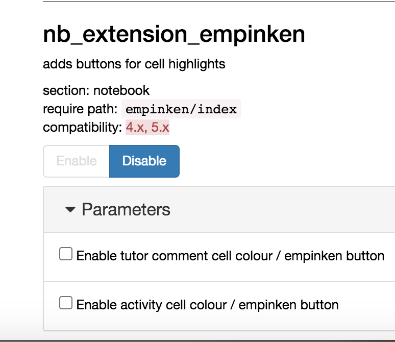

---
jupyter:
  jupytext:
    notebook_metadata_filter: rise
    text_representation:
      extension: .md
      format_name: markdown
      format_version: '1.2'
      jupytext_version: 1.4.2
  kernelspec:
    display_name: Python 3
    language: python
    name: python3
  rise:
    enable_chalkboard: true
    scroll: true
---

<!-- #region slideshow={"slide_type": "slide"} -->
# TM129 Robotics Refresh

Tony Hirst

Computing and Communications, The Open University

`tony.hirst@open.ac.uk`

`blog.ouseful.info`

`github.com/innovationOUtside`
<!-- #endregion -->

<!-- #region slideshow={"slide_type": "slide"} -->
## Not Demos

### `https://github.com/innovationOUtside/`

### and then:

- ### simulator package: `nbev3devsim`

- ### draft materials : `tm129-robotics2020`

Note: these are works in progress... I try to ensure that the current `master` works, but:

1. can't guarantee it...
2. my current WIP may be several days ahead of `master`
<!-- #endregion -->

<!-- #region slideshow={"slide_type": "slide"} -->
## In The Beginning...

- T184 Robotics and the Meaning of Life (2003-2011)
  - 10 points, Relevant Knowledge / Technology Short Course Programme
  - 50% online VLE teaching material, 50% computer desktop practicals
  
- TM129 Technologies in Practice (2013-)
  - Robotics module: T184, slightly revised
  - introduction to programming remit
<!-- #endregion -->

<!-- #region slideshow={"slide_type": "slide"} -->
## RobotLab Practical Activities


<!-- #endregion -->

<!-- #region slideshow={"slide_type": "slide"} -->
# Accessing Legacy Windows Apps Via a Browser


https://github.com/ouseful-demos/jupyter-desktop-server


<!-- #endregion -->

<!-- #region slideshow={"slide_type": "slide"} -->
# TM129 Update, 20J — Replacing RobotLab

This is not the first time RobotLab has been replaced in an OU module...

- T176 Engineering: professions, practice and skills 1
  - week long residential school
  - four day long activities including Robotics
  - robot activity originally used RobotoLab with Lego Mindstorms RCX robot
  - revised robot activity uses Lego software with Lego EV3 robot
  - BUT there was some early prototyping of using the Python wrapper for `ev3dev`...

<!-- #endregion -->

<!-- #region slideshow={"slide_type": "slide"} -->
## TM129 — Moving to Python

- Python wrapper to Lego `ev3dev` Linux operating system
- now also the `ev3devsim` simulator


<!-- #endregion -->

<!-- #region slideshow={"slide_type": "subslide"} -->
## ev3devsim

- runs in the browser
- uses Skulpt
- implements a cut-down version of `ev3dev-py` as a Skulpt package

BUT

- no access to full SciPy stack;
- how do we provide instruction?
<!-- #endregion -->

<!-- #region slideshow={"slide_type": "slide"} -->
## The Naive Jupyter Way

- embed `ev3devsim` in a Jupyter notebook or JupyterLab IFrame window

Disadvantages:

- very loose coupling between teaching materials eg in notebook and simulator
<!-- #endregion -->

<!-- #region slideshow={"slide_type": "slide"} -->
## Naive Integration Example
<!-- #endregion -->

```python
from IPython.display import IFrame
IFrame('https://www.aposteriori.com.sg/Ev3devSim/index.html', width='100%', height=800)
```

<!-- #region slideshow={"slide_type": "slide"} -->
## Integrated Jupyter Way - `nbev3devsim`


<!-- #endregion -->

<!-- #region slideshow={"slide_type": "notes"} -->
Code entered into a magicked code cell is downloaded to the simulator when the code cell is run. The code is then executed / run in the simulator.
<!-- #endregion -->

<!-- #region slideshow={"slide_type": "slide"} -->
##  `nbev3devsim` Widget

`jp_proxy_widget` wrapped version of `ev3devsim`


<!-- #endregion -->

<!-- #region slideshow={"slide_type": "subslide"} -->
### `nbev3devsim` Controls


<!-- #endregion -->

<!-- #region slideshow={"slide_type": "subslide"} -->
### `nbev3devsim` Output Area


<!-- #endregion -->

<!-- #region slideshow={"slide_type": "subslide"} -->
### `nbev3devsim` Sensor View


<!-- #endregion -->

<!-- #region slideshow={"slide_type": "subslide"} -->
### `nbev3devsim` Code Display


<!-- #endregion -->

<!-- #region slideshow={"slide_type": "slide"} -->
## `jp_proxy_widget` == `ipywidget` wrapper

- supports state transfer between notebook Python kernel and Javascript
- code is "downloaded" to the simulator from a magicked notebook cell
- simulator state, robot state and robot datalog contents are aviailbale to notebook Pyhton kernel


<!-- #endregion -->

<!-- #region slideshow={"slide_type": "slide"} -->
## Virtual Machines All The Way Down


<!-- #endregion -->

<!-- #region slideshow={"slide_type": "notes"} -->
The VM situation is actually a little bit more complicated than that:

- there is a state return path *from* the `nbev3devsim` simulator running in the browser Javascript context back to the Jupyter mediated Pyton environment;
- the Jupyter Python environment, and the Jupyter server are running on a Linux o/s in a Docker container;
- the Docker applciation *might* be running on the host o/s, or it might be remote and being access over an intervening network.
<!-- #endregion -->

<!-- #region slideshow={"slide_type": "slide"} -->
## Delivery Model — Open Computing Lab (OCL) — Aims

https://github.com/innovationOUtside/Open_Computing_Lab_Guide

-  provide module specific computational environments capable of running:
  - locally on students' own computers;
  - on OU hosted onlines servers;
  - on remote third party servers;
  - on personal home servers (eg Raspberry Pi).
<!-- #endregion -->

<!-- #region slideshow={"slide_type": "slide"} -->
## Delivery Model — Open Computing Lab (OCL) — Approach

- Docker containers
  - package and distribute arbitrary computational environments running arbitrary applications;
  - OU controls the computational environment (Docker runs "anywhere");
- Jupyter services:
  - providing single and multi-user access to browser accessed applications and environments;
  - support interactive and reflective read-write-execute activities.
<!-- #endregion -->

<!-- #region slideshow={"slide_type": "slide"} -->
## Building the Tools of Production

- convert original materials to notebooks
  - OU-XML to markdown (TH OU-XML processor;
    - OpenLearn example: https://github.com/psychemedia/openlearn-publish-test
  - markdown to Jupyter notebook (`jupytext`)
- evolving the simulator throughout the update
- generating diagrams and simulator backgrounds
- quality tests
<!-- #endregion -->

<!-- #region slideshow={"slide_type": "subslide"} -->
### OU-XML Processing

Pipeline for:

- grabbing OU-XML
- parsing XML
- identifying and downloading image assets
- converting parsed XML into markdown or Jupytext-markdown
<!-- #endregion -->

<!-- #region slideshow={"slide_type": "subslide"} -->
### Generating Simulator Backgrounds


<!-- #endregion -->

<!-- #region slideshow={"slide_type": "subslide"} -->
### Notebook Quality Checks


<!-- #endregion -->

<!-- #region slideshow={"slide_type": "slide"} -->
## Evolving the Pedagogy

- notebooks are medium that support interactive *teaching* as well as *active and reflective learning*
- the medium is a computational medium and as such is malleable in our hands
  - _"everyone should learn to code..."_
  - custome notebook magics and extensions
  - third party extensions
<!-- #endregion -->

<!-- #region slideshow={"slide_type": "subslide"} -->
### Activities


<!-- #endregion -->

<!-- #region slideshow={"slide_type": "slide"} -->
### Highlight Tutor Feedback


<!-- #endregion -->

<!-- #region slideshow={"slide_type": "subslide"} -->
### Third-party extension — `nbtutor`

https://github.com/lgpage/nbtutor
<!-- #endregion -->

```python hide_input=true
from IPython.display import Video
Video('presentation_images/nbtutor_demo.mp4')
```

<!-- #region slideshow={"slide_type": "slide"} -->
## Exploiting the Medium — Accessibility

As a computational medium, we can seek to explore the medium in ways that improve accessibility and explore alternative modalites.

- audio feedback in `nbev3devsim`;
- `say()` as well as `print()` feedback in `nbev3devsim` code;
- audio feedback mode in Eliza demos;
<!-- #endregion -->

<!-- #region slideshow={"slide_type": "subslide"} -->
### Eliza


<!-- #endregion -->

<!-- #region slideshow={"slide_type": "slide"} -->
## Example Magics

- `nbev3devsim` magic
- flowchart diagram magic
- cell difference magic
- durable_rules magic
- (TM351 entity relation diagram magic)

<!-- #endregion -->

<!-- #region slideshow={"slide_type": "subslide"} -->
### `nbev3devsim` Magic

- `--background / -b`: specify the background option to load into the simulator; 
- `--robotSetup / -r`: define the pre-configured robot template to use;
- `--xpos / -x`: specify initial, default x-coordinate of robot for this activity;
- `--ypos / -y`: specify initial, default y-coordinate of robot for this activity;
- `--angle / -a`: specify initial, default angle of robot for this activity.

Flags (pass the following to force the specified behaviour):

- `--quiet / -q`: suppress the audio alert that from a successful download to the simulator (default: audible download alert);
- `--obstacles / -o`: enable obstacles(default: no obstacles; takes arg corresponding to predefined obstacle config (`Central_post`, `Square_posts`, `Wall`);
- `--ultrasound / -u`: show ultrasound rays (default: no rays);
- `--pendown / -p`: set the pen in the pen down position (default: pen up).
<!-- #endregion -->

<!-- #region slideshow={"slide_type": "subslide"} -->
### Reducing Cognitive Load — Hiding Boilerplate

Several package imports and robit configuration declarations are required in order to construct a well-formed `ev3dev-py` programme that can be used to control the simulated robot.

To simplify matters, three magics are constructed that handle the boilerplate to a a greater or lesser extent:

- `%%sim_magic_preloaded`: many `ev3dev-py` boilerplate statements handled for free;
- `%%sim_magic_imports`: many `ev3dev-py` imports handled behind the scenes;
- `%%sim_magic`: standalone progrmme: if there's boilerplate required, you need to provide it.
<!-- #endregion -->

<!-- #region slideshow={"slide_type": "subslide"} -->
#### `%%sim_magic_preloaded`

*Boilerplate enclosed...*

```python
%%sim_magic_preloaded

# Stay inside
tank_drive.on(SpeedPercent(50), SpeedPercent(50))

while True:
    print('Light_left: ' + str(colorLeft.reflected_light_intensity))
    if colorLeft.reflected_light_intensity < 40:
        tank_drive.on_for_rotations(SpeedPercent(-50),
                                    SpeedPercent(-50), 2)
        # drive in a turn for 2 rotations of the outer motor
        tank_turn.on_for_rotations(-100, SpeedPercent(75), 2)
        tank_drive.on(SpeedPercent(50), SpeedPercent(50))
```
<!-- #endregion -->

<!-- #region slideshow={"slide_type": "subslide"} -->
#### `%%sim_magic_imports`

*Imports enclosed...*

```python
%%sim_magic_imports

# Stay inside
tank_turn = MoveSteering(OUTPUT_B, OUTPUT_C)
tank_drive = MoveTank(OUTPUT_B, OUTPUT_C)

colorLeft = ColorSensor(INPUT_2)

tank_drive.on(SpeedPercent(50), SpeedPercent(50))

while True:
    print('Light_left: ' + str(colorLeft.reflected_light_intensity))
    if colorLeft.reflected_light_intensity < 40:
        tank_drive.on_for_rotations(SpeedPercent(-50),
                                    SpeedPercent(-50), 2)
        # drive in a turn for 2 rotations of the outer motor
        tank_turn.on_for_rotations(-100, SpeedPercent(75), 2)
        tank_drive.on(SpeedPercent(50), SpeedPercent(50))
```
<!-- #endregion -->

<!-- #region slideshow={"slide_type": "subslide"} -->
#### `%%sim_magic`

*Standalone programme...*

```python
%%sim_magic

# Stay inside
from ev3dev2.motor import MoveTank, MoveSteering, SpeedPercent, OUTPUT_B, OUTPUT_C
from ev3dev2.sensor import INPUT_1, INPUT_2, INPUT_3, INPUT_4
from ev3dev2.sensor.lego import ColorSensor

tank_turn = MoveSteering(OUTPUT_B, OUTPUT_C)
tank_drive = MoveTank(OUTPUT_B, OUTPUT_C)
colorLeft = ColorSensor(INPUT_2)

tank_drive.on(SpeedPercent(50), SpeedPercent(50))

while True:
    print('Light_left: ' + str(colorLeft.reflected_light_intensity))
    if colorLeft.reflected_light_intensity < 40:
        tank_drive.on_for_rotations(SpeedPercent(-50), SpeedPercent(-50), 2)
        # drive in a turn for 2 rotations of the outer motor
        tank_turn.on_for_rotations(-100, SpeedPercent(75), 2)
        tank_drive.on(SpeedPercent(50), SpeedPercent(50))
```
<!-- #endregion -->

<!-- #region slideshow={"slide_type": "subslide"} -->
## `flowchart.js` Widget and Magic


<!-- #endregion -->

<!-- #region slideshow={"slide_type": "subslide"} -->
### `nb_cell_diff` Magic

https://github.com/innovationOUtside/nb_cell_diff


<!-- #endregion -->

<!-- #region slideshow={"slide_type": "subslide"} -->
### `durable_rules` Utility Functions and Magic

https://github.com/innovationOUtside/durable_rules_magic

Rulesets and assertions originally of the form:

```python
with ruleset('animal'):
    @when_all(c.first << (m.predicate == 'eats') & (m.object == 'flies'),
              (m.predicate == 'lives') & (m.object == 'water') & (m.subject == c.first.subject))
    def frog(c):
        c.assert_fact({ 'subject': c.first.subject, 'predicate': 'is', 'object': 'frog' })
        
assert_fact('animal', { 'subject': 'Kermit', 'predicate': 'eats', 'object': 'flies' })
```

With some utility functions, ruleset definition becomes:

```python
RULESET = new_ruleset()
with ruleset(RULESET):
    @when_all(c.first << Subject('eats', 'flies'),
              Subject('lives', 'water') & (m.subject == c.first.subject))
    def frog(c):
        c.assert_fact(SPO(c.first.subject, 'is', 'frog')) 
```

and with some magic, we can simplify assertions:

```python
%%assert_facts -r RULESET
Kermit : eats : flies
```
<!-- #endregion -->

<!-- #region slideshow={"slide_type": "slide"} -->
## Example Extensions

- `empinken`
- *Tensorflow Playground* widget
- two column code cell
<!-- #endregion -->

<!-- #region slideshow={"slide_type": "subslide"} -->
### `empinken` Extension — Toolbar Buttons

https://github.com/innovationOUtside/nb_extension_empinken


<!-- #endregion -->

<!-- #region slideshow={"slide_type": "subslide"} -->
### `empinken` Extension — nbExtension Configurator


<!-- #endregion -->

<!-- #region slideshow={"slide_type": "subslide"} -->
### Tensorflow Playgrund Widget (WIP)


<!-- #endregion -->

<!-- #region slideshow={"slide_type": "subslide"} -->
### Two Column Display


<!-- #endregion -->

<!-- #region slideshow={"slide_type": "slide"} -->
## Future Possible Developments (1)

- standalone browser experience
  - remove requirement Python shell (Jupyter-free)
  - copy code to simulator via JS or copy/paste
  - publish using Jupyter Book or similar
  - initially, no "extension" activities BUT possibility of using pyodide?
  
Advantages:

- presented without Jupyter dependency or with optional Jupyter dependency
<!-- #endregion -->

<!-- #region slideshow={"slide_type": "slide"} -->
## Future Possible Developments (2)

- extend range of how `nbev3devsim` is used in notebook
  - stripped down simulator window output as code cell output?
  - ...
- make `eliza.py` a package; improve handling of different voices;
- enable third party [`jupyter-a11y/nbreader`](https://jameslmartin.github.io/jupyter-a11y/) to speak cell contents aloud; make it an extension;
- improved quality checks / support
  - command-line / interactive spellchecker
  - code quality checks
  - automated in-notebook code tests
<!-- #endregion -->
