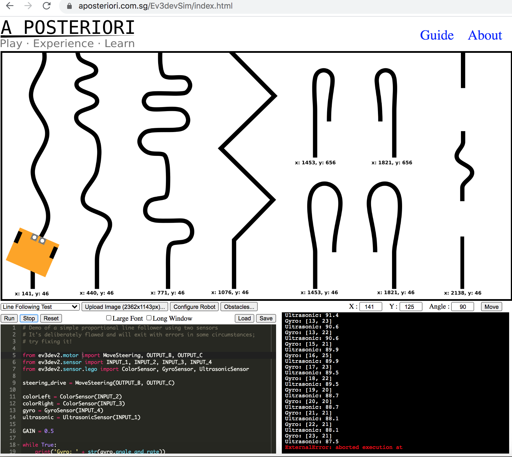

---
jupyter:
  jupytext:
    notebook_metadata_filter: rise
    text_representation:
      extension: .md
      format_name: markdown
      format_version: '1.2'
      jupytext_version: 1.4.2
  kernelspec:
    display_name: Python 3
    language: python
    name: python3
  rise:
    enable_chalkboard: true
    scroll: true
---

<!-- #region slideshow={"slide_type": "slide"} -->
# TM129 Robotics Refresh

Tony Hirst

Computing and Communications, The Open University

`tony.hirst@open.ac.uk`

`blog.ouseful.info`

`github.com/innovationOUtside`
<!-- #endregion -->

<!-- #raw slideshow={"slide_type": "notes"} -->
A review of updates in progress to the TM129 robotics module.
<!-- #endraw -->

<!-- #region slideshow={"slide_type": "slide"} -->
## Not Demos

### `https://github.com/innovationOUtside/`

### and then:

- ### simulator package: `nbev3devsim`

- ### draft materials : `tm129-robotics2020`

Note: these are works in progress... I try to ensure that the current `master` works, but:

1. can't guarantee it...
2. my current WIP may be several days ahead of `master`
<!-- #endregion -->

<!-- #region slideshow={"slide_type": "notes"} -->
Everything is available on public repos...
<!-- #endregion -->

<!-- #region slideshow={"slide_type": "slide"} -->
## PLEASE...

## If you try something in one of my repos and it doesn't work, or it doesn't work as you expect, *file an issue.*

## You spotting a problem and keeping it to yourself just represents a waste of your time and doesn't help address the issue.

## PRs are also welcome.
<!-- #endregion -->

<!-- #region slideshow={"slide_type": "notes"} -->
Quality improvement processes only work if there's a working feedback loop...
<!-- #endregion -->

## DEMO SERVER

*No longer available*

There are users `demo1`, `demo2`,...`demo9`, NO PASSWORD.


If someone has already started a server, you will be taken straight to the notebook...

Via: https://github.com/plasmabio/tljh-repo2docker, running on Digital Ocean. Took about 20 mins to build, cost <$1 for a couple of hours on a sizeable vanilla Linux server in London region.

<!-- #region slideshow={"slide_type": "notes"} -->
The demo server was an afterthought; the materials are currently in various states of brokenness. But it made the point that I could put a server up from a cold start forty mins before the seminar began...
<!-- #endregion -->

<!-- #region slideshow={"slide_type": "slide"} -->
## In The Beginning...

- T184 Robotics and the Meaning of Life (2003-2011)
  - 10 points, Relevant Knowledge / Technology Short Course Programme
  - 50% online VLE teaching material, 50% computer desktop practicals
  
- TM129 Technologies in Practice (2013-)
  - Robotics module: T184, slightly revised
  - introduction to programming remit
<!-- #endregion -->

<!-- #region slideshow={"slide_type": "notes"} -->
Some history and context...
<!-- #endregion -->

<!-- #region slideshow={"slide_type": "slide"} -->
## RobotLab Practical Activities


<!-- #endregion -->

<!-- #region slideshow={"slide_type": "notes"} -->
The RobotLab desktop application used to date in TM129.
<!-- #endregion -->

<!-- #region slideshow={"slide_type": "slide"} -->
# Accessing Legacy Windows Apps Via a Browser


https://github.com/ouseful-demos/jupyter-desktop-server


<!-- #endregion -->

<!-- #region slideshow={"slide_type": "notes"} -->
Keeping the RobotLab application running on a cross-platfrom basis is/was an unnecessary overhead.

The `jupyter-desktop-server` extension exposes a Linux desktop via `jupyter-server-proxy`. If we add *Wine* to the environment, we can run Windows applications on the desktop.

Installing the `jupyterlab-iframe` extension to the mix means we can display the proxied desktop in a Jupyterlab window.

Change the desktop resolution from the virtual desktop *Applications* menu.
<!-- #endregion -->

<!-- #region slideshow={"slide_type": "slide"} -->
# TM129 Update, 20J — Replacing RobotLab

This is not the first time RobotLab has been replaced in an OU module...

- T176 Engineering: professions, practice and skills 1
  - week long residential school
  - four day long activities including Robotics
  - robot activity originally used RobotoLab with Lego Mindstorms RCX robot
  - revised robot activity uses Lego software with Lego EV3 robot
  - BUT there was some early prototyping of using the Python wrapper for `ev3dev`...

<!-- #endregion -->

<!-- #region slideshow={"slide_type": "notes"} -->
We've replaced RobotLab in a module before...
<!-- #endregion -->

<!-- #region slideshow={"slide_type": "slide"} -->
## The Premise

Can we find an alternative to the current RobotLab simulator that:

- provides a text based instruction language (Python == a big plus);
- is accessed via a browser (use portability);
- mirrors many of the features of RobotLab (purpose designed; ideal for teaching a range of issues);
- allows us to replicate many of the original activities (current teaching line is tried and tested; familiar to tutors).
<!-- #endregion -->

<!-- #region slideshow={"slide_type": "notes"} -->
This slide added after the seminar - what are we trying to do in the rewrite?
<!-- #endregion -->

<!-- #region slideshow={"slide_type": "slide"} -->
## My Personal Preference

Replacement simulator should be useable in a Jupyter notebook context:

- allows us to explore Jupyter based teaching further;
- provides an on-ramp into notebooks at level 1
  - students are then aware of the notebook UI and may choose to use it as a personal scratchpad, notebook etc.
- allows us to test distribution approach in a low risk context (10 point module, level 1, pass fail grade)
- may be useful developing pedagogy and prototyping/testing elements for notebook based courses due out next year/year after (level 2, 30 credit point module on algorithms/Python; level 3, 30 credit point module on machine learning). 

<!-- #endregion -->

<!-- #region slideshow={"slide_type": "notes"} -->
Another slide added after the seminar - why use Jupyter...
<!-- #endregion -->

<!-- #region slideshow={"slide_type": "skip"} -->
Aside:

The Jupyter ecosystem can be extended in several ways.

Jupytext is essentially a server extension. Server extensions typically manage how the server works with raw documents, but also things like server proxies. Jupytext can intercept a request to view a markdown document with an on-the-fly conversion to a notebook format that lets the document be rendered as a notebook.
 
The UI you see in the browser is typically extended using notebook extensions. So this is stuff like buttons on the toolbar. Extensions also load things into the UI javascript, so you can do a level of interface level of interception there. Eg seeing a cell tagged a particular way and adding a class element to a div that invokes particular styling.
 
When a code cell is run normally, the code is sent to the kernel interpreter, executed, and response returned. (The kernel state also gets updated.)
 
Some notebook cell extensions can also be used to intercept code when a code cell is run; eg this extension https://github.com/innovationOUtside/cell_shell_magic/blob/master/cell_shell/__init__.py intercepts the code and prefixes it with the %%python3 magic , which forces the code to run in its own python shell (so this extension essentially converts to the notebook to one where the cells are all stateless – the only state you get is what you set from code running in that cell.

Magics also apply at the cell level. When a code cell containing magic is run, the line or cell contents are intercepted by the magic handler rather then sent for execution to the kernel. The magic decides what’s to be done with the line or cell contents. So eg this is the handler for the diff magic that finds differences between code cell contents: https://github.com/innovationOUtside/nb_cell_diff/blob/master/nbcelldiff/magics.py The code in the cell body is not run. The code that is run is the magic handler invoked by the block magic call, which takes as a function the cell content.
<!-- #endregion -->

<!-- #region slideshow={"slide_type": "slide"} -->
## TM129 — Moving to Python

- Python wrapper to Lego `ev3dev` Linux operating system
- now also the `ev3devsim` simulator


<!-- #endregion -->

<!-- #region slideshow={"slide_type": "notes"} -->
A relatively recent appearance, the `ev3devsim` simulator seemed like it could provide a good replacement, or at least, a good basis for replacement, for the RobotLab simulator.
<!-- #endregion -->

<!-- #region slideshow={"slide_type": "subslide"} -->
## ev3devsim

- runs in the browser
- uses Skulpt
- implements a cut-down version of `ev3dev-py` as a Skulpt package

BUT

- no access to full SciPy stack;
- how do we provide instruction?
<!-- #endregion -->

<!-- #region slideshow={"slide_type": "notes"} -->
Design-wise, `ev3devsim` is a blend of Javascript and Python.

The `ev3dev-py` package is Python, with a few hooks in Skulpt Javascript that relate Javascript simulator state and functions onto `ev3dev-py` state and calls.
<!-- #endregion -->

<!-- #region slideshow={"slide_type": "slide"} -->
## The Naive Jupyter Way

- embed `ev3devsim` in a Jupyter notebook or JupyterLab IFrame window

Disadvantages:

- very loose coupling between teaching materials eg in notebook and simulator
<!-- #endregion -->

<!-- #region slideshow={"slide_type": "notes"} -->
We could just embed `ev3devsim` in an IFrame and wrap it with teaching material.

This could be done at the cell level, or pop the simulator into a floating widget and use it there...

Note: we could drop the whole Jupyter requirement at student run-time and just have instructional material and the simulator in a flat web page (no server requirement other than the webserver; or even just free run it from files downloaded to your own desktop). I have to admit, this only occurred to me recently. Jupyter might still have a role, eg in providing the authoring environment, and then publishing the notebooks to HTML via Jupyter Book or `nbsphinx`, perhaps extended to support the widget display.

Another alternative, at the back of my mind but not explored, is exposing the content to students via Jupyter Book with Thebelab / juniper.js providing kernel support via a Binderhub or other Jupyter server. Maybe even via a pyodide implemented Jupyter Python kernel running in the browser...
<!-- #endregion -->

<!-- #region slideshow={"slide_type": "slide"} -->
## Naive Integration Example
<!-- #endregion -->

```python
from IPython.display import IFrame
IFrame('https://www.aposteriori.com.sg/Ev3devSim/index.html', width='100%', height=800)
```

<!-- #region slideshow={"slide_type": "notes"} -->
Example of just embedding the `ev3devsim` simulator in an IFrame. The `IFrame` code cell input could be hidden in the notebook. Could we also embed the iframe as HTML in a markdown cell so there is no need for the notebook to be run to generate the iframe?
<!-- #endregion -->

<!-- #region slideshow={"slide_type": "slide"} -->
## Integrated Jupyter Way - `nbev3devsim`


<!-- #endregion -->

<!-- #region slideshow={"slide_type": "notes"} -->
The IFrame could be popped into a floating widget. Or, the approach I have followed, is to create a custom `ipywidget` built from `ev3devsim` code and compoenents, wrapped using `jp-proxy-widget`.

The model I have used for geting code into the simularo is to entered it into a magicked code cell; running the code cell then "download" the code to the simulator, and it is then run in the simualtor from the simulator *Run* button.
<!-- #endregion -->

<!-- #region slideshow={"slide_type": "slide"} -->
##  `nbev3devsim` Widget

`jp_proxy_widget` wrapped version of `ev3devsim`


<!-- #endregion -->

<!-- #region slideshow={"slide_type": "notes"} -->
Overview of the widget components. The styling and layout is still to do: the functionality is still evolving... 

In the final design, should everything be visible? Or hidden in tabs or slider windows? No idea; and at the moment, my weak CSS skills means I'd need a fair bit of playing to figure things out...

The coloured boxes are there to help me see the extent of the elements components are in.
<!-- #endregion -->

<!-- #region slideshow={"slide_type": "subslide"} -->
### `nbev3devsim` Controls


<!-- #endregion -->

<!-- #region slideshow={"slide_type": "notes"} -->
The *paste* button allows you to paste code from the clipboard into the simulator. So you could copy code from a markdown cell or code cell, for example, then paste it into the simulator rather than downloading it by running a code cell. (This represented a step on the way to making the student workflow possible in eg a Jupyter Book UI. Code could be manually copied from the text and pasted into the simulator.)

The original RobotLab had noise levels for each sensor and each motor. So far, one noise level can be applied to all motors, one to all sensors. I need to address this, but it complicates the UI. A drop down window and may also complicate the simulator code. A drop down config window, light the robot config window, could make sense.
<!-- #endregion -->

<!-- #region slideshow={"slide_type": "subslide"} -->
### `nbev3devsim` Output Area


<!-- #endregion -->

<!-- #region slideshow={"slide_type": "notes"} -->
The output area can be used to dsiplay print messages; it's also where error messages are displayed. (I changed the colour from red to pink because red on black was low contrast; colour settings need to be pulled out into a settings file, perhaps, to make accessibility updates easier?)

Error messages are line numbered according to the whole programme, which is different to the programme in a code cell if a magic that inlcudes imports is used. The full programme is visible in the simulator programme preview; should the code cell allow template code to be automatically inserted into the cell when the code cell is run, or toggled somehow?

Error messages are also cryptic - you're never sure *which* file a line that caused an error is in. Can the file name at least be bubbled up into the error message somehow?
<!-- #endregion -->

<!-- #region slideshow={"slide_type": "subslide"} -->
### `nbev3devsim` Sensor View


<!-- #endregion -->

<!-- #region slideshow={"slide_type": "notes"} -->
Sensor values are previewed numerically and visually. Should the sensor displays have an option to be hidden and not updated, eg if the simulator is stuggling to run in a browser on a low-specced machine? 
<!-- #endregion -->

<!-- #region slideshow={"slide_type": "subslide"} -->
### `nbev3devsim` Code Display


<!-- #endregion -->

<!-- #region slideshow={"slide_type": "notes"} -->
The code display in the simulator is the full programme, rather than just the boilerplate free code body that may appear in the code cell.

The code display needs syntax highlighting and (optional?) line numbers. Also, it'd be nice if an error could be identified as relating to this programme and displaying where the error is in the programme.

We could also display this code in an editor window; but then, how should be this reflected back to the code in the code cell from which the code in the simulator was originally downloaded?
<!-- #endregion -->

<!-- #region slideshow={"slide_type": "slide"} -->
## `jp_proxy_widget` == `ipywidget` wrapper

- supports state transfer between notebook Python kernel and Javascript
- code is "downloaded" to the simulator from a magicked notebook cell
- simulator state, robot state and robot datalog contents are aviailbale to notebook Pyhton kernel


<!-- #endregion -->

<!-- #region slideshow={"slide_type": "notes"} -->
Wrapping the simulator as an `ipywidget` means we can get state trasfer / variable synchronisation going between the simulator Javaascript state and the Python kernel state.

The example here shows how we can access data logged in the simulator from within the Jupyter Python environment, and then charted using whatever Python charting we like.

I did have a demo of updating a Pyhton chart live from the simulator, but it was a bit stuttery at times. Using a Javascript chart package within the simulator widget was far smoother (it may even be reactive, I forget...).
<!-- #endregion -->

<!-- #region slideshow={"slide_type": "slide"} -->
## Virtual Machines All The Way Down


<!-- #endregion -->

<!-- #region slideshow={"slide_type": "notes"} -->
The TM129 is composed of three modules: robotics, networking and Linux/operating systems. At the back of my mind, the architecture could perhaps be used to illustrate certain concepts, eg regarding virtual machines, state encapsulation, etc, in the Linux/Operating systems unit.

The VM situation is also actually a little bit more complicated than the diagram suggests:

- there is a state return path *from* the `nbev3devsim` simulator running in the browser Javascript context back to the Jupyter mediated Python environment;
- the Jupyter Python environment, and the Jupyter server are running on a Linux o/s in a Docker container;
- the Docker applciation *might* be running on the host o/s, or it might be remote and being access over an intervening network.

If the chart block is reactive, there's also a story to be told about how *that* works (via events, dear boy, events...).
<!-- #endregion -->

<!-- #region slideshow={"slide_type": "slide"} -->
## Delivery Model — Open Computing Lab (OCL) — Aims

https://github.com/innovationOUtside/Open_Computing_Lab_Guide

-  provide module specific computational environments capable of running:
  - locally on students' own computers;
  - on OU hosted onlines servers;
  - on remote third party servers;
  - on personal home servers (eg Raspberry Pi).
<!-- #endregion -->

<!-- #region slideshow={"slide_type": "notes"} -->
So this is me, trying to articulate some of the ideas I've had for years. Giving the idea a name, imagining as something that really exists, and then riffing around the name is an approach I haven't tried before...
<!-- #endregion -->

<!-- #region slideshow={"slide_type": "slide"} -->
## Delivery Model — Open Computing Lab (OCL) — Approach

- Docker containers
  - package and distribute arbitrary computational environments running arbitrary applications;
  - OU controls the computational environment (Docker runs "anywhere");
- Jupyter services:
  - providing single and multi-user access to browser accessed applications and environments;
  - support interactive and reflective read-write-execute activities.
<!-- #endregion -->

<!-- #region slideshow={"slide_type": "notes"} -->
The approach is simple:

- we use Docker containers, and any computational environment we make available to students via a hosted service is *exactly the same* environment as they can take away and run at home, or wherever, for themselves.
- we use notebooks as the UI, because having an extensible, persoanlisable, read-write-execute UI makes lots of things possible;
- we use Jupyter services because the community is a strong one that draws on enterprise, as well as academic, developer support. Jupyter as an architecture / framework is integrated and covers everything from the UI (eg notebooks, nteract, etc), to scaleable deployment (Kubernetes integration), multi-user access with and without auth and user (file) persistence (JupyterHub, BinderHub), arbitrary compute environments (whatever kernel you like).
<!-- #endregion -->

<!-- #region slideshow={"slide_type": "slide"} -->
## Development Context

```
# Run command - name container, set port, provide token, set-up (package development) volume mounts
docker run  --name tm129test 
            -p 8129:8888
            -e JUPYTER_TOKEN="letmein"
            -v "$PWD:/home/jovyan/notebooks"
            -v "$PWD/../nbev3devsim/:/home/jovyan/nbev3devsim"
            -v "$PWD/../playground:/home/jovyan/playground"
            -v "$PWD/../nb_extension_twoCol/:/home/jovyan/twoCol"
            -v "$PWD/../nb_extension_empinken/:/home/jovyan/empinken"
            ousefuldemos/tm129-robotics2020:latest

docker stop tm129test   #used to stop container
docker start tm129test  #used to restart container with persisted config options
```
<!-- #endregion -->

<!-- #region slideshow={"slide_type": "notes"} -->
I'm developing lots of things in tandem, and this shows how; packages under development on cloned repos on my local machine, mounted into different directories in the base environment container; I can then edit various package files on host and easily update them in the container.

For a student running the container, they only need up to an including the `/home/joyan/notebooks` path.

The quotes are important on a Mac at least if the $PWD has a space in it. I donlt know how to write robust Docker volume mounts from a Windows command prompt. Anyone? Anyone?
<!-- #endregion -->

<!-- #region slideshow={"slide_type": "slide"} -->
## Building the Tools of Production

- convert original materials to notebooks
  - OU-XML to markdown (TH OU-XML processor;
    - OpenLearn example: https://github.com/psychemedia/openlearn-publish-test
  - markdown to Jupyter notebook (`jupytext`)
- evolving the simulator throughout the update
- generating diagrams and simulator backgrounds
- quality tests
<!-- #endregion -->

<!-- #region slideshow={"slide_type": "notes"} -->
I've never really understaood why folk should spout the mantra "everyone should learn to code" if they don't ever write any...

I see code as:

- a tool for building tools;
- a tool for getting things done (often through automation of repeatable, reproducible, editable tasks).

So the production process for me is as much about developing the production, teaching and learning environments as it is about just "the course materials".

Specifically:

- *production environment*: our modules take a long time to develop and are expected to last a long time; if you need to update something, such as an image, that can be a real faff... For xample, if we script the production of assets, then if we need to regenerate and asset, we can rerun the script; if we need to update and asset, we can tweak the script and generate the new one.
- *teaching*: tools to support teaching, which includes out delivery of materials, but also supporting ALs. For example, the `nbev3devsim` widget is being developed to support teaching; the `empinken` pink button is there to support ALs providing feedback; I'm also trying to mark-up teaching notebooks with slide tags so that can be used in a tutorial context, with select cells from a teaching notebook creating a coherent presentation.
- *learning*: this is what the students do; we should be providing them with an environment that they can take control of. So for example, tools that let them personalise / customise / take ownership of the notebook environment as well as the notebooks themselves. We can give them a base environment we think does the job, but they should then be able to take ownership of it and make it work better for them *if they want to*. We should also provide tools that they choose to use to support learning, rather than we provide to support teaching. The `cell diff` extension can help with that: students can choose to use it to compare one of their run code cells with another. (We can also invoke its use for a *teaching* purpose if, for example, we want to compare the code in two cells we have provided; but it also works when the student's choose to use it themselves, out of our ken and control, to check their own understanding of something.)

So, some of what I've done in my activities relating to updating TM129 have actually been to do with building tools to support the production process. 
<!-- #endregion -->

<!-- #region slideshow={"slide_type": "subslide"} -->
### OU-XML Processing

Pipeline for:

- grabbing OU-XML
- parsing XML
- identifying and downloading image assets
- converting parsed XML into markdown or Jupytext-markdown

OpenLearn example workflow: https://github.com/psychemedia/openlearn-publish-test
<!-- #endregion -->

<!-- #region slideshow={"slide_type": "notes"} -->
This is something I've dabbled with for years: generating things from OU-XML; the latest incarnation churns OU-XML into a markdown feedstock for conversion to Jupyter notebooks via Jupytext.

As to why it's relevant here? The TM129 robotics update is an update to the legacy materials, in which I wanted to preserve as much of the original material as possible and then just update the activities to use a replacement simulator.

As I'm authoring in the notebook UI, it made sense to get the original material into a format where I could start to edit it in the notebook UI. OU-XML conversion to markdown does that: I can edit the markdown either as markdown, or in the Jupyter UI under Jupytext.
<!-- #endregion -->

<!-- #region slideshow={"slide_type": "subslide"} -->
### Generating Simulator Backgrounds


<!-- #endregion -->

<!-- #region slideshow={"slide_type": "notes"} -->
The simulator activities run over a range of different backgrounds. The original RobotLab backgrounds had the wrong resolution and were just flat images.

By scripting the production of backgrounds:

- it's easier to tweak them if they need updating;
- students can tweak them and customise them if we make the means of their production available to them;
- if we need new assets, we may be able to extend or reuse bits of the production process form pre-existing assets.
<!-- #endregion -->

<!-- #region slideshow={"slide_type": "subslide"} -->
### Processing Images — Adding Noise


<!-- #endregion -->

<!-- #region slideshow={"slide_type": "notes"} -->
One of the original actvities used a noisy background, so I started exploring a tool to add noise to images as part of the image production process.

But having a tool available that adds variable amounts of noise to an image makes other things possible, like activities where wather than control sensor noise, we control environment noise.

Sometimes, tools developed to support *production* may also be reusable as tools that can extend activity delivery, or make new activities possible if we put the tools of produciton into the students' hands.
<!-- #endregion -->

<!-- #region slideshow={"slide_type": "subslide"} -->
### Notebook Quality Checks


See also: [Fragment – Metrics for Jupyter Notebook Based Educational Materials](https://blog.ouseful.info/2019/12/17/fragment-metrics-for-jupyter-notebook-based-educational-materials/)
<!-- #endregion -->

<!-- #region slideshow={"slide_type": "notes"} -->
I love the idea of macroscopes, tools for looking at everything in one go, and this is one such: a very simple display that renders the relative length of notebooks based on the amount of code and markdown text they contain, delimiting cells with grey bars and colouring markdown and code cell blue and pink respectively.

This was a half-hour hack (ish...), not least becuase parsing of the notebook JSON format is trivial using the `nbformat` package, and can be extended variously:

- generate time estimates for code cells based on lines of code and code complexity;
- colour markdown cells based on the readability index of the content;
- tweak markdown cell display with an overprint that shows code within the markdown cell;
- highlight presence of image, video an audio assets as overpints;
- extract activity duration and use that to size cells (a short markdown cell may set up an hour long activity);
- highlight sections and subsections based on heading levels, or activity areas based on empinken activity cell metadata, for example;
- etc

Note that the more layers we add, the more complex the visualisation will become to read. Which means it;s something you should start with simply and then become more expert at reading, adding new layers and views as you grow your uderstanding of the notebook structure starting from a really simple quick glance from the minimal pink'n'blue view.

With the OU-XML2md2ipynb process, we also have the opportunity for generating similar views over OU-XML materials. I'm really surprised that no-one in IET has been analysing OU materials using this sort of mechanised / automated visualisation approach, or generating statistics and possibly even learning design models from static analysis of OU-XML materials. But then, they're educational researchers and I'm not, so what do I know?!;-)
<!-- #endregion -->

<!-- #region slideshow={"slide_type": "slide"} -->
## Editing Process

I have absolutely no idea...


<!-- #endregion -->

<!-- #region slideshow={"slide_type": "notes"} -->
The materials have yet to be edited, and the question is *how* will they be edited. Trad OU materials are authored in Word, edited in Word, revised in Word, converted to OU-XML, and rendered on the VLE. (If the level of disconnect makes you think that this means we don't actually write for the web delivery medium by writing in that medium and as such exploiting the potential of that medium, you'd arguaby not be wrong...)

My workflow is author in notebooks (or markdown in a text editor; I know how to read and write the code, and know how it'll be rendered...) for delivery via the notebooks.

The screenshot above shows what the markdown looks like; the commented items are Jupytext markdown elements that help rebuild the Jupyter notebook view.
<!-- #endregion -->

<!-- #region slideshow={"slide_type": "subslide"} -->

<!-- #endregion -->

<!-- #region slideshow={"slide_type": "notes"} -->
This is how the markdown is rendered. The `empinken` extension colours the activity tagged cells and the `hidden=true` element is picked up by the notebook *Collapsible Headings* extension to hide a by default unrevealed answer. (In a notebook without the extension, the answer is displayed in plain view.
<!-- #endregion -->

<!-- #region slideshow={"slide_type": "skip"} -->
Aside:

Having answers revealed in unextended notebooks can be an issue, but there are ways round that.

A naive way is to put answers and hints in a separate, linked notebook, but I donlt like that approach. Having things strewn across multiple files is to my mind *not* the best way of adding the right amount and right sort of friction to the answer lookup problem. It also causes maintenance issues, unless you are generating separate student activity notebook and student hint notebooks from a single master notebook that contains activities and hints in the same document.

If you put the hints in separate files, eg `week2_section1_activity3.py` in a solutions dir, `../../solutions`, then in a code cell, a student can run the following in a code cell:

`%load ../../solutions/week2_section1_activity3.py`

and the content of the file will be loaded into the code cell.

The advantage of this is that a student has to take a positive action to render the answer code into the cell. You can make this easier or harder depending on how much friction you want to add. Eg low friction: just comment out the magic in the code cell, so all a student has to do is uncomment and run it. Higher friction: make them work out what the file name is and write it themselves.


Other approaches I have seen to hiding and revealing answers is to create a package that contains the answers, and then run a call onto that package to display the answer. eg s/thing like

```
from m269activities import hints
hints.reveal('week2_section1_activity3')
etc
```

Rather than rendering answers from a py function, you could also do it from magic which maybe has a slightly different feeling to it. eg

`%hint week2_section1_activity3`

You could also explore different sorts of friction, using nudges:

`%oh_go_on_then_give_me_a_hint_for week2_section1_activity3`

or 

`%ffs_why_is_this_so_hard week2_section1_activity3`

If the magic incantation is memorable, and students know the pattern for creating phrases like week2_section1_activity3 eg from the notebook URL pattern, then they can invoke the hint themself by saying it. You could even have aliases for revealing the hint, which the student could use in different situations to remind themselves of their state of mind when they were doing the activity.

`%Yes_I_did_it_but_what_did_you_suggest_for week2_section1_activity3`

It also occurs to me we could extend the Collapsible Heading notebook extension...

Tag a cell as an answer-header cell and in a code cell below put a #%load answer.py line.

In an unextended notebook, student has to uncomment the load magic and run the cell to reveal the answer; in an extended notebook, the extension colour codes the answer cell and collapses the answer; when the student clicks to expand the answer, the extension looks for #%load lines in the collapsed area, uncomments and executes them to load in the answer, expands the answer cells.

We could go further and provide an extension that lets an author write an answer in eg a markdown cell and then "answerify" it by posting it as metadata in preceding Answer reveal cell. In an unextended student notebook, the  answer would be hidden in metadata. To reveal it, a student could inspect the cell metadata. Clunky for them and answer wouldn't be rendered, but doable. In extended notebook clicking reveal would cause the extension to extract the answer from metadata and then render it in the notebook.
<!-- #endregion -->

<!-- #region slideshow={"slide_type": "subslide"} -->
### All Materials On Github


<!-- #endregion -->

<!-- #region slideshow={"slide_type": "notes"} -->
In normal workflow, documents are emailed backwards and forwards between author and editor, or placed in shared filestores. My documents are on a (public) Github repo, and whilst if absolutely pushed I might grudgingly make that a private repo, the repo location still works for my workflow, not least because of some of the features it offers to support issue capture, tracking, discussion and review.
<!-- #endregion -->

## Track Changes


<!-- #region slideshow={"slide_type": "notes"} -->
Track changes is widely used in the normal editing process for the editor to communicate suggested changes to the author and *vice versa*. What is diffing if not "Track Changes"?
<!-- #endregion -->

<!-- #region slideshow={"slide_type": "subslide"} -->
## Comment On Changes


<!-- #endregion -->

<!-- #region slideshow={"slide_type": "notes"} -->
If there is a diff, we can chat about it in context...
<!-- #endregion -->

<!-- #region slideshow={"slide_type": "subslide"} -->
## Issue Threads

(And *Github Discussions* on the way...)


<!-- #endregion -->

<!-- #region slideshow={"slide_type": "notes"} -->
If there's an issue, it can be raised as such, and a link provided into the relevant line or lines. Updates that address the issue, if appropriately committed, can automatically close the issue, providing a feeback loop from the issue (which points to the original problem in a source document at one point in time) to the fix, which shows the corrective measure and which can also be diffed back to the original.

In passing, I note that Github Discussions, (more general forums) will soon be available on a per repo basis for more general dicusssions.
<!-- #endregion -->

<!-- #region slideshow={"slide_type": "slide"} -->
## Evolving the Pedagogy

- notebooks are medium that support interactive *teaching* as well as *active and reflective learning*
- the medium is a computational medium and as such is malleable in our hands
  - _"everyone should learn to code..."_
  - custome notebook magics and extensions
  - third party extensions
<!-- #endregion -->

<!-- #region slideshow={"slide_type": "notes"} -->
Presenting material for the first time has an element of opportunity about it, not least when it comes to setting the expectations of the ALs. It's also the time we are free-est to try things out.
<!-- #endregion -->

<!-- #region slideshow={"slide_type": "skip"} -->
Aside:

Once a course is presented, course managers do what they can to minimise the changes that are applied because of risk, admin, process, and cost. (OU academics can't just edit and update materials. Typos spotted and mentioned by a pathfinder student studying weeks ahead of anyone else in the first presentation of a course can take years correct...)

So, again picking up on the mantra, if we're all expected to code, then what are we expected to code, my attitude is to treat the environment as an extensible one and consider ways in which we might usefully extend it (to support production, teaching and/or learning...).

Note that I'm in a long running debate about the extent to which we should provide students with a customised environment that we provide to students, and within which we create materials that exploit those extensions, versus creating materials for a vanilla, unextended environment that a student might run from an off-the-shelf Anaconda installation.

I have already stated my preference for providing customised computational environments using Docker containers, and that includes customisations of the Jupyter notebook environment that runs inside them. I do recognise that graceful degradation is desirable.

A middle ground might be a Python or conda package that students can install that does what it can to extend a vanilla environment to resemble a preonfigured one.

This might also be a neater way of creating Open Computing Lab environments.

For example, an OCL environment is built from a base environment and then extended by install an OU-branding package, a module-requirements package (required packages and applications), and a recommended module-environment package (recommended environment customisations). Students could then download and install these themselves into their own vanill environment.

Binder / REES specificaitons and TLJH plugins might have a role to play here too, somewhere...
<!-- #endregion -->

<!-- #region slideshow={"slide_type": "subslide"} -->
### Cell Status Indicators


<!-- #endregion -->

<!-- #region slideshow={"slide_type": "notes"} -->
I do like the cell status indicators provided by the [multi-outputs](https://blog.ouseful.info/2019/02/11/quick-review-jupyter-multi-outputs-notebook-extension/) notebook extension. They show progress through a notebook, and if you do away for a think about a broken cell, your attention is grabbed back to that cell when you return. Fixing the issue and seeing the cell execute blue then go green gives you a visual reward.
<!-- #endregion -->

<!-- #region slideshow={"slide_type": "subslide"} -->
### Activities


<!-- #endregion -->

<!-- #region slideshow={"slide_type": "notes"} -->
The original TM351 distribution style activity cells blue, in keeping with the theming of the online VLE materials. A notebook update and bad original coding made the extension powered cell colouring unreliable, but now it's back.

I also added a yellow cell highlight that I think can be used in at least two ways. Firstly, as a prompt to students in activities that they need to write something in the notebook as part of the activity. Secondly, via a button clicked when a cell is selected, so that students can highlight cells that they have added to the notebook to distinguish them from content that came with the original notebook. (I guess we could tweak the cell add button so that all cells added to a provided notebook by a student get coloured?)
<!-- #endregion -->

<!-- #region slideshow={"slide_type": "slide"} -->
### Highlight Tutor Feedback


<!-- #endregion -->

<!-- #region slideshow={"slide_type": "notes"} -->
The original cell colouring extension provided buttons to colour selected cells. A blue colour was applied to cells that formed activities; a pink colour was used in *production* by the course team to highlight course teams discussions, or cells that contained errors. The blue colour applying button was used in *production* to style how the notebooks were presented in *teaching* presentation. Also in presentation (teaching), tutors used the pink button, which became known as the *empinken* button, to colour feedback cells they had added to students' marked work. `empinken` is now the name of the updated package:-)
<!-- #endregion -->

<!-- #region slideshow={"slide_type": "subslide"} -->
### Third-party extension — `nbtutor`

https://github.com/lgpage/nbtutor
<!-- #endregion -->

<!-- #region slideshow={"slide_type": "notes"} -->
As an introductory programming module, in part, I thought it make sense to explore ways of embedding tools that might be used to support teaching — and learning — around simple programme code execution models....

Unfortutely, the tool doesn't (currently?!) work with the code intended for use in the simulator.
<!-- #endregion -->

```python
from IPython.display import Video
Video('presentation_images/nbtutor_demo.mp4')
```

<!-- #region slideshow={"slide_type": "notes"} -->
Python tutor is a web based tool that steps through a trace of some executed Python code. It's also available in the form of a notebook extension.

As a tool, we can use it two ways:

- to support *teaching*, by writing content around its explicit use;
- to support self-directed *learning*, where students choose to add the `%%nbtutor` to a mgic themselves to to step through and check either their own code *or* the execution of code we have provided them with.

Again, by providing students with the tool, they can choose whether or not to use it for their own benefit outside of any activities we have written around it or explicitly recommend its use with.
<!-- #endregion -->

```python hide_input=true
from IPython.display import Video
Video('presentation_images/nbtutor_demo.mp4')
```

<!-- #region slideshow={"slide_type": "slide"} -->
## Exploiting the Medium — Accessibility

As a computational medium, we can seek to explore the medium in ways that improve accessibility and explore alternative modalites.

- audio feedback in `nbev3devsim`;
- `say()` as well as `print()` feedback in `nbev3devsim` code;
- audio feedback mode in Eliza demos;
<!-- #endregion -->

<!-- #region slideshow={"slide_type": "notes"} -->
Making materials accessible can improve them for everyone, whether they means making them easier to read for visually impaired students, easier to use for students with mobility issues, arthritis, rheumatism or RSI pain, or students with fatigue or concentration issues, for English as a second language students, or for students who struggle with the cognitive load associated with reading complex texts or navigating complex user interfaces.

Providing alternatives — keyboard shortcuts, audio feedback, voice control — may be instigated to support one particular accessibility issue, but may also be of benefit to others outside that "target" user commuunity.

So, given we keep on hearing that "everyone should learn to code", as we develop our teaching materials, why not also take the opportunity to see if we can develop the environment for accessibility gains too? (You may notice a theme here, too. I see the environment *as part of the course materials*...)

Creating tools to support accessibility may also end up providing tools that we can use to create other, previously unimagined activities, either in terms of what the activity might teach, or how we might support interaction with it.

So for example, I have been exploring adding audio feedback to various things. When code is downloaded from a code cell to the simulator, there is an audible alert, mimicking the alert of downloading code to a real EV3 robot.

A `say()` function produces an audible message that complements the way a `print()` statement in a simulator code programme displays an output in the simulator output window. (I wonder: would `from IPython.display import say` be useful?)

```pyhton
from IPython.display import Javascript, display

def say(txt):
    display(Javascript(f'speechSynthesis.speak(new SpeechSynthesisUtterance("{txt}"))'))

say('hello there')
# Will probably fall over if there are any double quotes in the string passed into to say()
# But it's a start...

```

Could / should we extend the cell output display to optionally sound an alert if a code cell fails? (Hmm.. I think I'll add that...)
<!-- #endregion -->

<!-- #region slideshow={"slide_type": "subslide"} -->
### Eliza


Original code: https://github.com/dhconnelly/paip-python
<!-- #endregion -->

<!-- #region slideshow={"slide_type": "notes"} -->
One of the issues with writing the robotics activity updates separate to the online teaching component of the module means a potential disconnect between the two. The online materials mentioned Eliza and (I think?) sent students off to  a third party online Eliza app. Hmm... The practical activities included a short consideration fo rule based systems, so don't those fit?

So I found some Eliza code, and added it the practical activities. A slight tweak, and students can write and run their own Eliza rules, and maybe even share them on the forums. Another tweak, and we can get the Eliza therapist to speak answers, rather than, or as well as, print them. Does that change the dynamic or the perception? (The course is interested in social issues, and with relationships between humans and robots, as well as technical issues.) What about if you change the voice from female (the default I set in the program, though the first sentence always seems to use the default male browser voice?) to male, or to accented male/female?

One tiny bit of code to improve accessibility (why should unsighted students have to use a screen reader to read out Eliza's repsonse), and suddenly the activity is perhaps enriched for all students and other critiquues of what's going on become possible and relevant (e.g. the affect of default voice selection in voice apps).
<!-- #endregion -->

<!-- #region slideshow={"slide_type": "slide"} -->
## Example Magics

- `nbev3devsim` magic
- flowchart diagram magic
- cell difference magic
- durable_rules magic
- (TM351 entity relation diagram magic)

<!-- #endregion -->

<!-- #region slideshow={"slide_type": "notes"} -->
I love the way *magics* was chosen as the word to describe, erm, magics (macros?) in IPython. daily I am amazed by how I can hit a few keys on a keyboard, words appear on a screen, I move my finger over a trackpad, a thing moves over the screen, I press down to "click" a button on the screen, the code I wrote is executed and the machine does something I explcitly told it to do... How is that not magical?!

Having done an electronics degree way back when, I have some sense of what's going on in terms of physics and logical computation, but it's still amazing to me.

So using the language and metaphor or magic, of speaking incantations to help folk who are struggling to understand what's going on so they can get stuff done with code, doesn't seem inappropriate to me. Harry Potter and Hermione Granger invoke the forces of nature and the elemental words by saying specific words and making particular hand gestures that are amplified by a wand tip. As kids in their fictional world, do they understand the forces of nature at play, or are they practical wizards who can say the words and make the gestures? What's the difference between that and my typing and moving a mouse around?

So magic it is: use this incantation and useful stuff will happen. You don't need to understand how...

`[Whispers]` *It's magic*...
<!-- #endregion -->

<!-- #region slideshow={"slide_type": "subslide"} -->
### `nbev3devsim` Magic Invocation

Several magics are defined for use within a code cell. Magics do two things:

A magic command identifies a cell as a simulator magic 

`%%sim_magic`

Once identified as a simulator magic cell, when that code cell is run, the code it contains is downloaded to the robot.

The magic invocation can optionally configure the simulator:

`%%sim_magic_preloaded --background Lollipop -r Small_Robot -p`

In this case, when the cell is run, as well as downloading the code (not shown):
- a particular background is loaded into the simulator;
- the robot configuration is updated to the `Small_Robot` configuration;
- the pen trace is put in pen down mode.
<!-- #endregion -->

<!-- #region slideshow={"slide_type": "notes"} -->
The `sim_magic` commands serve the dual purpose of downloading code to the simulator *and* configuring the simulator.

Ideally, *all* simulator attributes would be configurable from the magic. This allows us as educators to fully define the simulator environment within which a program should be run, which reduces activity set-up time and confusion.

At the moment, there isn't a way of displaying the simulator configuration in one view, saving it to a file or communicating it back to a code cell from which it can be relaunched.
<!-- #endregion -->

<!-- #region slideshow={"slide_type": "subslide"} -->
### Using `nbev3devsim` Magic

- `--background / -b`: specify the background option to load into the simulator; 
- `--robotSetup / -r`: define the pre-configured robot template to use;
- `--xpos / -x`: specify initial, default x-coordinate of robot for this activity;
- `--ypos / -y`: specify initial, default y-coordinate of robot for this activity;
- `--angle / -a`: specify initial, default angle of robot for this activity.

Flags (pass the following to force the specified behaviour):

- `--quiet / -q`: suppress the audio alert that from a successful download to the simulator (default: audible download alert);
- `--obstacles / -o`: enable obstacles(default: no obstacles; takes arg corresponding to predefined obstacle config (`Central_post`, `Square_posts`, `Wall`);
- `--ultrasound / -u`: show ultrasound rays (default: no rays);
- `--pendown / -p`: set the pen in the pen down position (default: pen up).
<!-- #endregion -->

<!-- #region slideshow={"slide_type": "notes"} -->
The simulator magic has a range of parameters which correspond to controls in the simulator. Ideally, there should be a clear mapping between the name label of the simulator graphical control and the parameter name using in the magic.
<!-- #endregion -->

<!-- #region slideshow={"slide_type": "subslide"} -->
### Reducing Cognitive Load — Hiding Boilerplate

Several package imports and robit configuration declarations are required in order to construct a well-formed `ev3dev-py` programme that can be used to control the simulated robot.

To simplify matters, three magics are constructed that handle the boilerplate to a a greater or lesser extent:

- `%%sim_magic_preloaded`: many `ev3dev-py` boilerplate statements handled for free;
- `%%sim_magic_imports`: many `ev3dev-py` imports handled behind the scenes;
- `%%sim_magic`: standalone progrmme: if there's boilerplate required, you need to provide it.
<!-- #endregion -->

<!-- #region slideshow={"slide_type": "notes"} -->
Given that we are in control of what is sent from the code cell to the simulator, we can create a range of magics that hide different amounts of standard boilerplate code.

This simplifies the code that needs to be entered into a simulator magic code cell and reduces the chances of error.

There is the downside that the programme entered in a code cell is not a complete programme. To a certain extent, you might also argue that the boilerplate creates a "hidden state" problem, but I thing the converse is true: it creates a problem of *assumed state*, in the sense that a student might come to assume that packages are magically loaded.

But again, there is a clue in the use of the magic: you programme might actually represent a fully working on the context of the magic because of, ern, *magic*...
<!-- #endregion -->

<!-- #region slideshow={"slide_type": "subslide"} -->
#### `%%sim_magic_preloaded`

*Boilerplate enclosed...*

```python
%%sim_magic_preloaded

# Stay inside
tank_drive.on(SpeedPercent(50), SpeedPercent(50))

while True:
    print('Light_left: ' + str(colorLeft.reflected_light_intensity))
    if colorLeft.reflected_light_intensity < 40:
        tank_drive.on_for_rotations(SpeedPercent(-50),
                                    SpeedPercent(-50), 2)
        # drive in a turn for 2 rotations of the outer motor
        tank_turn.on_for_rotations(-100, SpeedPercent(75), 2)
        tank_drive.on(SpeedPercent(50), SpeedPercent(50))
```
<!-- #endregion -->

<!-- #region slideshow={"slide_type": "notes"} -->
The preloaded magic preloads a large number of `ev3devsim-py` packages, and also creates sensor and motor configuration variable assignements according to a local naming convention.

The intention is to simplify the code in the code cell to the code that actually programmes the robot, rather than code you need to put in place before you can start to write the actual robot programme code.

If there's an error in running the downloaded programme, the reported line number will be offset by quite a lot (I forget how many) corresponding to the number of lines of boilerplate introduced by the magic.
<!-- #endregion -->

<!-- #region slideshow={"slide_type": "subslide"} -->
#### `%%sim_magic_imports`

*Imports enclosed...*

```python
%%sim_magic_imports

# Stay inside
tank_turn = MoveSteering(OUTPUT_B, OUTPUT_C)
tank_drive = MoveTank(OUTPUT_B, OUTPUT_C)

colorLeft = ColorSensor(INPUT_2)

tank_drive.on(SpeedPercent(50), SpeedPercent(50))

while True:
    print('Light_left: ' + str(colorLeft.reflected_light_intensity))
    if colorLeft.reflected_light_intensity < 40:
        tank_drive.on_for_rotations(SpeedPercent(-50),
                                    SpeedPercent(-50), 2)
        # drive in a turn for 2 rotations of the outer motor
        tank_turn.on_for_rotations(-100, SpeedPercent(75), 2)
        tank_drive.on(SpeedPercent(50), SpeedPercent(50))
```
<!-- #endregion -->

<!-- #region slideshow={"slide_type": "notes"} -->
The imports magic handles imports from `ev3dev-py` packages but does not set up motor and sensor references.

The idea here is to get the base packages into scope invisibly, then allow the student to create the sensor/motor references and write robot control code that uses them.

As with the preloaded magic, if there's an error in running the downloaded programme, the reported line number will be offset by quite a lot (I forget how many) corresponding to the number of lines of boilerplate introduced by the magic.
<!-- #endregion -->

<!-- #region slideshow={"slide_type": "subslide"} -->
#### `%%sim_magic`

*Standalone programme...*

```python
%%sim_magic

# Stay inside
from ev3dev2.motor import MoveTank, MoveSteering, SpeedPercent, OUTPUT_B, OUTPUT_C
from ev3dev2.sensor import INPUT_1, INPUT_2, INPUT_3, INPUT_4
from ev3dev2.sensor.lego import ColorSensor

tank_turn = MoveSteering(OUTPUT_B, OUTPUT_C)
tank_drive = MoveTank(OUTPUT_B, OUTPUT_C)
colorLeft = ColorSensor(INPUT_2)

tank_drive.on(SpeedPercent(50), SpeedPercent(50))

while True:
    print('Light_left: ' + str(colorLeft.reflected_light_intensity))
    if colorLeft.reflected_light_intensity < 40:
        tank_drive.on_for_rotations(SpeedPercent(-50), SpeedPercent(-50), 2)
        # drive in a turn for 2 rotations of the outer motor
        tank_turn.on_for_rotations(-100, SpeedPercent(75), 2)
        tank_drive.on(SpeedPercent(50), SpeedPercent(50))
```
<!-- #endregion -->

<!-- #region slideshow={"slide_type": "notes"} -->
All the code is required: package imports, motor and variable assignments and the control code.

If there's anything you rely on missing, it won't work.

The one upside however is that the line numbers reported if you get an error in the downloaded programme are only offset by one (accounted for by the magic line...)
<!-- #endregion -->

<!-- #region slideshow={"slide_type": "subslide"} -->
## `flowchart.js` Widget and Magic


<!-- #endregion -->

<!-- #region slideshow={"slide_type": "notes"} -->
`flowchart.js` is a Javascript package that renders an SVG or png image from a text description of the flowchart.

The original materials had some low quality flowchart images, and I needed to create some new ones. Writing them seemed to make most sense.

I originally looked at using mermaid.js, but it's display style is a bit quirky. `flowchart.js` seems much better for some flowcharts.

The original package is wrapped as an `ipywidget` using `jp_proxy_widget`, which is then called from the magic handler. It's a buit quirky, but in part, I was exploring what might be possible with `jp_proxy_widget`.

Again, this was originally a tool built to support the production of media assets for use in teaching, but if we tell students about it, it also becomes a tool they could use to support learning, creating their own flowcharts, for example.

It might also be useful in assessment if we ask students to <s>draw</s> *create* a flowchart.
<!-- #endregion -->

<!-- #region slideshow={"slide_type": "subslide"} -->
### `nb_cell_diff` Magic

https://github.com/innovationOUtside/nb_cell_diff


<!-- #endregion -->

<!-- #region slideshow={"slide_type": "notes"} -->
The idea for this magic arose in TM351, where we were discussing the rather lengthy block of code that appeared in one cell, with my arguing that it might have been built up from smaller chunks in previous code cells.

A tool like this would help display the new code in the later cell introduced over an above the code seen in a previous cell.

As such, we could use it as a *teaching* tool to show the evolution of a code block, and we could also use it to render code difference display assets.

Students can also use the magic to support their own learning by comparing code chunks across previously executed cells.
<!-- #endregion -->

<!-- #region slideshow={"slide_type": "subslide"} -->
### `durable_rules` Utility Functions and Magic

https://github.com/innovationOUtside/durable_rules_magic

Rulesets and assertions originally of the form:

```python
with ruleset('animal'):
    @when_all(c.first << (m.predicate == 'eats') & (m.object == 'flies'),
              (m.predicate == 'lives') & (m.object == 'water') & (m.subject == c.first.subject))
    def frog(c):
        c.assert_fact({ 'subject': c.first.subject, 'predicate': 'is', 'object': 'frog' })
        
assert_fact('animal', { 'subject': 'Kermit', 'predicate': 'eats', 'object': 'flies' })
```

With some utility functions, ruleset definition becomes:

```python
RULESET = new_ruleset()
with ruleset(RULESET):
    @when_all(c.first << Subject('eats', 'flies'),
              Subject('lives', 'water') & (m.subject == c.first.subject))
    def frog(c):
        c.assert_fact(SPO(c.first.subject, 'is', 'frog')) 
```

and with some magic, we can simplify assertions:

```python
%%assert_facts -r RULESET
Kermit : eats : flies
```
<!-- #endregion -->

<!-- #region slideshow={"slide_type": "notes"} -->
One of the packages I was exploring to demonstrate rule based systems is a package called `durable_rules`. The syntax for defining rulesets and asserting facts and events is a little cumbersome. But with a little bit of thought, we can start to come up with our own functions this simplify the syntax a little.

With a bit more thought, we might be able to simplify things further... or even start to look at creating DSLs (domain specific languages). There are several recent papers describing tools for creating DSL kernels from quite simple grammars.

A question then arises regarding what are we trying to teach when we teach coding and programming (and how do we distringuish between them)? How important is the syntax? How important is it that we teach languages with particular recognisable syntax.

In TM351, we don't really teach Python at all. We teach *pandas* in a mainly naive way, but occasionally using idiomatic *pandas*.
<!-- #endregion -->

<!-- #region slideshow={"slide_type": "slide"} -->
## Example Extensions

- `empinken`
- two column code cell
- *Tensorflow Playground* widget
<!-- #endregion -->

<!-- #region slideshow={"slide_type": "notes"} -->
Creating extensions represents an evolution of the user interface to provide notebook UI tools to support production, teaching and learning.
<!-- #endregion -->

<!-- #region slideshow={"slide_type": "subslide"} -->
### `empinken` Extension — Toolbar Buttons

https://github.com/innovationOUtside/nb_extension_empinken


<!-- #endregion -->

<!-- #region slideshow={"slide_type": "notes"} -->
In producing the TM129 materials, I've revisited and renewed the `empinken` extension for highlighting cells as activity or feedback cells, with a new student comment style.
<!-- #endregion -->

<!-- #region slideshow={"slide_type": "subslide"} -->
### `empinken` Extension — nbExtension Configurator


<!-- #endregion -->

<!-- #region slideshow={"slide_type": "notes"} -->
Not implemented yet, but I made a start developing an nbconfigurator view that allows the empinken buttons to be selectively enabled and diabled. The student view might just include the student highlight button, a tutor's machine might include the feedback button, and perhaps the activity button if they also wanted to produce their own additional materials with colour distinguished activities.
<!-- #endregion -->

<!-- #region slideshow={"slide_type": "subslide"} -->
### Two Column Display


<!-- #endregion -->

<!-- #region slideshow={"slide_type": "notes"} -->
The two column display is based on a tool developed originally by Doug Blank that dodges the the output display from under a code cell to alongside it.

Some students might find this convenient in some cases. I'm not sure what, but it's somethign worth exploring. Alternatively, could we get a clean two column display going where input and output code cells are presenting in a parallel two column display, with their tops aligned.
<!-- #endregion -->

<!-- #region slideshow={"slide_type": "subslide"} -->
### Tensorflow Playgrund Widget (WIP)


<!-- #endregion -->

<!-- #region slideshow={"slide_type": "notes"} -->
The TM129 robotics unit also introduces simple neural networks. I've yet to start working on those updates, but the Tensorflow Playground looks like it might provide a basis for some interactive activities, though I'm not sure yet how extensible / customisable it is. Eg how easy it is to create my own test sets. Could we use it train on MNIST examples, for example?

The playground doesn't seem to render properly unserved, but it's easy enough to start a simple webserver to make it available to an iframe embedded in a notebook, or as in the example above, in a floating jquery dialog.

The code can parse parameters of out the URL it's loaded with, so that means no hassle setting parameters for a particular experiments.
<!-- #endregion -->

<!-- #region slideshow={"slide_type": "slide"} -->
## Opportunity (Cost) In Creating Technology Enhanced Learning Materials


Time required for:

- finding resources (*discovery*)
- evaluating resources (*playing* with them: *open-ended (self / un)directed exploration*)
- imagining a teaching / learning lines that may be strengthened by resources
- evolving activity design:
  - writing materials *(& playing a bit more)*
  - embedding resources in teaching material *(& playing a bit more)*
  - testing functionality *(& playing a bit more)*
  - testing usability *(& playing a bit more)*
  - testing accessibility *(& playing a bit more)*
- should solutions be one-off/bespoke or generalisable? 
<!-- #endregion -->

<!-- #region slideshow={"slide_type": "notes"} -->
Developing what *I* call *technology enhanced learning*, which seems to be very different to what most of the rest of institution appears to be referring to *technology enhanced learning* (tracking analytics so we can try to shape learners so they become more valuable to us), takes time.

I class the time as play.

Along the way, I learn how to do stuff.

I also have a huge stack of things I think I want to learn more about, and if something crops up that I can use as a foil for learning that thing, the one may lead to the other.

For example, at some point I need to get my head around CSS. Now I have a reason...

I also want to learn more about making things accessible in the browser. Again, lots of opportunity to pursue this "legitimately" as part of what *I'd* call course production...
<!-- #endregion -->

<!-- #region slideshow={"slide_type": "subslide"} -->
## Scrollytelling in a Notebook Context?
<!-- #endregion -->

<!-- #region slideshow={"slide_type": "notes"} -->
I've seen lots of nice examples of scrollytelling, but still not figured out if it's effective or just shiny. I also keep wondering about how it might work in a notebook context. One way would be to have an `ipywidget` in a floating dialog with the notebook scrolling underneath. As particular magic code cells come into focus (how *does* scrollytelling work? What event gets fired by what?!) the cell could be executed and used to drive the widget?

Or an extension that looks for particular tagged cells to come into focus and then do something with their content, metadata, or content built into the extension triggered by the cell tag or ID?
<!-- #endregion -->

```python
from IPython.display import Video
Video('presentation_images/backprop_scrollytelling.mp4')
```

<!-- #region slideshow={"slide_type": "notes"} -->
This backprop scrollytelling example is the only NN one I've found, (and then [not directly](https://twitter.com/dsmilkov/status/1011974815811596288); I had to go to the Wayback Machine). It's a technique I'm interested in trying out, but it may not make the cut (I've only so much playtime...).

Learning how the scrollytelling triggers work could be useful though, eg for accessibility things... Not sure what, but it feels relevant...

Just by the by, I note that you can print to the pager at the bottom a notebook, where docstrings are displayed when you ask for help on a function, with the following formulation:

```python
import IPython
IPython.core.page.page('hello world')
```

Is that something that could also be used as a place to post accessibility related messages?
<!-- #endregion -->

<!-- #region slideshow={"slide_type": "subslide"} -->
### MNIST Example

*Recognition using a pretrained `tensorflow.js` model. Can the Tensorflow Playground produce such models?*
<!-- #endregion -->

<!-- #region slideshow={"slide_type": "notes"} -->
I'm not sure if the MNIST handwritten digit datasets were used in the original robotics activity, or if they're referred to in the online teaching materials, but I think they're a good candidate for teaching becuase we can train on some of them and then leave the reast for student activities and maybe even assessment purposes...
<!-- #endregion -->

```python
url = 'https://bensonruan.com/handwritten-digit-recognition-with-tensorflow-js/'
IFrame(url, height=400, width='100%')
```

<!-- #region slideshow={"slide_type": "notes"} -->
The above is quite a nce example of a simple canvas element in which a student can draw a digit and have it recognised against a pretrained tensorflow.js model.

Can we load in other models and reuse this machinery?

Does the Tensorflow Playground create tensorflow.js models? If not, can we swap out the Tensorflow Playground NN package with one that does create tensorflow.js models?
<!-- #endregion -->

<!-- #region slideshow={"slide_type": "subslide"} -->
### An Aside — Producing the Tools of Production

*Making it up as we go along...*
<!-- #endregion -->

<!-- #region slideshow={"slide_type": "notes"} -->
So.. in writing this presentation, I was mindful of writing code to embed the IFrames... (I guess I could have embedded the IFrames using HTML in the markdown cell too?)

Can we magic that?
<!-- #endregion -->

```python slideshow={"slide_type": "-"}
from IPython.core.magic import register_line_magic
from IPython.display import IFrame

@register_line_magic
def iframe_magic(line):
    "Render URL in IFrame."
    return IFrame(line, height=500, width='100%')
```

<!-- #region slideshow={"slide_type": "notes"} -->
*Yes, we can...*

Magic!:-)
<!-- #endregion -->

<!-- #region slideshow={"slide_type": "subslide"} -->
### Raw Code and Explore the Layers

*Uses tensorflow Python package. Can this export a model that tensorflow.js can use?*
<!-- #endregion -->

<!-- #region slideshow={"slide_type": "notes"} -->
Pursuing the MNIST thing, and rmeember, I haven't yet started updating the TM129 robotics NN material, I'm just looking around with an opoen mind, I've been trawling for other interactives in general, though I'm particularly sensitised to one using MNIST, lest we can wire several of them together...
<!-- #endregion -->

```python slideshow={"slide_type": "-"}
%iframe_magic https://nbviewer.jupyter.org/urls/gist.githubusercontent.com/awjuliani/acde9d491658265c3fbf6a74b91518e3/raw/3c9dd8048e03a918164e81dacb376a921474def3/Deep%2520Layer%2520Visualization.ipynb
    
```

<!-- #region slideshow={"slide_type": "notes"} -->
The above example shows how we can peer into a multilayer network trained on the MNIST dataset. This is in Python, but can we generate models in Python that we can run in the browser, eg using tensorflow.js. Or vice versa?
<!-- #endregion -->

<!-- #region slideshow={"slide_type": "slide"} -->
### Development Itches Need Scratching...

*The `%iframe_magic` used fixed dimensions...*
<!-- #endregion -->

<!-- #region slideshow={"slide_type": "notes"} -->
That iframe magic... it used fixed ifram dimensions. That's a faff... can we expose them via the magic?
<!-- #endregion -->

```python
from IPython.core import magic_arguments

@register_line_magic
@magic_arguments.magic_arguments()
@magic_arguments.argument('--src', '-s', default='600', help='IFrame src.')
@magic_arguments.argument('--height', '-h', default='600', help='IFrame height.')
@magic_arguments.argument('--width', '-w', default='100%', help='IFrame width.')
def iframe_magic2(line):
    "Render URL in IFrame."
    args = magic_arguments.parse_argstring(iframe_magic2, line)
    return IFrame(args.src, height=args.height, width=args.width)
```

<!-- #region slideshow={"slide_type": "notes"} -->
*Yes, we can...*

Also, in passing, I note — again — I accidentally clicked the "cut cell" button in the notebook toolbar. (the "undo delete cells is in the *Edit* menu.

Note to self: can we move that somewhere else? Or put a guard on it where you're presented with a confirmatory dialogue, or maybe it changed colour for a couple of seconds and you have to click it again in that period to actually delete the cell? Or maybe change it from "cut" to "replace" for 5s after a cut so you can click it again to undo the cut?
<!-- #endregion -->

<!-- #region slideshow={"slide_type": "subslide"} -->
### Interactively Reviewing the Layers

*Can we supply our own model to this tool? A tensorflow.js one?*
<!-- #endregion -->

<!-- #region slideshow={"slide_type": "notes"} -->
The previous layer explorer in static code was nice, and can be cleanly incorporated in narrative linear teaching.

But is there anything more interactive out there?
<!-- #endregion -->

```python slideshow={"slide_type": "-"}
%iframe_magic2 --src https://tensorspace.org/html/playground/lenet.html -w 50%
```

<!-- #region slideshow={"slide_type": "notes"} -->
Indeed there is; again you can scrawl a number, and again it will be recogised, but this time you can interactively explore the hidden cell activation.

Once again: can we use other tensorflow.js models with this?
<!-- #endregion -->

<!-- #region slideshow={"slide_type": "slide"} -->
## Future Possible Developments (1)

- standalone browser experience
  - remove requirement Python shell (Jupyter-free)
  - copy code to simulator via JS or copy/paste
  - publish using Jupyter Book or similar
  - initially, no "extension" activities BUT possibility of using pyodide?
  
Advantages:

- presented without Jupyter dependency or with optional Jupyter dependency
<!-- #endregion -->

<!-- #region slideshow={"slide_type": "notes"} -->
There lots of ways the current work on `nbev3devsim` can be developed and pursued.

It didn't really occur to me to consider wrapping the `ev3devsim` simulator in an HTML course environment, maybe  something like the [`spacy-course`](https://github.com/ines/spacy-course) template: I was dogmatic in my "must be Jupyter" thinking.

But the more I think about it, the more I think it would be worth exploring. So as I update my `nbev3devsim` code, and in particular the `ev3devsim` code, which is now badly forked from the original and would be hard to maintain from the original, other than manually, if the original is updated, I need to think about that standalone requirement.

Another option would eb to try to factor things so that many of the activities work in the browser from a Jupyter Book or similar rendering of the notebooks, with code copied from code cells into the simulator *not* via the Python kernel (i.e. directly using Javascript). Something like thebelab could then be used to manage just activities that require the full scipy stack and the Python kernel.
<!-- #endregion -->

<!-- #region slideshow={"slide_type": "slide"} -->
## Future Possible Developments (2)

- extend range of how `nbev3devsim` is used in notebook
  - stripped down simulator window output as code cell output?
  - ...
- make `eliza.py` a package; improve handling of different voices;
- enable third party [`jupyter-a11y/nbreader`](https://jameslmartin.github.io/jupyter-a11y/) to speak cell contents aloud; make it an extension;
- improved quality checks / support
  - command-line / interactive spellchecker
  - code quality checks
  - automated in-notebook code tests
<!-- #endregion -->

<!-- #region slideshow={"slide_type": "notes"} -->
The `nbev3devsim` simulator needs work in styling, but I also wonder about the approach taken by the Tensorflow Playground, where you can switch various display elements on and off. This means you can offer a very bare bones view of the simulator in some activities where you don't want clutter, or donlt want the student to be able to change things, but in other cases give them full access over controls.

Would this become confusing? Frustrating? If the simulator appeared different each time you used it? Whare rules of thumb would we need in the malleable UI design? Things remain in the same relative order and in the same rows or quarter of the UI? Could visual cues identify the areas and then UI elements are disabled or visibale but always within the same area? Or do we always have things visible and then grey them out if we want to disable them, perhaps remembering the notebook at least, this could be reconfigured from the magic?
<!-- #endregion -->
